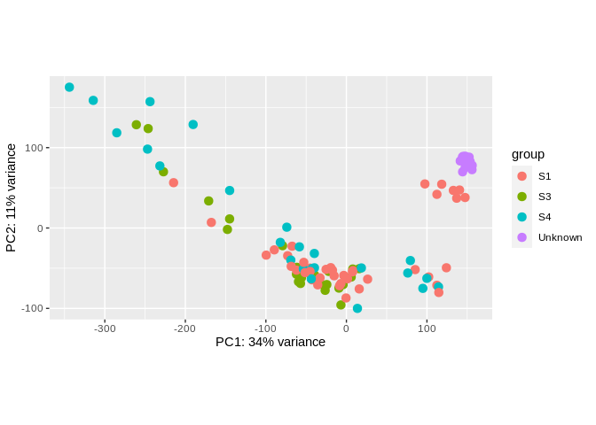
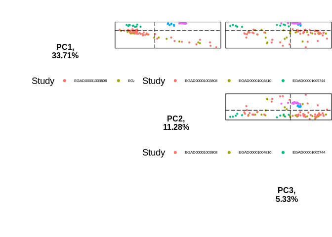
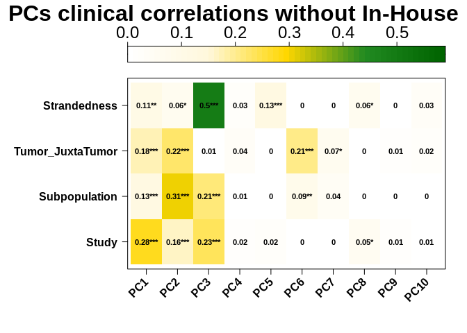
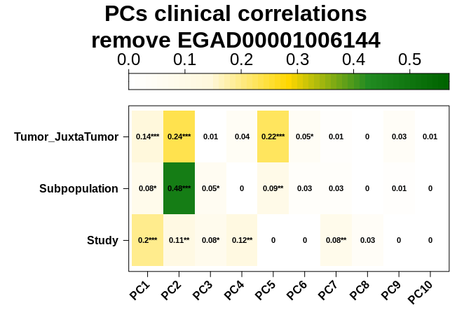
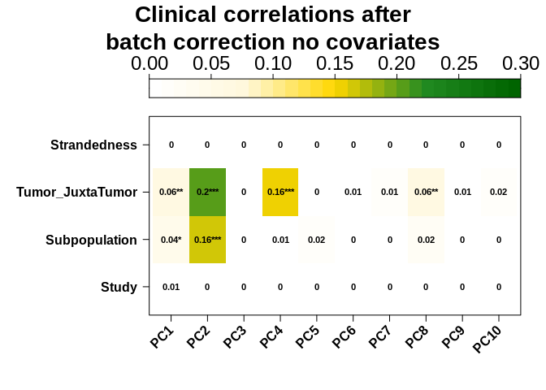
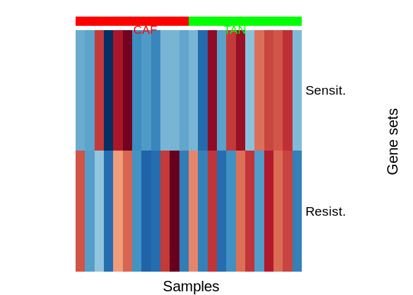

CAF Subpopulation Analysis
================
Kevin Ryan
2022-09-08 18:54:36

- <a href="#introduction" id="toc-introduction">Introduction</a>
- <a href="#preparation" id="toc-preparation">Preparation</a>
- <a href="#read-in-data" id="toc-read-in-data">Read in data</a>
- <a href="#exploratory-data-analysis"
  id="toc-exploratory-data-analysis">Exploratory data analysis</a>
  - <a href="#pca--clinical-correlations-all-studies"
    id="toc-pca--clinical-correlations-all-studies">PCA + clinical
    correlations all studies</a>
  - <a href="#pca--clinical-correlations-without-in-house-data"
    id="toc-pca--clinical-correlations-without-in-house-data">PCA + clinical
    correlations without In-House data</a>
  - <a
    href="#pca--clinical-correlations-without-in-house-data-or-study-egad00001006144"
    id="toc-pca--clinical-correlations-without-in-house-data-or-study-egad00001006144">PCA
    + clinical correlations without In-House data or study
    EGAD00001006144</a>
- <a href="#batch-correction-with-combat-seq-and-limma"
  id="toc-batch-correction-with-combat-seq-and-limma">Batch correction
  with Combat-Seq and limma</a>
  - <a href="#combat-seq" id="toc-combat-seq">Combat-Seq</a>
    - <a href="#combat-seq-no-clinical-covariates"
      id="toc-combat-seq-no-clinical-covariates">Combat-Seq no clinical
      covariates</a>
    - <a href="#limmaremovebatcheffects-with-all-covariates"
      id="toc-limmaremovebatcheffects-with-all-covariates">limma::removeBatchEffects
      with all covariates</a>
    - <a
      href="#limmaremovebatcheffects-with-no-clinical-covariates-or-subpopulation-information"
      id="toc-limmaremovebatcheffects-with-no-clinical-covariates-or-subpopulation-information">limma::removeBatchEffects
      with no clinical covariates or subpopulation information</a>
- <a href="#surrogate-variable-analysis"
  id="toc-surrogate-variable-analysis">Surrogate variable analysis</a>
- <a href="#differential-expression-analysis"
  id="toc-differential-expression-analysis">Differential expression
  analysis</a>
  - <a
    href="#gene-set-variation-analysis-gsva-for-gene-signature-identification"
    id="toc-gene-set-variation-analysis-gsva-for-gene-signature-identification">Gene
    set variation analysis (GSVA) for gene signature identification</a>
- <a href="#chemoresistance-gene-signature"
  id="toc-chemoresistance-gene-signature">Chemoresistance gene
  signature</a>
- <a href="#deconvolution-using-cibersortx"
  id="toc-deconvolution-using-cibersortx">Deconvolution using
  CIBERSORTx</a>
- <a href="#references" id="toc-references">References</a>

# Introduction

Cancer-associated fibroblasts (CAFs) are a heterogeneous cell type found
in the tumour microenvironment. They have a wide array of functions, and
tend to be immunosuppressive and cancer-promoting. There have been many
attempts to characterise subpopulations of CAFs, with much
transcriptomic analysis being carried out in the Mechta-Grigoriou lab in
Institut Curie. They have identified 4 ‘subpopulations’ which can be
separated based on the expression of different markers:

- S1: FAP<sup>High</sup>, CD29<sup>Med-High</sup>, α<sup>SMAHigh</sup>,
  PDPN<sup>High</sup>, PDGFRβ<sup>High</sup>
- S2: FAP<sup>Neg</sup>, CD29<sup>Low</sup>, αSMANeg-<sup>Low</sup>,
  PDPN<sup>Low</sup>, PDGFRβ<sup>Low</sup>
- S3: FAP<sup>Neg-Low</sup>, CD29<sup>Med</sup>, αSMA<sup>Neg-Low</sup>,
  PDPN<sup>Low</sup>, PDGFRβ<sup>Low-Med</sup>
- S4: FAP<sup>Low-Med</sup>, CD29<sup>High</sup>, αSMA<sup>High</sup>,
  PDPN<sup>Low</sup>, PDGFRβ<sup>Med</sup>

(Pelon et al. 2020)

FACS gating strategies can be used to isolate these subpopulations. The
Mechta-Grigoriou group have done this and have generated bulk
RNA-sequencing data for the S1, S3 and S4 subpopulations. They generated
scRNA-sequencing data for the S1 subpopulation. This data was deposited
on the European Genome Phenome Archive, and was accessed via a Data
Transfer Agreement.

The following summarises the data obtained:

<table style="width:98%;">
<colgroup>
<col style="width: 17%" />
<col style="width: 17%" />
<col style="width: 26%" />
<col style="width: 35%" />
</colgroup>
<thead>
<tr class="header">
<th>Subpopulation</th>
<th>Total samples</th>
<th>Studies (Samples)</th>
<th>Notes</th>
</tr>
</thead>
<tbody>
<tr class="odd">
<td>S1</td>
<td>28</td>
<td><ul>
<li>EGAD00001003808 (16)</li>
<li>EGAD00001005744 (5)</li>
<li>EGAD00001006144 (7)</li>
</ul></td>
<td><ul>
<li>3808 has 12xJuxta-tumor</li>
<li>5744 5 samples from LN</li>
<li>Sorting vs spreading</li>
</ul></td>
</tr>
<tr class="even">
<td>S2</td>
<td>0</td>
<td>N/A</td>
<td>N/A</td>
</tr>
<tr class="odd">
<td>S3</td>
<td>14</td>
<td><ul>
<li>EGAD00001004810 (14)</li>
</ul></td>
<td><ul>
<li>4810 has 11xJuxta-tumor</li>
<li>Ovarian</li>
</ul></td>
</tr>
<tr class="even">
<td>S4</td>
<td>15</td>
<td><ul>
<li>EGAD00001003808 (10)</li>
<li>EGAD00001005744 (5)</li>
</ul></td>
<td><ul>
<li>3808 has 9xJuxta-tumor</li>
<li>5744 5 samples from LN</li>
</ul></td>
</tr>
</tbody>
</table>

With the juxta-tumour data, tumour and juxta-tumour samples came from
the same patient. However, the metadata gives no indication of these
pairings. We could possibly use Optitype (Szolek et al. 2014) to
determine HLA allele and match the tumour and juxta-tumour samples.

We also have scRNA-seq data for S1, labelled with 8 subpopulations of S1
CAFs. It may be possible to use CIBERSORT (Newman et al. 2015) and
BayesPrism (Chu et al. 2022) to deconvolve the bulk S1 RNA-sequencing
data to further confirm the presence of these subpopulations.

It is likely that sorting the cells using FACS alters the
transcriptional properties of the cells compared to if they are
separated using spreading approaches, as is seen in study
`EGAD00001006144` and described in (Kieffer et al. 2020). This is
something that we will have to keep in mind.

The data was processed using nf-core/rnaseq version `3.8.1` using the
default parameters. STAR/Salmon were used for alignment/quantification.

We would expect our tumour-associated normal to be most like the S3
subpopulation (usually accumulate in juxta-tumours). The S2
subpopulation has been found to accumulate more in luminal A breast
cancer, whereas the S4 subpopulation tends to be present in Her2+ breast
cancers. Unfortunately, data is not available for the S2 subpopulation
and 11 of the 12 cancers encountered in our samples are Luminal A.

Combining RNA-sequencing datasets from different studies can be very
challenging. We can expect batch effects to be present, so it might not
be possible to determine whether differences we observe are due to
actual biological effects or technical artifacts. In addition, a recent
study suggests that DESeq2 and edgeR (the most popular differential
expression tools) experience large rates of false positives when used
with large sample sizes (Li et al. 2022). However, this assertion has
been refuted, and it has been suggested that the Li 2022 study did not
apply appropriate batch correction and quality control ([Twitter
thread](https://threadreaderapp.com/thread/1513468597288452097.html)
from Mike Love and associated [code on
GitHub](https://github.com/mikelove/preNivolumabOnNivolumab/blob/main/preNivolumabOnNivolumab.knit.md)).
One of the datasets (`EGAD00001006144`) was produced using stranded
RNA-seq, whereas the other datasets were unstranded. This can lead to a
lack of comparability of the datasets (Zhao, Ye, and Stanton 2020). It
may be necessary to drop this dataset from the analysis. All samples
were prepared by poly(A) selection (use of oligo-dT).

# Preparation

Columns will be: Sample, Study, Subpopulation, Tumor_Juxtatumor

*Here we will be combining data from 5 studies. To begin with, we will
only include the metadata available for all studies (except for our
unknown CAF Subpopulation label). Breast cancer subtype is only
available for certain studies and so is not included at this stage.*

There are also: ovarian cancer samples, EPCAM+ cells (an epithelial
marker) and samples from lymph nodes. For the time being, I will not
consider them.

# Read in data

Samples were processed with nf-core/rnaseq version `3.8.1`.

Salmon was used in alignment mode so there is no salmon index and no
checksum to import the metadata. Therefore, the parameters recommended
in the [tximeta
vignette](https://bioconductor.org/packages/release/bioc/vignettes/tximeta/inst/doc/tximeta.html#What_if_checksum_isn%E2%80%99t_known)
were used to summarise transcript counts to the gene level, using a
tx2gene file constructed using `generate_tx2gene_table.R`.

``` r
# salmon was used in alignment mode so there is no salmon index, therefore there is no checksum to import the metadata 
# txOut = FALSE means to summarise to gene level (i.e. don't give out transcripts, give out gene level)
se <- tximeta(coldata, skipMeta=TRUE, txOut=FALSE, tx2gene=tx2gene)
```

    ## reading in files with read_tsv

    ## 1 2 3 4 5 6 7 8 9 10 11 12 13 14 15 16 17 18 19 20 21 22 23 24 25 26 27 28 29 30 31 32 33 34 35 36 37 38 39 40 41 42 43 44 45 46 47 48 49 50 51 52 53 54 55 56 57 58 59 60 61 62 63 64 65 66 67 68 69 70 71 72 73 74 75 76 77 78 79 80 81 82 83 84 85 86 87 88 89 90 91 92 93 94 95 96 97 98 99 100 101 102 103 104 105 106 107 108 109 110 111 112 113 
    ## removing duplicated transcript rows from tx2gene
    ## transcripts missing from tx2gene: 18466
    ## summarizing abundance
    ## summarizing counts
    ## summarizing length

A DESeqDataSet was created, and only genes with a count of 10 or more in
7 samples were kept for further analysis. This was done for the combined
dataset both with and without the in-house data. A variance stabilising
transformation (vst) was also carried out to allow the data to be used
in downstream processes requiring homoskedastic data, e.g. PCA. *vst*
was carried out instead of regularised logarithm (*rlog*) as *rlog*
takes a long time to run when there is a large sample size.

``` r
dds <- DESeqDataSet(se, design = ~1)
```

    ## using counts and average transcript lengths from tximeta

``` r
# returns a vector of whether the total count of each gene is >= 10 (True or false)
keep <- rowSums(counts(dds)) >= 10
# only keep rows (genes) for which keep is TRUE
dds <- dds[keep,]
# at least X samples with a count of 10 or more, where X can be chosen as the sample size of the smallest group of samples
X <- 7
keep <- rowSums(counts(dds) >= 10) >= X
dds <- dds[keep,]
vsd <- vst(dds, blind = TRUE)
```

    ## using 'avgTxLength' from assays(dds), correcting for library size

``` r
# do no design for the time being, Subpopulation + Batch gives error - model matrix not full rank in DESeq2
# this function stores input values, intermediate calculations and results of DE analysis - makes counts non-negative integers
dds_no_inhouse <- DESeqDataSet(se_no_inhouse, design = ~1)
```

    ## using counts and average transcript lengths from tximeta

``` r
# returns a vector of whether the total count of each gene is >= 10 (True or false)
keep <- rowSums(counts(dds_no_inhouse)) >= 10
# only keep rows (genes) for which keep is TRUE
dds_no_inhouse <- dds_no_inhouse[keep,]
# at least X samples with a count of 10 or more, where X can be chosen as the sample size of the smallest group of samples
X <- 7
keep <- rowSums(counts(dds_no_inhouse) >= 10) >= X
dds_no_inhouse <- dds_no_inhouse[keep,]
```

# Exploratory data analysis

## PCA + clinical correlations all studies

For consistency between the DESeq2 `plotPCA` function (which by default
takes the 500 most variable genes) and the PCATools `pca` function, all
genes were used when carrying out PCA.

``` r
plotPCA(vsd, intgroup = c("Subpopulation"), ntop = nrow(vsd))
```

<!-- -->

``` r
plotPCA(vsd, intgroup = c("Study"), ntop = nrow(vsd))
```

<!-- -->

``` r
plotPCA(vsd, intgroup = c("Tumor_JuxtaTumor"), ntop = nrow(vsd))
```

<!-- --> There seems
to be 4 groups of samples here: the samples at PC1 \< -100 which look
like outliers, the main group in the middle (-100 \< PC1 \< 50) and then
2 groups which separate on PC2. One of these groups comes completely
from one batch (EGAD00001005744) which is purely tumour CAFs and the
other is a mixture of our in-house samples and study EGAD00001006144.
There is clear separation between the in-house samples and
EGAD00001006144, so perhaps they could be called one cluster. The
in-house samples underwent culturing in a medium to promote the growth
of fibroblastic cells, whereas the EGAD00001006144 samples either
underwent separation by sorting or spreading. It is possible that there
are similarities in the conditions under which the samples were kept
which altered their transcriptomic properties.

We can see that there are 16 samples that explain much of the variation
in PC1, meaning that they are quite different from the other samples.
Let’s have a look at the PCA loadings using the `biplot` from
`PCATools`.

``` r
vsd_mat <- assay(vsd)
metadata_pca <- metadata[,1:4]
p <- pca(vsd_mat, metadata = metadata_pca)
```

``` r
biplot(p, showLoadings = T, lab = NULL)
```

<!-- -->

There seems to be 10 genes that are associated with PC2, separating our
main cluster and the In-house/EGAD00001006144. samples.

- FOS
  - Proto-oncogene, forms part of TF complex, regulators of cell
    proliferation, differentiation, transformation, apoptosis.
- APOD
  - Apolipoprotein D, encodes part of HDL
  - Expression induced in quiescent/senescent fibroblasts (Rassart et
    al. 2020), and so may inhibit cell growth
  - Downregulated in CAFs in our initial CAF vs TAN DE analysis
- TMEM176B
  - A transmembrane protein
  - Identified as LR8 in 1999 (Lurton et al. 1999) and was proposed as a
    marker for fibroblasts and their subpopulations.
  - It has recently been found to be important in the AKT/mTOR pathway,
    which is involved in cell proliferation (and hence can be implicated
    in cancer) (Kang et al. 2021).
- SELENOP
  - Selenoprotein P
  - Increased expression stops conversion of fibroblasts to
    myofibroblasts (Short and Williams 2017)
- PLXDC1
  - Plexin Domain Containing 1
  - Involved in angiogenesis
  - Cell surface receptor for Pigment Epithelium Derived Factor (Cheng
    et al. 2014)
- P4HB
  - Protein disulfide isomerase
  - Possible fibroblast marker (Wetzig et al. 2013)
- CHPF
  - Chondroitin polymerising factor
  - Alters the formation of chondroitin sulphate in breast cancer.
    Chondroitin sulphate forms “abnormal” chains in breast cancer (Liao
    et al. 2021)
- CEMIP
  - Cell Migration Inducing Hyaluronidase 1
  - WNT-related (Dong et al. 2021)
  - High expression associated with malignancy and increased CAF
    infiltration (Dong et al. 2021). Possible biomarker. Dong study
    looked at expression in tumour cells, here we can see that its
    expression seems to change between different groups of CAFs too.
- TFPI2
  - Tissue factor pathway inhibitor 2.
  - Serine proteinase
  - Tumour suppressor
  - Inhibits plasmin, thereby inhibiting the activation of MMPs
  - Increased expression of TFPI2 in cancer cells downregulates the
    expression of MMPs in CAFs (the opposite is the case too) (Gaud et
    al. 2011).
- GREM1
  - Antagonist of BMP, playing a role in tissue differentiation.
  - Expressed in basal cell carcinoma CAF myofibroblasts (Kim et al.
    2017).
  - Expression of GREM1 derived from CAFs thought to promote cancer
    progression (Ren et al. 2019).
  - Found to be expressed in CAF cell lines but not in breast cancer
    cell lines (Ren et al. 2019).

``` r
peigencor
```

<!-- -->

``` r
ppairs
```

<!-- -->

## PCA + clinical correlations without In-House data

``` r
plotPCA(vsd_no_inhouse, intgroup = c("Subpopulation"), ntop = nrow(vsd_no_inhouse))
```

<!-- -->

``` r
plotPCA(vsd_no_inhouse, intgroup = c("Study"), ntop = nrow(vsd_no_inhouse))
```

<!-- -->

``` r
plotPCA(vsd_no_inhouse, intgroup = c("Tumor_JuxtaTumor"), ntop = nrow(vsd_no_inhouse))
```

<!-- -->

``` r
metadata_pca_no_inhouse <- colData(vsd_no_inhouse)[,1:5]
metadata_pca_no_inhouse <- as.data.frame(metadata_pca_no_inhouse[!names(metadata_pca_no_inhouse) %in% c("names")])
p_no_inhouse <- pca(vsd_mat_no_inhouse, metadata = metadata_pca_no_inhouse)
peigencor_no_inhouse <- eigencorplot(p_no_inhouse,
    components = getComponents(p_no_inhouse, 1:10),
    metavars = colnames(metadata_pca_no_inhouse),
    col = c('white', 'cornsilk1', 'gold', 'forestgreen', 'darkgreen'),
    cexCorval = 0.7,
    colCorval = 'black',
    fontCorval = 2,
    posLab = 'bottomleft',
    rotLabX = 45,
    posColKey = 'top',
    cexLabColKey = 1.5,
    scale = TRUE,
    corFUN = 'pearson',
    #corUSE = 'pairwise.complete.obs',
    corUSE = 'pairwise.complete.obs',
    corMultipleTestCorrection = 'none',
    main = 'PCs clinical correlations without In-House',
    colFrame = 'white',
    plotRsquared = TRUE)
```

    ## Warning in eigencorplot(p_no_inhouse, components = getComponents(p_no_inhouse, :
    ## Study is not numeric - please check the source data as non-numeric variables
    ## will be coerced to numeric

    ## Warning in eigencorplot(p_no_inhouse, components = getComponents(p_no_inhouse, :
    ## Subpopulation is not numeric - please check the source data as non-numeric
    ## variables will be coerced to numeric

    ## Warning in eigencorplot(p_no_inhouse, components = getComponents(p_no_inhouse, :
    ## Tumor_JuxtaTumor is not numeric - please check the source data as non-numeric
    ## variables will be coerced to numeric

    ## Warning in eigencorplot(p_no_inhouse, components = getComponents(p_no_inhouse, :
    ## Strandedness is not numeric - please check the source data as non-numeric
    ## variables will be coerced to numeric

``` r
peigencor_no_inhouse
```

<!-- -->

Here we can see strandedness (i.e. the study `EGAD00001006144`) is
significantly correlated with PCs 1-3. These PCs explain 29%, 7% and 5%
of the variance of the entire dataset respectively).

``` r
ppairs
```

<!-- -->

## PCA + clinical correlations without In-House data or study EGAD00001006144

Given the plot above, we can see that most of the variability of PC1 can
be attributed to Study, indicating batch effects. Methods exist to
“remove” batch effects, but they can not be run on our data. All of our
S3 samples come from study `EGAD00001004810` and so when one tries to
make a model matrix including both Study and Subpopulation, the model
matrix is of less than full rank and there is an error. Let’s look at
the clinical correlations plot if we remove our outlier study
`EGAD00001006144` as well as our in-house data.

``` r
plotPCA(vsd_no_inhouse_no_6144, intgroup = c("Subpopulation"), ntop = nrow(vsd_no_inhouse_no_6144))
```

<!-- -->

``` r
plotPCA(vsd_no_inhouse_no_6144, intgroup = c("Study"), ntop = nrow(vsd_no_inhouse_no_6144))
```

<!-- -->

``` r
plotPCA(vsd_no_inhouse_no_6144, intgroup = c("Tumor_JuxtaTumor"), ntop = nrow(vsd_no_inhouse_no_6144))
```

<!-- -->

``` r
peigencor_reduced
```

<!-- -->

``` r
ppairs_no_6144
```

<!-- -->

``` r
ppairs_no_6144_colour_subpop
```

<!-- -->

# Batch correction with Combat-Seq and limma

## Combat-Seq

Combat-Seq (Zhang, Parmigiani, and Johnson 2020) models the distribution
for each gene using a negative binomial regression model. This model
contains a mean and dispersion parameter. It allows us to preserve
changes in counts due to biological condition after adjustment. However,
in our case, it is not possible to guarantee the preservation of changes
due to biological condition (CAF subpopulation) while removing batch
effects. Here we carry out batch correction using Combat-Seq, and will
look at the data after adjustment to see if biological condition is
preserved after adjustment. We should note here that the S3
subpopulation does not separate well from the other subpopulations
before batch correction, even though the S3 data comes from a different
“study”.

### Combat-Seq no clinical covariates

``` r
counts_matrix <- assay(dds)
batch_all_samples <- metadata$Study
adjusted_all_samples <- ComBat_seq(counts = counts_matrix, batch = batch_all_samples)
```

    ## Found 5 batches
    ## Using null model in ComBat-seq.
    ## Adjusting for 0 covariate(s) or covariate level(s)
    ## Estimating dispersions
    ## Fitting the GLM model
    ## Shrinkage off - using GLM estimates for parameters
    ## Adjusting the data

``` r
dds_batch_corrected <- DESeqDataSetFromMatrix(adjusted_all_samples, colData = metadata, design = ~1)
```

    ## converting counts to integer mode

``` r
# not sure about the blind = FALSE here
vsd_batch_corrected <- vst(dds_batch_corrected, blind = FALSE)
```

``` r
plotPCA(vsd_batch_corrected, intgroup = c("Subpopulation"), ntop = nrow(vsd_batch_corrected))
```

<!-- -->

``` r
plotPCA(vsd_batch_corrected, intgroup = c("Study"), ntop = nrow(vsd_batch_corrected))
```

<!-- -->

``` r
plotPCA(vsd_batch_corrected, intgroup = c("Tumor_JuxtaTumor"), ntop = nrow(vsd_batch_corrected))
```

<!-- -->

``` r
peigencor_batch_corrected
```

<!-- --> \###
Combat-Seq with Tumour_Juxtatumor as covariate

``` r
adjusted_all_samples <- ComBat_seq(counts = counts_matrix, batch = batch_all_samples, group = metadata$Tumor_JuxtaTumor)
```

    ## Found 5 batches
    ## Using full model in ComBat-seq.
    ## Adjusting for 1 covariate(s) or covariate level(s)
    ## Estimating dispersions
    ## Fitting the GLM model
    ## Shrinkage off - using GLM estimates for parameters
    ## Adjusting the data

``` r
dds_batch_corrected <- DESeqDataSetFromMatrix(adjusted_all_samples, colData = metadata, design = ~1)
```

    ## converting counts to integer mode

``` r
# not sure about the blind = FALSE here
vsd_batch_corrected <- vst(dds_batch_corrected, blind = FALSE)
```

``` r
plotPCA(vsd_batch_corrected, intgroup = c("Subpopulation"), ntop = nrow(vsd_batch_corrected))
```

<!-- -->

``` r
plotPCA(vsd_batch_corrected, intgroup = c("Study"), ntop = nrow(vsd_batch_corrected))
```

<!-- -->

``` r
plotPCA(vsd_batch_corrected, intgroup = c("Tumor_JuxtaTumor"), ntop = nrow(vsd_batch_corrected))
```

<!-- -->

``` r
peigencor_batch_corrected
```

<!-- --> \##
limma::removeBatchEffects

### limma::removeBatchEffects with all covariates

Limma’s removeBatchEffect function requires a design matrix as input,
this is the “treatment condition” we wish to preserve. It is usually the
design matrix with all experimental factors other than batch effects.
The ideal scenario would be to include Subpopulation in this matrix.
However, this treats `Unknown` as its own Subpopulation, and so will
preserve differences between the InHouse samples and the other samples.
This is contrary to what we want when assigning our samples to a
cluster.

``` r
vsd_not_blind <- vst(dds, blind = FALSE)
```

    ## using 'avgTxLength' from assays(dds), correcting for library size

``` r
mat <- assay(vsd_not_blind)
# create model matrix, full model matrix with Tumor_JuxtaTumor and Subpopulation
mm <- model.matrix(~Tumor_JuxtaTumor+Subpopulation, colData(vsd_not_blind))
mat <- limma::removeBatchEffect(mat, batch = vsd_not_blind$Study, design = mm)
```

    ## Coefficients not estimable: batch2 batch4

    ## Warning: Partial NA coefficients for 17763 probe(s)

``` r
vsd_batch_corrected_limma_all_covariates <- vsd_not_blind
assay(vsd_batch_corrected_limma_all_covariates) <- mat
```

``` r
plotPCA(vsd_batch_corrected_limma_all_covariates, intgroup = c("Subpopulation"), ntop = nrow(vsd_batch_corrected_limma_all_covariates))
```

<!-- -->

``` r
plotPCA(vsd_batch_corrected_limma_all_covariates, intgroup = c("Study"),ntop = nrow(vsd_batch_corrected_limma_all_covariates) )
```

<!-- -->

``` r
plotPCA(vsd_batch_corrected_limma_all_covariates, intgroup = c("Tumor_JuxtaTumor"), ntop = nrow(vsd_batch_corrected_limma_all_covariates))
```

<!-- -->

``` r
plotPCA(vsd_batch_corrected_limma_all_covariates, intgroup = c("Subpopulation"), ntop = 500)
```

<!-- -->

``` r
plotPCA(vsd_batch_corrected_limma_all_covariates, intgroup = c("Study"),ntop = 500 )
```

<!-- -->

``` r
plotPCA(vsd_batch_corrected_limma_all_covariates, intgroup = c("Tumor_JuxtaTumor"), ntop =500)
```

<!-- -->

We can see that this removes batch effects and preserves differences
between the subpopulations. However, it treats our Unknown samples as
their own subpopulation.This is a case where the number of highest
variable genes chosen makes a big difference.

``` r
peigencor_batch_corrected
```

<!-- -->

### limma::removeBatchEffects with no clinical covariates or subpopulation information

``` r
# create model matrix, full model matrix with Tumor_JuxtaTumor and Subpopulation
mm <- model.matrix(~1, colData(vsd_not_blind))
mat <- limma::removeBatchEffect(mat, batch = vsd_not_blind$Study, design = mm)
```

``` r
vsd_batch_corrected_limma_no_covariates <- vsd_not_blind
assay(vsd_batch_corrected_limma_no_covariates) <- mat
```

``` r
plotPCA(vsd_batch_corrected_limma_no_covariates, intgroup = c("Subpopulation"), ntop = nrow(vsd_batch_corrected_limma_no_covariates))
```

<!-- -->

``` r
plotPCA(vsd_batch_corrected_limma_no_covariates, intgroup = c("Study"),ntop = nrow(vsd_batch_corrected_limma_no_covariates) )
```

<!-- -->

``` r
plotPCA(vsd_batch_corrected_limma_no_covariates, intgroup = c("Tumor_JuxtaTumor"), ntop = nrow(vsd_batch_corrected_limma_no_covariates))
```

<!-- -->

``` r
peigencor_batch_corrected
```

<!-- -->

# Surrogate variable analysis

``` r
dds_no_inhouse_no_6144 <- DESeq(dds_no_inhouse_no_6144)
```

    ## Warning in DESeq(dds_no_inhouse_no_6144): the design is ~ 1 (just an intercept).
    ## is this intended?

    ## estimating size factors

    ## using 'avgTxLength' from assays(dds), correcting for library size

    ## estimating dispersions

    ## gene-wise dispersion estimates

    ## mean-dispersion relationship

    ## final dispersion estimates

    ## fitting model and testing

    ## -- replacing outliers and refitting for 4760 genes
    ## -- DESeq argument 'minReplicatesForReplace' = 7 
    ## -- original counts are preserved in counts(dds)

    ## estimating dispersions

    ## fitting model and testing

``` r
dat  <- counts(dds_no_inhouse_no_6144, normalized = TRUE)
idx  <- rowMeans(dat) > 1
dat  <- dat[idx, ]
# we have Subpopulation and tumour-juxtatomour in the model matrix
mod  <- model.matrix(~ Subpopulation + Tumor_JuxtaTumor, colData(dds_no_inhouse_no_6144))
mod0 <- model.matrix(~   1, colData(dds_no_inhouse_no_6144))
svseq_no6144 <- svaseq(dat, mod, mod0)
```

    ## Number of significant surrogate variables is:  18 
    ## Iteration (out of 5 ):1  2  3  4  5

``` r
sv_names <- paste("SV", seq(1,svseq_no6144$n.sv), sep = "")
for (i in 1:length(sv_names)){
  colData(dds_no_inhouse_no_6144)[,sv_names[i]] <- svseq_no6144$sv[,i]
}
colData(dds_no_inhouse_no_6144)[,"Subpopulation"] <- as.factor(colData(dds_no_inhouse_no_6144)$Subpopulation)
colData(dds_no_inhouse_no_6144)[,"Tumor_JuxtaTumor"] <- as.factor(colData(dds_no_inhouse_no_6144)$Tumor_JuxtaTumor)
```

# Differential expression analysis

``` r
# add surrogate variables to design DDS object
design(dds_no_inhouse_no_6144) <- ~ Tumor_JuxtaTumor + SV1 + SV2 + SV3 + SV4 + SV5 + SV6 + SV7 + SV8 + SV9 + SV10 + SV11 + SV12 + SV13 + SV14 + SV15 + SV16 + SV17 + SV18 + Subpopulation
#dds_no_inhouse_no_6144_deseq <- DESeq(ddssva_copy)
#write_rds(dds_no_inhouse_no_6144_deseq, file = "/home/kevin/Documents/PhD/subtypes/caf-subtype-analysis/dds_noinhouse_no_6144_deseq_hgnc_hasntbeenrun.Rds")
dds_no_inhouse_no_6144_deseq <- readRDS("dds_noinhouse_no6144_hgnc_25082022.Rds")
```

The aim here is to extract lists of genes that are upregulated in each
subpopulation compared to the other 2 subpopulations. To do this, steps
from the [following
tutorial](https://github.com/tavareshugo/tutorial_DESeq2_contrasts/blob/main/DESeq2_contrasts.md)
were followed.

``` r
# define model matrix
mod_mat <- model.matrix(design(dds_no_inhouse_no_6144_deseq), colData(dds_no_inhouse_no_6144))
# e.g. for each sample that is S1, get the mean of the coefficients all the components of the formula 
S1 <- colMeans(mod_mat[dds_no_inhouse_no_6144_deseq$Subpopulation == "S1",])
S3 <- colMeans(mod_mat[dds_no_inhouse_no_6144_deseq$Subpopulation == "S3",])
S4 <- colMeans(mod_mat[dds_no_inhouse_no_6144_deseq$Subpopulation == "S4",])
not_S1 <- colMeans(mod_mat[dds_no_inhouse_no_6144_deseq$Subpopulation %in% c("S3", "S4"),])
not_S3 <- colMeans(mod_mat[dds_no_inhouse_no_6144_deseq$Subpopulation %in% c("S1", "S4"),])
not_S4 <- colMeans(mod_mat[dds_no_inhouse_no_6144_deseq$Subpopulation %in% c("S1", "S3"),])
```

``` r
res_not_S1 <- results(dds_no_inhouse_no_6144_deseq, contrast = S1 - not_S1, filterFun = ihw, alpha = 0.05, lfcThreshold = 2, altHypothesis = "greater")
res_not_S3 <- results(dds_no_inhouse_no_6144_deseq, contrast = S3 - not_S3, filterFun = ihw, alpha = 0.05, lfcThreshold = 2, altHypothesis = "greater")
res_not_S4 <- results(dds_no_inhouse_no_6144_deseq, contrast = S4 - not_S4, filterFun = ihw, alpha = 0.05, lfcThreshold = 2, altHypothesis = "greater")
```

``` r
res_not_S1_shrink <- lfcShrink(dds_no_inhouse_no_6144_deseq, contrast = S1 - not_S1, res = res_not_S1, type = "ashr")
```

    ## using 'ashr' for LFC shrinkage. If used in published research, please cite:
    ##     Stephens, M. (2016) False discovery rates: a new deal. Biostatistics, 18:2.
    ##     https://doi.org/10.1093/biostatistics/kxw041

``` r
res_not_S3_shrink <- lfcShrink(dds_no_inhouse_no_6144_deseq, contrast = S3 - not_S3, res = res_not_S3, type = "ashr")
```

    ## using 'ashr' for LFC shrinkage. If used in published research, please cite:
    ##     Stephens, M. (2016) False discovery rates: a new deal. Biostatistics, 18:2.
    ##     https://doi.org/10.1093/biostatistics/kxw041

``` r
res_not_S4_shrink <- lfcShrink(dds_no_inhouse_no_6144_deseq, contrast = S4 - not_S4, res = res_not_S4, type = "ashr")
```

    ## using 'ashr' for LFC shrinkage. If used in published research, please cite:
    ##     Stephens, M. (2016) False discovery rates: a new deal. Biostatistics, 18:2.
    ##     https://doi.org/10.1093/biostatistics/kxw041

``` r
res_not_S1_shrink_extract <- get_upregulated(res_not_S1_shrink)
res_not_S3_shrink_extract <- get_upregulated(res_not_S3_shrink)
res_not_S4_shrink_extract <- get_upregulated(res_not_S4_shrink)
```

``` r
dfs_to_filter <- list(res_not_S1_shrink_extract, res_not_S3_shrink_extract, res_not_S4_shrink_extract)
dfs_filtered <- filter_dfs_antijoin_rownames(dfs_to_filter)
```

    ## NULL
    ## NULL
    ## NULL

``` r
names(dfs_filtered) <- c("S1", "S3", "S4")
s1_filtered <- dfs_filtered[[1]]
s1_filtered_annotations <- annotate_de_genes(s1_filtered, filter_by = "hgnc_symbol")
```

    ## Warning: Ensembl will soon enforce the use of https.
    ## Ensure the 'host' argument includes "https://"

``` r
s3_filtered <- dfs_filtered[[2]]
s3_filtered_annotations <- annotate_de_genes(s3_filtered, filter_by = "hgnc_symbol")
```

    ## Warning: Ensembl will soon enforce the use of https.
    ## Ensure the 'host' argument includes "https://"

``` r
s4_filtered <- dfs_filtered[[3]]
s4_filtered_annotations <- annotate_de_genes(s4_filtered, filter_by = "hgnc_symbol")
```

    ## Warning: Ensembl will soon enforce the use of https.
    ## Ensure the 'host' argument includes "https://"

``` r
s1_gs <- s1_filtered_annotations$Gene
s3_gs <- s3_filtered_annotations$Gene
s4_gs <- s4_filtered_annotations$Gene
genesets <- list(s1_gs, s3_gs, s4_gs)
names(genesets) <- c("S1", "S3", "S4")
```

## Gene set variation analysis (GSVA) for gene signature identification

``` r
idx <- which(dds$Study == "InHouse")
dds_inhouse <- dds[,idx]
```

``` r
inhouse_metadata <- read.csv("/home/kevin/Documents/PhD/rna_seq_bc/metadata/reformat_samples_extra_info.csv")
caf_es <- gsva(expr = dds_inhouse,
               gset.idx.list = genesets,
               method = "gsva",
               kcdf = "Poisson",
               mx.diff=FALSE)
```

    ## Warning in .filterFeatures(expr, method): 247 genes with constant expression
    ## values throuhgout the samples.

    ## Warning in .filterFeatures(expr, method): Since argument method!="ssgsea", genes
    ## with constant expression values are discarded.

    ## Estimating GSVA scores for 3 gene sets.
    ## Estimating ECDFs with Poisson kernels
    ##   |                                                                              |                                                                      |   0%  |                                                                              |=======================                                               |  33%  |                                                                              |===============================================                       |  67%  |                                                                              |======================================================================| 100%

``` r
caf_es$Patient <- inhouse_metadata$Patient
caf_es$Subtype <- inhouse_metadata$Subtype
caf_es$Grade <- inhouse_metadata$Grade
caf_es$Histology <- inhouse_metadata$Histology
```

``` r
subpopulationOrder <- c("tumor", "juxtatumor")
sampleOrderBySubpopulation <- sort(match(caf_es$Tumor_JuxtaTumor, subpopulationOrder),
                             index.return=TRUE)$ix
subpopulationXtable <- table(caf_es$Tumor_JuxtaTumor)
subpopulationColorLegend <- c(tumor="red", juxtatumor="green")
geneSetOrder <- c("S4", "S3", "S1")
geneSetLabels <- geneSetOrder
hmcol <- colorRampPalette(brewer.pal(10, "RdBu"))(256)
hmcol <- hmcol[length(hmcol):1]
#png(filename = "/home/kevin/Documents/PhD/subtypes/caf-subtype-analysis/caf_rnaseq_combined_analysis_files/figure-gfm/gsva_subpopulation_caf_tan.png")
heatmap(assay(caf_es)[geneSetOrder, sampleOrderBySubpopulation], Rowv=NA,
        Colv=NA, scale="row", margins=c(3,5), col=hmcol,
        ColSideColors=rep(subpopulationColorLegend[subpopulationOrder],
                          times=subpopulationXtable[subpopulationOrder]),
        labCol="", 
        caf_es$Tumor_JuxtaTumor[sampleOrderBySubpopulation],
        labRow=paste(toupper(substring(geneSetLabels, 1,1)),
                     substring(geneSetLabels, 2), sep=""),
        cexRow=2, main=" \n ")
par(xpd=TRUE)
text(0.285,1.1, "CAF", col="red", cex=1.2)
text(0.55,1.1, "TAN", col="green", cex=1.2)
#text(0.17,1.13, "CAF", col="red", cex=1.2)
#text(0.65,1.13, "TAN", col="green", cex=1.2)
mtext("CAF subpopulation signature", side=4, line=0, cex=1.5)
mtext("Samples", side=1, line=4, cex=1.5, at = 0.42)
```

<!-- -->

``` r
#dev.off()
subtypeOrder <- c("LuminalA", "TNBC")
sampleOrderBySubtype <- sort(match(caf_es$Subtype, subtypeOrder),
                             index.return=TRUE)$ix
subtypeXtable <- table(caf_es$Subtype)
subtypeColorLegend <- c(LuminalA="red", TNBC="green")
geneSetOrder <- c("S4", "S3", "S1")
geneSetLabels <- geneSetOrder
hmcol <- colorRampPalette(brewer.pal(10, "RdBu"))(256)
hmcol <- hmcol[length(hmcol):1]

#png(filename = "/home/kevin/Documents/PhD/subtypes/caf-subtype-analysis/caf_rnaseq_combined_analysis_files/figure-gfm/gsva_cancer_subtype.png")
heatmap(assay(caf_es)[geneSetOrder, sampleOrderBySubtype], Rowv=NA,
        Colv=NA, scale="row", margins=c(3,5), col=hmcol,
        ColSideColors=rep(subtypeColorLegend[subtypeOrder],
                          times=subtypeXtable[subtypeOrder]),
        labCol="", 
        #labCol = caf_es$Patient[sampleOrderBySubtype],
        caf_es$Subtype[sampleOrderBySubtype],
        labRow=paste(toupper(substring(geneSetLabels, 1,1)),
                     substring(geneSetLabels, 2), sep=""),
        cexRow=2, main=" \n ")
par(xpd=TRUE)
text(0.4,1.1, "LuminalA", col="red", cex=1.2)
text(0.65,1.1, "TNBC", col="green", cex=1.2)
#text(0.35,1.13, "LuminalA", col="red", cex=1.2)
#text(0.85,1.13, "TNBC", col="green", cex=1.2)
mtext("CAF subpopulation signature", side=4, line=0, cex=1.5)
mtext("Samples", side=1, line=4, cex=1.5, at = 0.42)
```

<!-- -->

``` r
#dev.off()

gradeOrder <- c("Grade_2", "Grade_3")
sampleOrderByGrade <- sort(match(caf_es$Grade, gradeOrder),
                             index.return=TRUE)$ix
gradeXtable <- table(caf_es$Grade)
gradeColorLegend <- c(Grade_2="red", Grade_3="green")
geneSetOrder <- c("S4", "S3", "S1")
geneSetLabels <- geneSetOrder
hmcol <- colorRampPalette(brewer.pal(10, "RdBu"))(256)
hmcol <- hmcol[length(hmcol):1]

#png(filename = "/home/kevin/Documents/PhD/subtypes/caf-subtype-analysis/caf_rnaseq_combined_analysis_files/figure-gfm/gsva_cancer_grade.png")
heatmap(assay(caf_es)[geneSetOrder, sampleOrderByGrade], Rowv=NA,
        Colv=NA, scale="row", margins=c(3,5), col=hmcol,
        ColSideColors=rep(gradeColorLegend[gradeOrder],
                          times=gradeXtable[gradeOrder]),
        labCol="", 
        #labCol = caf_es$Patient[sampleOrderByGrade],
        caf_es$Subtype[sampleOrderBySubtype],
        labRow=paste(toupper(substring(geneSetLabels, 1,1)),
                     substring(geneSetLabels, 2), sep=""),
        cexRow=2, main=" \n ")
par(xpd=TRUE)
text(0.34,1.1, "Grade 2", col="red", cex=1.2)
text(0.6,1.1, "Grade 3", col="green", cex=1.2)
#text(0.25,1.13, "Grade 2", col="red", cex=1.2)
#text(0.74,1.13, "Grade 3", col="green", cex=1.2)
mtext("CAF subpopulation signature", side=4, line=0, cex=1.5)
mtext("Samples", side=1, line=4, cex=1.5, at = 0.42)
```

<!-- -->

``` r
#dev.off()
```

``` r
caf_idx <- which(colData(caf_es)$Tumor_JuxtaTumor == "tumor")
tan_idx <- which(colData(caf_es)$Tumor_JuxtaTumor == "juxtatumor")
df_plot_S1 <- cbind.data.frame(S1_ES = assay(caf_es)[1,], Tumor_JuxtaTumor = colData(caf_es)$Tumor_JuxtaTumor)
gsva_plot_s1 <- ggplot(df_plot_S1, aes(x = Tumor_JuxtaTumor, y = S1_ES)) +
  geom_point(size = 2,  # reduce point size to minimize overplotting 
    position = position_jitter(
      width = 0.1,  # amount of jitter in horizontal direction
      height = 0     # amount of jitter in vertical direction (0 = none)
    )
  ) +
  theme(panel.grid.major = element_blank(), 
        panel.grid.minor = element_blank(),
        panel.background = element_blank(), 
        axis.line = element_line(colour = "black"), 
        axis.title.x = element_blank(),
        plot.title = element_text(hjust = 0.5)) +
  ylab("S1 GSVA ES")  #, axis.title.x = element_blank())

df_plot_S3 <- cbind.data.frame(S3_ES = assay(caf_es)[2,], Tumor_JuxtaTumor = colData(caf_es)$Tumor_JuxtaTumor)
gsva_plot_s3 <- ggplot(df_plot_S3, aes(x = Tumor_JuxtaTumor, y = S3_ES)) +
  geom_point(size = 2,  # reduce point size to minimize overplotting 
    position = position_jitter(
      width = 0.1,  # amount of jitter in horizontal direction
      height = 0     # amount of jitter in vertical direction (0 = none)
    )
  ) +
  theme(panel.grid.major = element_blank(), 
        panel.grid.minor = element_blank(),
        panel.background = element_blank(), 
        axis.line = element_line(colour = "black"), 
        axis.title.x = element_blank(),
        plot.title = element_text(hjust = 0.5)) +
  ylab("S3 GSVA ES")  #, axis.title.x = element_blank())

df_plot_S4 <- cbind.data.frame(S4_ES = assay(caf_es)[3,], Tumor_JuxtaTumor = colData(caf_es)$Tumor_JuxtaTumor)
gsva_plot_s4 <- ggplot(df_plot_S4, aes(x = Tumor_JuxtaTumor, y = S4_ES)) +
  geom_point(size = 2,  # reduce point size to minimize overplotting 
    position = position_jitter(
      width = 0.1,  # amount of jitter in horizontal direction
      height = 0     # amount of jitter in vertical direction (0 = none)
    )
  ) +
  theme(panel.grid.major = element_blank(), 
        panel.grid.minor = element_blank(),
        panel.background = element_blank(), 
        axis.line = element_line(colour = "black"), 
        axis.title.x = element_blank(),
        plot.title = element_text(hjust = 0.5)) +
  ylab("S4 GSVA ES")  #, axis.title.x = element_blank())
```

``` r
distribution_es_s1 <- df_plot_S1 %>% 
ggplot(mapping = aes(S1_ES)) +
  geom_density() +
  facet_wrap(~Tumor_JuxtaTumor) +
  theme_linedraw()

distribution_es_s3 <- df_plot_S3 %>% 
ggplot(mapping = aes(S3_ES)) +
  geom_density() +
  facet_wrap(~Tumor_JuxtaTumor) +
  theme_linedraw()

distribution_es_s4 <- df_plot_S4 %>% 
ggplot(mapping = aes(S4_ES)) +
  geom_density() +
  facet_wrap(~Tumor_JuxtaTumor) +
  theme_linedraw()
```

``` r
 plot_grid(top_row, bottom_row, nrow = 2,
      rel_heights = c(1.1, 0.9))
```

<!-- -->

``` r
df_plot_S1$S1_ES %>% 
shapiro.test()
```

    ## 
    ##  Shapiro-Wilk normality test
    ## 
    ## data:  .
    ## W = 0.88376, p-value = 0.009899

``` r
df_plot_S3$S3_ES %>% 
shapiro.test()
```

    ## 
    ##  Shapiro-Wilk normality test
    ## 
    ## data:  .
    ## W = 0.82457, p-value = 0.000764

``` r
df_plot_S4$S4_ES %>% 
shapiro.test()
```

    ## 
    ##  Shapiro-Wilk normality test
    ## 
    ## data:  .
    ## W = 0.8989, p-value = 0.0204

p \< 0.05, data is not normally distributed. T-test may be unsuitable
for comparing distributions. Carry out Wilcoxon rank-sum test
(Mann-Whitney U test).

``` r
wilcox.test(x = df_plot_S1$S1_ES[df_plot_S1$Tumor_JuxtaTumor == "tumor"], 
            y = df_plot_S1$S1_ES[df_plot_S1$Tumor_JuxtaTumor == "juxtatumor"],
            paired = TRUE)
```

    ## 
    ##  Wilcoxon signed rank exact test
    ## 
    ## data:  df_plot_S1$S1_ES[df_plot_S1$Tumor_JuxtaTumor == "tumor"] and df_plot_S1$S1_ES[df_plot_S1$Tumor_JuxtaTumor == "juxtatumor"]
    ## V = 12, p-value = 0.03418
    ## alternative hypothesis: true location shift is not equal to 0

``` r
wilcox.test(x = df_plot_S3$S3_ES[df_plot_S3$Tumor_JuxtaTumor == "tumor"], 
            y = df_plot_S3$S3_ES[df_plot_S3$Tumor_JuxtaTumor == "juxtatumor"],
            paired = TRUE)
```

    ## 
    ##  Wilcoxon signed rank exact test
    ## 
    ## data:  df_plot_S3$S3_ES[df_plot_S3$Tumor_JuxtaTumor == "tumor"] and df_plot_S3$S3_ES[df_plot_S3$Tumor_JuxtaTumor == "juxtatumor"]
    ## V = 10, p-value = 0.021
    ## alternative hypothesis: true location shift is not equal to 0

``` r
wilcox.test(x = df_plot_S4$S4_ES[df_plot_S4$Tumor_JuxtaTumor == "tumor"], 
            y = df_plot_S4$S4_ES[df_plot_S4$Tumor_JuxtaTumor == "juxtatumor"],
            paired = TRUE)
```

    ## 
    ##  Wilcoxon signed rank exact test
    ## 
    ## data:  df_plot_S4$S4_ES[df_plot_S4$Tumor_JuxtaTumor == "tumor"] and df_plot_S4$S4_ES[df_plot_S4$Tumor_JuxtaTumor == "juxtatumor"]
    ## V = 55, p-value = 0.2334
    ## alternative hypothesis: true location shift is not equal to 0

``` r
median(df_plot_S1$S1_ES[df_plot_S1$Tumor_JuxtaTumor == "tumor"])
```

    ## [1] -0.1687633

``` r
median(df_plot_S1$S1_ES[df_plot_S1$Tumor_JuxtaTumor == "juxtatumor"])
```

    ## [1] 0.211911

``` r
median(df_plot_S3$S3_ES[df_plot_S3$Tumor_JuxtaTumor == "tumor"])
```

    ## [1] -0.04473953

``` r
median(df_plot_S3$S3_ES[df_plot_S3$Tumor_JuxtaTumor == "juxtatumor"])
```

    ## [1] 0.420649

``` r
median(df_plot_S4$S4_ES[df_plot_S4$Tumor_JuxtaTumor == "tumor"])
```

    ## [1] 0.2539725

``` r
median(df_plot_S4$S4_ES[df_plot_S4$Tumor_JuxtaTumor == "juxtatumor"])
```

    ## [1] -0.1836231

We can see from the above that there is a difference between the
enrichment scores for the gene signatures for the S1 and S3
subpopulaions between CAF and TAN. We can suggest that the TAN
(juxta-tumour) samples are enriched for our S1 and S3 gene signatures
compared to the genes outside the gene signatures, and that this
enrichment is greater in the TAN samples than in the CAF samples.

``` r
results_combined <- cbind.data.frame(colData(caf_es)$names, colData(caf_es)$Patient, df_plot_S1$S1_ES, df_plot_S3$S3_ES, df_plot_S4$S4_ES, df_plot_S1$Tumor_JuxtaTumor, colData(caf_es)$Subtype, colData(caf_es)$Grade, colData(caf_es)$Histology)
colnames(results_combined) <- c("Sample", "Patient", "S1_ES", "S3_ES", "S4_ES", "Tumor_JuxtaTumor", "Subtype", "Grade", "Histology")
results_combined
```

    ##    Sample Patient      S1_ES      S3_ES      S4_ES Tumor_JuxtaTumor  Subtype
    ## 1    4033       1 -0.2111870  0.2282682  0.4511291            tumor LuminalA
    ## 2    4034       1  0.1667547  0.2602349 -0.2104131       juxtatumor LuminalA
    ## 3    4027       2 -0.3911261 -0.5744436  0.5483698            tumor     TNBC
    ## 4    4028       2 -0.3006402 -0.4322374 -0.4128925       juxtatumor     TNBC
    ## 5    4112       3  0.3408958 -0.3317912  0.2026432            tumor LuminalA
    ## 6    4113       3  0.3192418  0.5494366 -0.1568331       juxtatumor LuminalA
    ## 7    4116       4 -0.3791867 -0.3831630 -0.6103717            tumor LuminalA
    ## 8    4117       4 -0.2337296 -0.2289328 -0.3081449       juxtatumor LuminalA
    ## 9    4214       5  0.2261749  0.5747017  0.5845368            tumor LuminalA
    ## 10   4215       5  0.2202032  0.3547532  0.2426352       juxtatumor LuminalA
    ## 11   4315       6  0.3229567  0.5416024  0.5350491            tumor LuminalA
    ## 12   4316       6  0.3736564  0.6030234  0.3862160       juxtatumor LuminalA
    ## 13   4340       7 -0.2435243 -0.6432975 -0.4944882            tumor LuminalA
    ## 14   4341       7  0.2036188  0.2515679 -0.4312309       juxtatumor LuminalA
    ## 15   4344       8  0.1594359  0.4920567 -0.2643276            tumor LuminalA
    ## 16   4345       8 -0.2293861  0.4467967 -0.3578373       juxtatumor LuminalA
    ## 17   3532       9 -0.2008142  0.3100232 -0.3087708            tumor LuminalA
    ## 18   3533       9  0.2411840  0.3945014  0.1800844       juxtatumor LuminalA
    ## 19   3536      10 -0.1367123  0.5282220  0.3053018            tumor LuminalA
    ## 20   3537      10  0.2672011  0.5898932 -0.2313765       juxtatumor LuminalA
    ## 21   4299      11  0.1797552 -0.3177473 -0.2203716            tumor LuminalA
    ## 22   4300      11  0.4438534  0.5556149  0.2794237       juxtatumor LuminalA
    ## 23   4722      12 -0.4150383 -0.4818981  0.5708118            tumor LuminalA
    ## 24   4723      12 -0.1783413  0.5212709  0.4818895       juxtatumor LuminalA
    ##      Grade Histology
    ## 1  Grade_2   Lobular
    ## 2  Grade_2   Lobular
    ## 3  Grade_3    Ductal
    ## 4  Grade_3    Ductal
    ## 5  Grade_3    Ductal
    ## 6  Grade_3    Ductal
    ## 7  Grade_2   Lobular
    ## 8  Grade_2   Lobular
    ## 9  Grade_2   Lobular
    ## 10 Grade_2   Lobular
    ## 11 Grade_2    Ductal
    ## 12 Grade_2    Ductal
    ## 13 Grade_2   Lobular
    ## 14 Grade_2   Lobular
    ## 15 Grade_2    Ductal
    ## 16 Grade_2    Ductal
    ## 17 Grade_2    Ductal
    ## 18 Grade_2    Ductal
    ## 19 Grade_3   Lobular
    ## 20 Grade_3   Lobular
    ## 21 Grade_3    Ductal
    ## 22 Grade_3    Ductal
    ## 23 Grade_2   Lobular
    ## 24 Grade_2   Lobular

# Chemoresistance gene signature

(Su et al. 2018) carried out differential expression analysis between
chemoresistant and chemosensitive CAFs from breast cancer. It is
possible to try and identify the resulting signature in our samples. We
will use the list of upregulated genes in chemoresistant samples as our
marker of chemoresistance and the genes downregulated in the
chemoresistant cells as our marker of chemosensitivity.

The HGNCHelper package can be used to fix outdated gene symbols.

``` r
assay(chemo_es)
```

    ##               4033       4034       4027       4028       4112      4113
    ## Resist.  0.2511948  0.1835208 -0.2275412 -0.2921821 -0.1549386 0.2922223
    ## Sensit. -0.2884295 -0.2617528 -0.3135180 -0.4803626  0.3979869 0.5291087
    ##               4116       4117      4214       4215      4315      4316
    ## Resist. -0.3305799 -0.3323113 0.1485889 -0.2558840 0.2260738 0.2115296
    ## Sensit. -0.6315582 -0.3175666 0.4718418  0.3953624 0.5808599 0.5089124
    ##               4340       4341       4344       4345       3532      3533
    ## Resist. -0.2499012  0.2918001 -0.3521381 -0.2333033 -0.3312907 0.3284542
    ## Sensit. -0.3752032 -0.2284608 -0.3360215  0.2964242 -0.3923255 0.3729971
    ##               3536      3537       4299      4300       4722       4723
    ## Resist.  0.2863740 0.2172434  0.4309208 0.2723313 -0.2989202 -0.2909116
    ## Sensit. -0.2635225 0.3420735 -0.2614191 0.4182203 -0.2995230 -0.2494366

``` r
#rownames(assay(chemo_es)) <- c("Resistance", "Sensitive")
subpopulationOrder <- c("tumor", "juxtatumor")
sampleOrderBySubpopulation <- sort(match(chemo_es$Tumor_JuxtaTumor, subpopulationOrder),
                             index.return=TRUE)$ix
subpopulationXtable <- table(chemo_es$Tumor_JuxtaTumor)
subpopulationColorLegend <- c(tumor="red", juxtatumor="green")
geneSetOrder <- c("Resist.", "Sensit.")
geneSetLabels <- geneSetOrder
hmcol <- colorRampPalette(brewer.pal(10, "RdBu"))(256)
hmcol <- hmcol[length(hmcol):1]

#png(filename = "/home/kevin/Documents/PhD/subtypes/caf-subtype-analysis/caf_rnaseq_combined_analysis_files/figure-gfm/gsva_chemoresistance_caf_tan.png")
heatmap(assay(chemo_es)[geneSetOrder, sampleOrderBySubpopulation], Rowv=NA,
        Colv=NA, scale="row", margins=c(3,5), col=hmcol,
        ColSideColors=rep(subpopulationColorLegend[subpopulationOrder],
                          times=subpopulationXtable[subpopulationOrder]),
        labCol="", 
        chemo_es$Tumor_JuxtaTumor[sampleOrderBySubpopulation],
        labRow=paste(toupper(substring(geneSetLabels, 1,1)),
                     substring(geneSetLabels, 2), sep=""),
        cexRow=2, main=" \n ")
par(xpd=TRUE)
text(0.285,1.1, "CAF", col="red", cex=1.2)
text(0.55,1.1, "TAN", col="green", cex=1.2)
#text(0.16,1.13, "CAF", col="red", cex=1.2)
#text(0.65,1.13, "TAN", col="green", cex=1.2)
mtext("Gene sets", side=4, line=0, cex=1.5)
mtext("Samples", side=1, line=4, cex=1.5, at = 0.42)
```

<!-- -->

``` r
#dev.off()

subtypeOrder <- c("LuminalA", "TNBC")
sampleOrderBySubtype <- sort(match(chemo_es$Subtype, subtypeOrder),
                             index.return=TRUE)$ix
subtypeXtable <- table(chemo_es$Subtype)
subtypeColorLegend <- c(LuminalA="red", TNBC="green")
geneSetOrder <- c("Resist.", "Sensit.")
geneSetLabels <- geneSetOrder
hmcol <- colorRampPalette(brewer.pal(10, "RdBu"))(256)
hmcol <- hmcol[length(hmcol):1]

#png(filename = "/home/kevin/Documents/PhD/subtypes/caf-subtype-analysis/caf_rnaseq_combined_analysis_files/figure-gfm/gsva_chemoresistance_cancer_subtype.png")
heatmap(assay(chemo_es)[geneSetOrder, sampleOrderBySubtype], Rowv=NA,
        Colv=NA, scale="row", margins=c(3,5), col=hmcol,
        ColSideColors=rep(subtypeColorLegend[subtypeOrder],
                          times=subtypeXtable[subtypeOrder]),
        labCol="", 
        #labCol = caf_es$Patient[sampleOrderBySubtype],
        chemo_es$Subtype[sampleOrderBySubtype],
        labRow=paste(toupper(substring(geneSetLabels, 1,1)),
                     substring(geneSetLabels, 2), sep=""),
        cexRow=2, main=" \n ")
par(xpd=TRUE)
text(0.4,1.1, "LuminalA", col="red", cex=1.2)
text(0.65,1.1, "TNBC", col="green", cex=1.2)
#text(0.35,1.13, "LuminalA", col="red", cex=1.2)
#text(0.85,1.13, "TNBC", col="green", cex=1.2)
mtext("Gene sets", side=4, line=0, cex=1.5)
mtext("Samples", side=1, line=4, cex=1.5, at = 0.42)
```

<!-- -->

``` r
#dev.off()

gradeOrder <- c("Grade_2", "Grade_3")
sampleOrderByGrade <- sort(match(chemo_es$Grade, gradeOrder),
                             index.return=TRUE)$ix
gradeXtable <- table(chemo_es$Grade)
gradeColorLegend <- c(Grade_2="red", Grade_3="green")
geneSetOrder <- c("Resist.", "Sensit.")
geneSetLabels <- geneSetOrder
hmcol <- colorRampPalette(brewer.pal(10, "RdBu"))(256)
hmcol <- hmcol[length(hmcol):1]

#png(filename = "/home/kevin/Documents/PhD/subtypes/caf-subtype-analysis/caf_rnaseq_combined_analysis_files/figure-gfm/gsva_chemoresistance_cancer_grade.png")
heatmap(assay(chemo_es)[geneSetOrder, sampleOrderByGrade], Rowv=NA,
        Colv=NA, scale="row", margins=c(3,5), col=hmcol,
        ColSideColors=rep(gradeColorLegend[gradeOrder],
                          times=gradeXtable[gradeOrder]),
        labCol="", 
        #labCol = caf_es$Patient[sampleOrderByGrade],
        chemo_es$Subtype[sampleOrderBySubtype],
        labRow=paste(toupper(substring(geneSetLabels, 1,1)),
                     substring(geneSetLabels, 2), sep=""),
        cexRow=2, main=" \n ")
par(xpd=TRUE)
text(0.34,1.1, "Grade 2", col="red", cex=1.2)
text(0.6,1.1, "Grade 3", col="green", cex=1.2)
#text(0.25,1.13, "Grade 2", col="red", cex=1.2)
#text(0.75,1.13, "Grade 3", col="green", cex=1.2)
mtext("Gene sets", side=4, line=0, cex=1.5)
mtext("Samples", side=1, line=4, cex=1.5, at = 0.42)
```

<!-- -->

``` r
#dev.off()
```

``` r
chemoresistance_ratio <- function(df){
  out <- data.frame(Patient = df$Patient,)
}
as_tibble(t(assay(chemo_es))) %>% mutate(Patient = colData(chemo_es)$Patient, Chemoresistance_ratio = abs(Resist.)/abs(Sensit.)) %>% print(n = 24)
```

    ## # A tibble: 24 × 4
    ##    Resist. Sensit. Patient Chemoresistance_ratio
    ##      <dbl>   <dbl>   <int>                 <dbl>
    ##  1   0.251  -0.288       1                 0.871
    ##  2   0.184  -0.262       1                 0.701
    ##  3  -0.228  -0.314       2                 0.726
    ##  4  -0.292  -0.480       2                 0.608
    ##  5  -0.155   0.398       3                 0.389
    ##  6   0.292   0.529       3                 0.552
    ##  7  -0.331  -0.632       4                 0.523
    ##  8  -0.332  -0.318       4                 1.05 
    ##  9   0.149   0.472       5                 0.315
    ## 10  -0.256   0.395       5                 0.647
    ## 11   0.226   0.581       6                 0.389
    ## 12   0.212   0.509       6                 0.416
    ## 13  -0.250  -0.375       7                 0.666
    ## 14   0.292  -0.228       7                 1.28 
    ## 15  -0.352  -0.336       8                 1.05 
    ## 16  -0.233   0.296       8                 0.787
    ## 17  -0.331  -0.392       9                 0.844
    ## 18   0.328   0.373       9                 0.881
    ## 19   0.286  -0.264      10                 1.09 
    ## 20   0.217   0.342      10                 0.635
    ## 21   0.431  -0.261      11                 1.65 
    ## 22   0.272   0.418      11                 0.651
    ## 23  -0.299  -0.300      12                 0.998
    ## 24  -0.291  -0.249      12                 1.17

``` r
wilcox.test(x = df_plot_S1$S1_ES[df_plot_S1$Tumor_JuxtaTumor == "tumor"], 
            y = df_plot_S1$S1_ES[df_plot_S1$Tumor_JuxtaTumor == "juxtatumor"],
            paired = TRUE)
```

    ## 
    ##  Wilcoxon signed rank exact test
    ## 
    ## data:  df_plot_S1$S1_ES[df_plot_S1$Tumor_JuxtaTumor == "tumor"] and df_plot_S1$S1_ES[df_plot_S1$Tumor_JuxtaTumor == "juxtatumor"]
    ## V = 12, p-value = 0.03418
    ## alternative hypothesis: true location shift is not equal to 0

``` r
wilcox.test(x = df_plot_S3$S3_ES[df_plot_S3$Tumor_JuxtaTumor == "tumor"], 
            y = df_plot_S3$S3_ES[df_plot_S3$Tumor_JuxtaTumor == "juxtatumor"],
            paired = TRUE)
```

    ## 
    ##  Wilcoxon signed rank exact test
    ## 
    ## data:  df_plot_S3$S3_ES[df_plot_S3$Tumor_JuxtaTumor == "tumor"] and df_plot_S3$S3_ES[df_plot_S3$Tumor_JuxtaTumor == "juxtatumor"]
    ## V = 10, p-value = 0.021
    ## alternative hypothesis: true location shift is not equal to 0

``` r
wilcox.test(x = df_plot_S4$S4_ES[df_plot_S4$Tumor_JuxtaTumor == "tumor"], 
            y = df_plot_S4$S4_ES[df_plot_S4$Tumor_JuxtaTumor == "juxtatumor"],
            paired = TRUE)
```

    ## 
    ##  Wilcoxon signed rank exact test
    ## 
    ## data:  df_plot_S4$S4_ES[df_plot_S4$Tumor_JuxtaTumor == "tumor"] and df_plot_S4$S4_ES[df_plot_S4$Tumor_JuxtaTumor == "juxtatumor"]
    ## V = 55, p-value = 0.2334
    ## alternative hypothesis: true location shift is not equal to 0

# Deconvolution using CIBERSORTx

CIBERSORTx (Newman et al. 2019) is the most commonly used tool for
cell-type deconvolution. It is a machine learning method based on
support vector regression, which carries out batch correction,
correcting for between-platform differences in expression data. In this
case, the signature matrix was made using all of the available CAF
subpopulation data (40 S1 samples, 25 S3 samples, 24 S4 samples). It is
possible to infer the proportions of the different subpopulations as
well as a subpopulation-specific gene expression matrix for each sample.
Either scRNA-seq, bulk RNA-seq or microarray data can be used as the
reference.

- Create signature matrix for CIBERSORTx
- TPM normalise data,probably optional
- Run CIBERSORTx to figure out proportions of S1, S3 and S4 in In-house
  samples

The files for CIBERSORT (mixture file, reference data and phenotype
classes file), were prepared using the `cibersortx_prepare_files.R`
script.

`CIBERSORTx` was run using the following command:

    docker run -v /home/kevin/Documents/PhD/cibersort/caf_subpopulation/infiles:/src/data -v /home/kevin/Documents/PhD/cibersort/caf_subpopulation/outfiles:/src/outdir cibersortx/fractions --username k.ryan45@nuigalway.ie --token b7f03b943ade9b4146dc2126b4ac9d19 --single_cell FALSE --refsample caf_subtypes_tpm_for_sig_matrix.txt --mixture caf_tpm_mixture.txt --rmbatchBmode TRUE --outdir /home/kevin/Documents/PhD/cibersort/caf_subpopulation/outfiles --phenoclasses /home/kevin/Documents/PhD/cibersort/caf_subpopulation/infiles/phenoclasses_caf.txt

``` r
cibersort_results <- read.table("/home/kevin/Documents/PhD/cibersort/caf_subpopulation/outfiles/CIBERSORTx_Adjusted.txt", header = T)
cibersort_results
```

    ##    Mixture        S1 S3           S4 P.value Correlation      RMSE
    ## 1     4033 0.7910443  0 0.2089557492       0   0.6082765 0.8157847
    ## 2     4034 1.0000000  0 0.0000000000       0   0.6377965 0.8262784
    ## 3     4027 0.5530809  0 0.4469191109       0   0.7390362 0.6734956
    ## 4     4028 0.9540262  0 0.0459738305       0   0.5771597 0.8772853
    ## 5     4112 0.9145585  0 0.0854415380       0   0.6851607 0.7521922
    ## 6     4113 1.0000000  0 0.0000000000       0   0.7377976 0.7054262
    ## 7     4116 0.9202598  0 0.0797402206       0   0.6086764 0.8364088
    ## 8     4117 0.9749568  0 0.0250432452       0   0.6490463 0.8064734
    ## 9     4214 0.8948236  0 0.1051763746       0   0.7248746 0.7025445
    ## 10    4215 0.9586793  0 0.0413207259       0   0.7114689 0.7295204
    ## 11    4315 0.8479862  0 0.1520138235       0   0.7125195 0.7118186
    ## 12    4316 0.9996778  0 0.0003222288       0   0.7190471 0.7295308
    ## 13    4340 0.8708912  0 0.1291087778       0   0.6756717 0.7559901
    ## 14    4341 0.9423294  0 0.0576705911       0   0.6866700 0.7557415
    ## 15    4344 0.9305382  0 0.0694618285       0   0.6622681 0.7811234
    ## 16    4345 0.9217481  0 0.0782519211       0   0.6139309 0.8312952
    ## 17    3532 0.8895852  0 0.1104147845       0   0.5699035 0.8684824
    ## 18    3533 0.9919602  0 0.0080398226       0   0.6016636 0.8632189
    ## 19    3536 0.7865679  0 0.2134320528       0   0.5379829 0.8807957
    ## 20    3537 0.9395404  0 0.0604595827       0   0.5060439 0.9421126
    ## 21    4299 0.8210417  0 0.1789582923       0   0.7106510 0.7115838
    ## 22    4300 0.9567319  0 0.0432681184       0   0.7036329 0.7386330
    ## 23    4722 0.3774401  0 0.6225598787       0   0.8107501 0.5852533
    ## 24    4723 0.8577810  0 0.1422189828       0   0.6788132 0.7508034

The online version of CIBERSORTx was also used, using 500 permutations.
The study `EGAD00001006144` was excluded from the signature matrix due
to its probable outlier status.

``` r
cibersort_results_online <- read.csv("/home/kevin/Documents/PhD/cibersort/caf_subpopulation/outfiles/online/2022-09-01-CIBERSORTx_Job6_Results_online_no6144_hgnc.csv", header = T)
cibersort_results_online 
```

    ##    Mixture        S1 S3         S4 P.value Correlation      RMSE
    ## 1     4033 0.9200710  0 0.07992904       0   0.6351293 1.1460059
    ## 2     4034 0.9239457  0 0.07605427       0   0.6657794 1.1107332
    ## 3     4027 0.8184646  0 0.18153543       0   0.5447931 1.1453912
    ## 4     4028 0.9313242  0 0.06867582       0   0.5780322 1.2291753
    ## 5     4112 0.9161738  0 0.08382623       0   0.6779809 1.0858067
    ## 6     4113 0.9474235  0 0.05257651       0   0.7795798 0.9763537
    ## 7     4116 0.9168721  0 0.08312792       0   0.5980791 1.1885625
    ## 8     4117 0.9124145  0 0.08758548       0   0.6446746 1.1252229
    ## 9     4214 0.9070862  0 0.09291375       0   0.6558631 1.1048196
    ## 10    4215 0.9332171  0 0.06678290       0   0.6664009 1.1204241
    ## 11    4315 0.9384081  0 0.06159186       0   0.6343094 1.1678461
    ## 12    4316 0.9313687  0 0.06863127       0   0.7470213 1.0065390
    ## 13    4340 0.9208098  0 0.07919018       0   0.6219298 1.1634929
    ## 14    4341 0.9116361  0 0.08836394       0   0.6582423 1.1067898
    ## 15    4344 0.9120902  0 0.08790977       0   0.6589903 1.1063207
    ## 16    4345 0.8916855  0 0.10831455       0   0.6391071 1.1093961
    ## 17    3532 0.9221877  0 0.07781229       0   0.5934655 1.2001776
    ## 18    3533 0.9401834  0 0.05981664       0   0.6295261 1.1759367
    ## 19    3536 0.8795555  0 0.12044448       0   0.5611606 1.1913771
    ## 20    3537 0.8907880  0 0.10921199       0   0.5571366 1.2084328
    ## 21    4299 0.8913230  0 0.10867704       0   0.6886893 1.0438535
    ## 22    4300 0.9472909  0 0.05270908       0   0.6613853 1.1431199
    ## 23    4722 0.6837608  0 0.31623923       0   0.5446944 1.0181402
    ## 24    4723 0.9100635  0 0.08993653       0   0.5722794 1.2120169

``` r
cibersort_grid
```

<!-- -->

Using the deconvolution approach with CIBERSORTx, there seems to be none
of the S3 subpopulation present. It is possible that the S3
subpopulation does not have a very well defined transcriptional profile.

Results look strange with P-value of 9999. CIBERSORTx was run using the
Docker image and using the GUI, and different results were obtained.
When the Docker image was used and the number of permutations was
changed from 0 to 100, the p-value changed to 0.000. The proportions
look different between the two methods, with the GUI predicting about
0.75 S1 with the rest being S4 for most samples.

# References

<div id="refs" class="references csl-bib-body hanging-indent">

<div id="ref-Cheng2014" class="csl-entry">

Cheng, Guo, Ming Zhong, Riki Kawaguchi, Miki Kassai, Muayyad Al-Ubaidi,
Jun Deng, Mariam Ter-Stepanian, and Hui Sun. 2014. “<span
class="nocase">Identification of PLXDC1 and PLXDC2 as the transmembrane
receptors for the multifunctional factor PEDF</span>.” *eLife* 3:
e05401. <https://doi.org/10.7554/ELIFE.05401>.

</div>

<div id="ref-Chu2022" class="csl-entry">

Chu, Tinyi, Zhong Wang, Dana Pe’er, and Charles G. Danko. 2022. “<span
class="nocase">Cell type and gene expression deconvolution with
BayesPrism enables Bayesian integrative analysis across bulk and
single-cell RNA sequencing in oncology</span>.” *Nature Cancer 2022 3:4*
3 (4): 505–17. <https://doi.org/10.1038/s43018-022-00356-3>.

</div>

<div id="ref-Dong2021" class="csl-entry">

Dong, Xingxing, Yalong Yang, Qianqian Yuan, Jinxuan Hou, and Gaosong Wu.
2021. “<span class="nocase">High Expression of CEMIP Correlates Poor
Prognosis and the Tumur Microenvironment in Breast Cancer as a
Promisingly Prognostic Biomarker</span>.” *Frontiers in Genetics* 12
(December): 2512. <https://doi.org/10.3389/FGENE.2021.768140/BIBTEX>.

</div>

<div id="ref-Gaud2011" class="csl-entry">

Gaud, Guillaume, Sophie Iochmann, Audrey Guillon-Munos, Benjamin
Brillet, Stéphanie Petiot, Florian Seigneuret, Antoine Touzé, et al.
2011. “<span class="nocase">TFPI-2 silencing increases tumour
progression and promotes metalloproteinase 1 and 3 induction through
tumour-stromal cell interactions</span>.” *Journal of Cellular and
Molecular Medicine* 15 (2): 196.
<https://doi.org/10.1111/J.1582-4934.2009.00989.X>.

</div>

<div id="ref-Kang2021" class="csl-entry">

Kang, Chifei, Ran Rostoker, Sarit Ben-Shumel, Rola Rashed, James Andrew
Duty, Deniz Demircioglu, Irini M. Antoniou, et al. 2021. “<span
class="nocase">Tmem176b regulates akt/mtor signaling and tumor growth in
triple-negative breast cancer</span>.” *Cells* 10 (12): 3430.
<https://doi.org/10.3390/CELLS10123430/S1>.

</div>

<div id="ref-Kieffer2020" class="csl-entry">

Kieffer, Yann, Hocine R. Hocine, Géraldine Gentric, Floriane Pelon,
Charles Bernard, Brigitte Bourachot, Sonia Lameiras, et al. 2020. “<span
class="nocase">Single-cell analysis reveals fibroblast clusters linked
to immunotherapy resistance in cancer</span>.” *Cancer Discovery* 10
(9): 1330–51.
<https://doi.org/10.1158/2159-8290.CD-19-1384/333435/AM/SINGLE-CELL-ANALYSIS-REVEALS-FIBROBLAST-CLUSTERS>.

</div>

<div id="ref-Kim2017" class="csl-entry">

Kim, Hye Sung, Myung Soo Shin, Min Seok Cheon, Jae Wang Kim, Cheol Lee,
Woo Ho Kim, Young Sill Kim, and Bo Gun Jang. 2017. “<span
class="nocase">GREM1 is expressed in the cancer-associated
myofibroblasts of basal cell carcinomas</span>.” *PLoS ONE* 12 (3).
<https://doi.org/10.1371/JOURNAL.PONE.0174565>.

</div>

<div id="ref-Li2022" class="csl-entry">

Li, Yumei, Xinzhou Ge, Fanglue Peng, Wei Li, and Jingyi Jessica Li.
2022. “<span class="nocase">Exaggerated false positives by popular
differential expression methods when analyzing human population
samples</span>.” *Genome Biology* 23 (1): 1–13.
<https://doi.org/10.1186/S13059-022-02648-4/FIGURES/2>.

</div>

<div id="ref-Liao2021" class="csl-entry">

Liao, Wen-Chieh, Hung-Rong Yen, Chia-Hua Chen, Yin-Hung Chu, Ying-Chyi
Song, To-Jung Tseng, and Chiung-Hui Liu. 2021. “<span
class="nocase">CHPF promotes malignancy of breast cancer cells by
modifying syndecan-4 and the tumor microenvironment</span>.” *American
Journal of Cancer Research* 11 (3): 812. [/pmc/articles/PMC7994168/
/pmc/articles/PMC7994168/?report=abstract
https://www.ncbi.nlm.nih.gov/pmc/articles/PMC7994168/](/pmc/articles/PMC7994168/ /pmc/articles/PMC7994168/?report=abstract https://www.ncbi.nlm.nih.gov/pmc/articles/PMC7994168/).

</div>

<div id="ref-Lurton1999" class="csl-entry">

Lurton, J., T. M. Rose, G. Raghu, and A. S. Narayanan. 1999. “<span
class="nocase">Isolation of a Gene Product Expressed by a Subpopulation
of Human Lung Fibroblasts by Differential Display</span>.” *American
Journal of Respiratory Cell and Molecular Biology* 20 (2): 327–31.
<https://doi.org/10.1165/AJRCMB.20.2.3368>.

</div>

<div id="ref-Newman2015" class="csl-entry">

Newman, Aaron M., Chih Long Liu, Michael R. Green, Andrew J. Gentles,
Weiguo Feng, Yue Xu, Chuong D. Hoang, Maximilian Diehn, and Ash A.
Alizadeh. 2015. “<span class="nocase">Robust enumeration of cell subsets
from tissue expression profiles</span>.” *Nature Methods 2015 12:5* 12
(5): 453–57. <https://doi.org/10.1038/nmeth.3337>.

</div>

<div id="ref-Newman2019" class="csl-entry">

Newman, Aaron M., Chloé B. Steen, Chih Long Liu, Andrew J. Gentles,
Aadel A. Chaudhuri, Florian Scherer, Michael S. Khodadoust, et al. 2019.
“<span class="nocase">Determining cell type abundance and expression
from bulk tissues with digital cytometry</span>.” *Nature Biotechnology
2019 37:7* 37 (7): 773–82. <https://doi.org/10.1038/s41587-019-0114-2>.

</div>

<div id="ref-Pelon2020" class="csl-entry">

Pelon, Floriane, Brigitte Bourachot, Yann Kieffer, Ilaria Magagna, Fanny
Mermet-Meillon, Isabelle Bonnet, Ana Costa, et al. 2020. “<span
class="nocase">Cancer-associated fibroblast heterogeneity in axillary
lymph nodes drives metastases in breast cancer through complementary
mechanisms</span>.” *Nature Communications 2020 11:1* 11 (1): 1–20.
<https://doi.org/10.1038/s41467-019-14134-w>.

</div>

<div id="ref-Rassart2020" class="csl-entry">

Rassart, Eric, Frederik Desmarais, Ouafa Najyb, Karl F. Bergeron, and
Catherine Mounier. 2020. “Apolipoprotein D.” *Gene* 756 (September):
144874. <https://doi.org/10.1016/J.GENE.2020.144874>.

</div>

<div id="ref-Ren2019" class="csl-entry">

Ren, Jiang, Marcel Smid, Josephine Iaria, Daniela C. F. Salvatori, Hans
Van Dam, Hong Jian Zhu, John W. M. Martens, and Peter Ten Dijke. 2019.
“<span class="nocase">Cancer-associated fibroblast-derived Gremlin 1
promotes breast cancer progression</span>.” *Breast Cancer Research* 21
(1): 1–19. <https://doi.org/10.1186/S13058-019-1194-0/FIGURES/7>.

</div>

<div id="ref-Short2017" class="csl-entry">

Short, Sarah P., and Christopher S. Williams. 2017. “<span
class="nocase">Selenoproteins in tumorigenesis and cancer
progression</span>.” *Advances in Cancer Research* 136: 49.
<https://doi.org/10.1016/BS.ACR.2017.08.002>.

</div>

<div id="ref-Su2018" class="csl-entry">

Su, Shicheng, Jianing Chen, Herui Yao, Jiang Liu, Shubin Yu, Liyan Lao,
Minghui Wang, et al. 2018. “<span class="nocase">CD10 + GPR77 +
Cancer-Associated Fibroblasts Promote Cancer Formation and
Chemoresistance by Sustaining Cancer Stemness</span>.” *Cell* 172 (4):
841–856.e16. <https://doi.org/10.1016/J.CELL.2018.01.009>.

</div>

<div id="ref-Szolek2014" class="csl-entry">

Szolek, András, Benjamin Schubert, Christopher Mohr, Marc Sturm,
Magdalena Feldhahn, and Oliver Kohlbacher. 2014. “<span
class="nocase">OptiType: precision HLA typing from next-generation
sequencing data</span>.” *Bioinformatics* 30 (23): 3310–16.
<https://doi.org/10.1093/BIOINFORMATICS/BTU548>.

</div>

<div id="ref-Wetzig2013" class="csl-entry">

Wetzig, Andrew, Ayodele Alaiya, Monther Al-Alwan, Christian B. Pradez,
Manogaran S. Pulicat, Amer Al-Mazrou, Zakia Shinwari, et al. 2013.
“<span class="nocase">Differential marker expression by cultures rich in
mesenchymal stem cells</span>.” *BMC Cell Biology* 14 (1): 54.
<https://doi.org/10.1186/1471-2121-14-54>.

</div>

<div id="ref-Zhang2020" class="csl-entry">

Zhang, Yuqing, Giovanni Parmigiani, and W. Evan Johnson. 2020. “<span
class="nocase">ComBat-seq: batch effect adjustment for RNA-seq count
data</span>.” *NAR Genomics and Bioinformatics* 2 (3).
<https://doi.org/10.1093/NARGAB/LQAA078>.

</div>

<div id="ref-Zhao2020" class="csl-entry">

Zhao, Shanrong, Zhan Ye, and Robert Stanton. 2020. “<span
class="nocase">Misuse of RPKM or TPM normalization when comparing across
samples and sequencing protocols</span>.” *RNA* 26 (8): 903.
<https://doi.org/10.1261/RNA.074922.120>.

</div>

</div>
