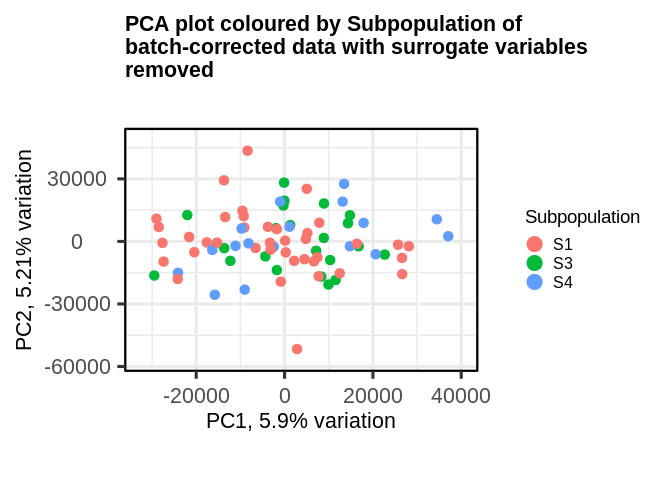
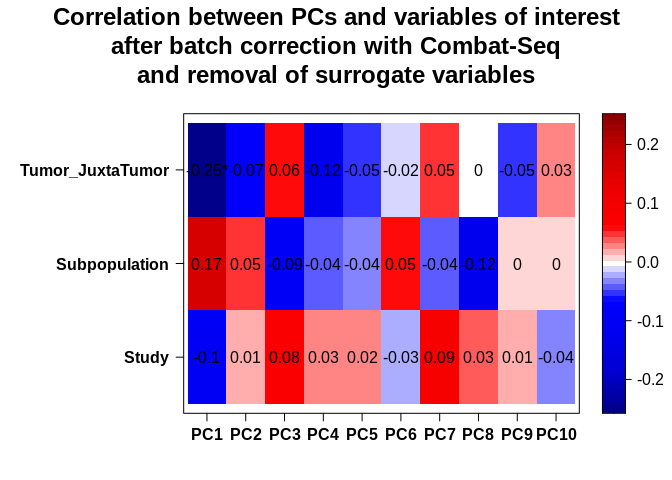
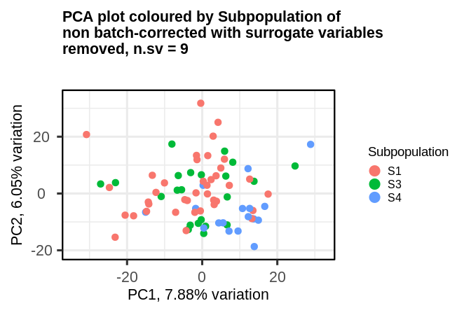
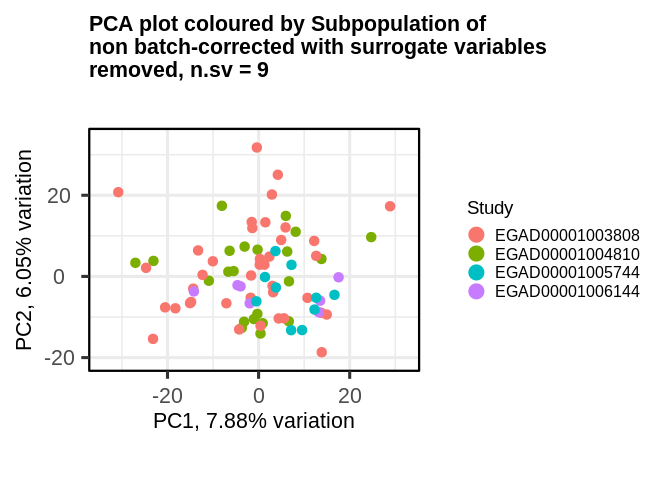

QC
================

- <a href="#read-in-data" id="toc-read-in-data">Read in data</a>
- <a href="#exploratory-data-analysis"
  id="toc-exploratory-data-analysis">Exploratory data analysis</a>
  - <a href="#pca--clinical-correlations-all-studies"
    id="toc-pca--clinical-correlations-all-studies">PCA + clinical
    correlations all studies</a>
  - <a href="#clinical-correlations" id="toc-clinical-correlations">Clinical
    correlations</a>
  - <a href="#outlier-removal" id="toc-outlier-removal">Outlier removal</a>
    - <a href="#hgnc-symbol" id="toc-hgnc-symbol">HGNC symbol</a>
    - <a href="#ensg-gene-id-version" id="toc-ensg-gene-id-version">Ensg gene
      id version</a>
  - <a href="#batch-correction" id="toc-batch-correction">Batch
    Correction</a>
    - <a href="#hgnc-symbol-1" id="toc-hgnc-symbol-1">HGNC symbol</a>
    - <a href="#ensembl-gene-id-version"
      id="toc-ensembl-gene-id-version">Ensembl gene ID version</a>
    - <a href="#surrogate-variable-analysis"
      id="toc-surrogate-variable-analysis">Surrogate variable analysis</a>

# Read in data

Samples were processed with nf-core/rnaseq version `3.8.1`.

Salmon was used in alignment mode so there is no salmon index and no
checksum to import the metadata. Therefore, the parameters recommended
in the [tximeta
vignette](https://bioconductor.org/packages/release/bioc/vignettes/tximeta/inst/doc/tximeta.html#What_if_checksum_isn%E2%80%99t_known)
were used to summarise transcript counts to the gene level, using a
tx2gene file constructed using `generate_tx2gene_table.R`.

``` r
# salmon was used in alignment mode so there is no salmon index, therefore there is no checksum to import the metadata 
# txOut = FALSE means to summarise to gene level (i.e. don't give out transcripts, give out gene level)
se.hgnc <- tximeta(coldata, skipMeta=TRUE, txOut=FALSE, tx2gene=tx2gene.hgnc)
```

    ## reading in files with read_tsv

    ## 1 2 3 4 5 6 7 8 9 10 11 12 13 14 15 16 17 18 19 20 21 22 23 24 25 26 27 28 29 30 31 32 33 34 35 36 37 38 39 40 41 42 43 44 45 46 47 48 49 50 51 52 53 54 55 56 57 58 59 60 61 62 63 64 65 66 67 68 69 70 71 72 73 74 75 76 77 78 79 80 81 82 83 84 85 86 87 88 89 90 91 92 93 94 95 96 97 98 99 100 101 102 103 104 105 106 107 108 109 110 111 112 113 
    ## removing duplicated transcript rows from tx2gene
    ## transcripts missing from tx2gene: 18974
    ## summarizing abundance
    ## summarizing counts
    ## summarizing length

``` r
se.ensg <- tximeta(coldata, skipMeta=TRUE, txOut=FALSE, tx2gene=tx2gene.ensg.version)
```

    ## reading in files with read_tsv
    ## 1 2 3 4 5 6 7 8 9 10 11 12 13 14 15 16 17 18 19 20 21 22 23 24 25 26 27 28 29 30 31 32 33 34 35 36 37 38 39 40 41 42 43 44 45 46 47 48 49 50 51 52 53 54 55 56 57 58 59 60 61 62 63 64 65 66 67 68 69 70 71 72 73 74 75 76 77 78 79 80 81 82 83 84 85 86 87 88 89 90 91 92 93 94 95 96 97 98 99 100 101 102 103 104 105 106 107 108 109 110 111 112 113 
    ## transcripts missing from tx2gene: 18974
    ## summarizing abundance
    ## summarizing counts
    ## summarizing length

``` r
dds.hgnc <- DESeqDataSet(se.hgnc, design = ~1)
```

    ## using counts and average transcript lengths from tximeta

``` r
dds.ensg <- DESeqDataSet(se.ensg, design = ~1)
```

    ## using counts and average transcript lengths from tximeta

``` r
dds.hgnc <- filter_out_low_expressed(dds.hgnc)
```

    ## [1] "no of genes before filtering... 38675"
    ## [1] "no of genes after filtering... 17964"

``` r
dds.ensg <- filter_out_low_expressed(dds.ensg)
```

    ## [1] "no of genes before filtering... 59385"
    ## [1] "no of genes after filtering... 21943"

``` r
vsd.hgnc <- vst(dds.hgnc, blind = TRUE)
```

    ## using 'avgTxLength' from assays(dds), correcting for library size

``` r
vsd.ensg <- vst(dds.ensg, blind = TRUE)
```

    ## using 'avgTxLength' from assays(dds), correcting for library size

# Exploratory data analysis

## PCA + clinical correlations all studies

For consistency between the DESeq2 `plotPCA` function (which by default
takes the 500 most variable genes) and the PCATools `pca` function, all
genes were used when carrying out PCA.

``` r
plotPCA(vsd.hgnc, intgroup = c("Subpopulation"), ntop = nrow(vsd.hgnc)) + 
    ggtitle("PCA using HGNC gene IDs")
```

<!-- -->

``` r
plotPCA(vsd.hgnc, intgroup = c("Study"), ntop = nrow(vsd.hgnc)) +
    ggtitle("PCA using HGNC gene IDs")
```

<!-- -->

``` r
plotPCA(vsd.hgnc, intgroup = c("Tumor_JuxtaTumor"), ntop = nrow(vsd.hgnc)) + 
  ggtitle("PCA using HGNC gene IDs")
```

<!-- -->

There seems to be 4 groups of samples here: the samples at PC1 \< -100
which look like outliers, the main group in the middle (-100 \< PC1 \<
50) and then 2 groups which separate on PC2. One of these groups comes
completely from one batch (EGAD00001005744) which is purely tumour CAFs
and the other is a mixture of our in-house samples and study
EGAD00001006144. There is clear separation between the in-house samples
and EGAD00001006144, so perhaps they could be called one cluster. The
in-house samples underwent culturing in a medium to promote the growth
of fibroblastic cells, whereas the EGAD00001006144 samples either
underwent separation by sorting or spreading. It is possible that there
are similarities in the conditions under which the samples were kept
which altered their transcriptomic properties.

We can see that there are 16 samples that explain much of the variation
in PC1, meaning that they are quite different from the other samples.
Let’s have a look at the PCA loadings using the `biplot` from
`PCATools`.

It is important to note here that our interpretation of the PCA is
subjective, and can change depending on the number of highly variable
genes we consider when carrying out PCA.

``` r
plotPCA(vsd.ensg, intgroup = c("Subpopulation"), ntop = nrow(vsd.ensg)) + 
    ggtitle("PCA using Ensembl gene ID version")
```

<!-- -->

``` r
plotPCA(vsd.ensg, intgroup = c("Study"), ntop = nrow(vsd.ensg)) +
    ggtitle("PCA using Ensembl gene ID version")
```

<!-- -->

``` r
plotPCA(vsd.ensg, intgroup = c("Tumor_JuxtaTumor"), ntop = nrow(vsd.ensg)) + 
  ggtitle("PCA using Ensembl gene ID version")
```

<!-- -->

``` r
vsd.mat.hgnc <- assay(vsd.hgnc)
metadata_pca <- metadata[,1:4]
p <- pca(vsd.mat.hgnc, metadata = metadata_pca)
```

``` r
biplot(p, showLoadings = T, lab = NULL)
```

<!-- -->

There seems to be 10 genes that are associated with PC2, separating our
main cluster and the In-house/EGAD00001006144. samples.

- FOS
  - Proto-oncogene, forms part of TF complex, regulators of cell
    proliferation, differentiation, transformation, apoptosis.
- APOD
  - Apolipoprotein D, encodes part of HDL
  - Expression induced in quiescent/senescent fibroblasts (Rassart et
    al. 2020), and so may inhibit cell growth
  - Downregulated in CAFs in our initial CAF vs TAN DE analysis
- TMEM176B
  - A transmembrane protein
  - Identified as LR8 in 1999 (Lurton et al. 1999) and was proposed as a
    marker for fibroblasts and their subpopulations.
  - It has recently been found to be important in the AKT/mTOR pathway,
    which is involved in cell proliferation (and hence can be implicated
    in cancer) (Kang et al. 2021).
- SELENOP
  - Selenoprotein P
  - Increased expression stops conversion of fibroblasts to
    myofibroblasts (Short and Williams 2017)
- PLXDC1
  - Plexin Domain Containing 1
  - Involved in angiogenesis
  - Cell surface receptor for Pigment Epithelium Derived Factor (Cheng
    et al. 2014)
- P4HB
  - Protein disulfide isomerase
  - Possible fibroblast marker (Wetzig et al. 2013)
- CHPF
  - Chondroitin polymerising factor
  - Alters the formation of chondroitin sulphate in breast cancer.
    Chondroitin sulphate forms “abnormal” chains in breast cancer (Liao
    et al. 2021)
- CEMIP
  - Cell Migration Inducing Hyaluronidase 1
  - WNT-related (Dong et al. 2021)
  - High expression associated with malignancy and increased CAF
    infiltration (Dong et al. 2021). Possible biomarker. Dong study
    looked at expression in tumour cells, here we can see that its
    expression seems to change between different groups of CAFs too.
- TFPI2
  - Tissue factor pathway inhibitor 2.
  - Serine proteinase
  - Tumour suppressor
  - Inhibits plasmin, thereby inhibiting the activation of MMPs
  - Increased expression of TFPI2 in cancer cells downregulates the
    expression of MMPs in CAFs (the opposite is the case too) (Gaud et
    al. 2011).
- GREM1
  - Antagonist of BMP, playing a role in tissue differentiation.
  - Expressed in basal cell carcinoma CAF myofibroblasts (Kim et al.
    2017).
  - Expression of GREM1 derived from CAFs thought to promote cancer
    progression (Ren et al. 2019).
  - Found to be expressed in CAF cell lines but not in breast cancer
    cell lines (Ren et al. 2019).
  - Its expression in bulk tumour samples is correlated with the
    expression of CAF markers such as FAP (Ren et al. 2019).

We can also re-plot the PCA and colour the points by expression of these
genes. It is not done here.

## Clinical correlations

``` r
peigencor
```

<!-- -->

This demonstrates that there are batch effects that need to be removed.

## Outlier removal

### HGNC symbol

``` r
rv <- rowVars(assay(vsd.hgnc))
pc <- prcomp(t(assay(vsd.hgnc)[head(order(-rv),nrow(assay(vsd.hgnc))),]))
# -110 found by visual inspection - see README - this gets rid of 16 samples. -200 gets rid of 11 samples...
idx <- pc$x[,1] < -200
print(paste("Number of samples being removed,", length(idx[which(idx == TRUE)]), sep = " "))
```

    ## [1] "Number of samples being removed, 10"

``` r
patient_samples <- rownames(metadata)
patient_samples <- patient_samples[!idx]
outliers <- patient_samples[idx]
print("Outliers: ")
```

    ## [1] "Outliers: "

``` r
print(outliers)
```

    ##  [1] "B86T3"               "B86T16"              "B86T22"             
    ##  [4] "B86T23"              "B103T104"            "B103T49"            
    ##  [7] "B103T52"             "B103T61"             "B123U3"             
    ## [10] "CAF_Culture_D220T17"

``` r
paste(outliers, collapse = "|")
```

    ## [1] "B86T3|B86T16|B86T22|B86T23|B103T104|B103T49|B103T52|B103T61|B123U3|CAF_Culture_D220T17"

``` r
# create new metadata file 
metadata_reduced <- metadata[patient_samples,]
date <- Sys.Date()
metadata_outfile <- paste("../intermediate_files/metadata_outliers_removed_hgnc_", date, ".txt", sep = "")
print(paste("writing reduced metadata file to ", metadata_outfile, sep = ""))
```

    ## [1] "writing reduced metadata file to ../intermediate_files/metadata_outliers_removed_hgnc_2022-10-26.txt"

``` r
print("not writing to  file")
```

    ## [1] "not writing to  file"

``` r
#write.table(metadata_reduced, file = metadata_outfile, sep = "\t", quote = F, row.names = T)
```

``` r
dds.hgnc.remove.outliers <- dds.ensg[,!idx]
vsd.hgnc.remove.outliers <- vst(dds.hgnc.remove.outliers, blind = TRUE)
```

    ## using 'avgTxLength' from assays(dds), correcting for library size

``` r
#vsd.ensg.remove.outliers.mat <- assay(vsd.ensg.remove.outliers)
```

``` r
plotPCA(vsd.hgnc.remove.outliers, intgroup = c("Subpopulation"), ntop = nrow(vsd.hgnc.remove.outliers)) + 
    ggtitle("PCA using HGNC symbol outliers removed")
```

<!-- -->

``` r
plotPCA(vsd.hgnc.remove.outliers, intgroup = c("Study"), ntop = nrow(vsd.hgnc.remove.outliers)) +
    ggtitle("PCA using HGNC symbol version outliers removed")
```

<!-- -->

``` r
plotPCA(vsd.hgnc.remove.outliers, intgroup = c("Tumor_JuxtaTumor"), ntop = nrow(vsd.hgnc.remove.outliers)) + 
  ggtitle("PCA using HGNC symbol outliers removed")
```

<!-- -->

### Ensg gene id version

``` r
rv <- rowVars(assay(vsd.ensg))
pc <- prcomp(t(assay(vsd.ensg)[head(order(-rv),nrow(assay(vsd.ensg))),]))
# -110 found by visual inspection - see README
idx <- pc$x[,1] < -200
print(paste("Number of samples being removed,", length(idx[which(idx == TRUE)]), sep = " "))
```

    ## [1] "Number of samples being removed, 11"

``` r
patient_samples <- rownames(metadata)
patient_samples <- patient_samples[!idx]
# create new metadata file 
metadata_reduced <- metadata[patient_samples,]
date <- Sys.Date()
metadata_outfile <- paste("../intermediate_files/metadata_outliers_removed_ensembl_gene_id_version_", date, ".txt", sep = "")
print(paste("writing reduced metadata file to ", metadata_outfile, sep = ""))
```

    ## [1] "writing reduced metadata file to ../intermediate_files/metadata_outliers_removed_ensembl_gene_id_version_2022-10-26.txt"

``` r
print("not writing to file")
```

    ## [1] "not writing to file"

``` r
#write.table(metadata_reduced, file = metadata_outfile, sep = "\t", quote = F, row.names = T)
```

``` r
dds.ensg.remove.outliers <- dds.ensg[,!idx]
vsd.ensg.remove.outliers <- vst(dds.ensg.remove.outliers, blind = TRUE)
```

    ## using 'avgTxLength' from assays(dds), correcting for library size

``` r
#vsd.ensg.remove.outliers.mat <- assay(vsd.ensg.remove.outliers)
```

``` r
plotPCA(vsd.ensg.remove.outliers, intgroup = c("Subpopulation"), ntop = nrow(vsd.ensg.remove.outliers)) + 
    ggtitle("PCA using Ensembl gene ID version outliers removed")
```

<!-- -->

``` r
plotPCA(vsd.ensg.remove.outliers, intgroup = c("Study"), ntop = nrow(vsd.ensg.remove.outliers)) +
    ggtitle("PCA using Ensembl gene ID version outliers removed")
```

<!-- -->

``` r
plotPCA(vsd.ensg.remove.outliers, intgroup = c("Tumor_JuxtaTumor"), ntop = nrow(vsd.ensg.remove.outliers)) + 
  ggtitle("PCA using Ensembl gene ID version outliers removed")
```

<!-- -->

## Batch Correction

### HGNC symbol

``` r
# remove batch effects
dds.hgnc.remove.outliers.mat <- assay(dds.hgnc.remove.outliers)
outliers.removed.batch <- colData(dds.hgnc.remove.outliers)$Study
print(paste("Number of genes before filtering: ", nrow(dds.hgnc.remove.outliers.mat), sep = ""))
```

    ## [1] "Number of genes before filtering: 21943"

``` r
# remove genes with 0 in > 1/3 of samples as per GitHub user benostendorf https://github.com/zhangyuqing/ComBat-seq/issues/20 
dds.hgnc.remove.outliers.mat.filtered <- dds.hgnc.remove.outliers.mat[apply(dds.hgnc.remove.outliers.mat, 1, function(x) sum(x == 0)) < ncol(dds.hgnc.remove.outliers.mat) / 3, ]
print(paste("Number of genes after filtering: ", nrow(dds.hgnc.remove.outliers.mat.filtered), sep = ""))
```

    ## [1] "Number of genes after filtering: 14278"

``` r
outliers.removed.group <- colData(dds.hgnc.remove.outliers)$Tumor_JuxtaTumor
print("batch correcting...")
```

    ## [1] "batch correcting..."

``` r
ptm <- proc.time()
dds.hgnc.remove.outliers.mat.batch.corrected <- ComBat_seq(counts = dds.hgnc.remove.outliers.mat.filtered, batch = outliers.removed.batch, group = outliers.removed.group, full_mod = TRUE)
```

    ## Found 5 batches
    ## Using full model in ComBat-seq.
    ## Adjusting for 1 covariate(s) or covariate level(s)
    ## Estimating dispersions
    ## Fitting the GLM model
    ## Shrinkage off - using GLM estimates for parameters
    ## Adjusting the data

``` r
time_taken <- proc.time() - ptm
print("time taken...")
```

    ## [1] "time taken..."

``` r
print(time_taken)
```

    ##    user  system elapsed 
    ##  39.135  44.913  26.856

``` r
dds.hgnc.remove.outliers.batch.corrected <- DESeqDataSetFromMatrix(dds.hgnc.remove.outliers.mat.batch.corrected, colData = colData(dds.hgnc.remove.outliers), design = ~1)
```

    ## converting counts to integer mode

``` r
vsd.hgnc.remove.outliers.batch.corrected <- vst(dds.hgnc.remove.outliers.batch.corrected, blind = TRUE)
```

``` r
plotPCA(vsd.hgnc.remove.outliers.batch.corrected, intgroup = c("Subpopulation"), ntop = nrow(vsd.hgnc.remove.outliers.batch.corrected)) + 
    ggtitle("PCA using HGNC symbol outliers removed batch corrected")
```

<!-- -->

``` r
plotPCA(vsd.hgnc.remove.outliers.batch.corrected, intgroup = c("Study"), ntop = nrow(vsd.hgnc.remove.outliers.batch.corrected)) +
    ggtitle("PCA using HGNC symbol version outliers removed")
```

<!-- -->

``` r
plotPCA(vsd.hgnc.remove.outliers.batch.corrected, intgroup = c("Tumor_JuxtaTumor"), ntop = nrow(vsd.hgnc.remove.outliers.batch.corrected)) + 
  ggtitle("PCA using HGNC symbol outliers removed batch corrected")
```

<!-- -->

### Ensembl gene ID version

``` r
# remove batch effects
dds.ensg.remove.outliers.mat <- assay(dds.ensg.remove.outliers)
outliers.removed.batch <- colData(dds.ensg.remove.outliers)$Study
print(paste("Number of genes before filtering: ", nrow(dds.ensg.remove.outliers.mat), sep = ""))
```

    ## [1] "Number of genes before filtering: 21943"

``` r
# remove genes with 0 in > 1/3 of samples as per GitHub user benostendorf https://github.com/zhangyuqing/ComBat-seq/issues/20 
dds.ensg.remove.outliers.mat.filtered <- dds.ensg.remove.outliers.mat[apply(dds.ensg.remove.outliers.mat, 1, function(x) sum(x == 0)) < ncol(dds.ensg.remove.outliers.mat) / 3, ]
print(paste("Number of genes after filtering: ", nrow(dds.ensg.remove.outliers.mat.filtered), sep = ""))
```

    ## [1] "Number of genes after filtering: 14250"

``` r
outliers.removed.group <- colData(dds.ensg.remove.outliers)$Tumor_JuxtaTumor
print("batch correcting...")
```

    ## [1] "batch correcting..."

``` r
ptm <- proc.time()
dds.ensg.remove.outliers.mat.batch.corrected <- ComBat_seq(counts = dds.ensg.remove.outliers.mat.filtered, batch = outliers.removed.batch, group = outliers.removed.group, full_mod = TRUE)
```

    ## Found 5 batches
    ## Using full model in ComBat-seq.
    ## Adjusting for 1 covariate(s) or covariate level(s)
    ## Estimating dispersions
    ## Fitting the GLM model
    ## Shrinkage off - using GLM estimates for parameters
    ## Adjusting the data

``` r
time_taken <- proc.time() - ptm
print("time taken...")
```

    ## [1] "time taken..."

``` r
print(time_taken)
```

    ##    user  system elapsed 
    ##  40.457  49.888  26.999

``` r
dds.ensg.remove.outliers.batch.corrected <- DESeqDataSetFromMatrix(dds.ensg.remove.outliers.mat.batch.corrected, colData = colData(dds.ensg.remove.outliers), design = ~1)
```

    ## converting counts to integer mode

``` r
vsd.ensg.remove.outliers.batch.corrected <- vst(dds.ensg.remove.outliers.batch.corrected, blind = TRUE)
```

``` r
plotPCA(vsd.ensg.remove.outliers.batch.corrected, intgroup = c("Subpopulation"), ntop = nrow(vsd.ensg.remove.outliers.batch.corrected)) + 
    ggtitle("PCA using Ensembl gene ID version outliers removed batch corrected")
```

<!-- -->

``` r
plotPCA(vsd.ensg.remove.outliers.batch.corrected, intgroup = c("Study"), ntop = nrow(vsd.ensg.remove.outliers.batch.corrected)) +
    ggtitle("PCA using Ensembl gene ID version outliers removed batch corrected")
```

<!-- -->

``` r
plotPCA(vsd.ensg.remove.outliers.batch.corrected, intgroup = c("Tumor_JuxtaTumor"), ntop = nrow(vsd.ensg.remove.outliers.batch.corrected)) + 
  ggtitle("PCA using Ensembl gene ID version outliers removed batch corrected")
```

<!-- -->

``` r
date <- Sys.Date()
outfile.hgnc <- paste("../intermediate_files/dds_batch_corrected_group_tumor_hgnc_", date, ".Rds", sep = "")
print(paste("writing batch corrected data to ", outfile.hgnc, sep = ""))
```

    ## [1] "writing batch corrected data to ../intermediate_files/dds_batch_corrected_group_tumor_hgnc_2022-10-26.Rds"

``` r
print("not writing to file")
```

    ## [1] "not writing to file"

``` r
#saveRDS(dds.hgnc.remove.outliers.batch.corrected, file = outfile.hgnc)
```

``` r
date <- Sys.Date()
outfile.ensg <- paste("../intermediate_files/dds_batch_corrected_group_tumor_ensembl_gene_id_version_", date, ".Rds", sep = "")
print(paste("writing batch corrected data to ", outfile.ensg, sep = ""))
```

    ## [1] "writing batch corrected data to ../intermediate_files/dds_batch_corrected_group_tumor_ensembl_gene_id_version_2022-10-26.Rds"

``` r
print("not writing to file")
```

    ## [1] "not writing to file"

``` r
#saveRDS(dds.ensg.remove.outliers.batch.corrected, file = outfile.ensg)
```

### Surrogate variable analysis

#### SVA seems to remove biological signal

Is surrogate variable analysis required on the batch-corrected data?
Does it remove the biological signal completely?

Source of this code:
<https://www.bioconductor.org/packages/devel/workflows/vignettes/rnaseqGene/inst/doc/rnaseqGene.html>

``` r
keep <- which(colData(dds.ensg.remove.outliers.batch.corrected)$Subpopulation != "Unknown")
dds.ensg.remove.outliers.batch.corrected.no.inhouse <- dds.ensg.remove.outliers.batch.corrected[,keep]
```

``` r
dds.ensg.remove.outliers.batch.corrected.no.inhouse <- DESeq(dds.ensg.remove.outliers.batch.corrected.no.inhouse)
```

    ## Warning in DESeq(dds.ensg.remove.outliers.batch.corrected.no.inhouse): the
    ## design is ~ 1 (just an intercept). is this intended?

    ## estimating size factors

    ## estimating dispersions

    ## gene-wise dispersion estimates

    ## mean-dispersion relationship

    ## final dispersion estimates

    ## fitting model and testing

    ## -- replacing outliers and refitting for 149 genes
    ## -- DESeq argument 'minReplicatesForReplace' = 7 
    ## -- original counts are preserved in counts(dds)

    ## estimating dispersions

    ## fitting model and testing

``` r
counts.ensg.remove.outliers.batch.corrected.no.inhouse  <- counts(dds.ensg.remove.outliers.batch.corrected.no.inhouse, normalized = TRUE)
idx  <- rowMeans(counts.ensg.remove.outliers.batch.corrected.no.inhouse) > 1
counts.ensg.remove.outliers.batch.corrected.no.inhouse  <- counts.ensg.remove.outliers.batch.corrected.no.inhouse[idx, ]
```

``` r
plotPCA(vst(dds.ensg.remove.outliers.batch.corrected.no.inhouse), ntop = nrow(dds.ensg.remove.outliers.batch.corrected.no.inhouse), intgroup = "Subpopulation")
```

<!-- -->

``` r
mod <- model.matrix(~ Subpopulation + Tumor_JuxtaTumor, colData(dds.ensg.remove.outliers.batch.corrected.no.inhouse))
mod0 <- model.matrix(~ 1, colData(dds.ensg.remove.outliers.batch.corrected.no.inhouse))
svseq_no_inhouse <- svaseq(counts.ensg.remove.outliers.batch.corrected.no.inhouse, mod, mod0) # use number of surrogate variables determined by the package, number is 22
```

    ## Number of significant surrogate variables is:  22 
    ## Iteration (out of 5 ):1  2  3  4  5

``` r
colData(dds.ensg.remove.outliers.batch.corrected.no.inhouse)$Tumor_JuxtaTumor <- as.factor(colData(dds.ensg.remove.outliers.batch.corrected.no.inhouse)$Tumor_JuxtaTumor)
colData(dds.ensg.remove.outliers.batch.corrected.no.inhouse)$Subpopulation <- as.factor(colData(dds.ensg.remove.outliers.batch.corrected.no.inhouse)$Subpopulation)

sv_names <- paste("SV", seq(1,svseq_no_inhouse$n.sv), sep = "")
for (i in 1:length(sv_names)){
  colData(dds.ensg.remove.outliers.batch.corrected.no.inhouse)[,sv_names[i]] <- svseq_no_inhouse$sv[,i]
}
```

``` r
design(dds.ensg.remove.outliers.batch.corrected.no.inhouse) <- ~ Tumor_JuxtaTumor + SV1 + SV2 + SV3 + SV4 + SV5 + SV6 + SV7 + SV8 + SV9 + SV10 + SV11 + SV12 + SV13 + SV14 + SV15 + SV16 + SV17 + SV18 +SV19 + SV20 + SV21 + SV22 + Subpopulation
```

``` r
vst.dds.ensg.remove.outliers.batch.corrected.no.inhouse <- vst(dds.ensg.remove.outliers.batch.corrected.no.inhouse)
```

``` r
counts.ensg.remove.outliers.batch.corrected.no.inhouse.remove.svs <- svaBatchCor(counts.ensg.remove.outliers.batch.corrected.no.inhouse, mmi = mod, mm0 = mod0, n.sv = 22)$corrected
```

    ## Number of significant surrogate variables is:  22 
    ## Iteration (out of 5 ):1  2  3  4  5

``` r
pca.metadata <- colData(dds.ensg.remove.outliers.batch.corrected.no.inhouse)[,1:4]
# how to do VST outside deseq2? counts are not in a DEseq2 object
pca.counts.ensg.remove.outliers.batch.corrected.no.inhouse.remove.svs <- pca(counts.ensg.remove.outliers.batch.corrected.no.inhouse.remove.svs, metadata = pca.metadata)
```

``` r
PCAtools::biplot(pca.counts.ensg.remove.outliers.batch.corrected.no.inhouse.remove.svs, lab = NULL, colby = "Subpopulation", legendPosition = 'right', title = "PCA plot coloured by Subpopulation of \nbatch-corrected data with surrogate variables\nremoved")
```

<!-- -->

``` r
eigencorplot(pca.counts.ensg.remove.outliers.batch.corrected.no.inhouse.remove.svs, metavars = c('Subpopulation', 'Tumor_JuxtaTumor', 'Study'),
             main = "Correlation between PCs and variables of interest\nafter batch correction with Combat-Seq\nand removal of surrogate variables", cexMain = 1.5)
```

    ## Warning in
    ## eigencorplot(pca.counts.ensg.remove.outliers.batch.corrected.no.inhouse.remove.svs, :
    ## Subpopulation is not numeric - please check the source data as non-numeric
    ## variables will be coerced to numeric

    ## Warning in
    ## eigencorplot(pca.counts.ensg.remove.outliers.batch.corrected.no.inhouse.remove.svs, :
    ## Tumor_JuxtaTumor is not numeric - please check the source data as non-numeric
    ## variables will be coerced to numeric

    ## Warning in
    ## eigencorplot(pca.counts.ensg.remove.outliers.batch.corrected.no.inhouse.remove.svs, :
    ## Study is not numeric - please check the source data as non-numeric variables
    ## will be coerced to numeric

<!-- -->

From the above we can see that when we include surrogate variables, we
lose much of our biological signal.

#### What if we do SVA on the non batch-corrected data?

``` r
keep <- which(colData(dds.ensg.remove.outliers)$Subpopulation != "Unknown")
dds.ensg.remove.outliers.no.inhouse <- dds.ensg.remove.outliers[,keep]
dds.ensg.remove.outliers.no.inhouse <- DESeq(dds.ensg.remove.outliers.no.inhouse)
```

    ## Warning in DESeq(dds.ensg.remove.outliers.no.inhouse): the design is ~ 1 (just
    ## an intercept). is this intended?

    ## estimating size factors

    ## using 'avgTxLength' from assays(dds), correcting for library size

    ## estimating dispersions

    ## gene-wise dispersion estimates

    ## mean-dispersion relationship

    ## final dispersion estimates

    ## fitting model and testing

    ## -- replacing outliers and refitting for 4932 genes
    ## -- DESeq argument 'minReplicatesForReplace' = 7 
    ## -- original counts are preserved in counts(dds)

    ## estimating dispersions

    ## fitting model and testing

``` r
# write to file
outfile.ensg.no.inhouse <- paste("../intermediate_files/dds_not_corrected_remove_outliers_ensg_", date, ".Rds", sep = "")

saveRDS(dds.ensg.remove.outliers.no.inhouse, file = outfile.ensg.no.inhouse)
counts.ensg.remove.outliers.batch.no.inhouse  <- counts(dds.ensg.remove.outliers.no.inhouse, normalized = TRUE)
idx  <- rowMeans(counts.ensg.remove.outliers.batch.no.inhouse) > 1
counts.ensg.remove.outliers.batch.no.inhouse  <- counts.ensg.remove.outliers.batch.no.inhouse[idx, ]
```

``` r
mod <- model.matrix(~ Subpopulation + Tumor_JuxtaTumor, colData(dds.ensg.remove.outliers.no.inhouse))
mod0 <- model.matrix(~ 1, colData(dds.ensg.remove.outliers.no.inhouse))
svseq_no_inhouse_non_corrected <- svaseq(counts.ensg.remove.outliers.batch.no.inhouse, mod, mod0) # use number of surrogate variables determined by the package, number is 21
```

    ## Number of significant surrogate variables is:  21 
    ## Iteration (out of 5 ):1  2  3  4  5

``` r
colData(dds.ensg.remove.outliers.no.inhouse)$Tumor_JuxtaTumor <- as.factor(colData(dds.ensg.remove.outliers.no.inhouse)$Tumor_JuxtaTumor)
colData(dds.ensg.remove.outliers.no.inhouse)$Subpopulation <- as.factor(colData(dds.ensg.remove.outliers.no.inhouse)$Subpopulation)

sv_names <- paste("SV", seq(1,svseq_no_inhouse_non_corrected$n.sv), sep = "")
for (i in 1:length(sv_names)){
  colData(dds.ensg.remove.outliers.no.inhouse)[,sv_names[i]] <- svseq_no_inhouse$sv[,i]
}

design(dds.ensg.remove.outliers.no.inhouse) <- ~ Tumor_JuxtaTumor + SV1 + SV2 + SV3 + SV4 + SV5 + SV6 + SV7 + SV8 + SV9 + SV10 + SV11 + SV12 + SV13 + SV14 + SV15 + SV16 + SV17 + SV18 +SV19 + SV20 + SV21 + Subpopulation

counts.ensg.remove.outliers.no.inhouse.remove.svs <- svaBatchCor(counts.ensg.remove.outliers.batch.no.inhouse, mmi = mod, mm0 = mod0, n.sv = 1)$corrected
```

    ## Number of significant surrogate variables is:  1 
    ## Iteration (out of 5 ):1  2  3  4  5

``` r
pca.metadata <- colData(dds.ensg.remove.outliers.no.inhouse)[,1:4]
# how to do VST outside deseq2? counts are not in a DEseq2 object
pca.counts.ensg.remove.outliers.no.inhouse.remove.svs <- pca(counts.ensg.remove.outliers.no.inhouse.remove.svs, metadata = pca.metadata)
```

``` r
PCAtools::biplot(pca.counts.ensg.remove.outliers.no.inhouse.remove.svs, lab = NULL, colby = "Study", legendPosition = 'right', title = "PCA plot coloured by Subpopulation of \nnon batch-corrected with surrogate variables\nremoved")
```

<!-- -->

``` r
counts.ensg.remove.outliers.no.inhouse.remove.svs.list <- list()
counts.ensg.remove.outliers.no.inhouse.remove.svs.list.log2.plus.1 <- list()
pca.metadata <- colData(dds.ensg.remove.outliers.no.inhouse)[,1:4]
pca.counts.ensg.remove.outliers.no.inhouse.remove.svs.list <- list()
eigencorplots <- list()
for (i in 1:21){
  sva.output <- svaBatchCor(counts.ensg.remove.outliers.batch.no.inhouse, mmi = mod, mm0 = mod0, n.sv = i)$corrected
  counts.ensg.remove.outliers.no.inhouse.remove.svs.list[[i]] <- sva.output
  sva.output.log2.plus.1 <- log2(sva.output + 1)
  sva.output.log2.plus.1 <- sva.output.log2.plus.1[complete.cases(sva.output.log2.plus.1),]
  counts.ensg.remove.outliers.no.inhouse.remove.svs.list.log2.plus.1[[i]] <- sva.output.log2.plus.1
  pca.out <- pca(sva.output.log2.plus.1, metadata = pca.metadata)
  pca.counts.ensg.remove.outliers.no.inhouse.remove.svs.list[[i]] <- pca.out
  clinical.correlations <- eigencorplot(pca.out, metavars = colnames(pca.out$metadata), main = paste("n.sv:", i))
  eigencorplots[[i]] <- clinical.correlations
}
```

    ## Number of significant surrogate variables is:  1 
    ## Iteration (out of 5 ):1  2  3  4  5

    ## Warning: NaNs produced

    ## Warning in eigencorplot(pca.out, metavars = colnames(pca.out$metadata), : names
    ## is not numeric - please check the source data as non-numeric variables will be
    ## coerced to numeric

    ## Warning in eigencorplot(pca.out, metavars = colnames(pca.out$metadata), : Study
    ## is not numeric - please check the source data as non-numeric variables will be
    ## coerced to numeric

    ## Warning in eigencorplot(pca.out, metavars = colnames(pca.out$metadata), :
    ## Subpopulation is not numeric - please check the source data as non-numeric
    ## variables will be coerced to numeric

    ## Warning in eigencorplot(pca.out, metavars = colnames(pca.out$metadata), :
    ## Tumor_JuxtaTumor is not numeric - please check the source data as non-numeric
    ## variables will be coerced to numeric

    ## Number of significant surrogate variables is:  2 
    ## Iteration (out of 5 ):1  2  3  4  5

    ## Warning: NaNs produced

    ## Warning in eigencorplot(pca.out, metavars = colnames(pca.out$metadata), : names
    ## is not numeric - please check the source data as non-numeric variables will be
    ## coerced to numeric

    ## Warning in eigencorplot(pca.out, metavars = colnames(pca.out$metadata), : Study
    ## is not numeric - please check the source data as non-numeric variables will be
    ## coerced to numeric

    ## Warning in eigencorplot(pca.out, metavars = colnames(pca.out$metadata), :
    ## Subpopulation is not numeric - please check the source data as non-numeric
    ## variables will be coerced to numeric

    ## Warning in eigencorplot(pca.out, metavars = colnames(pca.out$metadata), :
    ## Tumor_JuxtaTumor is not numeric - please check the source data as non-numeric
    ## variables will be coerced to numeric

    ## Number of significant surrogate variables is:  3 
    ## Iteration (out of 5 ):1  2  3  4  5

    ## Warning: NaNs produced

    ## Warning in eigencorplot(pca.out, metavars = colnames(pca.out$metadata), : names
    ## is not numeric - please check the source data as non-numeric variables will be
    ## coerced to numeric

    ## Warning in eigencorplot(pca.out, metavars = colnames(pca.out$metadata), : Study
    ## is not numeric - please check the source data as non-numeric variables will be
    ## coerced to numeric

    ## Warning in eigencorplot(pca.out, metavars = colnames(pca.out$metadata), :
    ## Subpopulation is not numeric - please check the source data as non-numeric
    ## variables will be coerced to numeric

    ## Warning in eigencorplot(pca.out, metavars = colnames(pca.out$metadata), :
    ## Tumor_JuxtaTumor is not numeric - please check the source data as non-numeric
    ## variables will be coerced to numeric

    ## Number of significant surrogate variables is:  4 
    ## Iteration (out of 5 ):1  2  3  4  5

    ## Warning: NaNs produced

    ## Warning in eigencorplot(pca.out, metavars = colnames(pca.out$metadata), : names
    ## is not numeric - please check the source data as non-numeric variables will be
    ## coerced to numeric

    ## Warning in eigencorplot(pca.out, metavars = colnames(pca.out$metadata), : Study
    ## is not numeric - please check the source data as non-numeric variables will be
    ## coerced to numeric

    ## Warning in eigencorplot(pca.out, metavars = colnames(pca.out$metadata), :
    ## Subpopulation is not numeric - please check the source data as non-numeric
    ## variables will be coerced to numeric

    ## Warning in eigencorplot(pca.out, metavars = colnames(pca.out$metadata), :
    ## Tumor_JuxtaTumor is not numeric - please check the source data as non-numeric
    ## variables will be coerced to numeric

    ## Number of significant surrogate variables is:  5 
    ## Iteration (out of 5 ):1  2  3  4  5

    ## Warning: NaNs produced

    ## Warning in eigencorplot(pca.out, metavars = colnames(pca.out$metadata), : names
    ## is not numeric - please check the source data as non-numeric variables will be
    ## coerced to numeric

    ## Warning in eigencorplot(pca.out, metavars = colnames(pca.out$metadata), : Study
    ## is not numeric - please check the source data as non-numeric variables will be
    ## coerced to numeric

    ## Warning in eigencorplot(pca.out, metavars = colnames(pca.out$metadata), :
    ## Subpopulation is not numeric - please check the source data as non-numeric
    ## variables will be coerced to numeric

    ## Warning in eigencorplot(pca.out, metavars = colnames(pca.out$metadata), :
    ## Tumor_JuxtaTumor is not numeric - please check the source data as non-numeric
    ## variables will be coerced to numeric

    ## Number of significant surrogate variables is:  6 
    ## Iteration (out of 5 ):1  2  3  4  5

    ## Warning: NaNs produced

    ## Warning in eigencorplot(pca.out, metavars = colnames(pca.out$metadata), : names
    ## is not numeric - please check the source data as non-numeric variables will be
    ## coerced to numeric

    ## Warning in eigencorplot(pca.out, metavars = colnames(pca.out$metadata), : Study
    ## is not numeric - please check the source data as non-numeric variables will be
    ## coerced to numeric

    ## Warning in eigencorplot(pca.out, metavars = colnames(pca.out$metadata), :
    ## Subpopulation is not numeric - please check the source data as non-numeric
    ## variables will be coerced to numeric

    ## Warning in eigencorplot(pca.out, metavars = colnames(pca.out$metadata), :
    ## Tumor_JuxtaTumor is not numeric - please check the source data as non-numeric
    ## variables will be coerced to numeric

    ## Number of significant surrogate variables is:  7 
    ## Iteration (out of 5 ):1  2  3  4  5

    ## Warning: NaNs produced

    ## Warning in eigencorplot(pca.out, metavars = colnames(pca.out$metadata), : names
    ## is not numeric - please check the source data as non-numeric variables will be
    ## coerced to numeric

    ## Warning in eigencorplot(pca.out, metavars = colnames(pca.out$metadata), : Study
    ## is not numeric - please check the source data as non-numeric variables will be
    ## coerced to numeric

    ## Warning in eigencorplot(pca.out, metavars = colnames(pca.out$metadata), :
    ## Subpopulation is not numeric - please check the source data as non-numeric
    ## variables will be coerced to numeric

    ## Warning in eigencorplot(pca.out, metavars = colnames(pca.out$metadata), :
    ## Tumor_JuxtaTumor is not numeric - please check the source data as non-numeric
    ## variables will be coerced to numeric

    ## Number of significant surrogate variables is:  8 
    ## Iteration (out of 5 ):1  2  3  4  5

    ## Warning: NaNs produced

    ## Warning in eigencorplot(pca.out, metavars = colnames(pca.out$metadata), : names
    ## is not numeric - please check the source data as non-numeric variables will be
    ## coerced to numeric

    ## Warning in eigencorplot(pca.out, metavars = colnames(pca.out$metadata), : Study
    ## is not numeric - please check the source data as non-numeric variables will be
    ## coerced to numeric

    ## Warning in eigencorplot(pca.out, metavars = colnames(pca.out$metadata), :
    ## Subpopulation is not numeric - please check the source data as non-numeric
    ## variables will be coerced to numeric

    ## Warning in eigencorplot(pca.out, metavars = colnames(pca.out$metadata), :
    ## Tumor_JuxtaTumor is not numeric - please check the source data as non-numeric
    ## variables will be coerced to numeric

    ## Number of significant surrogate variables is:  9 
    ## Iteration (out of 5 ):1  2  3  4  5

    ## Warning: NaNs produced

    ## Warning in eigencorplot(pca.out, metavars = colnames(pca.out$metadata), : names
    ## is not numeric - please check the source data as non-numeric variables will be
    ## coerced to numeric

    ## Warning in eigencorplot(pca.out, metavars = colnames(pca.out$metadata), : Study
    ## is not numeric - please check the source data as non-numeric variables will be
    ## coerced to numeric

    ## Warning in eigencorplot(pca.out, metavars = colnames(pca.out$metadata), :
    ## Subpopulation is not numeric - please check the source data as non-numeric
    ## variables will be coerced to numeric

    ## Warning in eigencorplot(pca.out, metavars = colnames(pca.out$metadata), :
    ## Tumor_JuxtaTumor is not numeric - please check the source data as non-numeric
    ## variables will be coerced to numeric

    ## Number of significant surrogate variables is:  10 
    ## Iteration (out of 5 ):1  2  3  4  5

    ## Warning: NaNs produced

    ## Warning in eigencorplot(pca.out, metavars = colnames(pca.out$metadata), : names
    ## is not numeric - please check the source data as non-numeric variables will be
    ## coerced to numeric

    ## Warning in eigencorplot(pca.out, metavars = colnames(pca.out$metadata), : Study
    ## is not numeric - please check the source data as non-numeric variables will be
    ## coerced to numeric

    ## Warning in eigencorplot(pca.out, metavars = colnames(pca.out$metadata), :
    ## Subpopulation is not numeric - please check the source data as non-numeric
    ## variables will be coerced to numeric

    ## Warning in eigencorplot(pca.out, metavars = colnames(pca.out$metadata), :
    ## Tumor_JuxtaTumor is not numeric - please check the source data as non-numeric
    ## variables will be coerced to numeric

    ## Number of significant surrogate variables is:  11 
    ## Iteration (out of 5 ):1  2  3  4  5

    ## Warning: NaNs produced

    ## Warning in eigencorplot(pca.out, metavars = colnames(pca.out$metadata), : names
    ## is not numeric - please check the source data as non-numeric variables will be
    ## coerced to numeric

    ## Warning in eigencorplot(pca.out, metavars = colnames(pca.out$metadata), : Study
    ## is not numeric - please check the source data as non-numeric variables will be
    ## coerced to numeric

    ## Warning in eigencorplot(pca.out, metavars = colnames(pca.out$metadata), :
    ## Subpopulation is not numeric - please check the source data as non-numeric
    ## variables will be coerced to numeric

    ## Warning in eigencorplot(pca.out, metavars = colnames(pca.out$metadata), :
    ## Tumor_JuxtaTumor is not numeric - please check the source data as non-numeric
    ## variables will be coerced to numeric

    ## Number of significant surrogate variables is:  12 
    ## Iteration (out of 5 ):1  2  3  4  5

    ## Warning: NaNs produced

    ## Warning in eigencorplot(pca.out, metavars = colnames(pca.out$metadata), : names
    ## is not numeric - please check the source data as non-numeric variables will be
    ## coerced to numeric

    ## Warning in eigencorplot(pca.out, metavars = colnames(pca.out$metadata), : Study
    ## is not numeric - please check the source data as non-numeric variables will be
    ## coerced to numeric

    ## Warning in eigencorplot(pca.out, metavars = colnames(pca.out$metadata), :
    ## Subpopulation is not numeric - please check the source data as non-numeric
    ## variables will be coerced to numeric

    ## Warning in eigencorplot(pca.out, metavars = colnames(pca.out$metadata), :
    ## Tumor_JuxtaTumor is not numeric - please check the source data as non-numeric
    ## variables will be coerced to numeric

    ## Number of significant surrogate variables is:  13 
    ## Iteration (out of 5 ):1  2  3  4  5

    ## Warning: NaNs produced

    ## Warning in eigencorplot(pca.out, metavars = colnames(pca.out$metadata), : names
    ## is not numeric - please check the source data as non-numeric variables will be
    ## coerced to numeric

    ## Warning in eigencorplot(pca.out, metavars = colnames(pca.out$metadata), : Study
    ## is not numeric - please check the source data as non-numeric variables will be
    ## coerced to numeric

    ## Warning in eigencorplot(pca.out, metavars = colnames(pca.out$metadata), :
    ## Subpopulation is not numeric - please check the source data as non-numeric
    ## variables will be coerced to numeric

    ## Warning in eigencorplot(pca.out, metavars = colnames(pca.out$metadata), :
    ## Tumor_JuxtaTumor is not numeric - please check the source data as non-numeric
    ## variables will be coerced to numeric

    ## Number of significant surrogate variables is:  14 
    ## Iteration (out of 5 ):1  2  3  4  5

    ## Warning: NaNs produced

    ## Warning in eigencorplot(pca.out, metavars = colnames(pca.out$metadata), : names
    ## is not numeric - please check the source data as non-numeric variables will be
    ## coerced to numeric

    ## Warning in eigencorplot(pca.out, metavars = colnames(pca.out$metadata), : Study
    ## is not numeric - please check the source data as non-numeric variables will be
    ## coerced to numeric

    ## Warning in eigencorplot(pca.out, metavars = colnames(pca.out$metadata), :
    ## Subpopulation is not numeric - please check the source data as non-numeric
    ## variables will be coerced to numeric

    ## Warning in eigencorplot(pca.out, metavars = colnames(pca.out$metadata), :
    ## Tumor_JuxtaTumor is not numeric - please check the source data as non-numeric
    ## variables will be coerced to numeric

    ## Number of significant surrogate variables is:  15 
    ## Iteration (out of 5 ):1  2  3  4  5

    ## Warning: NaNs produced

    ## Warning in eigencorplot(pca.out, metavars = colnames(pca.out$metadata), : names
    ## is not numeric - please check the source data as non-numeric variables will be
    ## coerced to numeric

    ## Warning in eigencorplot(pca.out, metavars = colnames(pca.out$metadata), : Study
    ## is not numeric - please check the source data as non-numeric variables will be
    ## coerced to numeric

    ## Warning in eigencorplot(pca.out, metavars = colnames(pca.out$metadata), :
    ## Subpopulation is not numeric - please check the source data as non-numeric
    ## variables will be coerced to numeric

    ## Warning in eigencorplot(pca.out, metavars = colnames(pca.out$metadata), :
    ## Tumor_JuxtaTumor is not numeric - please check the source data as non-numeric
    ## variables will be coerced to numeric

    ## Number of significant surrogate variables is:  16 
    ## Iteration (out of 5 ):1  2  3  4  5

    ## Warning: NaNs produced

    ## Warning in eigencorplot(pca.out, metavars = colnames(pca.out$metadata), : names
    ## is not numeric - please check the source data as non-numeric variables will be
    ## coerced to numeric

    ## Warning in eigencorplot(pca.out, metavars = colnames(pca.out$metadata), : Study
    ## is not numeric - please check the source data as non-numeric variables will be
    ## coerced to numeric

    ## Warning in eigencorplot(pca.out, metavars = colnames(pca.out$metadata), :
    ## Subpopulation is not numeric - please check the source data as non-numeric
    ## variables will be coerced to numeric

    ## Warning in eigencorplot(pca.out, metavars = colnames(pca.out$metadata), :
    ## Tumor_JuxtaTumor is not numeric - please check the source data as non-numeric
    ## variables will be coerced to numeric

    ## Number of significant surrogate variables is:  17 
    ## Iteration (out of 5 ):1  2  3  4  5

    ## Warning: NaNs produced

    ## Warning in eigencorplot(pca.out, metavars = colnames(pca.out$metadata), : names
    ## is not numeric - please check the source data as non-numeric variables will be
    ## coerced to numeric

    ## Warning in eigencorplot(pca.out, metavars = colnames(pca.out$metadata), : Study
    ## is not numeric - please check the source data as non-numeric variables will be
    ## coerced to numeric

    ## Warning in eigencorplot(pca.out, metavars = colnames(pca.out$metadata), :
    ## Subpopulation is not numeric - please check the source data as non-numeric
    ## variables will be coerced to numeric

    ## Warning in eigencorplot(pca.out, metavars = colnames(pca.out$metadata), :
    ## Tumor_JuxtaTumor is not numeric - please check the source data as non-numeric
    ## variables will be coerced to numeric

    ## Number of significant surrogate variables is:  18 
    ## Iteration (out of 5 ):1  2  3  4  5

    ## Warning: NaNs produced

    ## Warning in eigencorplot(pca.out, metavars = colnames(pca.out$metadata), : names
    ## is not numeric - please check the source data as non-numeric variables will be
    ## coerced to numeric

    ## Warning in eigencorplot(pca.out, metavars = colnames(pca.out$metadata), : Study
    ## is not numeric - please check the source data as non-numeric variables will be
    ## coerced to numeric

    ## Warning in eigencorplot(pca.out, metavars = colnames(pca.out$metadata), :
    ## Subpopulation is not numeric - please check the source data as non-numeric
    ## variables will be coerced to numeric

    ## Warning in eigencorplot(pca.out, metavars = colnames(pca.out$metadata), :
    ## Tumor_JuxtaTumor is not numeric - please check the source data as non-numeric
    ## variables will be coerced to numeric

    ## Number of significant surrogate variables is:  19 
    ## Iteration (out of 5 ):1  2  3  4  5

    ## Warning: NaNs produced

    ## Warning in eigencorplot(pca.out, metavars = colnames(pca.out$metadata), : names
    ## is not numeric - please check the source data as non-numeric variables will be
    ## coerced to numeric

    ## Warning in eigencorplot(pca.out, metavars = colnames(pca.out$metadata), : Study
    ## is not numeric - please check the source data as non-numeric variables will be
    ## coerced to numeric

    ## Warning in eigencorplot(pca.out, metavars = colnames(pca.out$metadata), :
    ## Subpopulation is not numeric - please check the source data as non-numeric
    ## variables will be coerced to numeric

    ## Warning in eigencorplot(pca.out, metavars = colnames(pca.out$metadata), :
    ## Tumor_JuxtaTumor is not numeric - please check the source data as non-numeric
    ## variables will be coerced to numeric

    ## Number of significant surrogate variables is:  20 
    ## Iteration (out of 5 ):1  2  3  4  5

    ## Warning: NaNs produced

    ## Warning in eigencorplot(pca.out, metavars = colnames(pca.out$metadata), : names
    ## is not numeric - please check the source data as non-numeric variables will be
    ## coerced to numeric

    ## Warning in eigencorplot(pca.out, metavars = colnames(pca.out$metadata), : Study
    ## is not numeric - please check the source data as non-numeric variables will be
    ## coerced to numeric

    ## Warning in eigencorplot(pca.out, metavars = colnames(pca.out$metadata), :
    ## Subpopulation is not numeric - please check the source data as non-numeric
    ## variables will be coerced to numeric

    ## Warning in eigencorplot(pca.out, metavars = colnames(pca.out$metadata), :
    ## Tumor_JuxtaTumor is not numeric - please check the source data as non-numeric
    ## variables will be coerced to numeric

    ## Number of significant surrogate variables is:  21 
    ## Iteration (out of 5 ):1  2  3  4  5

    ## Warning: NaNs produced

    ## Warning in eigencorplot(pca.out, metavars = colnames(pca.out$metadata), : names
    ## is not numeric - please check the source data as non-numeric variables will be
    ## coerced to numeric

    ## Warning in eigencorplot(pca.out, metavars = colnames(pca.out$metadata), : Study
    ## is not numeric - please check the source data as non-numeric variables will be
    ## coerced to numeric

    ## Warning in eigencorplot(pca.out, metavars = colnames(pca.out$metadata), :
    ## Subpopulation is not numeric - please check the source data as non-numeric
    ## variables will be coerced to numeric

    ## Warning in eigencorplot(pca.out, metavars = colnames(pca.out$metadata), :
    ## Tumor_JuxtaTumor is not numeric - please check the source data as non-numeric
    ## variables will be coerced to numeric

Starting at 1 surrogate variable, the resulting eigencorplot resulting
from adding 1 surrogate variable was examined. The first one without a
significant correlation between PCs and study was n.sv = 9.

``` r
eigencorplots[[9]]
```

<!-- -->

We can see from the PCA plot that when we include 9 surrogate variables,
we get some separation by subpopulation, and good mixing between the
studies.

``` r
PCAtools::biplot(pca.counts.ensg.remove.outliers.no.inhouse.remove.svs.list[[9]], lab = NULL, colby = "Subpopulation", legendPosition = 'right', title = "PCA plot coloured by Subpopulation of \nnon batch-corrected with surrogate variables\nremoved, n.sv = 9")
```

<!-- -->

``` r
PCAtools::biplot(pca.counts.ensg.remove.outliers.no.inhouse.remove.svs.list[[9]], lab = NULL, colby = "Study", legendPosition = 'right', title = "PCA plot coloured by Subpopulation of \nnon batch-corrected with surrogate variables\nremoved, n.sv = 9")
```

<!-- -->

#### Which SVs are correlated with the labels?

Below is a look at which SVs are correlated with Subpopulation. This was
done in a hope that one could pick and choose which SVs to include in
the DE analysis. It does not seem to be a feasible option.

Do an eigencorplot on the batch-corrected data, looking for correlations
with the clinical covariates and the surrogate variables identified with
SVA

``` r
vst.dds.ensg.remove.outliers.batch.corrected.no.inhouse.assay <- assay(vst.dds.ensg.remove.outliers.batch.corrected.no.inhouse)
pca.counts.ensg.remove.outliers.batch.corrected.no.inhouse <- pca(vst.dds.ensg.remove.outliers.batch.corrected.no.inhouse.assay, metadata = colData(vst.dds.ensg.remove.outliers.batch.corrected.no.inhouse)[,-c(5,6)])
```

``` r
eigencorplot(pca.counts.ensg.remove.outliers.batch.corrected.no.inhouse, metavars = colnames(pca.counts.ensg.remove.outliers.batch.corrected.no.inhouse$metadata))
```

    ## Warning in
    ## eigencorplot(pca.counts.ensg.remove.outliers.batch.corrected.no.inhouse, : names
    ## is not numeric - please check the source data as non-numeric variables will be
    ## coerced to numeric

    ## Warning in
    ## eigencorplot(pca.counts.ensg.remove.outliers.batch.corrected.no.inhouse, : Study
    ## is not numeric - please check the source data as non-numeric variables will be
    ## coerced to numeric

    ## Warning in
    ## eigencorplot(pca.counts.ensg.remove.outliers.batch.corrected.no.inhouse, :
    ## Subpopulation is not numeric - please check the source data as non-numeric
    ## variables will be coerced to numeric

    ## Warning in
    ## eigencorplot(pca.counts.ensg.remove.outliers.batch.corrected.no.inhouse, :
    ## Tumor_JuxtaTumor is not numeric - please check the source data as non-numeric
    ## variables will be coerced to numeric

<!-- -->

``` r
shapiro.test(pca.counts.ensg.remove.outliers.batch.corrected.no.inhouse$metadata$SV1)$p.value # not normally distributed, can't do ANOVA
```

    ## [1] 7.21966e-07

``` r
subpopulation_svs <- data.frame(pca.counts.ensg.remove.outliers.batch.corrected.no.inhouse$metadata)[,-c(1,2,4)]
library("ggpubr")
ggline(subpopulation_svs, x = "Subpopulation", y = "SV1", 
       add = c("mean_se", "jitter"), 
          order = c("S1", "S3", "S4"),
          ylab = "Surrogate variable 1", xlab = "Subpopulation")
```

<!-- -->

``` r
ggline(subpopulation_svs, x = "Subpopulation", y = "SV5", 
       add = c("mean_se", "jitter"), 
          order = c("S1", "S3", "S4"),
          ylab = "Surrogate variable 5", xlab = "Subpopulation")
```

<!-- -->

``` r
ggline(subpopulation_svs, x = "Subpopulation", y = "SV8", 
       add = c("mean_se", "jitter"), 
          order = c("S1", "S3", "S4"),
          ylab = "Surrogate variable 8", xlab = "Subpopulation")
```

<!-- -->

``` r
kruskal_results <- data.frame(SV = colnames(subpopulation_svs)[2:ncol(subpopulation_svs)], pval = rep(1, ncol(subpopulation_svs)-1))
for (i in 2:ncol(subpopulation_svs)){
  kruskal_results[i-1,2] <- kruskal.test(subpopulation_svs[,i] ~ Subpopulation, data = subpopulation_svs)$p.value
}
kruskal_results$padj <- p.adjust(p = kruskal_results$pval, method = "BH")
kruskal_results$sig <- ifelse(kruskal_results$padj < 0.1, "Yes", "No")
kruskal_results
```

    ##      SV         pval       padj sig
    ## 1   SV1 0.2762862661 0.85173266  No
    ## 2   SV2 0.0986782749 0.54273051  No
    ## 3   SV3 0.7016214818 0.88085568  No
    ## 4   SV4 0.0606646870 0.44487437  No
    ## 5   SV5 0.6586999646 0.88085568  No
    ## 6   SV6 0.0012944040 0.01423844 Yes
    ## 7   SV7 0.6341874208 0.88085568  No
    ## 8   SV8 0.0005388763 0.01185528 Yes
    ## 9   SV9 0.6885735510 0.88085568  No
    ## 10 SV10 0.4274182617 0.85173266  No
    ## 11 SV11 0.4420602773 0.85173266  No
    ## 12 SV12 0.1703630211 0.67935802  No
    ## 13 SV13 0.5693226859 0.88085568  No
    ## 14 SV14 0.4429945290 0.85173266  No
    ## 15 SV15 0.7824565121 0.88085568  No
    ## 16 SV16 0.8007778867 0.88085568  No
    ## 17 SV17 0.4645814490 0.85173266  No
    ## 18 SV18 0.1852794612 0.67935802  No
    ## 19 SV19 0.7490272839 0.88085568  No
    ## 20 SV20 0.3729538582 0.85173266  No
    ## 21 SV21 0.8803500853 0.92227152  No
    ## 22 SV22 0.9858831321 0.98588313  No

Try to remove all SVs except for SV8 and SV6

``` r
svs.include <- c(6,8)
counts.ensg.remove.outliers.batch.corrected.no.inhouse.remove.svs.sv8.sv6 <- svaBatchCor(counts.ensg.remove.outliers.batch.corrected.no.inhouse, mmi = mod, mm0 = mod0, n.sv = 22, svs.include = svs.include)$corrected
```

    ## Number of significant surrogate variables is:  22 
    ## Iteration (out of 5 ):1  2  3  4  5

``` r
pca.counts.ensg.remove.outliers.batch.corrected.no.inhouse.remove.svs.sv8.sv6 <- pca(counts.ensg.remove.outliers.batch.corrected.no.inhouse.remove.svs.sv8.sv6, metadata = pca.metadata)
eigencorplot(pca.counts.ensg.remove.outliers.batch.corrected.no.inhouse.remove.svs.sv8.sv6, metavars = c('Subpopulation', 'Tumor_JuxtaTumor', 'Study'),
             main = "Correlation between PCs and variables of interest\nafter batch correction with Combat-Seq\nand removal of surrogate variables\nwith only SV6 or SV8", cexMain = 1.5)
```

    ## Warning in
    ## eigencorplot(pca.counts.ensg.remove.outliers.batch.corrected.no.inhouse.remove.svs.sv8.sv6, :
    ## Subpopulation is not numeric - please check the source data as non-numeric
    ## variables will be coerced to numeric

    ## Warning in
    ## eigencorplot(pca.counts.ensg.remove.outliers.batch.corrected.no.inhouse.remove.svs.sv8.sv6, :
    ## Tumor_JuxtaTumor is not numeric - please check the source data as non-numeric
    ## variables will be coerced to numeric

    ## Warning in
    ## eigencorplot(pca.counts.ensg.remove.outliers.batch.corrected.no.inhouse.remove.svs.sv8.sv6, :
    ## Study is not numeric - please check the source data as non-numeric variables
    ## will be coerced to numeric

<!-- -->

``` r
PCAtools::biplot(pca.counts.ensg.remove.outliers.batch.corrected.no.inhouse.remove.svs.sv8.sv6, lab = NULL, colby = "Subpopulation", legendPosition = 'right', title = "PCA plot coloured by Subpopulation of \nbatch-corrected data with surrogate variables\nremoved SV6 SV8")
```

<!-- -->

<div id="refs" class="references csl-bib-body hanging-indent">

<div id="ref-Cheng2014" class="csl-entry">

Cheng, Guo, Ming Zhong, Riki Kawaguchi, Miki Kassai, Muayyad Al-Ubaidi,
Jun Deng, Mariam Ter-Stepanian, and Hui Sun. 2014. “<span
class="nocase">Identification of PLXDC1 and PLXDC2 as the transmembrane
receptors for the multifunctional factor PEDF</span>.” *eLife* 3:
e05401. <https://doi.org/10.7554/ELIFE.05401>.

</div>

<div id="ref-Dong2021" class="csl-entry">

Dong, Xingxing, Yalong Yang, Qianqian Yuan, Jinxuan Hou, and Gaosong Wu.
2021. “<span class="nocase">High Expression of CEMIP Correlates Poor
Prognosis and the Tumur Microenvironment in Breast Cancer as a
Promisingly Prognostic Biomarker</span>.” *Frontiers in Genetics* 12
(December): 2512. <https://doi.org/10.3389/FGENE.2021.768140/BIBTEX>.

</div>

<div id="ref-Gaud2011" class="csl-entry">

Gaud, Guillaume, Sophie Iochmann, Audrey Guillon-Munos, Benjamin
Brillet, Stéphanie Petiot, Florian Seigneuret, Antoine Touzé, et al.
2011. “<span class="nocase">TFPI-2 silencing increases tumour
progression and promotes metalloproteinase 1 and 3 induction through
tumour-stromal cell interactions</span>.” *Journal of Cellular and
Molecular Medicine* 15 (2): 196.
<https://doi.org/10.1111/J.1582-4934.2009.00989.X>.

</div>

<div id="ref-Kang2021" class="csl-entry">

Kang, Chifei, Ran Rostoker, Sarit Ben-Shumel, Rola Rashed, James Andrew
Duty, Deniz Demircioglu, Irini M. Antoniou, et al. 2021. “<span
class="nocase">Tmem176b regulates akt/mtor signaling and tumor growth in
triple-negative breast cancer</span>.” *Cells* 10 (12): 3430.
<https://doi.org/10.3390/CELLS10123430/S1>.

</div>

<div id="ref-Kim2017" class="csl-entry">

Kim, Hye Sung, Myung Soo Shin, Min Seok Cheon, Jae Wang Kim, Cheol Lee,
Woo Ho Kim, Young Sill Kim, and Bo Gun Jang. 2017. “<span
class="nocase">GREM1 is expressed in the cancer-associated
myofibroblasts of basal cell carcinomas</span>.” *PLoS ONE* 12 (3).
<https://doi.org/10.1371/JOURNAL.PONE.0174565>.

</div>

<div id="ref-Liao2021" class="csl-entry">

Liao, Wen-Chieh, Hung-Rong Yen, Chia-Hua Chen, Yin-Hung Chu, Ying-Chyi
Song, To-Jung Tseng, and Chiung-Hui Liu. 2021. “<span
class="nocase">CHPF promotes malignancy of breast cancer cells by
modifying syndecan-4 and the tumor microenvironment</span>.” *American
Journal of Cancer Research* 11 (3): 812. [/pmc/articles/PMC7994168/
/pmc/articles/PMC7994168/?report=abstract
https://www.ncbi.nlm.nih.gov/pmc/articles/PMC7994168/](/pmc/articles/PMC7994168/ /pmc/articles/PMC7994168/?report=abstract https://www.ncbi.nlm.nih.gov/pmc/articles/PMC7994168/).

</div>

<div id="ref-Lurton1999" class="csl-entry">

Lurton, J., T. M. Rose, G. Raghu, and A. S. Narayanan. 1999. “<span
class="nocase">Isolation of a Gene Product Expressed by a Subpopulation
of Human Lung Fibroblasts by Differential Display</span>.” *American
Journal of Respiratory Cell and Molecular Biology* 20 (2): 327–31.
<https://doi.org/10.1165/AJRCMB.20.2.3368>.

</div>

<div id="ref-Rassart2020" class="csl-entry">

Rassart, Eric, Frederik Desmarais, Ouafa Najyb, Karl F. Bergeron, and
Catherine Mounier. 2020. “Apolipoprotein D.” *Gene* 756 (September):
144874. <https://doi.org/10.1016/J.GENE.2020.144874>.

</div>

<div id="ref-Ren2019" class="csl-entry">

Ren, Jiang, Marcel Smid, Josephine Iaria, Daniela C. F. Salvatori, Hans
Van Dam, Hong Jian Zhu, John W. M. Martens, and Peter Ten Dijke. 2019.
“<span class="nocase">Cancer-associated fibroblast-derived Gremlin 1
promotes breast cancer progression</span>.” *Breast Cancer Research* 21
(1): 1–19. <https://doi.org/10.1186/S13058-019-1194-0/FIGURES/7>.

</div>

<div id="ref-Short2017" class="csl-entry">

Short, Sarah P., and Christopher S. Williams. 2017. “<span
class="nocase">Selenoproteins in tumorigenesis and cancer
progression</span>.” *Advances in Cancer Research* 136: 49.
<https://doi.org/10.1016/BS.ACR.2017.08.002>.

</div>

<div id="ref-Wetzig2013" class="csl-entry">

Wetzig, Andrew, Ayodele Alaiya, Monther Al-Alwan, Christian B. Pradez,
Manogaran S. Pulicat, Amer Al-Mazrou, Zakia Shinwari, et al. 2013.
“<span class="nocase">Differential marker expression by cultures rich in
mesenchymal stem cells</span>.” *BMC Cell Biology* 14 (1): 54.
<https://doi.org/10.1186/1471-2121-14-54>.

</div>

</div>
