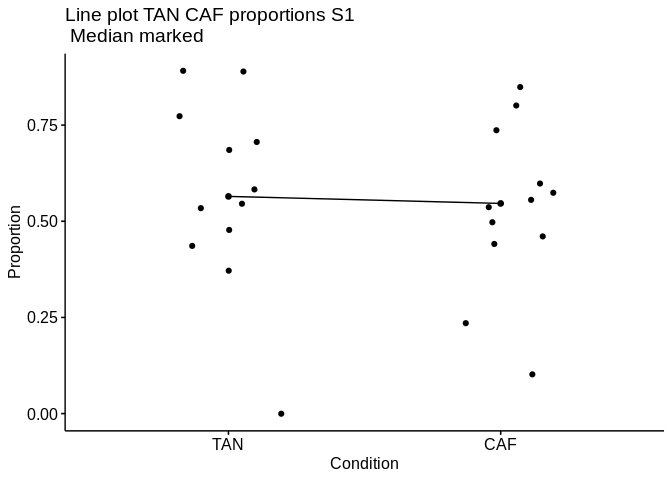
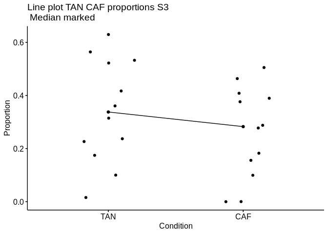
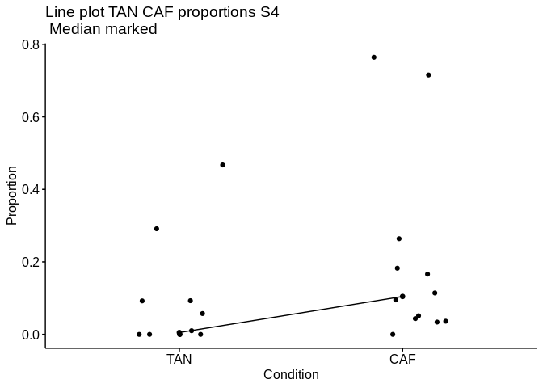

Results CIBERSORT
================

- <a href="#cibersort" id="toc-cibersort">CIBERSORT</a>
  - <a href="#cibersort-results-online"
    id="toc-cibersort-results-online">CIBERSORT results online</a>
  - <a href="#cibersort-results-docker"
    id="toc-cibersort-results-docker">CIBERSORT results docker</a>
  - <a
    href="#separate-plot-per-subpopulation-using-online-version-of-cibersort"
    id="toc-separate-plot-per-subpopulation-using-online-version-of-cibersort">Separate
    plot per subpopulation, using online version of CIBERSORT</a>

# CIBERSORT

``` r
metadata <- read.csv(file = here("intermediate_files/metadata/reformat_samples_extra_info.csv"))
colnames(metadata)[1] <- "Mixture"
metadata$Mixture <- as.character(metadata$Mixture)
metadata$Condition <- ifelse(metadata$Condition == "Tumour", "CAF", "TAN")
```

## CIBERSORT results online

``` r
cibersort_plot_online
```

<!-- -->

    ## Saving 7 x 5 in image

    ## [1] "saved to ... outfiles/cibersort_results_online_2022-10-17.png"

## CIBERSORT results docker

``` r
cibersort_plot_docker
```

<!-- -->

    ## Saving 7 x 5 in image

    ## [1] "saved to ... outfiles/cibersort_results_docker_2022-10-17.png"

``` r
cibersort_grid
```

<!-- -->

    ## [1] "saved to ... outfiles/cibersort_plot_combined_batch_corrected_2022-10-17.png"

## Separate plot per subpopulation, using online version of CIBERSORT

``` r
cibersort_output_metadata <- full_join(cibersort_output, metadata, by = "Mixture")
ggplot(cibersort_output_metadata, 
                                aes(x = as.character(Mixture), y = S1, fill = Condition
)) +
  geom_col() + 
  ggtitle("CIBERSORT results S1") +   
  theme(plot.title = element_text(hjust = 0.5),  axis.text = element_text(size = 8, angle = 90)) +
  xlab("Mixture") + 
  ylab("Proportion") +
  theme(#panel.grid.major = element_blank(), 
        panel.grid.minor = element_blank(),
        panel.background = element_blank(), 
        axis.line = element_line(colour = "black")) +
      scale_y_continuous(expand = c(0, 0), limits = c(0, 1.0000001)) 
```

<!-- -->

``` r
ggplot(cibersort_output_metadata, 
                                aes(x = as.character(Mixture), y = S3, fill = Condition
)) +
  geom_col() + 
  ggtitle("CIBERSORT results S3") +   
  theme(plot.title = element_text(hjust = 0.5),  axis.text = element_text(size = 8, angle = 90)) +
  xlab("Mixture") + 
  ylab("Proportion") +
  theme(#panel.grid.major = element_blank(), 
        panel.grid.minor = element_blank(),
        panel.background = element_blank(), 
        axis.line = element_line(colour = "black")) +
      scale_y_continuous(expand = c(0, 0), limits = c(0, 1.0000001)) 
```

<!-- -->

``` r
ggplot(cibersort_output_metadata, 
                                aes(x = as.character(Mixture), y = S4, fill = Condition
)) +
  geom_col() + 
  ggtitle("CIBERSORT results S4") +   
  theme(plot.title = element_text(hjust = 0.5),  axis.text = element_text(size = 8, angle = 90)) +
  xlab("Mixture") + 
  ylab("Proportion") +
  theme(#panel.grid.major = element_blank(), 
        panel.grid.minor = element_blank(),
        panel.background = element_blank(), 
        axis.line = element_line(colour = "black")) +
      scale_y_continuous(expand = c(0, 0), limits = c(0, 1.0000001)) 
```

<!-- --> \### Line
Plots

``` r
library("ggpubr")
```

    ## 
    ## Attaching package: 'ggpubr'

    ## The following object is masked from 'package:cowplot':
    ## 
    ##     get_legend

``` r
ggline(cibersort_output_metadata, x = "Condition", y = "S1", 
       add = c("median", "jitter"), 
          order = c("TAN", "CAF"),
          ylab = "Proportion", xlab = "Condition",
       title = "Line plot TAN CAF proportions S1\n Median marked")
```

<!-- -->

``` r
ggline(cibersort_output_metadata, x = "Condition", y = "S3", 
       add = c("median", "jitter"), 
          order = c("TAN", "CAF"),
          ylab = "Proportion", xlab = "Condition",
       title = "Line plot TAN CAF proportions S3\n Median marked")
```

<!-- -->

``` r
ggline(cibersort_output_metadata, x = "Condition", y = "S4", 
       add = c("median", "jitter"), 
          order = c("TAN", "CAF"),
          ylab = "Proportion", xlab = "Condition",
       title = "Line plot TAN CAF proportions S4\n Median marked")
```

<!-- -->

``` r
# Subset weight data before treatment
#TAN <- subset(cibersort_output_metadata,  Condition == "TAN", S1,
            #     drop = TRUE)
# subset weight data after treatment
#CAF <- subset(cibersort_output_metadata,  group == "after", weight,
               #  drop = TRUE)
# Plot paired data
#library(PairedData)
#pd <- paired(before, after)
#plot(pd, type = "profile") + theme_bw()
```

### Significance tests

``` r
shapiro.test(cibersort_output_metadata$S1)
```

    ## 
    ##  Shapiro-Wilk normality test
    ## 
    ## data:  cibersort_output_metadata$S1
    ## W = 0.94819, p-value = 0.2475

``` r
shapiro.test(cibersort_output_metadata$S3)
```

    ## 
    ##  Shapiro-Wilk normality test
    ## 
    ## data:  cibersort_output_metadata$S3
    ## W = 0.96504, p-value = 0.5477

``` r
shapiro.test(cibersort_output_metadata$S4)
```

    ## 
    ##  Shapiro-Wilk normality test
    ## 
    ## data:  cibersort_output_metadata$S4
    ## W = 0.69302, p-value = 8.157e-06

``` r
group_by(cibersort_output_metadata, Condition) %>%
  summarise(
    count = n(),
    median = median(S1, na.rm = TRUE),
    IQR = IQR(S1, na.rm = TRUE)
  )
```

    ## # A tibble: 2 × 4
    ##   Condition count median   IQR
    ##   <chr>     <int>  <dbl> <dbl>
    ## 1 CAF          12  0.546 0.177
    ## 2 TAN          12  0.565 0.255

``` r
group_by(cibersort_output_metadata, Condition) %>%
  summarise(
    count = n(),
    median = median(S3, na.rm = TRUE),
    IQR = IQR(S3, na.rm = TRUE)
  )
```

    ## # A tibble: 2 × 4
    ##   Condition count median   IQR
    ##   <chr>     <int>  <dbl> <dbl>
    ## 1 CAF          12  0.283 0.253
    ## 2 TAN          12  0.338 0.311

``` r
group_by(cibersort_output_metadata, Condition) %>%
  summarise(
    count = n(),
    median = median(S4, na.rm = TRUE),
    IQR = IQR(S4, na.rm = TRUE)
  )
```

    ## # A tibble: 2 × 4
    ##   Condition count  median    IQR
    ##   <chr>     <int>   <dbl>  <dbl>
    ## 1 CAF          12 0.105   0.161 
    ## 2 TAN          12 0.00511 0.0927

``` r
s1.test <- wilcox.test(S1 ~ Condition, data = cibersort_output_metadata, paired = TRUE)$p.value
s3.test <- wilcox.test(S3 ~ Condition, data = cibersort_output_metadata, paired = TRUE)$p.value
s4.test <- wilcox.test(S4 ~ Condition, data = cibersort_output_metadata, paired = TRUE)$p.value
p.values <- c(s1.test, s3.test, s4.test)
wilcox_results <- data.frame(Subpopulation = c("S1", "S3", "S4"), p.value = p.values, p.adj = p.adjust(p.values, method = "bonferroni"))
wilcox_results
```

    ##   Subpopulation    p.value     p.adj
    ## 1            S1 0.62207031 1.0000000
    ## 2            S3 0.26611328 0.7983398
    ## 3            S4 0.06396484 0.1918945

We can see that there might be a difference in S4 proportions between
CAF and TANs, but that it is not statistically significant using a
paired Wilcoxon signed rank test.
