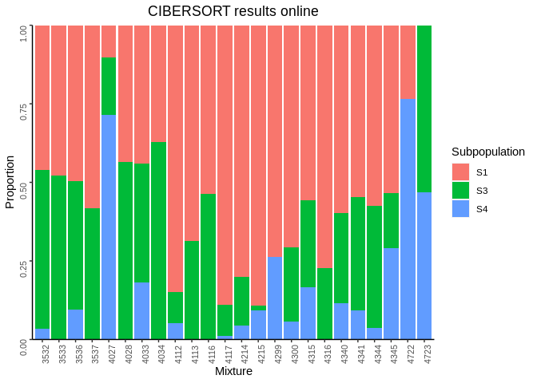
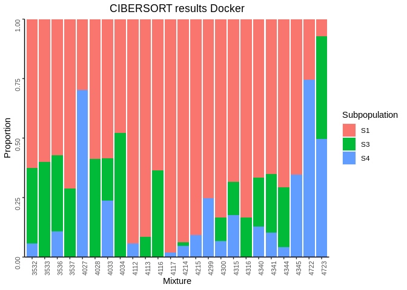
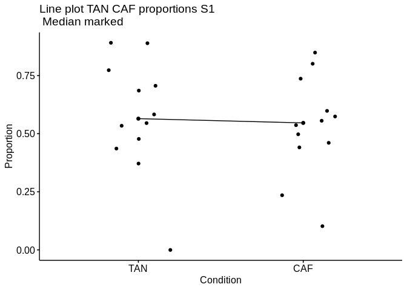
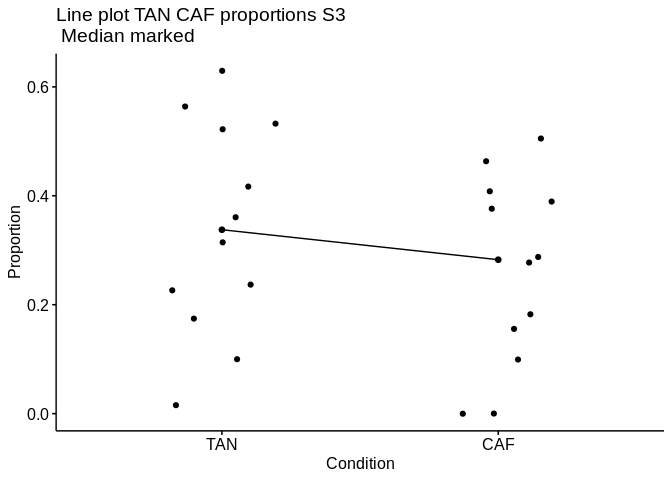
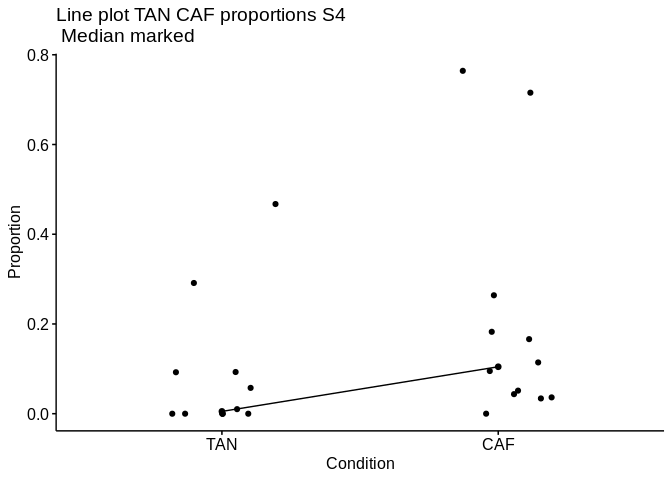

Results CIBERSORT
================

- <a href="#cibersort" id="toc-cibersort">CIBERSORT</a>
  - <a href="#cibersort-results-online"
    id="toc-cibersort-results-online">CIBERSORT results online</a>
  - <a href="#cibersort-results-docker"
    id="toc-cibersort-results-docker">CIBERSORT results docker</a>
  - <a
    href="#separate-plot-per-subpopulation-using-online-version-of-cibersort"
    id="toc-separate-plot-per-subpopulation-using-online-version-of-cibersort">Separate
    plot per subpopulation, using online version of CIBERSORT</a>

# CIBERSORT

``` r
metadata <- read.csv(file = here("intermediate_files/metadata/reformat_samples_extra_info.csv"))
colnames(metadata)[1] <- "Mixture"
metadata$Mixture <- as.character(metadata$Mixture)
metadata$Condition <- ifelse(metadata$Condition == "Tumour", "CAF", "TAN")
```

## CIBERSORT results online

### Signature matrix

``` r
mart <- useMart(biomart = "ensembl", dataset = "hsapiens_gene_ensembl", #host="https://www.ensembl.org")
                host="useast.ensembl.org")
```

    ## Warning: Ensembl will soon enforce the use of https.
    ## Ensure the 'host' argument includes "https://"

``` r
sig.matrix <- read.table(here("intermediate_files/cibersort/CIBERSORTx_Job15_phenoclasses_caf_2022-10-07.CIBERSORTx_Job15_caf_tpm_for_signature_engs_version_batch_corrected_2022-10-07.bm.K999.txt"), header = T)
biomart.output <- getBM.call(sig.matrix$NAME)
sig.matrix$hgnc_symbol <- biomart.output$hgnc_symbol
```

The only CAF marker found in the signature matrix is ACTA2 (alphaSMA),
which has higher expression in S4 in this signature matrix

``` r
sig.matrix[sig.matrix$hgnc_symbol == "ACTA2",]
```

    ##                  NAME       S1       S3       S4 hgnc_symbol
    ## 31 ENSG00000107796.13 1080.753 1398.749 15937.93       ACTA2

``` r
cibersort_plot_online
```

<!-- -->

## CIBERSORT results docker

``` r
cibersort_plot_docker
```

<!-- -->

``` r
cibersort_grid
```

<!-- -->

    ## [1] "saved to ... outfiles/cibersort_plot_combined_batch_corrected_2022-10-28.png"

## Separate plot per subpopulation, using online version of CIBERSORT

``` r
cibersort_output_metadata <- full_join(cibersort_output, metadata, by = "Mixture")
ggplot(cibersort_output_metadata, 
                                aes(x = as.character(Mixture), y = S1, fill = Condition
)) +
  geom_col() + 
  ggtitle("CIBERSORT results S1") +   
  theme(plot.title = element_text(hjust = 0.5),  axis.text = element_text(size = 8, angle = 90)) +
  xlab("Mixture") + 
  ylab("Proportion") +
  theme(#panel.grid.major = element_blank(), 
        panel.grid.minor = element_blank(),
        panel.background = element_blank(), 
        axis.line = element_line(colour = "black")) +
      scale_y_continuous(expand = c(0, 0), limits = c(0, 1.0000001)) 
```

<!-- -->

``` r
ggplot(cibersort_output_metadata, 
                                aes(x = as.character(Mixture), y = S3, fill = Condition
)) +
  geom_col() + 
  ggtitle("CIBERSORT results S3") +   
  theme(plot.title = element_text(hjust = 0.5),  axis.text = element_text(size = 8, angle = 90)) +
  xlab("Mixture") + 
  ylab("Proportion") +
  theme(#panel.grid.major = element_blank(), 
        panel.grid.minor = element_blank(),
        panel.background = element_blank(), 
        axis.line = element_line(colour = "black")) +
      scale_y_continuous(expand = c(0, 0), limits = c(0, 1.0000001)) 
```

<!-- -->

``` r
ggplot(cibersort_output_metadata, 
                                aes(x = as.character(Mixture), y = S4, fill = Condition
)) +
  geom_col() + 
  ggtitle("CIBERSORT results S4") +   
  theme(plot.title = element_text(hjust = 0.5),  axis.text = element_text(size = 8, angle = 90)) +
  xlab("Mixture") + 
  ylab("Proportion") +
  theme(#panel.grid.major = element_blank(), 
        panel.grid.minor = element_blank(),
        panel.background = element_blank(), 
        axis.line = element_line(colour = "black")) +
      scale_y_continuous(expand = c(0, 0), limits = c(0, 1.0000001)) 
```

<!-- --> \### Line
Plots

``` r
library("ggpubr")
```

    ## 
    ## Attaching package: 'ggpubr'

    ## The following object is masked from 'package:cowplot':
    ## 
    ##     get_legend

``` r
ggline(cibersort_output_metadata, x = "Condition", y = "S1", 
       add = c("median", "jitter"), 
          order = c("TAN", "CAF"),
          ylab = "Proportion", xlab = "Condition",
       title = "Line plot TAN CAF proportions S1\n Median marked")
```

<!-- -->

``` r
ggline(cibersort_output_metadata, x = "Condition", y = "S3", 
       add = c("median", "jitter"), 
          order = c("TAN", "CAF"),
          ylab = "Proportion", xlab = "Condition",
       title = "Line plot TAN CAF proportions S3\n Median marked")
```

<!-- -->

``` r
ggline(cibersort_output_metadata, x = "Condition", y = "S4", 
       add = c("median", "jitter"), 
          order = c("TAN", "CAF"),
          ylab = "Proportion", xlab = "Condition",
       title = "Line plot TAN CAF proportions S4\n Median marked")
```

<!-- -->

``` r
# Subset weight data before treatment
#TAN <- subset(cibersort_output_metadata,  Condition == "TAN", S1,
            #     drop = TRUE)
# subset weight data after treatment
#CAF <- subset(cibersort_output_metadata,  group == "after", weight,
               #  drop = TRUE)
# Plot paired data
#library(PairedData)
#pd <- paired(before, after)
#plot(pd, type = "profile") + theme_bw()
```

### Significance tests

``` r
shapiro.test(cibersort_output_metadata$S1)
```

    ## 
    ##  Shapiro-Wilk normality test
    ## 
    ## data:  cibersort_output_metadata$S1
    ## W = 0.94819, p-value = 0.2475

``` r
shapiro.test(cibersort_output_metadata$S3)
```

    ## 
    ##  Shapiro-Wilk normality test
    ## 
    ## data:  cibersort_output_metadata$S3
    ## W = 0.96504, p-value = 0.5477

``` r
shapiro.test(cibersort_output_metadata$S4)
```

    ## 
    ##  Shapiro-Wilk normality test
    ## 
    ## data:  cibersort_output_metadata$S4
    ## W = 0.69302, p-value = 8.157e-06

``` r
group_by(cibersort_output_metadata, Condition) %>%
  summarise(
    count = n(),
    median = median(S1, na.rm = TRUE),
    IQR = IQR(S1, na.rm = TRUE)
  )
```

    ## # A tibble: 2 × 4
    ##   Condition count median   IQR
    ##   <chr>     <int>  <dbl> <dbl>
    ## 1 CAF          12  0.546 0.177
    ## 2 TAN          12  0.565 0.255

``` r
group_by(cibersort_output_metadata, Condition) %>%
  summarise(
    count = n(),
    median = median(S3, na.rm = TRUE),
    IQR = IQR(S3, na.rm = TRUE)
  )
```

    ## # A tibble: 2 × 4
    ##   Condition count median   IQR
    ##   <chr>     <int>  <dbl> <dbl>
    ## 1 CAF          12  0.283 0.253
    ## 2 TAN          12  0.338 0.311

``` r
group_by(cibersort_output_metadata, Condition) %>%
  summarise(
    count = n(),
    median = median(S4, na.rm = TRUE),
    IQR = IQR(S4, na.rm = TRUE)
  )
```

    ## # A tibble: 2 × 4
    ##   Condition count  median    IQR
    ##   <chr>     <int>   <dbl>  <dbl>
    ## 1 CAF          12 0.105   0.161 
    ## 2 TAN          12 0.00511 0.0927

``` r
s1.test <- wilcox.test(S1 ~ Condition, data = cibersort_output_metadata, paired = TRUE)$p.value
s3.test <- wilcox.test(S3 ~ Condition, data = cibersort_output_metadata, paired = TRUE)$p.value
s4.test <- wilcox.test(S4 ~ Condition, data = cibersort_output_metadata, paired = TRUE)$p.value
p.values <- c(s1.test, s3.test, s4.test)
wilcox_results <- data.frame(Subpopulation = c("S1", "S3", "S4"), p.value = p.values, p.adj = p.adjust(p.values, method = "bonferroni"))
wilcox_results
```

    ##   Subpopulation    p.value     p.adj
    ## 1            S1 0.62207031 1.0000000
    ## 2            S3 0.26611328 0.7983398
    ## 3            S4 0.06396484 0.1918945

We can see that there might be a difference in S4 proportions between
CAF and TANs, but that it is not statistically significant using a
paired Wilcoxon signed rank test. That is, we are unable to reject the
null hypothesis that the difference proportion of the S4 subpopulation
in CAFs and TANs is zero.

``` r
cibersort_output_metadata
```

    ##    Mixture        S1         S3         S4 P.value Correlation      RMSE
    ## 1     4033 0.4411452 0.37628297 0.18257183   0.002   0.8552713 0.6495483
    ## 2     4034 0.3707795 0.62922053 0.00000000   0.006   0.5915965 0.8652729
    ## 3     4027 0.1020785 0.18241527 0.71550620   0.000   0.9963246 0.2635868
    ## 4     4028 0.4360502 0.56394984 0.00000000   0.002   0.7735788 0.8025013
    ## 5     4112 0.8491647 0.09937116 0.05146411   0.000   0.9295476 0.6867645
    ## 6     4113 0.6854778 0.31452217 0.00000000   0.006   0.6671213 0.8271217
    ## 7     4116 0.5365684 0.46343159 0.00000000   0.000   0.9166760 0.7432801
    ## 8     4117 0.8897112 0.10006443 0.01022440   0.002   0.8084383 0.7571482
    ## 9     4214 0.8008680 0.15557744 0.04355457   0.002   0.8480369 0.7333701
    ## 10    4215 0.8917078 0.01574823 0.09254395   0.002   0.8347974 0.7097487
    ## 11    4315 0.5561097 0.27758015 0.16631019   0.000   0.9004940 0.6289092
    ## 12    4316 0.7734964 0.22650361 0.00000000   0.002   0.8612339 0.7461502
    ## 13    4340 0.5981195 0.28762821 0.11425233   0.000   0.9271644 0.6564874
    ## 14    4341 0.5461569 0.36077932 0.09306375   0.000   0.8636496 0.7099537
    ## 15    4344 0.5741792 0.38945871 0.03636208   0.000   0.8796320 0.7376001
    ## 16    4345 0.5341763 0.17446424 0.29135949   0.002   0.8502485 0.5778917
    ## 17    3532 0.4607560 0.50521747 0.03402650   0.004   0.6961510 0.8167438
    ## 18    3533 0.4777469 0.52225310 0.00000000   0.002   0.7518157 0.8076564
    ## 19    3536 0.4969618 0.40807783 0.09496040   0.000   0.9180386 0.6826095
    ## 20    3537 0.5830378 0.41696215 0.00000000   0.002   0.7583485 0.7992779
    ## 21    4299 0.7361807 0.00000000 0.26381927   0.000   0.9353591 0.5049331
    ## 22    4300 0.7058059 0.23675397 0.05744016   0.000   0.9144948 0.7007175
    ## 23    4722 0.2356080 0.00000000 0.76439196   0.000   0.9943301 0.3390454
    ## 24    4723 0.0000000 0.53260353 0.46739647   0.000   0.9531719 0.3129327
    ##    Patient Condition Age Size   Grade Histology          ER          PR
    ## 1        1       CAF  46   45 Grade_2   Lobular ER_positive PR_positive
    ## 2        1       TAN  46   45 Grade_2   Lobular ER_positive PR_positive
    ## 3        2       CAF  77   40 Grade_3    Ductal ER_negative PR_negative
    ## 4        2       TAN  77   40 Grade_3    Ductal ER_negative PR_negative
    ## 5        3       CAF  62   12 Grade_3    Ductal ER_positive PR_negative
    ## 6        3       TAN  62    8 Grade_3    Ductal ER_positive PR_negative
    ## 7        4       CAF  45   35 Grade_2   Lobular ER_positive PR_positive
    ## 8        4       TAN  45   13 Grade_2   Lobular ER_positive PR_positive
    ## 9        5       CAF  78   90 Grade_2   Lobular ER_positive PR_negative
    ## 10       5       TAN  78   90 Grade_2   Lobular ER_positive PR_negative
    ## 11       6       CAF  84   30 Grade_2    Ductal ER_positive PR_positive
    ## 12       6       TAN  84   22 Grade_2    Ductal ER_positive PR_positive
    ## 13       7       CAF  62  100 Grade_2   Lobular ER_positive PR_positive
    ## 14       7       TAN  62  100 Grade_2   Lobular ER_positive PR_positive
    ## 15       8       CAF  50   28 Grade_2    Ductal ER_positive PR_positive
    ## 16       8       TAN  50   28 Grade_2    Ductal ER_positive PR_positive
    ## 17       9       CAF  48   16 Grade_2    Ductal ER_positive PR_positive
    ## 18       9       TAN  48   16 Grade_2    Ductal ER_positive PR_positive
    ## 19      10       CAF  50   52 Grade_3   Lobular ER_positive PR_positive
    ## 20      10       TAN  50   52 Grade_3   Lobular ER_positive PR_positive
    ## 21      11       CAF  84   40 Grade_3    Ductal ER_positive PR_positive
    ## 22      11       TAN  84   40 Grade_3    Ductal ER_positive PR_positive
    ## 23      12       CAF  81   52 Grade_2   Lobular ER_positive PR_negative
    ## 24      12       TAN  81   52 Grade_2   Lobular ER_positive PR_negative
    ##             Her2  Subtype          LVI
    ## 1  Her2_negative LuminalA LVI_negative
    ## 2  Her2_negative LuminalA LVI_negative
    ## 3  Her2_negative     TNBC LVI_positive
    ## 4  Her2_negative     TNBC LVI_positive
    ## 5  Her2_negative LuminalA LVI_negative
    ## 6  Her2_negative LuminalA LVI_negative
    ## 7  Her2_negative LuminalA LVI_positive
    ## 8  Her2_negative LuminalA LVI_positive
    ## 9  Her2_negative LuminalA LVI_positive
    ## 10 Her2_negative LuminalA LVI_positive
    ## 11 Her2_negative LuminalA LVI_positive
    ## 12 Her2_negative LuminalA LVI_positive
    ## 13 Her2_negative LuminalA LVI_negative
    ## 14 Her2_negative LuminalA LVI_negative
    ## 15 Her2_negative LuminalA LVI_negative
    ## 16 Her2_negative LuminalA LVI_negative
    ## 17 Her2_negative LuminalA LVI_negative
    ## 18 Her2_negative LuminalA LVI_negative
    ## 19 Her2_negative LuminalA LVI_negative
    ## 20 Her2_negative LuminalA LVI_negative
    ## 21 Her2_negative LuminalA LVI_positive
    ## 22 Her2_negative LuminalA LVI_positive
    ## 23 Her2_negative LuminalA LVI_negative
    ## 24 Her2_negative LuminalA LVI_negative

``` r
max.proportion <- c()
for (i in 1:nrow(cibersort_output_metadata)){
  max.proportion[i] <- names(which.max(cibersort_output_metadata[i,2:4]))
}
max.proportion
```

    ##  [1] "S1" "S3" "S4" "S3" "S1" "S1" "S1" "S1" "S1" "S1" "S1" "S1" "S1" "S1" "S1"
    ## [16] "S1" "S3" "S3" "S1" "S1" "S1" "S1" "S4" "S3"

``` r
cibersort_output_metadata$max_proportion_cibersort <- max.proportion
cibersort_output_metadata[which(cibersort_output_metadata$max_proportion_cibersort == "S1"),]
```

    ##    Mixture        S1         S3         S4 P.value Correlation      RMSE
    ## 1     4033 0.4411452 0.37628297 0.18257183   0.002   0.8552713 0.6495483
    ## 5     4112 0.8491647 0.09937116 0.05146411   0.000   0.9295476 0.6867645
    ## 6     4113 0.6854778 0.31452217 0.00000000   0.006   0.6671213 0.8271217
    ## 7     4116 0.5365684 0.46343159 0.00000000   0.000   0.9166760 0.7432801
    ## 8     4117 0.8897112 0.10006443 0.01022440   0.002   0.8084383 0.7571482
    ## 9     4214 0.8008680 0.15557744 0.04355457   0.002   0.8480369 0.7333701
    ## 10    4215 0.8917078 0.01574823 0.09254395   0.002   0.8347974 0.7097487
    ## 11    4315 0.5561097 0.27758015 0.16631019   0.000   0.9004940 0.6289092
    ## 12    4316 0.7734964 0.22650361 0.00000000   0.002   0.8612339 0.7461502
    ## 13    4340 0.5981195 0.28762821 0.11425233   0.000   0.9271644 0.6564874
    ## 14    4341 0.5461569 0.36077932 0.09306375   0.000   0.8636496 0.7099537
    ## 15    4344 0.5741792 0.38945871 0.03636208   0.000   0.8796320 0.7376001
    ## 16    4345 0.5341763 0.17446424 0.29135949   0.002   0.8502485 0.5778917
    ## 19    3536 0.4969618 0.40807783 0.09496040   0.000   0.9180386 0.6826095
    ## 20    3537 0.5830378 0.41696215 0.00000000   0.002   0.7583485 0.7992779
    ## 21    4299 0.7361807 0.00000000 0.26381927   0.000   0.9353591 0.5049331
    ## 22    4300 0.7058059 0.23675397 0.05744016   0.000   0.9144948 0.7007175
    ##    Patient Condition Age Size   Grade Histology          ER          PR
    ## 1        1       CAF  46   45 Grade_2   Lobular ER_positive PR_positive
    ## 5        3       CAF  62   12 Grade_3    Ductal ER_positive PR_negative
    ## 6        3       TAN  62    8 Grade_3    Ductal ER_positive PR_negative
    ## 7        4       CAF  45   35 Grade_2   Lobular ER_positive PR_positive
    ## 8        4       TAN  45   13 Grade_2   Lobular ER_positive PR_positive
    ## 9        5       CAF  78   90 Grade_2   Lobular ER_positive PR_negative
    ## 10       5       TAN  78   90 Grade_2   Lobular ER_positive PR_negative
    ## 11       6       CAF  84   30 Grade_2    Ductal ER_positive PR_positive
    ## 12       6       TAN  84   22 Grade_2    Ductal ER_positive PR_positive
    ## 13       7       CAF  62  100 Grade_2   Lobular ER_positive PR_positive
    ## 14       7       TAN  62  100 Grade_2   Lobular ER_positive PR_positive
    ## 15       8       CAF  50   28 Grade_2    Ductal ER_positive PR_positive
    ## 16       8       TAN  50   28 Grade_2    Ductal ER_positive PR_positive
    ## 19      10       CAF  50   52 Grade_3   Lobular ER_positive PR_positive
    ## 20      10       TAN  50   52 Grade_3   Lobular ER_positive PR_positive
    ## 21      11       CAF  84   40 Grade_3    Ductal ER_positive PR_positive
    ## 22      11       TAN  84   40 Grade_3    Ductal ER_positive PR_positive
    ##             Her2  Subtype          LVI max_proportion_cibersort
    ## 1  Her2_negative LuminalA LVI_negative                       S1
    ## 5  Her2_negative LuminalA LVI_negative                       S1
    ## 6  Her2_negative LuminalA LVI_negative                       S1
    ## 7  Her2_negative LuminalA LVI_positive                       S1
    ## 8  Her2_negative LuminalA LVI_positive                       S1
    ## 9  Her2_negative LuminalA LVI_positive                       S1
    ## 10 Her2_negative LuminalA LVI_positive                       S1
    ## 11 Her2_negative LuminalA LVI_positive                       S1
    ## 12 Her2_negative LuminalA LVI_positive                       S1
    ## 13 Her2_negative LuminalA LVI_negative                       S1
    ## 14 Her2_negative LuminalA LVI_negative                       S1
    ## 15 Her2_negative LuminalA LVI_negative                       S1
    ## 16 Her2_negative LuminalA LVI_negative                       S1
    ## 19 Her2_negative LuminalA LVI_negative                       S1
    ## 20 Her2_negative LuminalA LVI_negative                       S1
    ## 21 Her2_negative LuminalA LVI_positive                       S1
    ## 22 Her2_negative LuminalA LVI_positive                       S1

``` r
cibersort_output_metadata[which(cibersort_output_metadata$max_proportion_cibersort == "S3"),]
```

    ##    Mixture        S1        S3        S4 P.value Correlation      RMSE Patient
    ## 2     4034 0.3707795 0.6292205 0.0000000   0.006   0.5915965 0.8652729       1
    ## 4     4028 0.4360502 0.5639498 0.0000000   0.002   0.7735788 0.8025013       2
    ## 17    3532 0.4607560 0.5052175 0.0340265   0.004   0.6961510 0.8167438       9
    ## 18    3533 0.4777469 0.5222531 0.0000000   0.002   0.7518157 0.8076564       9
    ## 24    4723 0.0000000 0.5326035 0.4673965   0.000   0.9531719 0.3129327      12
    ##    Condition Age Size   Grade Histology          ER          PR          Her2
    ## 2        TAN  46   45 Grade_2   Lobular ER_positive PR_positive Her2_negative
    ## 4        TAN  77   40 Grade_3    Ductal ER_negative PR_negative Her2_negative
    ## 17       CAF  48   16 Grade_2    Ductal ER_positive PR_positive Her2_negative
    ## 18       TAN  48   16 Grade_2    Ductal ER_positive PR_positive Her2_negative
    ## 24       TAN  81   52 Grade_2   Lobular ER_positive PR_negative Her2_negative
    ##     Subtype          LVI max_proportion_cibersort
    ## 2  LuminalA LVI_negative                       S3
    ## 4      TNBC LVI_positive                       S3
    ## 17 LuminalA LVI_negative                       S3
    ## 18 LuminalA LVI_negative                       S3
    ## 24 LuminalA LVI_negative                       S3

``` r
cibersort_output_metadata[which(cibersort_output_metadata$max_proportion_cibersort == "S4"),]
```

    ##    Mixture        S1        S3        S4 P.value Correlation      RMSE Patient
    ## 3     4027 0.1020785 0.1824153 0.7155062       0   0.9963246 0.2635868       2
    ## 23    4722 0.2356080 0.0000000 0.7643920       0   0.9943301 0.3390454      12
    ##    Condition Age Size   Grade Histology          ER          PR          Her2
    ## 3        CAF  77   40 Grade_3    Ductal ER_negative PR_negative Her2_negative
    ## 23       CAF  81   52 Grade_2   Lobular ER_positive PR_negative Her2_negative
    ##     Subtype          LVI max_proportion_cibersort
    ## 3      TNBC LVI_positive                       S4
    ## 23 LuminalA LVI_negative                       S4
