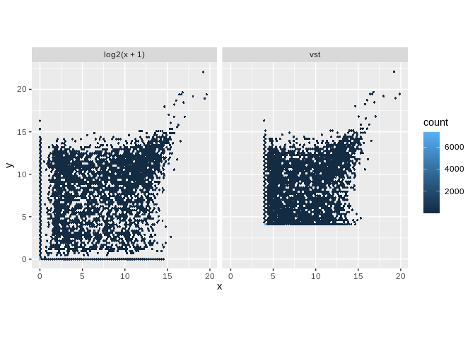
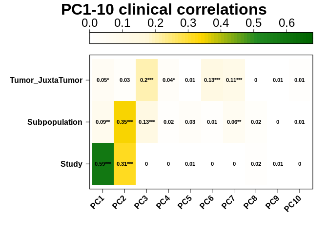
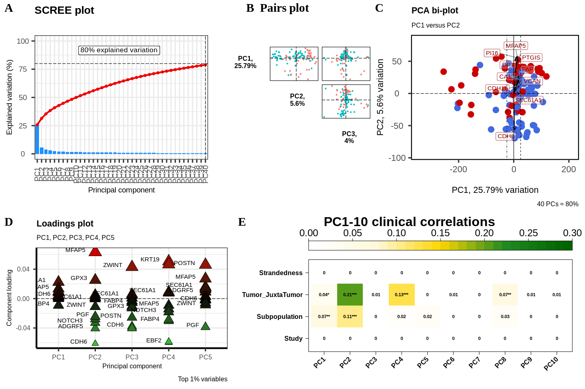

CAF subtype analysis
================
Kevin Ryan
2022-07-06 18:13:30

-   <a href="#introduction" id="toc-introduction">Introduction</a>
    -   <a href="#preparation" id="toc-preparation">Preparation</a>
        -   <a href="#create-sample-file" id="toc-create-sample-file">Create Sample
            File</a>
        -   <a href="#use-deseq2-to-normalise-data-instead"
            id="toc-use-deseq2-to-normalise-data-instead">Use DeSeq2 to normalise
            data instead</a>
        -   <a href="#data-transformation" id="toc-data-transformation">Data
            transformation</a>
    -   <a href="#references" id="toc-references">References</a>

# Introduction

Cancer-associated fibroblasts (CAFs) are a heterogeneous cell type found
in the tumour microenvironment. They have a wide array of functions, and
tend to be immunosuppressive and cancer-promoting. There have been many
attempts to characterise subtypes of CAFs, with much transcriptomic
analysis being carried out in the Mechta-Grigoriou lab in Institut
Curie. They have identified 4 ‘subtypes’ which can be separated based on
the expression of different markers:

-   S1: FAP<sup>High</sup>, CD29<sup>Med-High</sup>,
    α<sup>SMAHigh</sup>, PDPN<sup>High</sup>, PDGFRβ<sup>High</sup>
-   S2: FAP<sup>Neg</sup>, CD29<sup>Low</sup>, αSMANeg-<sup>Low</sup>,
    PDPN<sup>Low</sup>, PDGFRβ<sup>Low</sup>
-   S3: FAP<sup>Neg-Low</sup>, CD29<sup>Med</sup>,
    αSMA<sup>Neg-Low</sup>, PDPN<sup>Low</sup>, PDGFRβ<sup>Low-Med</sup>
-   S4: FAP<sup>Low-Med</sup>, CD29<sup>High</sup>, αSMA<sup>High</sup>,
    PDPN<sup>Low</sup>, PDGFRβ<sup>Med</sup>

(Pelon et al. 2020)

FACS gating strategies can be used to isolate these various subtypes.
The Mechta-Grigoriou group have done this and have generated bulk
RNA-sequencing data for the S1, S3 and S4 subtypes. They generated
scRNA-sequencing data for the S1 subtype. This data was deposited on the
European Genome Phenome Archive, and was accessed via a Data Transfer
Agreement.

The following summarises the data obtained:

<table>
<colgroup>
<col style="width: 18%" />
<col style="width: 18%" />
<col style="width: 27%" />
<col style="width: 36%" />
</colgroup>
<thead>
<tr class="header">
<th>Subpopulation</th>
<th>| Total sam</th>
<th>ples | Studies (Samples)</th>
<th>| Notes</th>
</tr>
</thead>
<tbody>
<tr class="odd">
<td>S1</td>
<td>28</td>
<td><ul>
<li>EGAD00001003808 (16)</li>
<li>EGAD00001005744 (5)</li>
<li>EGAD00001006144 (7)</li>
</ul></td>
<td><ul>
<li>3808 has 12xJuxta-tumor</li>
<li>5744 5 samples from LN</li>
<li>Sorting vs spreading</li>
</ul></td>
</tr>
<tr class="even">
<td>S2</td>
<td>0</td>
<td>N/A</td>
<td>N/A</td>
</tr>
<tr class="odd">
<td>S3</td>
<td>14</td>
<td><ul>
<li>EGAD00001004810 (14)</li>
</ul></td>
<td><ul>
<li>4810 has 11xJuxta-tumor</li>
<li>Ovarian</li>
</ul></td>
</tr>
<tr class="even">
<td>S4</td>
<td>15</td>
<td><ul>
<li>EGAD00001003808 (10)</li>
<li>EGAD00001005744 (5)</li>
</ul></td>
<td><ul>
<li>3808 has 9xJuxta-tumor</li>
<li>5744 5 samples from LN</li>
</ul></td>
</tr>
</tbody>
</table>

With the juxta-tumour data, they got tumour and juxta-tumour data from
the same patient. However, I have not been able to figure out whether
they came from the same patient. Could probably use Optitype to
determine HLA allele - match tumour and juxta tumour.

We also have scRNA-seq data for S1.

The data was processed using nf-core/rnaseq version `3.8.1` using the
default parameters. STAR/Salmon were used for alignment/quantification.
In-house CAF and tumour-associated normal (TAN) RNA-sequencing data were
processed using nf-core/rnaseq version `3.1`, and STAR/Salmon were also
used for alignment/quantification.

We would expect our tumour-associated normal to be most like the S3
subtype (usually accumulate in juxta-tumours).

Combining RNA-sequencing datasets from different studies can be very
challenging. We can expect batch effects to be present, so it might be
possible to determine whether differences be observe are due to actual
biological effects or technical artifacts. In addition, a recent study
suggests that DESeq2 and edgeR (the most popular differential expression
tools) experience large rates of false positives when used with large
sample sizes (Li et al. 2022). One of the datasets (`EGAD00001006144`)
was produced using stranded RNA-seq, whereas the other datasets were
unstranded. This can lead to a lack of comparability of the datasets
(Zhao, Ye, and Stanton 2020). It may be necessary to drop this dataset
from the analysis. All samples were prepared by poly(A) selection (use
of oligo-dT).

## Preparation

### Create Sample File

Columns will be: Sample, Study, CAF_subtype, Tumor_Juxtatumor

*Here we will be combining data from 5 studies. To begin with, we will
only include the metadata available for all studies (except for our
unknown CAF subtype label). Breast cancer subtype is only available for
certain studies and so is not included at this stage.*

There are also: ovarian cancer samples, EPCAM+ cells, samples prepared
by spreading or spreading and samples from lymph nodes. For the time
being, I will not consider them.

``` r
suppressPackageStartupMessages(library(dplyr))
suppressPackageStartupMessages(library(stringr))
library(biomaRt)
suppressPackageStartupMessages(library(tximport))
library(DT)
suppressPackageStartupMessages(library(tidyverse))
suppressPackageStartupMessages(library(ggplot2))
library(cowplot)
suppressPackageStartupMessages(library(PCAtools))
library(dplyr)
suppressPackageStartupMessages(library(SummarizedExperiment))
library(DESeq2)
suppressPackageStartupMessages(library(tximeta))
library(pheatmap)
library(RColorBrewer)
library(glmpca)
```

``` r
EGAD_4810 <- read.table("/home/kevin/Documents/PhD/CAF_data/EGAD00001004810/delimited_maps/Run_Sample_meta_info.map", 
                        sep = ";")
EGAD_4810_cancers <- str_split_fixed(EGAD_4810$V1, pattern = "=", n = 2)[,2]
EGAD_4810_keep <- which(EGAD_4810_cancers == "BC")
EGAD_4810_filtered <- EGAD_4810[EGAD_4810_keep,]
EGAD_4810_meta <- data.frame(
  Sample = str_split_fixed(EGAD_4810_filtered$V4, pattern = "=", n = 2)[,2],
  Study = "EGAD00001004810",
  Subtype = "S3",
  Tumor_JuxtaTumor = tolower(str_split_fixed(EGAD_4810_filtered$V3, pattern = " ", n = 2)[,2]),
  directory = "/home/kevin/Documents/PhD/CAF_data/nfcore_results/EGAD00001004810_nfcore_results/star_salmon",
  row.names = 1
)
EGAD_3808 <- read.table("/home/kevin/Documents/PhD/CAF_data/EGAD00001003808/meta_CAF-S1_S4_BC_47samples.txt", 
                        header = T, sep = "\t")
EGAD_3808_meta <- data.frame(
  Sample = EGAD_3808$Sample.Name,
  Study = "EGAD00001003808",
  Subtype = EGAD_3808$subset,
  Tumor_JuxtaTumor = EGAD_3808$Type, 
    directory = "/home/kevin/Documents/PhD/CAF_data/nfcore_results/EGAD00001003808_nfcore_results/star_salmon",
  row.names = 1
)
EGAD_6144 <- read.table("/home/kevin/Documents/PhD/CAF_data/EGAD00001006144/meta_7samples.txt", 
                        header = T,sep = "\t")
EGAD_6144_meta <- data.frame(
  Sample = paste("CAF_Culture_", EGAD_6144$Sample.Name, sep = ""),
  Study = "EGAD00001006144",
  Subtype = "S1",
  Tumor_JuxtaTumor = "tumor",
    directory = "/home/kevin/Documents/PhD/CAF_data/nfcore_results/EGAD00001006144_nfcore_results/star_salmon",
  row.names = 1
)
EGAD_5744 <- read.table("/home/kevin/Documents/PhD/CAF_data/EGAD00001005744/metaData_Pelon_et_al.txt", 
                        header =T, check.names = F)
EGAD_5744$Sample.Name <- gsub(pattern = "\\.", replacement = "-", x = EGAD_5744$Sample.Name )
EGAD_5744_filtered <- EGAD_5744[!(EGAD_5744$subset == "EPCAM+") & (EGAD_5744$Type == "T"),]
EGAD_5744_meta <- data.frame(
  Sample = EGAD_5744_filtered$Sample.Name,
  Study = "EGAD00001005744",
  Subtype = EGAD_5744_filtered$subset,
  Tumor_JuxtaTumor = "tumor",
    directory = "/home/kevin/Documents/PhD/CAF_data/nfcore_results/EGAD00001005744_nfcore_results/star_salmon",
  row.names = 1
)
barkley_samples <- read.csv("/home/kevin/Documents/PhD/rna_seq_bc/metadata/reformat_samples.csv", 
                            header = T, row.names = "samples", check.names = F)
barkley_samples_meta <- data.frame(
  Sample = row.names(barkley_samples),
   Study = "In-House",
  Subtype = "Unknown",
  Tumor_JuxtaTumor = ifelse(barkley_samples$Condition == "Tumour", "tumor", "juxta-tumor"),
  directory = "/home/kevin/Documents/PhD/CAF_data/nfcore_results/inhouse_data_nfcore_results_version_3_8_1/star_salmon",
  row.names = 1
)
metadata <- rbind.data.frame(EGAD_4810_meta, EGAD_3808_meta, 
                             EGAD_6144_meta, EGAD_5744_meta, barkley_samples_meta)
metadata[1:5,]
```

    ##                  Study Subtype Tumor_JuxtaTumor
    ## B73T39 EGAD00001004810      S3            tumor
    ## B86T3  EGAD00001004810      S3            tumor
    ## B86T7  EGAD00001004810      S3      juxta-tumor
    ## B86T10 EGAD00001004810      S3            tumor
    ## B86T13 EGAD00001004810      S3      juxta-tumor
    ##                                                                                           directory
    ## B73T39 /home/kevin/Documents/PhD/CAF_data/nfcore_results/EGAD00001004810_nfcore_results/star_salmon
    ## B86T3  /home/kevin/Documents/PhD/CAF_data/nfcore_results/EGAD00001004810_nfcore_results/star_salmon
    ## B86T7  /home/kevin/Documents/PhD/CAF_data/nfcore_results/EGAD00001004810_nfcore_results/star_salmon
    ## B86T10 /home/kevin/Documents/PhD/CAF_data/nfcore_results/EGAD00001004810_nfcore_results/star_salmon
    ## B86T13 /home/kevin/Documents/PhD/CAF_data/nfcore_results/EGAD00001004810_nfcore_results/star_salmon

### Use DeSeq2 to normalise data instead

Difficult to mess around with filters etc.

Plan: rerun in house samples with same nfcore version `3.8.1` Read in
samples with tximport, deseqdataobject etc

``` r
files <- file.path(metadata$directory, rownames(metadata), "quant.sf")
coldata <- data.frame(files, names=rownames(metadata), Study = metadata$Study, 
                      Subtype = metadata$Subtype, 
                      Tumor_JuxtaTumor = metadata$Tumor_JuxtaTumor,
                      stringsAsFactors=FALSE)
tx2gene <- read_tsv("/home/kevin/Documents/PhD/references/tx2gene_gencode_v31.txt")
```

    ## Rows: 226882 Columns: 2
    ## ── Column specification ────────────────────────────────────────────────────────
    ## Delimiter: "\t"
    ## chr (2): TXNAME, GENEID
    ## 
    ## ℹ Use `spec()` to retrieve the full column specification for this data.
    ## ℹ Specify the column types or set `show_col_types = FALSE` to quiet this message.

``` r
se <- tximeta(coldata, skipMeta=TRUE, txOut=FALSE, tx2gene=tx2gene)
```

    ## reading in files with read_tsv
    ## 1 2 3 4 5 6 7 8 9 10 11 12 13 14 15 16 17 18 19 20 21 22 23 24 25 26 27 28 29 30 31 32 33 34 35 36 37 38 39 40 41 42 43 44 45 46 47 48 49 50 51 52 53 54 55 56 57 58 59 60 61 62 63 64 65 66 67 68 69 70 71 72 73 74 75 76 77 78 79 80 81 82 83 84 85 86 87 88 89 90 91 92 93 94 95 96 97 98 99 100 101 102 103 104 105 106 107 108 109 110 111 112 113 
    ## summarizing abundance
    ## summarizing counts
    ## summarizing length

``` r
dds <- DESeqDataSet(se, design = ~ Study)
```

    ## using counts and average transcript lengths from tximeta

    ## Warning in DESeqDataSet(se, design = ~Study): some variables in design formula
    ## are characters, converting to factors

    ##   Note: levels of factors in the design contain characters other than
    ##   letters, numbers, '_' and '.'. It is recommended (but not required) to use
    ##   only letters, numbers, and delimiters '_' or '.', as these are safe characters
    ##   for column names in R. [This is a message, not a warning or an error]

``` r
dim(dds)
```

    ## [1] 60603   113

``` r
keep <- rowSums(counts(dds)) >= 10
dds <- dds[keep,]
dim(dds)
```

    ## [1] 36458   113

``` r
# at least X samples with a count of 10 or more, where X can be chosen as the sample size of the smallest group of samples
X <- 7
keep <- rowSums(counts(dds) >= 10) >= X
dds <- dds[keep,]
dim(dds)
```

    ## [1] 22678   113

``` r
ntd <- normTransform(dds)
```

    ##   Note: levels of factors in the design contain characters other than
    ##   letters, numbers, '_' and '.'. It is recommended (but not required) to use
    ##   only letters, numbers, and delimiters '_' or '.', as these are safe characters
    ##   for column names in R. [This is a message, not a warning or an error]

    ## using 'avgTxLength' from assays(dds), correcting for library size

``` r
dds <- DESeq(dds)
```

    ## estimating size factors

    ##   Note: levels of factors in the design contain characters other than
    ##   letters, numbers, '_' and '.'. It is recommended (but not required) to use
    ##   only letters, numbers, and delimiters '_' or '.', as these are safe characters
    ##   for column names in R. [This is a message, not a warning or an error]

    ## using 'avgTxLength' from assays(dds), correcting for library size

    ## estimating dispersions

    ## gene-wise dispersion estimates

    ## mean-dispersion relationship

    ##   Note: levels of factors in the design contain characters other than
    ##   letters, numbers, '_' and '.'. It is recommended (but not required) to use
    ##   only letters, numbers, and delimiters '_' or '.', as these are safe characters
    ##   for column names in R. [This is a message, not a warning or an error]

    ## final dispersion estimates

    ##   Note: levels of factors in the design contain characters other than
    ##   letters, numbers, '_' and '.'. It is recommended (but not required) to use
    ##   only letters, numbers, and delimiters '_' or '.', as these are safe characters
    ##   for column names in R. [This is a message, not a warning or an error]

    ## fitting model and testing

    ##   Note: levels of factors in the design contain characters other than
    ##   letters, numbers, '_' and '.'. It is recommended (but not required) to use
    ##   only letters, numbers, and delimiters '_' or '.', as these are safe characters
    ##   for column names in R. [This is a message, not a warning or an error]

    ## -- replacing outliers and refitting for 2685 genes
    ## -- DESeq argument 'minReplicatesForReplace' = 7 
    ## -- original counts are preserved in counts(dds)

    ## estimating dispersions

    ##   Note: levels of factors in the design contain characters other than
    ##   letters, numbers, '_' and '.'. It is recommended (but not required) to use
    ##   only letters, numbers, and delimiters '_' or '.', as these are safe characters
    ##   for column names in R. [This is a message, not a warning or an error]

    ## fitting model and testing

    ##   Note: levels of factors in the design contain characters other than
    ##   letters, numbers, '_' and '.'. It is recommended (but not required) to use
    ##   only letters, numbers, and delimiters '_' or '.', as these are safe characters
    ##   for column names in R. [This is a message, not a warning or an error]

``` r
select <- order(rowMeans(counts(dds,normalized=TRUE)),
                decreasing=TRUE)[1:20]
df <- as.data.frame(colData(dds)[,c("Study","Subtype", "Tumor_JuxtaTumor")])
pheatmap(assay(ntd)[select,], cluster_rows=FALSE, show_rownames=FALSE,
         cluster_cols=FALSE, annotation_col=df, show_colnames = F)
```

<!-- -->

From the heatmap, we can see that there are profound batch effects
present which must be dealt with.

### Data transformation

There are a number of options to choose from when normalising RNA-seq
data, the main ones being: - Take the log of the data and add a
pseudocount. - Variance stabilizing transformation (Anders and Huber
2010) - Regularized logarithm transformation (Love, Huber, and Anders
2014)

The log+pseudocount approach tends to mean that lowly expressed genes
have more of an effect. *Vst* and *rlog* bring these counts towards a
middle amount, making the data more homoskedastic. This allows them to
be used in downstream processes which require homoskedastic data
(e.g. PCA). The authors of DESeq2 recommend *vst* for large sample sizes
such as ours as it is much faster than *rlog*

``` r
vsd <- vst(dds, blind = FALSE)
head(assay(vsd), 3)
```

    ##                      B73T39    B86T3     B86T7    B86T10    B86T13    B86T16
    ## ENSG00000000003.14 3.866757 3.866757 13.303147 13.739305  9.197653 10.215319
    ## ENSG00000000005.6  3.866757 3.866757  3.866757  3.866757  4.729477  7.996898
    ## ENSG00000000419.12 4.546417 9.724112  5.831559  6.155486 10.001550 10.437130
    ##                       B86T22 B103T103 B103T107  B103T111  B103T115  B103T51
    ## ENSG00000000003.14 10.495470 9.805996 9.906286 10.812837 10.321324 9.844911
    ## ENSG00000000005.6   6.612790 6.522889 6.217076  3.866757  9.369832 3.866757
    ## ENSG00000000419.12  9.144584 9.243821 9.687213  9.776062 10.241720 9.875850
    ##                     B103T55   B103T67  B103T71   B103T75  B103T79  B103T83
    ## ENSG00000000003.14 9.561417 10.380215 8.955318 10.192112 3.866757 9.505005
    ## ENSG00000000005.6  7.431878  3.866757 3.866757  7.472572 3.866757 7.536091
    ## ENSG00000000419.12 6.222346  9.010390 9.549980  9.383235 4.667569 8.836295
    ##                      B103T87  B103T91  B103T95   B103T99    B123U2    B123U6
    ## ENSG00000000003.14 11.046519 9.854786 9.236606  3.866757 10.103382  9.908686
    ## ENSG00000000005.6   3.866757 6.705345 3.866757  3.866757  3.866757  4.438059
    ## ENSG00000000419.12  8.533239 8.354044 9.677032 10.434347  9.176872 10.110374
    ##                      B123U8   B73T37   B73T40     B86T1    B86T4     B86T5
    ## ENSG00000000003.14 9.818232 9.427059 4.355369 10.520839 3.866757  9.107014
    ## ENSG00000000005.6  5.699758 3.866757 3.866757  3.866757 3.866757  7.469991
    ## ENSG00000000419.12 8.905005 9.793491 8.632692  9.414916 9.720878 10.398777
    ##                       B86T8     B86T9   B86T11    B86T12   B86T14    B86T15
    ## ENSG00000000003.14 9.608018  9.537468 3.866757  9.055725 4.297356 10.153948
    ## ENSG00000000005.6  8.811929  3.866757 3.866757  8.749459 3.866757  3.866757
    ## ENSG00000000419.12 8.844344 10.213163 8.732383 10.043833 4.716892  9.926172
    ##                      B86T17    B86T18   B86T21    B86T23    B86T24   B86T26
    ## ENSG00000000003.14 3.866757  4.532697 3.866757 10.463138 10.723656 3.866757
    ## ENSG00000000005.6  3.866757 11.090548 3.866757  3.866757  3.866757 3.866757
    ## ENSG00000000419.12 5.509258  3.866757 4.387635  8.459106  9.392886 3.866757
    ##                     B103T100 B103T101 B103T104 B103T105 B103T108  B103T109
    ## ENSG00000000003.14 10.656924 8.203476 3.866757 8.228861 3.866757 10.167013
    ## ENSG00000000005.6   3.866757 3.866757 3.866757 3.866757 3.866757  4.369259
    ## ENSG00000000419.12  3.866757 9.295713 9.573438 9.817354 3.866757  8.873852
    ##                    B103T112   B103T49  B103T52   B103T53   B103T56   B103T57
    ## ENSG00000000003.14 9.672956 11.186960 8.744178 10.318855 10.295865 10.235381
    ## ENSG00000000005.6  6.596450  3.866757 3.866757  7.925979 10.078662  3.866757
    ## ENSG00000000419.12 8.933205  9.003331 4.362166  9.458606  9.465979  9.824871
    ##                      B103T61  B103T65   B103T69   B103T72  B103T73   B103T76
    ## ENSG00000000003.14 10.497539 9.754739 10.770916 10.689738 9.025646 12.142127
    ## ENSG00000000005.6  10.070662 3.866757  3.866757  3.866757 6.736222  3.866757
    ## ENSG00000000419.12  9.933465 8.961976  9.908984 10.248754 9.535936 11.962847
    ##                      B103T77  B103T80  B103T81  B103T84  B103T85   B103T93
    ## ENSG00000000003.14 10.724669 9.516722 6.577462 3.866757 9.842419 10.588569
    ## ENSG00000000005.6   3.866757 3.866757 6.187225 3.866757 3.866757  3.866757
    ## ENSG00000000419.12  9.473356 9.954829 9.265016 3.866757 9.366797  9.527731
    ##                     B103T96   B103T97    B123U1   B123U3   B123U4    B123U7
    ## ENSG00000000003.14 8.410211 10.253826 10.411564 9.370665 9.464684 11.160920
    ## ENSG00000000005.6  3.866757  3.866757  3.866757 3.866757 3.866757  3.866757
    ## ENSG00000000419.12 9.546436  9.154248  9.516907 9.770335 9.245075  9.761120
    ##                    CAF_Culture_D220T13 CAF_Culture_D220T17 CAF_Culture_D220T21
    ## ENSG00000000003.14           10.411355            9.717426           10.119597
    ## ENSG00000000005.6             4.894787            4.596820            3.866757
    ## ENSG00000000419.12            9.823691            9.812140            9.862794
    ##                    CAF_Culture_D220T25 CAF_Culture_D220T29 CAF_Culture_D220T33
    ## ENSG00000000003.14           10.402832            9.927961            9.836486
    ## ENSG00000000005.6             3.866757            4.193220            3.866757
    ## ENSG00000000419.12           10.044345           10.261504           10.043271
    ##                    CAF_Culture_D220T37 A461-A462-A465U15 A461-A462-A465U17
    ## ENSG00000000003.14            9.591556         10.809829         10.160352
    ## ENSG00000000005.6             3.866757          5.362144          7.305402
    ## ENSG00000000419.12           10.071540          9.676252          9.830369
    ##                    A461-A462-A465U25 A461-A462-A465U27 A461-A462-A465U3
    ## ENSG00000000003.14          9.960402          8.378325        10.074855
    ## ENSG00000000005.6           6.434754          7.599629         3.866757
    ## ENSG00000000419.12         10.183317          9.630945         9.781195
    ##                    A461-A462-A465U32 A461-A462-A465U35 A461-A462-A465U5
    ## ENSG00000000003.14         10.691639          8.488310         8.701812
    ## ENSG00000000005.6           3.866757          3.866757         3.866757
    ## ENSG00000000419.12          9.909735         10.145741         9.673899
    ##                    A461-A462-A465U7 A461-A462-A465U9     4033     4034     4027
    ## ENSG00000000003.14        10.623500         7.763200 9.459894 9.599036 9.090119
    ## ENSG00000000005.6          4.545603         5.733637 4.280270 3.866757 4.269526
    ## ENSG00000000419.12        10.113545        10.069071 9.958360 9.813810 9.850216
    ##                         4028     4112     4113     4116      4117     4214
    ## ENSG00000000003.14  9.241599 9.269435 9.164897 9.263413  9.181283 9.332912
    ## ENSG00000000005.6   4.146422 3.866757 3.866757 3.866757  4.269394 4.301056
    ## ENSG00000000419.12 10.014486 9.828945 9.721642 9.908401 10.032242 9.915502
    ##                        4215     4315     4316     4340     4341     4344
    ## ENSG00000000003.14 9.427510 9.184769 9.376886 9.065623 9.043109 9.243710
    ## ENSG00000000005.6  3.866757 3.866757 3.866757 3.866757 3.866757 3.866757
    ## ENSG00000000419.12 9.875313 9.790475 9.975637 9.775184 9.892715 9.871946
    ##                        4345      3532     3533     3536     3537     4299
    ## ENSG00000000003.14 9.346023  9.058633 9.228147 9.167183 9.249824 9.198150
    ## ENSG00000000005.6  3.866757  3.866757 3.866757 4.164621 3.866757 3.866757
    ## ENSG00000000419.12 9.999822 10.009922 9.955196 9.964938 9.883580 9.817371
    ##                        4300     4722     4723
    ## ENSG00000000003.14 9.138079 8.557567 9.006320
    ## ENSG00000000005.6  3.866757 4.955898 3.866757
    ## ENSG00000000419.12 9.845885 9.704606 9.841769

``` r
dds <- estimateSizeFactors(dds)
```

    ##   Note: levels of factors in the design contain characters other than
    ##   letters, numbers, '_' and '.'. It is recommended (but not required) to use
    ##   only letters, numbers, and delimiters '_' or '.', as these are safe characters
    ##   for column names in R. [This is a message, not a warning or an error]

    ## using 'avgTxLength' from assays(dds), correcting for library size

``` r
df <- bind_rows(
  as_data_frame(log2(counts(dds, normalized=TRUE)[, 1:2]+1)) %>%
         mutate(transformation = "log2(x + 1)"),
  as_data_frame(assay(vsd)[, 1:2]) %>% mutate(transformation = "vst"))
```

    ## Warning: `as_data_frame()` was deprecated in tibble 2.0.0.
    ## Please use `as_tibble()` instead.
    ## The signature and semantics have changed, see `?as_tibble`.
    ## This warning is displayed once every 8 hours.
    ## Call `lifecycle::last_lifecycle_warnings()` to see where this warning was generated.

``` r
colnames(df)[1:2] <- c("x", "y")  

lvls <- c("log2(x + 1)", "vst")
df$transformation <- factor(df$transformation, levels=lvls)

ggplot(df, aes(x = x, y = y)) + geom_hex(bins = 80) +
  coord_fixed() + facet_grid( . ~ transformation)  
```

<!-- -->

There doesn’t seem to much of a difference between the two methods of
normalisation, only that the lowly expressed genes have been brought up
to a minimum of \~4.

``` r
sampleDists <- dist(t(assay(vsd)))
```

``` r
sampleDistMatrix <- as.matrix( sampleDists )
rownames(sampleDistMatrix) <- vsd$Study
colnames(sampleDistMatrix) <- NULL
colors <- colorRampPalette( rev(brewer.pal(9, "Blues")) )(255)
pheatmap(sampleDistMatrix,
         clustering_distance_rows = sampleDists,
         clustering_distance_cols = sampleDists,
         col = colors)
```

<!-- -->

``` r
plotPCA(vsd, intgroup = c("Study", "Subtype"))
```

<!-- -->

``` r
pcaData <- plotPCA(vsd, intgroup = c("Study", "Subtype"), returnData = TRUE)
percentVar <- round(100 * attr(pcaData, "percentVar"))
```

``` r
ggplot(pcaData, aes(x = PC1, y = PC2, color = Study, shape = Subtype)) +
  geom_point(size =3) +
  xlab(paste0("PC1: ", percentVar[1], "% variance")) +
  ylab(paste0("PC2: ", percentVar[2], "% variance")) +
  coord_fixed() +
  ggtitle("PCA with VST data")
```

<!-- -->

``` r
gpca <- glmpca(counts(dds), L=2)
gpca.dat <- gpca$factors
gpca.dat$Study <- dds$Study
gpca.dat$Subtype <- dds$Subtype
```

Next step is to look at batch correction.

## References

<div id="refs" class="references csl-bib-body hanging-indent">

<div id="ref-Li2022" class="csl-entry">

Li, Yumei, Xinzhou Ge, Fanglue Peng, Wei Li, and Jingyi Jessica Li.
2022. “<span class="nocase">Exaggerated false positives by popular
differential expression methods when analyzing human population
samples</span>.” *Genome Biology* 23 (1): 1–13.
<https://doi.org/10.1186/S13059-022-02648-4/FIGURES/2>.

</div>

<div id="ref-Pelon2020" class="csl-entry">

Pelon, Floriane, Brigitte Bourachot, Yann Kieffer, Ilaria Magagna, Fanny
Mermet-Meillon, Isabelle Bonnet, Ana Costa, et al. 2020. “<span
class="nocase">Cancer-associated fibroblast heterogeneity in axillary
lymph nodes drives metastases in breast cancer through complementary
mechanisms</span>.” *Nature Communications 2020 11:1* 11 (1): 1–20.
<https://doi.org/10.1038/s41467-019-14134-w>.

</div>

<div id="ref-Zhao2020" class="csl-entry">

Zhao, Shanrong, Zhan Ye, and Robert Stanton. 2020. “<span
class="nocase">Misuse of RPKM or TPM normalization when comparing across
samples and sequencing protocols</span>.” *RNA* 26 (8): 903.
<https://doi.org/10.1261/RNA.074922.120>.

</div>

</div>
