CAF Subpopulation Analysis
================
Kevin Ryan
2022-08-29 16:39:11

- <a href="#introduction" id="toc-introduction">Introduction</a>
- <a href="#analysis" id="toc-analysis">Analysis</a>
  - <a href="#preparation" id="toc-preparation">Preparation</a>
  - <a href="#read-in-data" id="toc-read-in-data">Read in data</a>
    - <a href="#data-transformation" id="toc-data-transformation">Data
      transformation</a>
  - <a href="#qc---pca-per-study" id="toc-qc---pca-per-study">QC - PCA per
    study</a>
  - <a href="#batch-correction" id="toc-batch-correction">Batch
    Correction</a>
    - <a href="#clinical-correlations-without-batch-correction"
      id="toc-clinical-correlations-without-batch-correction">Clinical
      Correlations without Batch Correction</a>
    - <a href="#batch-correction-with-combat-seq"
      id="toc-batch-correction-with-combat-seq">Batch Correction with
      Combat-Seq</a>
    - <a href="#clinical-correlations-after-batch-correction"
      id="toc-clinical-correlations-after-batch-correction">Clinical
      Correlations after batch correction</a>
    - <a href="#differential-expression-analysis-caf-vs-tan"
      id="toc-differential-expression-analysis-caf-vs-tan">Differential
      Expression Analysis CAF vs TAN</a>
    - <a href="#surrogate-variable-analysis"
      id="toc-surrogate-variable-analysis">Surrogate variable analysis</a>
    - <a
      href="#differential-expression-analysis-without-the-inhouse-data-and-without-study-6144"
      id="toc-differential-expression-analysis-without-the-inhouse-data-and-without-study-6144">Differential
      expression analysis without the inhouse data and without study 6144</a>
    - <a href="#over-representation-analysis"
      id="toc-over-representation-analysis">Over-representation analysis</a>
    - <a
      href="#gene-set-variation-analysis-gsva-for-gene-signature-identification"
      id="toc-gene-set-variation-analysis-gsva-for-gene-signature-identification">Gene
      set variation analysis (GSVA) for gene signature identification</a>
    - <a href="#chemoresistance-gene-signature"
      id="toc-chemoresistance-gene-signature">Chemoresistance gene
      signature</a>
    - <a href="#marker-gene-expression" id="toc-marker-gene-expression">Marker
      gene expression</a>
    - <a href="#batch-correction-with-combat-seq-1"
      id="toc-batch-correction-with-combat-seq-1">Batch correction with
      Combat-Seq</a>
    - <a
      href="#differentially-expressed-genes-caf-vs-tan-tumor-vs-juxta-tumor"
      id="toc-differentially-expressed-genes-caf-vs-tan-tumor-vs-juxta-tumor">Differentially
      Expressed Genes CAF vs TAN (Tumor vs Juxta-Tumor)</a>
    - <a href="#enrichment-plots" id="toc-enrichment-plots">Enrichment
      plots</a>
    - <a href="#dot-plot" id="toc-dot-plot">Dot Plot</a>
    - <a href="#enrichment-plots-1" id="toc-enrichment-plots-1">Enrichment
      Plots</a>
    - <a href="#batch-correction-1" id="toc-batch-correction-1">Batch
      correction</a>
- <a href="#predicting-subpopulations-present-in-in-house-samples"
  id="toc-predicting-subpopulations-present-in-in-house-samples">Predicting
  subpopulation(s) present in In-House samples</a>
  - <a
    href="#assigning-in-house-samples-to-a-caf-subpopulation-using-k-nearest-neighbours"
    id="toc-assigning-in-house-samples-to-a-caf-subpopulation-using-k-nearest-neighbours">Assigning
    in-house samples to a CAF Subpopulation using K-nearest neighbours</a>
  - <a href="#deconvolution-using-cibersortx"
    id="toc-deconvolution-using-cibersortx">Deconvolution using
    CIBERSORTx</a>
  - <a href="#references" id="toc-references">References</a>

# Introduction

Cancer-associated fibroblasts (CAFs) are a heterogeneous cell type found
in the tumour microenvironment. They have a wide array of functions, and
tend to be immunosuppressive and cancer-promoting. There have been many
attempts to characterise subpopulations of CAFs, with much
transcriptomic analysis being carried out in the Mechta-Grigoriou lab in
Institut Curie. They have identified 4 ‘subpopulations’ which can be
separated based on the expression of different markers:

- S1: FAP<sup>High</sup>, CD29<sup>Med-High</sup>, α<sup>SMAHigh</sup>,
  PDPN<sup>High</sup>, PDGFRβ<sup>High</sup>
- S2: FAP<sup>Neg</sup>, CD29<sup>Low</sup>, αSMANeg-<sup>Low</sup>,
  PDPN<sup>Low</sup>, PDGFRβ<sup>Low</sup>
- S3: FAP<sup>Neg-Low</sup>, CD29<sup>Med</sup>, αSMA<sup>Neg-Low</sup>,
  PDPN<sup>Low</sup>, PDGFRβ<sup>Low-Med</sup>
- S4: FAP<sup>Low-Med</sup>, CD29<sup>High</sup>, αSMA<sup>High</sup>,
  PDPN<sup>Low</sup>, PDGFRβ<sup>Med</sup>

(Pelon et al. 2020)

FACS gating strategies can be used to isolate these various
subpopulations. The Mechta-Grigoriou group have done this and have
generated bulk RNA-sequencing data for the S1, S3 and S4 subpopulations.
They generated scRNA-sequencing data for the S1 subpopulation. This data
was deposited on the European Genome Phenome Archive, and was accessed
via a Data Transfer Agreement.

The following summarises the data obtained:

<table style="width:98%;">
<colgroup>
<col style="width: 17%" />
<col style="width: 17%" />
<col style="width: 26%" />
<col style="width: 35%" />
</colgroup>
<thead>
<tr class="header">
<th>Subpopulation</th>
<th>Total samples</th>
<th>Studies (Samples)</th>
<th>Notes</th>
</tr>
</thead>
<tbody>
<tr class="odd">
<td>S1</td>
<td>28</td>
<td><ul>
<li>EGAD00001003808 (16)</li>
<li>EGAD00001005744 (5)</li>
<li>EGAD00001006144 (7)</li>
</ul></td>
<td><ul>
<li>3808 has 12xJuxta-tumor</li>
<li>5744 5 samples from LN</li>
<li>Sorting vs spreading</li>
</ul></td>
</tr>
<tr class="even">
<td>S2</td>
<td>0</td>
<td>N/A</td>
<td>N/A</td>
</tr>
<tr class="odd">
<td>S3</td>
<td>14</td>
<td><ul>
<li>EGAD00001004810 (14)</li>
</ul></td>
<td><ul>
<li>4810 has 11xJuxta-tumor</li>
<li>Ovarian</li>
</ul></td>
</tr>
<tr class="even">
<td>S4</td>
<td>15</td>
<td><ul>
<li>EGAD00001003808 (10)</li>
<li>EGAD00001005744 (5)</li>
</ul></td>
<td><ul>
<li>3808 has 9xJuxta-tumor</li>
<li>5744 5 samples from LN</li>
</ul></td>
</tr>
</tbody>
</table>

With the juxta-tumour data, they got tumour and juxta-tumour samples
from the same patient. However, I have not been able to figure out
whether they came from the same patient. We could possibly use Optitype
to determine HLA allele - match tumour and juxta tumour.

We also have scRNA-seq data for S1, labelled with 8 subpopulations of S1
CAFs. It may be possible to

It is likely that sorting the cells using FACS alters the
transcriptional properties of the cells compared to if they are
separated using spreading approaches, as is seen in study
`EGAD00001006144`. This is something that we will have to keep in mind.

The data was processed using nf-core/rnaseq version `3.8.1` using the
default parameters. STAR/Salmon were used for alignment/quantification.

We would expect our tumour-associated normal to be most like the S3
subpopulation (usually accumulate in juxta-tumours). The S2
subpopulation has been found to accumulate more in luminal A breast
cancer, whereas the S4 subpopulation tends to be present in Her2+ breast
cancers. Unfortunately, data is not available for the S2 subpopulation
and 11 of the 12 cancers encountered in our samples are Luminal A.

Combining RNA-sequencing datasets from different studies can be very
challenging. We can expect batch effects to be present, so it might not
be possible to determine whether differences we observe are due to
actual biological effects or technical artifacts. In addition, a recent
study suggests that DESeq2 and edgeR (the most popular differential
expression tools) experience large rates of false positives when used
with large sample sizes (Li et al. 2022). However, this assertion has
been refuted, and it has been suggested that the Li 2022 study did not
apply appropriate batch correction and quality control ([Twitter
thread](https://threadreaderapp.com/thread/1513468597288452097.html)
from Mike Love and associated [code on
GitHub](https://github.com/mikelove/preNivolumabOnNivolumab/blob/main/preNivolumabOnNivolumab.knit.md)).
One of the datasets (`EGAD00001006144`) was produced using stranded
RNA-seq, whereas the other datasets were unstranded. This can lead to a
lack of comparability of the datasets (Zhao, Ye, and Stanton 2020). It
may be necessary to drop this dataset from the analysis. All samples
were prepared by poly(A) selection (use of oligo-dT).

# Analysis

## Preparation

Columns will be: Sample, Study, Subpopulation, Tumor_Juxtatumor

*Here we will be combining data from 5 studies. To begin with, we will
only include the metadata available for all studies (except for our
unknown CAF Subpopulation label). Breast cancer subtype is only
available for certain studies and so is not included at this stage.*

There are also: ovarian cancer samples, EPCAM+ cells (an epithelial
marker) and samples from lymph nodes. For the time being, I will not
consider them.

## Read in data

Samples were processed with nf-core/rnaseq version `3.8.1` Salmon was
used in alignment mode so there is no salmon index, so there is no
checksum to import the metadata. Therefore, the parameters recommended
in the [tximeta
vignette](https://bioconductor.org/packages/release/bioc/vignettes/tximeta/inst/doc/tximeta.html#What_if_checksum_isn%E2%80%99t_known)
were used to summarise transcript counts to the gene level, using a
tx2gene file constructed using `generate_tx2gene_table.R`.

``` r
files <- file.path(metadata$directory, rownames(metadata), "quant.sf")
coldata <- data.frame(files, names=rownames(metadata), Study = metadata$Study, 
                      Subpopulation = metadata$Subpopulation, 
                      Tumor_JuxtaTumor = metadata$Tumor_JuxtaTumor,
                      stringsAsFactors=FALSE)
# tx2gene file for the gencode v31 file used in the analysis, generated using generate_tx2gene_table.R
#tx2gene <- read_tsv("/home/kevin/Documents/PhD/references/tx2gene_gencode_v31.txt")

# tx2gene but using the hgnc symbol instead of ensembl gene id version
mart <- useMart(biomart = "ensembl", dataset = "hsapiens_gene_ensembl", host="https://www.ensembl.org")
```

    ## Ensembl site unresponsive, trying useast mirror

    ## Ensembl site unresponsive, trying uswest mirror

``` r
                #host="uswest.ensembl.org")
tx2gene <- getBM(attributes = c("ensembl_transcript_id_version", "hgnc_symbol"), mart = mart, useCache = FALSE)

# salmon was used in alignment mode so there is no salmon index, therefore there is no checksum to import the metadata 
# txOut = FALSE means to summarise to gene level (i.e. don't give out transcripts, give out gene level)
se <- tximeta(coldata, skipMeta=TRUE, txOut=FALSE, tx2gene=tx2gene)
```

    ## reading in files with read_tsv

    ## 1 2 3 4 5 6 7 8 9 10 11 12 13 14 15 16 17 18 19 20 21 22 23 24 25 26 27 28 29 30 31 32 33 34 35 36 37 38 39 40 41 42 43 44 45 46 47 48 49 50 51 52 53 54 55 56 57 58 59 60 61 62 63 64 65 66 67 68 69 70 71 72 73 74 75 76 77 78 79 80 81 82 83 84 85 86 87 88 89 90 91 92 93 94 95 96 97 98 99 100 101 102 103 104 105 106 107 108 109 110 111 112 113 
    ## removing duplicated transcript rows from tx2gene
    ## transcripts missing from tx2gene: 18466
    ## summarizing abundance
    ## summarizing counts
    ## summarizing length

``` r
#se_hgnc <- tximeta(coldata, skipMeta=TRUE, txOut=FALSE, tx2gene=tx2gene_hgnc)
# read in using tx
```

``` r
dds <- DESeqDataSet(se, design = ~1)
```

    ## using counts and average transcript lengths from tximeta

``` r
# returns a vector of whether the total count of each gene is >= 10 (True or false)
keep <- rowSums(counts(dds)) >= 10
# only keep rows (genes) for which keep is TRUE
dds <- dds[keep,]
# at least X samples with a count of 10 or more, where X can be chosen as the sample size of the smallest group of samples
X <- 7
keep <- rowSums(counts(dds) >= 10) >= X
dds <- dds[keep,]
vsd <- vst(dds, blind = FALSE)
```

    ## using 'avgTxLength' from assays(dds), correcting for library size

``` r
files_no_inhouse <- file.path(metadata_no_inhouse$directory, rownames(metadata_no_inhouse), "quant.sf")
coldata_no_inhouse <- data.frame(files = files_no_inhouse, names=rownames(metadata_no_inhouse), Study = metadata_no_inhouse$Study, 
                      Subpopulation = metadata_no_inhouse$Subpopulation, 
                      Tumor_JuxtaTumor = metadata_no_inhouse$Tumor_JuxtaTumor,
                      Strandedness = metadata_no_inhouse$Strandedness,
                      stringsAsFactors=FALSE)
# tx2gene file for the gencode v31 file used in the analysis
#tx2gene <- read_tsv("/home/kevin/Documents/PhD/references/tx2gene_gencode_v31.txt")
se_no_inhouse <- tximeta(coldata = coldata_no_inhouse, skipMeta=TRUE, txOut=FALSE, tx2gene=tx2gene)
```

    ## reading in files with read_tsv

    ## 1 2 3 4 5 6 7 8 9 10 11 12 13 14 15 16 17 18 19 20 21 22 23 24 25 26 27 28 29 30 31 32 33 34 35 36 37 38 39 40 41 42 43 44 45 46 47 48 49 50 51 52 53 54 55 56 57 58 59 60 61 62 63 64 65 66 67 68 69 70 71 72 73 74 75 76 77 78 79 80 81 82 83 84 85 86 87 88 89 
    ## removing duplicated transcript rows from tx2gene
    ## transcripts missing from tx2gene: 18466
    ## summarizing abundance
    ## summarizing counts
    ## summarizing length

``` r
idx <- which(se_no_inhouse$Study != "EGAD00001006144")
se_no_inhouse_no_6144 <- se_no_inhouse[,idx]
```

``` r
# do no design for the time being, Subpopulation + Batch gives error - model matrix not full rank
# this function stores input values, intermediate calculations and results of DE analysis - makes counts non-negative integers
dds_no_inhouse <- DESeqDataSet(se_no_inhouse, design = ~1)
```

    ## using counts and average transcript lengths from tximeta

``` r
# returns a vector of whether the total count of each gene is >= 10 (True or false)
keep <- rowSums(counts(dds_no_inhouse)) >= 10
# only keep rows (genes) for which keep is TRUE
dds_no_inhouse <- dds_no_inhouse[keep,]
# at least X samples with a count of 10 or more, where X can be chosen as the sample size of the smallest group of samples
X <- 7
keep <- rowSums(counts(dds_no_inhouse) >= 10) >= X
dds_no_inhouse <- dds_no_inhouse[keep,]
dds_no_inhouse_copy <- dds_no_inhouse
ntd <- normTransform(dds_no_inhouse)
```

    ## using 'avgTxLength' from assays(dds), correcting for library size

``` r
# do no design for the time being, Subpopulation + Batch gives error - model matrix not full rank
# this function stores input values, intermediate calculations and results of DE analysis - makes counts non-negative integers
dds <- DESeqDataSet(se, design = ~1)
```

    ## using counts and average transcript lengths from tximeta

``` r
# returns a vector of whether the total count of each gene is >= 10 (True or false)
keep <- rowSums(counts(dds)) >= 10
# only keep rows (genes) for which keep is TRUE
dds <- dds[keep,]
# at least X samples with a count of 10 or more, where X can be chosen as the sample size of the smallest group of samples
X <- 7
keep <- rowSums(counts(dds) >= 10) >= X
dds <- dds[keep,]
ntd <- normTransform(dds)
```

    ## using 'avgTxLength' from assays(dds), correcting for library size

``` r
dds_noinhouse_no6144 <- DESeqDataSet(se_no_inhouse_no_6144, design = ~1)
```

    ## using counts and average transcript lengths from tximeta

``` r
# returns a vector of whether the total count of each gene is >= 10 (True or false)
keep <- rowSums(counts(dds_noinhouse_no6144)) >= 10
# only keep rows (genes) for which keep is TRUE
dds_noinhouse_no6144 <- dds_noinhouse_no6144[keep,]
# at least X samples with a count of 10 or more, where X can be chosen as the sample size of the smallest group of samples
X <- 7
keep <- rowSums(counts(dds_noinhouse_no6144) >= 10) >= X
dds_noinhouse_no6144 <- dds_noinhouse_no6144[keep,]
```

### Data transformation

There are a number of options to choose from when normalising RNA-seq
data, the main ones being: \* Take the log of the data and add a
pseudocount. \* Variance stabilizing transformation (Anders and Huber
2010) \* Regularized logarithm transformation (Love, Huber, and Anders
2014)

The log+pseudocount approach tends to mean that lowly expressed genes
have more of an effect. *Vst* and *rlog* bring these counts towards a
central amount, making the data more homoskedastic. This allows them to
be used in downstream processes which require homoskedastic data
(e.g. PCA). The authors of DESeq2 recommend *vst* for large sample sizes
such as ours as it is much faster than *rlog*.

``` r
meanSdPlot(assay(ntd))
```

%20transformation-1.png)<!-- -->

``` r
# here, blind is FALSE as we don't want it to be blind to experimental design 
# recommended when transforming data for downstream analysis which will use the design information
vsd <- vst(dds, blind = FALSE)
```

    ## using 'avgTxLength' from assays(dds), correcting for library size

``` r
meanSdPlot(assay(vsd))
```

<!-- -->

``` r
dds <- estimateSizeFactors(dds)
```

    ## using 'avgTxLength' from assays(dds), correcting for library size

``` r
df <- bind_rows(
  as_data_frame(log2(counts(dds, normalized=TRUE)[, 1:2]+1)) %>%
         mutate(transformation = "log2(x + 1)"),
  as_data_frame(assay(vsd)[, 1:2]) %>% mutate(transformation = "vst"))
```

    ## Warning: `as_data_frame()` was deprecated in tibble 2.0.0.
    ## Please use `as_tibble()` instead.
    ## The signature and semantics have changed, see `?as_tibble`.
    ## This warning is displayed once every 8 hours.
    ## Call `lifecycle::last_lifecycle_warnings()` to see where this warning was generated.

``` r
colnames(df)[1:2] <- c("x", "y")  

lvls <- c("log2(x + 1)", "vst")
df$transformation <- factor(df$transformation, levels=lvls)

ggplot(df, aes(x = x, y = y)) + geom_hex(bins = 80) +
  coord_fixed() + facet_grid( . ~ transformation)  
```

<!-- -->

There doesn’t seem to much of a difference between the two methods of
normalisation, only that the lowly expressed genes have been brought up
to a minimum of \~4.

## QC - PCA per study

Function not working at present

``` r
#studies <- levels(colData(vsd)$Study)
# write a function which takes in DESeq object & creates PCA of all studies
deseq_pca_studies <- function(dds_object){
  library(PCAtools)
  library(ggplot2)
  studies <- levels(colData(dds_object)$Study)
  pca_plots <- list()
  for (i in 1:length(studies)){
    study <- studies[i]
    samples <- colnames(dds_object)[which(colData(dds_object)$Study == study)]
    dds_object_study <- dds_object[,samples]
    stopifnot(dim(dds_object_study)[2] == length(samples))
    pca_plot_data <- plotPCA(dds_object_study, intgroup = c("Subpopulation", "Tumor_JuxtaTumor"), returnData = TRUE)
    percentVar <- round(100 * attr(pca_plot_data, "percentVar"))
    title <- paste("PCA plot of study:", study, sep = " ")
    #plot_labels <- rownames(pca_plot_data)
    #print(samples)
    #print(length(samples))
    pca_plot_data$samples <- rownames(pca_plot_data)
    pca_plot <- ggplot(pca_plot_data, aes(x = PC1, y = PC2, color = Subpopulation, shape = Tumor_JuxtaTumor, label = samples)) +
                geom_point(size =3) +
                geom_text(hjust="middle", vjust=1, data = subset(pca_plot_data, PC2 > 22)) +
                xlab(paste0("PC1: ", percentVar[1], "% variance")) +
                ylab(paste0("PC2: ", percentVar[2], "% variance")) +
                coord_fixed() +
                ggtitle(title)
    pca_plots[[i]] <- pca_plot
    #print(pca_plots[i])
  }
  #stopifnot(length(pca_plots) == length(studies))
  return(pca_plots)
}
```

``` r
#output <- deseq_pca_studies(vsd)
#output
#output
```

``` r
plotPCA(vsd, intgroup = c("Study", "Subpopulation"))
```

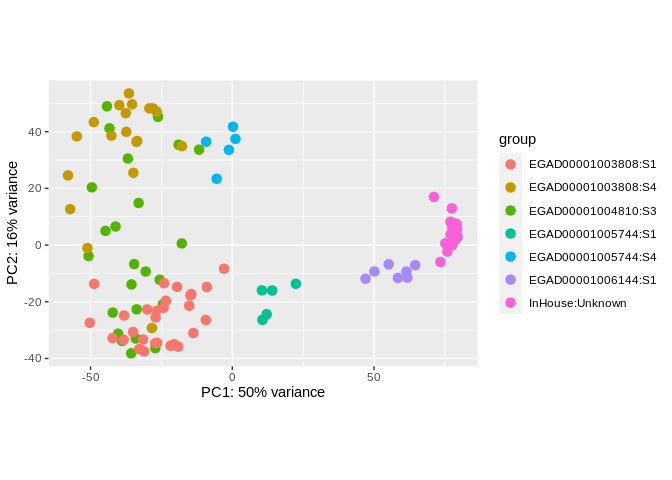<!-- -->

## Batch Correction

### Clinical Correlations without Batch Correction

PCA plots as per <https://github.com/kevinblighe/PCAtools>

``` r
vsd_mat <- assay(vsd)
#keep <- rownames(vsd_mat)[!duplicated(rownames(vsd_mat))]
#vsd_mat <- vsd_mat[keep,]
metadata_pca <- metadata[,1:4]
p <- pca(vsd_mat, metadata = metadata_pca)
pscree <- screeplot(p, components = getComponents(p, 1:30),
    hline = 80, vline = 24, axisLabSize = 14, titleLabSize = 20,
    returnPlot = FALSE) +
    geom_label(aes(20, 80, label = '80% explained variation', vjust = -1, size = 8))
ppairs <- pairsplot(p, components = getComponents(p, c(1:3)),
    triangle = TRUE, trianglelabSize = 12,
    hline = 0, vline = 0,
    pointSize = 0.8, gridlines.major = FALSE, gridlines.minor = FALSE,
    colby = 'Tumor_JuxtaTumor',
    title = '', plotaxes = FALSE,
    margingaps = unit(c(0.01, 0.01, 0.01, 0.01), 'cm'),
    returnPlot = FALSE)
 pbiplot <- biplot(p,
    # loadings parameters
      showLoadings = TRUE,
      lengthLoadingsArrowsFactor = 1.5,
      sizeLoadingsNames = 4,
      colLoadingsNames = 'red4',
    # other parameters
      lab = NULL,
      colby = 'Tumor_JuxtaTumor', colkey = c('tumor'='royalblue', 'juxtatumor'='red3'),
      hline = 0, vline = c(-25, 0, 25),
      vlineType = c('dotdash', 'solid', 'dashed'),
      gridlines.major = FALSE, gridlines.minor = FALSE,
      pointSize = 5,
      legendPosition = 'none', legendLabSize = 16, legendIconSize = 8.0,
      #shape = 'Study', shapekey = c('Grade 1'=15, 'Grade 2'=17, 'Grade 3'=8),
      drawConnectors = FALSE,
      title = 'PCA bi-plot',
      subtitle = 'PC1 versus PC2',
      caption = '24 PCs ≈ 80%',
      returnPlot = FALSE)
 
 ploadings <- plotloadings(p, rangeRetain = 0.01, labSize = 3,
    title = 'Loadings plot', axisLabSize = 12,
    subtitle = 'PC1, PC2, PC3, PC4, PC5',
    caption = 'Top 1% variables',
    shape = 24, shapeSizeRange = c(4, 8),
    col = c('limegreen', 'black', 'red3'),
    legendPosition = 'none',
    drawConnectors = FALSE,
    returnPlot = FALSE)
 
 #peigencor <- #eigencorplot(p,
#    components = getComponents(p, 1:10),
#    metavars = c('Study','Subpopulation','Tumor_JuxtaTumor'),
#    cexCorval = 1.0,
#    fontCorval = 2,
#    posLab = 'all', 
#    rotLabX = 45,
#    scale = TRUE,
#    main = "PC clinical correlates",
#    cexMain = 1.5,
#    plotRsquared = FALSE,
#    corFUN = 'pearson',
#    corUSE = 'pairwise.complete.obs',
#    signifSymbols = c('****', '***', '**', '*', ''),
#    signifCutpoints = c(0, 0.0001, 0.001, 0.01, 0.05, 1),
#    returnPlot = FALSE)
peigencor <- eigencorplot(p,
    components = getComponents(p, 1:10),
    metavars = colnames(metadata_pca),
    col = c('white', 'cornsilk1', 'gold', 'forestgreen', 'darkgreen'),
    cexCorval = 0.7,
    colCorval = 'black',
    fontCorval = 2,
    posLab = 'bottomleft',
    rotLabX = 45,
    posColKey = 'top',
    cexLabColKey = 1.5,
    scale = TRUE,
    corFUN = 'pearson',
    corUSE = 'pairwise.complete.obs',
    corMultipleTestCorrection = 'none',
    main = 'PC1-10 clinical correlations',
    colFrame = 'white',
    plotRsquared = TRUE)
 
  library(cowplot)
  library(ggplotify)

    top_row <- plot_grid(pscree, ppairs, pbiplot,
      ncol = 3,
      labels = c('A', 'B  Pairs plot', 'C'),
      label_fontfamily = 'serif',
      label_fontface = 'bold',
      label_size = 22,
      align = 'h',
      rel_widths = c(1.10, 0.80, 1.10))

    bottom_row <- plot_grid(ploadings,
      as.grob(peigencor),
      ncol = 2,
      labels = c('D', 'E'),
      label_fontfamily = 'serif',
      label_fontface = 'bold',
      label_size = 22,
      align = 'h',
      rel_widths = c(0.8, 1.2))

    plot_grid(top_row, bottom_row, ncol = 1,
      rel_heights = c(1.1, 0.9))
```


### Batch Correction with Combat-Seq

Here, batch correction is carried out using Study as our batch and
Tumor_JuxtaTumor status as our group. This should remove differences
between batches without removing differences between Tumor and
JuxtaTumor. However, it does not preserve differences between CAF
subpopulations. This will allow us to carry out DE analysis on these
samples. Another method, which is recommended when carrying out
differential expression analysis, is to include batch as a covariate in
the model matrix, i.e. \~ Tumor_JuxtaTumor + Study (possibly???).
However, this results in a model matrix of less than full rank, and so
is not an option.

``` r
counts_matrix_all <- assay(dds)
batch_all <- metadata$Study
covariates_all <- metadata$Tumor_JuxtaTumor
adjusted_all <- ComBat_seq(counts = counts_matrix_all, batch = batch_all, group = covariates_all)
```

    ## Found 5 batches
    ## Using full model in ComBat-seq.
    ## Adjusting for 1 covariate(s) or covariate level(s)
    ## Estimating dispersions
    ## Fitting the GLM model
    ## Shrinkage off - using GLM estimates for parameters
    ## Adjusting the data

``` r
round_df <- function(x, digits) {
    # round all numeric variables
    # x: data frame 
    # digits: number of digits to round
    numeric_columns <- sapply(x, mode) == 'numeric'
    x[numeric_columns] <-  round(x[numeric_columns], digits)
    x
}
```

``` r
adjusted_all_reduced <- adjusted_all/100
adjusted_all_reduced <- round_df(adjusted_all_reduced)
dds_batch_corrected <- DESeqDataSetFromMatrix(adjusted_all_reduced, colData = metadata, design = ~1)
```

    ## converting counts to integer mode

``` r
vsd <- vst(dds_batch_corrected, blind = FALSE)
```

### Clinical Correlations after batch correction

``` r
p <- pca(assay(vsd), metadata = metadata_pca)
pscree <- screeplot(p, components = getComponents(p, 1:40),
    hline = 80, vline = 40, axisLabSize = 14, titleLabSize = 20,
    returnPlot = FALSE) +
    geom_label(aes(20, 80, label = '80% explained variation', vjust = -1, size = 8))
ppairs <- pairsplot(p, components = getComponents(p, c(1:3)),
    triangle = TRUE, trianglelabSize = 12,
    hline = 0, vline = 0,
    pointSize = 0.8, gridlines.major = FALSE, gridlines.minor = FALSE,
    colby = 'Tumor_JuxtaTumor',
    title = '', plotaxes = FALSE,
    margingaps = unit(c(0.01, 0.01, 0.01, 0.01), 'cm'),
    returnPlot = FALSE)
 pbiplot <- biplot(p,
    # loadings parameters
      showLoadings = TRUE,
      lengthLoadingsArrowsFactor = 1.5,
      sizeLoadingsNames = 4,
      colLoadingsNames = 'red4',
    # other parameters
      lab = NULL,
      colby = 'Tumor_JuxtaTumor', colkey = c('tumor'='royalblue', 'juxtatumor'='red3'),
      hline = 0, vline = c(-25, 0, 25),
      vlineType = c('dotdash', 'solid', 'dashed'),
      gridlines.major = FALSE, gridlines.minor = FALSE,
      pointSize = 5,
      legendPosition = 'none', legendLabSize = 16, legendIconSize = 8.0,
      #shape = 'Study', shapekey = c('Grade 1'=15, 'Grade 2'=17, 'Grade 3'=8),
      drawConnectors = FALSE,
      title = 'PCA bi-plot',
      subtitle = 'PC1 versus PC2',
      caption = '40 PCs ≈ 80%',
      returnPlot = FALSE)
 
 ploadings <- plotloadings(p, rangeRetain = 0.01, labSize = 4,
    title = 'Loadings plot', axisLabSize = 12,
    subtitle = 'PC1, PC2, PC3, PC4, PC5',
    caption = 'Top 1% variables',
    shape = 24, shapeSizeRange = c(4, 8),
    col = c('limegreen', 'black', 'red3'),
    legendPosition = 'none',
    drawConnectors = FALSE,
    returnPlot = FALSE)
 
 #peigencor <- #eigencorplot(p,
#    components = getComponents(p, 1:10),
#    metavars = c('Study','Subpopulation','Tumor_JuxtaTumor'),
#    cexCorval = 1.0,
#    fontCorval = 2,
#    posLab = 'all', 
#    rotLabX = 45,
#    scale = TRUE,
#    main = "PC clinical correlates",
#    cexMain = 1.5,
#    plotRsquared = FALSE,
#    corFUN = 'pearson',
#    corUSE = 'pairwise.complete.obs',
#    signifSymbols = c('****', '***', '**', '*', ''),
#    signifCutpoints = c(0, 0.0001, 0.001, 0.01, 0.05, 1),
#    returnPlot = FALSE)
peigencor <- eigencorplot(p,
    components = getComponents(p, 1:10),
    metavars = colnames(metadata_pca),
    col = c('white', 'cornsilk1', 'gold', 'forestgreen', 'darkgreen'),
    cexCorval = 0.7,
    colCorval = 'black',
    fontCorval = 2,
    posLab = 'bottomleft',
    rotLabX = 45,
    posColKey = 'top',
    cexLabColKey = 1.5,
    scale = TRUE,
    corFUN = 'pearson',
    corUSE = 'pairwise.complete.obs',
    corMultipleTestCorrection = 'none',
    main = 'PC1-10 clinical correlations',
    colFrame = 'white',
    plotRsquared = TRUE)

    top_row <- plot_grid(pscree, ppairs, pbiplot,
      ncol = 3,
      labels = c('A', 'B  Pairs plot', 'C'),
      label_fontfamily = 'serif',
      label_fontface = 'bold',
      label_size = 22,
      align = 'h',
      rel_widths = c(1.10, 0.80, 1.10))

    bottom_row <- plot_grid(ploadings,
      as.grob(peigencor),
      ncol = 2,
      labels = c('D', 'E'),
      label_fontfamily = 'serif',
      label_fontface = 'bold',
      label_size = 22,
      align = 'h',
      rel_widths = c(0.8, 1.2))

    plot_grid(top_row, bottom_row, ncol = 1,
      rel_heights = c(1.1, 0.9))
```


### Differential Expression Analysis CAF vs TAN

``` r
#dds <- DESeqDataSet(countData = round(adjusted_all/10), colData = metadata, design = ~ Study + Tumor_JuxtaTumor)
```

### Surrogate variable analysis

#### svaseq with study EGAD00001006144

Looking for hidden sources of variation in the data. Results very
difficult to interpret.

``` r
dds_no_inhouse <- DESeq(dds_no_inhouse)
```

    ## Warning in DESeq(dds_no_inhouse): the design is ~ 1 (just an intercept). is this
    ## intended?

    ## estimating size factors

    ## using 'avgTxLength' from assays(dds), correcting for library size

    ## estimating dispersions

    ## gene-wise dispersion estimates

    ## mean-dispersion relationship

    ## final dispersion estimates

    ## fitting model and testing

    ## -- replacing outliers and refitting for 4827 genes
    ## -- DESeq argument 'minReplicatesForReplace' = 7 
    ## -- original counts are preserved in counts(dds)

    ## estimating dispersions

    ## fitting model and testing

``` r
dat  <- counts(dds_no_inhouse, normalized = TRUE)
idx  <- rowMeans(dat) > 1
dat  <- dat[idx, ]
# we have Subpopulation and tumour-juxtatomour in the model matrix
mod  <- model.matrix(~ Subpopulation + Tumor_JuxtaTumor, colData(dds_no_inhouse))
mod0 <- model.matrix(~   1, colData(dds_no_inhouse))
svseq <- svaseq(dat, mod, mod0)
```

    ## Number of significant surrogate variables is:  21 
    ## Iteration (out of 5 ):1  2  3  4  5

``` r
par(mfrow = c(4, 5), mar = c(3,5,3,1))
for (i in 1:20) {
  stripchart(svseq$sv[, i] ~ dds_no_inhouse$Study, vertical = TRUE, main = paste0("SV", i))
  abline(h = 0)
 }
```

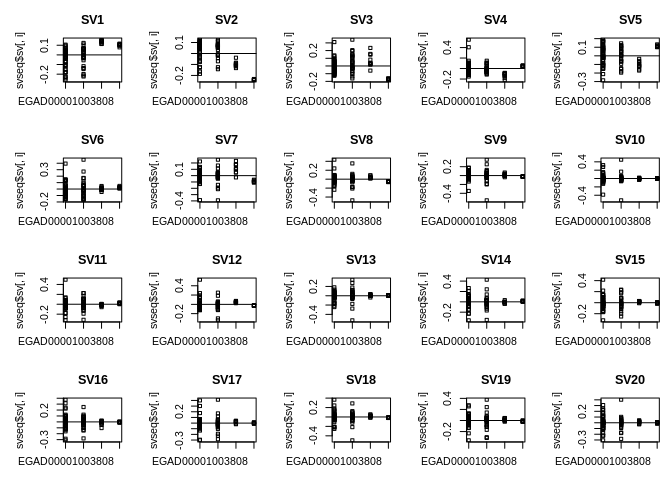<!-- -->

``` r
#svseq$sv
par(mfrow = c(4, 5), mar = c(3,5,3,1))
for (i in 1:20) {
  stripchart(svseq$sv[, i] ~ dds_no_inhouse$Subpopulation, vertical = TRUE, main = paste0("SV", i))
  abline(h = 0)
 }
```

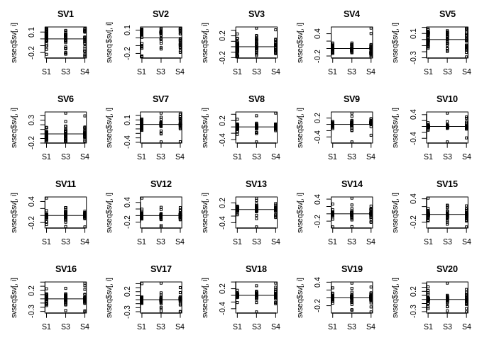<!-- -->

``` r
#svseq$sv
par(mfrow = c(4, 5), mar = c(3,5,3,1))
for (i in 1:20) {
  stripchart(svseq$sv[, i] ~ dds_no_inhouse$Strandedness, vertical = TRUE, main = paste0("SV", i))
  abline(h = 0)
 }
```

<!-- -->

#### svaseq without study EGAD00001006144

``` r
dds_noinhouse_no6144 <- DESeq(dds_noinhouse_no6144)
```

    ## Warning in DESeq(dds_noinhouse_no6144): the design is ~ 1 (just an intercept).
    ## is this intended?

    ## estimating size factors

    ## using 'avgTxLength' from assays(dds), correcting for library size

    ## estimating dispersions

    ## gene-wise dispersion estimates

    ## mean-dispersion relationship

    ## final dispersion estimates

    ## fitting model and testing

    ## -- replacing outliers and refitting for 4760 genes
    ## -- DESeq argument 'minReplicatesForReplace' = 7 
    ## -- original counts are preserved in counts(dds)

    ## estimating dispersions

    ## fitting model and testing

``` r
dat  <- counts(dds_noinhouse_no6144, normalized = TRUE)
idx  <- rowMeans(dat) > 1
dat  <- dat[idx, ]
# we have Subpopulation and tumour-juxtatomour in the model matrix
mod  <- model.matrix(~ Subpopulation + Tumor_JuxtaTumor, colData(dds_noinhouse_no6144))
mod0 <- model.matrix(~   1, colData(dds_noinhouse_no6144))
svseq_no6144 <- svaseq(dat, mod, mod0)
```

    ## Number of significant surrogate variables is:  18 
    ## Iteration (out of 5 ):1  2  3  4  5

``` r
par(mfrow = c(4, 5), mar = c(3,5,3,1))
for (i in 1:ncol(svseq_no6144$sv)) {
  stripchart(svseq_no6144$sv[, i] ~ dds_noinhouse_no6144$Study, vertical = TRUE, main = paste0("SV", i))
  abline(h = 0)
 }
```

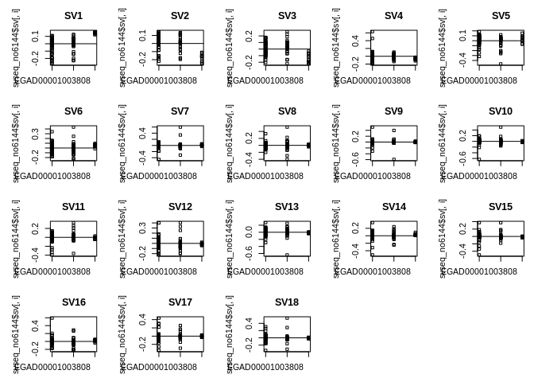<!-- -->

``` r
#svseq$sv
par(mfrow = c(4, 5), mar = c(3,5,3,1))
for (i in 1:ncol(svseq_no6144$sv)) {
  stripchart(svseq_no6144$sv[, i] ~ dds_noinhouse_no6144$Subpopulation, vertical = TRUE, main = paste0("SV", i))
  abline(h = 0)
 }
```

<!-- -->

### Differential expression analysis without the inhouse data and without study 6144

``` r
get_upregulated <- function(df){

    key <- intersect(rownames(df)[which(df$log2FoldChange>=2)], rownames(df)[which(df$padj<=0.05)])

  results <- as.data.frame((df)[which(rownames(df) %in% key),])
    return(results)
}

get_downregulated <- function(df){

    key <- intersect(rownames(df)[which(df$log2FoldChange<=-2)], rownames(df)[which(df$padj<=0.05)])

    results <- as.data.frame((df)[which(rownames(df) %in% key),])
    return(results)
}

annotate_de_genes <- function(df, filter_by){
    # if your df has hgnc_symbol as rownames, filter by that, if it is the ENSG1234.12, use "ensembl_gene_id_version", if it is the regular engs, filter by "ensembl_gene_id"
    filter_by_string <- as.character(filter_by)
    df$gene_symbol <- rownames(df)
    colnames(df)[6] <- filter_by_string
    #print(df)
    mart <- useMart(biomart = "ensembl", dataset = "hsapiens_gene_ensembl",  host="https://www.ensembl.org")
                    #host="uswest.ensembl.org")
    info <- getBM(attributes=c("hgnc_symbol",
                               "ensembl_gene_id_version",
                               "chromosome_name",
                               "start_position",
                               "end_position",
                               "strand",
                               "entrezgene_description",
                               "entrezgene_id"),
                  filters = c(filter_by_string),
                  values = df[,6],
                  mart = mart,
                  useCache=FALSE)

    tmp <- merge(df, info, by=filter_by_string)
    tmp$strand <- gsub("-1", "-", tmp$strand)
    tmp$strand <- gsub("1", "+", tmp$strand)
    #tmp$hgnc_symbol <- make.names(tmp$hgnc_symbol, unique = T)
    tmp <- tmp[!grepl("CHR", tmp$chromosome_name),]

    output_col <- c("Gene", "Ensembl ID", "Chromosome", "Start", "Stop", "Strand", "Description", "Log2FC", "P-value", "Adj P-value", "Entrez ID")
    tmp <- subset(tmp, select=c(hgnc_symbol, ensembl_gene_id_version, chromosome_name, start_position, end_position, strand, entrezgene_description, log2FoldChange, pvalue, padj, entrezgene_id))
    colnames(tmp) <- output_col

    if(min(tmp$Log2FC) > 0){
        tmp <- tmp[order(-tmp$Log2FC),]
    }else{
        tmp <- tmp[order(tmp$Log2FC),]
    }

    return(tmp)

}

anti_join_rownames <- function(df1, df2){
  anti_join((df1 %>% mutate(Symbol = rownames(df1))),
           (df2 %>% mutate(Symbol = rownames(df2))),
          by = 'Symbol')
}

filter_dfs_antijoin_rownames <- function(df_list){
  output <- list()
    for (i in 1:length(dfs_to_filter)){
      df_interest <- dfs_to_filter[[i]]
      if (nrow(df_interest) == 0) stop("one of your dataframes has no rows")
      not_i <- seq(1,length(dfs_to_filter))[seq(1,length(dfs_to_filter)) != i]
      for (j in not_i){
        df_filtered <- anti_join_rownames(df_interest, dfs_to_filter[[j]])
        if (nrow(df_filtered) == 0){
          break
        }
      }
      df_filtered <- subset(df_filtered, select = -c(Symbol)) 
      output <- c(output, list(df_filtered))
      print(dim(output)[[i]])
    }
  return(output)
}
```

#### Without Inhouse Data

``` r
register(MulticoreParam(4))
ddssva <- dds_no_inhouse
sv_names <- paste("SV", seq(1,svseq$n.sv), sep = "")
for (i in 1:length(sv_names)){
  colData(ddssva)[,sv_names[i]] <- svseq$sv[,i]
}
colData(ddssva)[,"Subpopulation"] <- as.factor(colData(ddssva)$Subpopulation)
colData(ddssva)[,"Tumor_JuxtaTumor"] <- as.factor(colData(ddssva)$Tumor_JuxtaTumor)
design(ddssva) <- ~ Subpopulation + Tumor_JuxtaTumor + SV1 + SV2 + SV3 + SV4 + SV5 + SV6 + SV7 + SV8 + SV9 + SV10 + SV11 + SV12 + SV13 + SV14 + SV15 + SV16 + SV17 + SV18 + SV19 + SV20
ddssva_copy <- ddssva
design(ddssva_copy) <- ~ Tumor_JuxtaTumor + SV1 + SV2 + SV3 + SV4 + SV5 + SV6 + SV7 + SV8 + SV9 + SV10 + SV11 + SV12 + SV13 + SV14 + SV15 + SV16 + SV17 + SV18 + SV19 + SV20 + SV21 + Subpopulation
#dds_no_inhouse_deseq <- DESeq(ddssva_copy)
#write_rds(dds_no_inhouse_deseq, file = "/home/kevin/Documents/PhD/subtypes/caf-subtype-analysis/dds_noinhouse_deseq_hgnc_25082022.Rds")
dds_no_inhouse_wald_diffdesign <- readRDS("dds_noinhouse_deseq_hgnc_25082022.Rds")
```

``` r
#design(dds_no_inhouse) <- ~ Subpopulation + Tumor_JuxtaTumor + SV1 + SV2 + SV3 + SV4
#design(dds_no_inhouse) <- ~ Tumor_JuxtaTumor + SV1 + SV2 + SV3 + SV4
#design(dds_no_inhouse) <- ~ SV1 + SV2 + SV3 + SV4
# design(dds_no_inhouse) <- ~ Tumor_JuxtaTumor + SV1 + SV2 + SV3 + SV4
```

The aim here is to extract lists of genes that are upregulated in each
subpopulation compared to the other 2 subpopulations. To do this, steps
from the [following
tutorial](https://github.com/tavareshugo/tutorial_DESeq2_contrasts/blob/main/DESeq2_contrasts.md)
were followed.

``` r
# define model matrix
mod_mat <- model.matrix(design(dds_no_inhouse_wald_diffdesign), colData(dds_no_inhouse_wald_diffdesign))
# e.g. for each sample that is S1, get the mean of the coefficients all the components of the formula 
S1 <- colMeans(mod_mat[dds_no_inhouse_wald_diffdesign$Subpopulation == "S1",])
S3 <- colMeans(mod_mat[dds_no_inhouse_wald_diffdesign$Subpopulation == "S3",])
S4 <- colMeans(mod_mat[dds_no_inhouse_wald_diffdesign$Subpopulation == "S4",])
not_S1 <- colMeans(mod_mat[dds_no_inhouse_wald_diffdesign$Subpopulation %in% c("S3", "S4"),])
not_S3 <- colMeans(mod_mat[dds_no_inhouse_wald_diffdesign$Subpopulation %in% c("S1", "S4"),])
not_S4 <- colMeans(mod_mat[dds_no_inhouse_wald_diffdesign$Subpopulation %in% c("S1", "S3"),])
```

``` r
res_not_S1 <- results(dds_no_inhouse_wald_diffdesign, contrast = S1 - not_S1, filterFun = ihw, alpha = 0.05, lfcThreshold = 2, altHypothesis = "greater")
res_not_S3 <- results(dds_no_inhouse_wald_diffdesign, contrast = S3 - not_S3, filterFun = ihw, alpha = 0.05, lfcThreshold = 2, altHypothesis = "greater")
res_not_S4 <- results(dds_no_inhouse_wald_diffdesign, contrast = S4 - not_S4, filterFun = ihw, alpha = 0.05, lfcThreshold = 2, altHypothesis = "greater")
```

``` r
drawLines <- function() abline(h=c(-2,2),col="dodgerblue",lwd=2)
par(mfrow = c(3, 1))
plotMA(res_not_S1) ; drawLines()
plotMA(res_not_S3) ; drawLines()
plotMA(res_not_S4) ; drawLines()
```

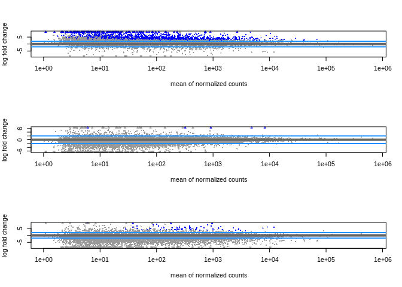<!-- -->

``` r
res_not_S1_shrink <- lfcShrink(dds_no_inhouse_wald_diffdesign, contrast = S1 - not_S1, res = res_not_S1, type = "ashr")
```

    ## using 'ashr' for LFC shrinkage. If used in published research, please cite:
    ##     Stephens, M. (2016) False discovery rates: a new deal. Biostatistics, 18:2.
    ##     https://doi.org/10.1093/biostatistics/kxw041

``` r
res_not_S3_shrink <- lfcShrink(dds_no_inhouse_wald_diffdesign, contrast = S3 - not_S3, res = res_not_S3, type = "ashr")
```

    ## using 'ashr' for LFC shrinkage. If used in published research, please cite:
    ##     Stephens, M. (2016) False discovery rates: a new deal. Biostatistics, 18:2.
    ##     https://doi.org/10.1093/biostatistics/kxw041

``` r
res_not_S4_shrink <- lfcShrink(dds_no_inhouse_wald_diffdesign, contrast = S4 - not_S4, res = res_not_S4, type = "ashr")
```

    ## using 'ashr' for LFC shrinkage. If used in published research, please cite:
    ##     Stephens, M. (2016) False discovery rates: a new deal. Biostatistics, 18:2.
    ##     https://doi.org/10.1093/biostatistics/kxw041

``` r
par(mfrow = c(3, 1))
plotMA(res_not_S1_shrink) ; drawLines()
plotMA(res_not_S3_shrink) ; drawLines()
plotMA(res_not_S4_shrink) ; drawLines()
```

<!-- -->

``` r
res_not_S1_shrink_extract <- get_upregulated(res_not_S1_shrink)
res_not_S3_shrink_extract <- get_upregulated(res_not_S3_shrink)
res_not_S4_shrink_extract <- get_upregulated(res_not_S4_shrink)
```

``` r
dfs_to_filter <- list(res_not_S1_shrink_extract, res_not_S3_shrink_extract, res_not_S4_shrink_extract)
dfs_filtered <- filter_dfs_antijoin_rownames(dfs_to_filter)
```

    ## NULL
    ## NULL
    ## NULL

``` r
names(dfs_filtered) <- c("S1", "S3", "S4")
s1_filtered <- dfs_filtered[[1]]
s1_filtered_annotations <- annotate_de_genes(s1_filtered, filter_by = "hgnc_symbol")
```

    ## Ensembl site unresponsive, trying uswest mirror

``` r
s3_filtered <- dfs_filtered[[2]]
s3_filtered_annotations <- annotate_de_genes(s3_filtered, filter_by = "hgnc_symbol")
s4_filtered <- dfs_filtered[[3]]
s4_filtered_annotations <- annotate_de_genes(s4_filtered, filter_by = "hgnc_symbol")
```

#### Without inhouse data or study EGAD00001006144

``` r
sv_names <- paste("SV", seq(1,svseq_no6144$n.sv), sep = "")
for (i in 1:length(sv_names)){
  colData(dds_noinhouse_no6144)[,sv_names[i]] <- svseq_no6144$sv[,i]
}
colData(dds_noinhouse_no6144)[,"Subpopulation"] <- as.factor(colData(dds_noinhouse_no6144)$Subpopulation)
colData(dds_noinhouse_no6144)[,"Tumor_JuxtaTumor"] <- as.factor(colData(dds_noinhouse_no6144)$Tumor_JuxtaTumor)

design(dds_noinhouse_no6144) <- ~ Tumor_JuxtaTumor + SV1 + SV2 + SV3 + SV4 + SV5 + SV6 + SV7 + SV8 + SV9 + SV10 + SV11 + SV12 + SV13 + SV14 + SV15 + SV16 + SV17 + SV18 + Subpopulation
#ptm <- proc.time()
#dds_no_inhouse_no6144 <- DESeq(dds_noinhouse_no6144, parallel = TRUE)
#proc.time() - ptm
#write_rds(dds_no_inhouse_no6144, file = "/home/kevin/Documents/PhD/subtypes/caf-subtype-analysis/dds_noinhouse_no6144_hgnc_25082022.Rds")
dds_no_inhouse_no6144 <- readRDS("dds_noinhouse_no6144_hgnc_25082022.Rds")
```

Elapsed = 2835.825

``` r
#register(MulticoreParam(4))
#ptm <- proc.time()
#dds_no_inhouse_no6144 <- DESeq(dds_noinhouse_no6144, parallel = TRUE)
#proc.time() - ptm
#write_rds(dds_no_inhouse_no6144, file = "/home/kevin/Documents/PhD/subtypes/caf-subtype-analysis/dds_no_inhouse_no6144_deseq_11082022.Rds")
#dds_no_inhouse_no6144 <- readRDS("dds_no_inhouse_no6144_deseq_11082022.Rds")
```

The aim here is to extract lists of genes that are upregulated in each
subpopulation compared to the other 2 subpopulations. To do this, steps
from the [following
tutorial](https://github.com/tavareshugo/tutorial_DESeq2_contrasts/blob/main/DESeq2_contrasts.md)
were followed.

``` r
# define model matrix
mod_mat <- model.matrix(design(dds_no_inhouse_no6144), colData(dds_no_inhouse_no6144))
# e.g. for each sample that is S1, get the mean of the coefficients all the components of the formula 
S1 <- colMeans(mod_mat[dds_no_inhouse_no6144$Subpopulation == "S1",])
S3 <- colMeans(mod_mat[dds_no_inhouse_no6144$Subpopulation == "S3",])
S4 <- colMeans(mod_mat[dds_no_inhouse_no6144$Subpopulation == "S4",])
not_S1 <- colMeans(mod_mat[dds_no_inhouse_no6144$Subpopulation %in% c("S3", "S4"),])
not_S3 <- colMeans(mod_mat[dds_no_inhouse_no6144$Subpopulation %in% c("S1", "S4"),])
not_S4 <- colMeans(mod_mat[dds_no_inhouse_no6144$Subpopulation %in% c("S1", "S3"),])
```

``` r
res_not_S1 <- results(dds_no_inhouse_no6144, contrast = S1 - not_S1, filterFun = ihw, alpha = 0.05, lfcThreshold = 2, altHypothesis = "greater")
res_not_S3 <- results(dds_no_inhouse_no6144, contrast = S3 - not_S3, filterFun = ihw, alpha = 0.05, lfcThreshold = 2, altHypothesis = "greater")
res_not_S4 <- results(dds_no_inhouse_no6144, contrast = S4 - not_S4, filterFun = ihw, alpha = 0.05, lfcThreshold = 2, altHypothesis = "greater")
```

``` r
drawLines <- function() abline(h=c(-2,2),col="dodgerblue",lwd=2)
par(mfrow = c(3, 1))
plotMA(res_not_S1) ; drawLines()
plotMA(res_not_S3) ; drawLines()
plotMA(res_not_S4) ; drawLines()
```

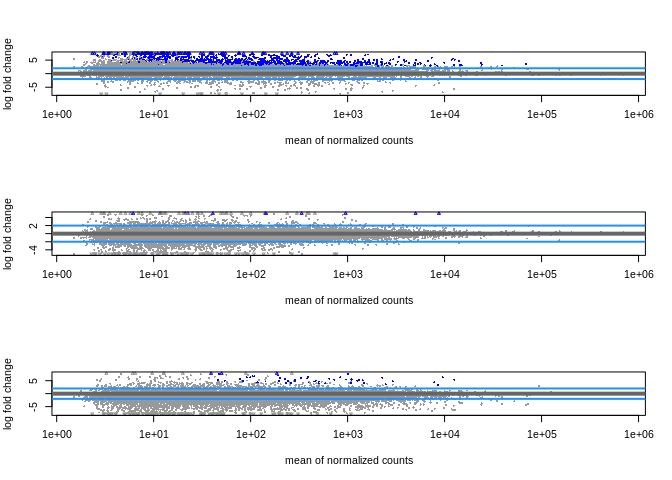<!-- -->

``` r
res_not_S1_shrink <- lfcShrink(dds_no_inhouse_wald_diffdesign, contrast = S1 - not_S1, res = res_not_S1, type = "ashr")
```

    ## using 'ashr' for LFC shrinkage. If used in published research, please cite:
    ##     Stephens, M. (2016) False discovery rates: a new deal. Biostatistics, 18:2.
    ##     https://doi.org/10.1093/biostatistics/kxw041

``` r
res_not_S3_shrink <- lfcShrink(dds_no_inhouse_wald_diffdesign, contrast = S3 - not_S3, res = res_not_S3, type = "ashr")
```

    ## using 'ashr' for LFC shrinkage. If used in published research, please cite:
    ##     Stephens, M. (2016) False discovery rates: a new deal. Biostatistics, 18:2.
    ##     https://doi.org/10.1093/biostatistics/kxw041

``` r
res_not_S4_shrink <- lfcShrink(dds_no_inhouse_wald_diffdesign, contrast = S4 - not_S4, res = res_not_S4, type = "ashr")
```

    ## using 'ashr' for LFC shrinkage. If used in published research, please cite:
    ##     Stephens, M. (2016) False discovery rates: a new deal. Biostatistics, 18:2.
    ##     https://doi.org/10.1093/biostatistics/kxw041

``` r
par(mfrow = c(3, 1))
plotMA(res_not_S1_shrink) ; drawLines()
plotMA(res_not_S3_shrink) ; drawLines()
plotMA(res_not_S4_shrink) ; drawLines()
```

<!-- -->

``` r
res_not_S1_shrink_extract <- get_upregulated(res_not_S1_shrink)
res_not_S3_shrink_extract <- get_upregulated(res_not_S3_shrink)
res_not_S4_shrink_extract <- get_upregulated(res_not_S4_shrink)
```

``` r
dfs_to_filter <- list(res_not_S1_shrink_extract, res_not_S3_shrink_extract, res_not_S4_shrink_extract)
dfs_filtered <- filter_dfs_antijoin_rownames(dfs_to_filter)
```

    ## NULL
    ## NULL
    ## NULL

``` r
names(dfs_filtered) <- c("S1", "S3", "S4")
s1_filtered <- dfs_filtered[[1]]
s1_filtered_annotations <- annotate_de_genes(s1_filtered, filter_by = "hgnc_symbol")
s3_filtered <- dfs_filtered[[2]]
s3_filtered_annotations <- annotate_de_genes(s3_filtered, filter_by = "hgnc_symbol")
s4_filtered <- dfs_filtered[[3]]
s4_filtered_annotations <- annotate_de_genes(s4_filtered, filter_by = "hgnc_symbol")
```

``` r
s1_gs <- s1_filtered_annotations$Gene
s3_gs <- s3_filtered_annotations$Gene
s4_gs <- s4_filtered_annotations$Gene
genesets <- list(s1_gs, s3_gs, s4_gs)
names(genesets) <- c("S1", "S3", "S4")
```

### Over-representation analysis

``` r
mart <- useMart(biomart = "ensembl", dataset = "hsapiens_gene_ensembl", host="www.ensembl.org") #host = "https://uswest.ensembl.org")
```

    ## Warning: Ensembl will soon enforce the use of https.
    ## Ensure the 'host' argument includes "https://"

``` r
background_genes <- getBM(attributes = "entrezgene_id", 
                          #filters = "ensembl_gene_id_version", 
                          filters = "hgnc_symbol",
                          mart = mart,
                          values = rownames(res_not_S1_shrink))
```

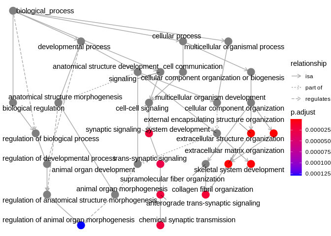<!-- -->

``` r
dotplot(ego_S1, title = "S1 signature over-representation analysis")
```

<!-- -->

``` r
dotplot(ego_S3, title = "S3 signature over-representation analysis")
```

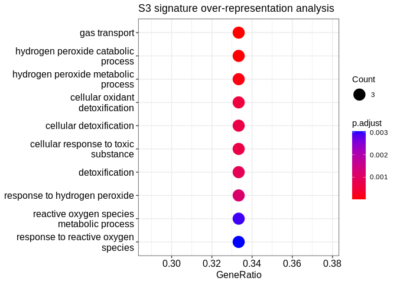<!-- -->

``` r
dotplot(ego_S4, title = "S4 signature over-representation analysis")
```

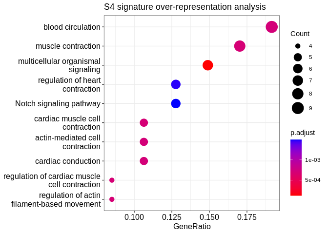<!-- -->

### Gene set variation analysis (GSVA) for gene signature identification

``` r
idx <- which(dds$Study == "InHouse")
dds_inhouse <- dds[,idx]
```

``` r
inhouse_metadata <- read.csv("/home/kevin/Documents/PhD/rna_seq_bc/metadata/reformat_samples_extra_info.csv")
caf_es <- gsva(expr = dds_inhouse,
               gset.idx.list = genesets,
               method = "gsva",
               kcdf = "Poisson",
               mx.diff=FALSE)
```

    ## Warning in .filterFeatures(expr, method): 247 genes with constant expression
    ## values throuhgout the samples.

    ## Warning in .filterFeatures(expr, method): Since argument method!="ssgsea", genes
    ## with constant expression values are discarded.

    ## Estimating GSVA scores for 3 gene sets.
    ## Estimating ECDFs with Poisson kernels
    ##   |                                                                              |                                                                      |   0%  |                                                                              |=======================                                               |  33%  |                                                                              |===============================================                       |  67%  |                                                                              |======================================================================| 100%

``` r
caf_es$Patient <- inhouse_metadata$Patient
caf_es$Subtype <- inhouse_metadata$Subtype
caf_es$Grade <- inhouse_metadata$Grade
caf_es$Histology <- inhouse_metadata$Histology
```

``` r
subpopulationOrder <- c("tumor", "juxtatumor")
sampleOrderBySubpopulation <- sort(match(caf_es$Tumor_JuxtaTumor, subpopulationOrder),
                             index.return=TRUE)$ix
subpopulationXtable <- table(caf_es$Tumor_JuxtaTumor)
subpopulationColorLegend <- c(tumor="red", juxtatumor="green")
geneSetOrder <- c("S4", "S3", "S1")
geneSetLabels <- geneSetOrder
hmcol <- colorRampPalette(brewer.pal(10, "RdBu"))(256)
hmcol <- hmcol[length(hmcol):1]
heatmap(assay(caf_es)[geneSetOrder, sampleOrderBySubpopulation], Rowv=NA,
        Colv=NA, scale="row", margins=c(3,5), col=hmcol,
        ColSideColors=rep(subpopulationColorLegend[subpopulationOrder],
                          times=subpopulationXtable[subpopulationOrder]),
        labCol="", 
        caf_es$Tumor_JuxtaTumor[sampleOrderBySubpopulation],
        labRow=paste(toupper(substring(geneSetLabels, 1,1)),
                     substring(geneSetLabels, 2), sep=""),
        cexRow=2, main=" \n ")
par(xpd=TRUE)
text(0.285,1.1, "CAF", col="red", cex=1.2)
text(0.55,1.1, "TAN", col="green", cex=1.2)
#text(0.47,1.21, "S4", col="blue", cex=1.2)
mtext("Gene sets", side=4, line=0, cex=1.5)
mtext("Samples", side=1, line=4, cex=1.5, at = 0.42)
```

<!-- -->

``` r
subtypeOrder <- c("LuminalA", "TNBC")
sampleOrderBySubtype <- sort(match(caf_es$Subtype, subtypeOrder),
                             index.return=TRUE)$ix
subtypeXtable <- table(caf_es$Subtype)
subtypeColorLegend <- c(LuminalA="red", TNBC="green")
geneSetOrder <- c("S4", "S3", "S1")
geneSetLabels <- geneSetOrder
hmcol <- colorRampPalette(brewer.pal(10, "RdBu"))(256)
hmcol <- hmcol[length(hmcol):1]
heatmap(assay(caf_es)[geneSetOrder, sampleOrderBySubtype], Rowv=NA,
        Colv=NA, scale="row", margins=c(3,5), col=hmcol,
        ColSideColors=rep(subtypeColorLegend[subtypeOrder],
                          times=subtypeXtable[subtypeOrder]),
        labCol="", 
        #labCol = caf_es$Patient[sampleOrderBySubtype],
        caf_es$Subtype[sampleOrderBySubtype],
        labRow=paste(toupper(substring(geneSetLabels, 1,1)),
                     substring(geneSetLabels, 2), sep=""),
        cexRow=2, main=" \n ")
par(xpd=TRUE)
text(0.4,1.1, "LuminalA", col="red", cex=1.2)
text(0.65,1.1, "TNBC", col="green", cex=1.2)
#text(0.47,1.21, "S4", col="blue", cex=1.2)
mtext("Gene sets", side=4, line=0, cex=1.5)
mtext("Samples", side=1, line=4, cex=1.5, at = 0.42)
```

<!-- -->

``` r
gradeOrder <- c("Grade_2", "Grade_3")
sampleOrderByGrade <- sort(match(caf_es$Grade, gradeOrder),
                             index.return=TRUE)$ix
gradeXtable <- table(caf_es$Grade)
gradeColorLegend <- c(Grade_2="red", Grade_3="green")
geneSetOrder <- c("S4", "S3", "S1")
geneSetLabels <- geneSetOrder
hmcol <- colorRampPalette(brewer.pal(10, "RdBu"))(256)
hmcol <- hmcol[length(hmcol):1]
heatmap(assay(caf_es)[geneSetOrder, sampleOrderByGrade], Rowv=NA,
        Colv=NA, scale="row", margins=c(3,5), col=hmcol,
        ColSideColors=rep(gradeColorLegend[gradeOrder],
                          times=gradeXtable[gradeOrder]),
        labCol="", 
        #labCol = caf_es$Patient[sampleOrderByGrade],
        caf_es$Subtype[sampleOrderBySubtype],
        labRow=paste(toupper(substring(geneSetLabels, 1,1)),
                     substring(geneSetLabels, 2), sep=""),
        cexRow=2, main=" \n ")
par(xpd=TRUE)
text(0.34,1.1, "Grade 2", col="red", cex=1.2)
text(0.6,1.1, "Grade 3", col="green", cex=1.2)
#text(0.47,1.21, "S4", col="blue", cex=1.2)
mtext("Gene sets", side=4, line=0, cex=1.5)
mtext("Samples", side=1, line=4, cex=1.5, at = 0.42)
```

<!-- -->

``` r
subtypeOrder <- c("LuminalA", "TNBC")
sampleOrderBySubtype <- sort(match(caf_es$Subtype, subtypeOrder),
                             index.return=TRUE)$ix
subtypeXtable <- table(caf_es$Subtype)
subtypeColorLegend <- c(LuminalA="red", TNBC="green")
geneSetOrder <- c("S4", "S3", "S1")
geneSetLabels <- geneSetOrder
hmcol <- colorRampPalette(brewer.pal(10, "RdBu"))(256)
hmcol <- hmcol[length(hmcol):1]
heatmap(assay(caf_es)[geneSetOrder, sampleOrderBySubtype], Rowv=NA,
        Colv=NA, scale="row", margins=c(3,5), col=hmcol,
        ColSideColors=rep(subtypeColorLegend[subtypeOrder],
                          times=subtypeXtable[subtypeOrder]),
        #labCol="", 
        labCol = caf_es$Patient[sampleOrderBySubtype],
        caf_es$Subtype[sampleOrderBySubtype],
        labRow=paste(toupper(substring(geneSetLabels, 1,1)),
                     substring(geneSetLabels, 2), sep=""),
        cexRow=2, main=" \n ")
par(xpd=TRUE)
text(0.4,1.1, "LuminalA", col="red", cex=1.2)
text(0.65,1.1, "TNBC", col="green", cex=1.2)
#text(0.47,1.21, "S4", col="blue", cex=1.2)
mtext("Gene sets", side=4, line=0, cex=1.5)
mtext("Samples", side=1, line=4, cex=1.5, at = 0.42)
```

<!-- -->

``` r
caf_idx <- which(colData(caf_es)$Tumor_JuxtaTumor == "tumor")
tan_idx <- which(colData(caf_es)$Tumor_JuxtaTumor == "juxtatumor")
df_plot_S1 <- cbind.data.frame(S1_ES = assay(caf_es)[1,], Tumor_JuxtaTumor = colData(caf_es)$Tumor_JuxtaTumor)
gsva_plot_s1 <- ggplot(df_plot_S1, aes(x = Tumor_JuxtaTumor, y = S1_ES)) +
  geom_point(size = 2,  # reduce point size to minimize overplotting 
    position = position_jitter(
      width = 0.1,  # amount of jitter in horizontal direction
      height = 0     # amount of jitter in vertical direction (0 = none)
    )
  ) +
  theme(panel.grid.major = element_blank(), 
        panel.grid.minor = element_blank(),
        panel.background = element_blank(), 
        axis.line = element_line(colour = "black"), 
        axis.title.x = element_blank(),
        plot.title = element_text(hjust = 0.5)) +
  ylab("S1 GSVA ES")  #, axis.title.x = element_blank())

df_plot_S3 <- cbind.data.frame(S3_ES = assay(caf_es)[2,], Tumor_JuxtaTumor = colData(caf_es)$Tumor_JuxtaTumor)
gsva_plot_s3 <- ggplot(df_plot_S3, aes(x = Tumor_JuxtaTumor, y = S3_ES)) +
  geom_point(size = 2,  # reduce point size to minimize overplotting 
    position = position_jitter(
      width = 0.1,  # amount of jitter in horizontal direction
      height = 0     # amount of jitter in vertical direction (0 = none)
    )
  ) +
  theme(panel.grid.major = element_blank(), 
        panel.grid.minor = element_blank(),
        panel.background = element_blank(), 
        axis.line = element_line(colour = "black"), 
        axis.title.x = element_blank(),
        plot.title = element_text(hjust = 0.5)) +
  ylab("S3 GSVA ES")  #, axis.title.x = element_blank())

df_plot_S4 <- cbind.data.frame(S4_ES = assay(caf_es)[3,], Tumor_JuxtaTumor = colData(caf_es)$Tumor_JuxtaTumor)
gsva_plot_s4 <- ggplot(df_plot_S4, aes(x = Tumor_JuxtaTumor, y = S4_ES)) +
  geom_point(size = 2,  # reduce point size to minimize overplotting 
    position = position_jitter(
      width = 0.1,  # amount of jitter in horizontal direction
      height = 0     # amount of jitter in vertical direction (0 = none)
    )
  ) +
  theme(panel.grid.major = element_blank(), 
        panel.grid.minor = element_blank(),
        panel.background = element_blank(), 
        axis.line = element_line(colour = "black"), 
        axis.title.x = element_blank(),
        plot.title = element_text(hjust = 0.5)) +
  ylab("S4 GSVA ES")  #, axis.title.x = element_blank())
```

``` r
distribution_es_s1 <- df_plot_S1 %>% 
ggplot(mapping = aes(S1_ES)) +
  geom_density() +
  facet_wrap(~Tumor_JuxtaTumor) +
  theme_linedraw()

distribution_es_s3 <- df_plot_S3 %>% 
ggplot(mapping = aes(S3_ES)) +
  geom_density() +
  facet_wrap(~Tumor_JuxtaTumor) +
  theme_linedraw()

distribution_es_s4 <- df_plot_S4 %>% 
ggplot(mapping = aes(S4_ES)) +
  geom_density() +
  facet_wrap(~Tumor_JuxtaTumor) +
  theme_linedraw()
```

``` r
top_row <- plot_grid(gsva_plot_s1, gsva_plot_s3, gsva_plot_s4,
      ncol = 3,
      labels = c('A', 'B', 'C'),
      label_fontfamily = 'serif',
      label_fontface = 'bold',
      label_size = 15,
      align = 'h',
      rel_widths = c(1.10, 0.80, 1.10))

    bottom_row <- plot_grid(distribution_es_s1, distribution_es_s3, distribution_es_s4,
      ncol = 3,
      labels = c('D', 'E', 'F'),
      label_fontfamily = 'serif',
      label_fontface = 'bold',
      label_size = 22,
      align = 'h',
      rel_widths = c(0.8, 1.2))

    plot_grid(top_row, bottom_row, nrow = 2,
      rel_heights = c(1.1, 0.9))
```

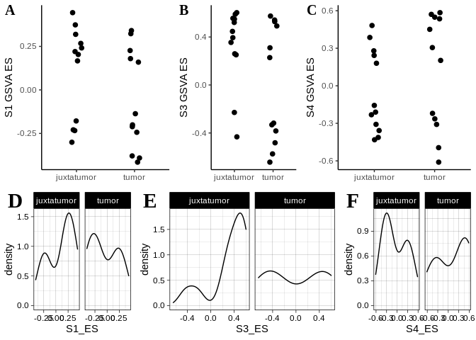<!-- -->

``` r
df_plot_S1$S1_ES %>% 
shapiro.test()
```

    ## 
    ##  Shapiro-Wilk normality test
    ## 
    ## data:  .
    ## W = 0.88376, p-value = 0.009899

``` r
df_plot_S3$S3_ES %>% 
shapiro.test()
```

    ## 
    ##  Shapiro-Wilk normality test
    ## 
    ## data:  .
    ## W = 0.82457, p-value = 0.000764

``` r
df_plot_S4$S4_ES %>% 
shapiro.test()
```

    ## 
    ##  Shapiro-Wilk normality test
    ## 
    ## data:  .
    ## W = 0.8989, p-value = 0.0204

p \< 0.05, data is not normally distributed. T-test may be unsuitable
for comparing distributions. Carry out Wilcoxon rank-sum test
(Mann-Whitney U test).

``` r
wilcox.test(x = df_plot_S1$S1_ES[df_plot_S1$Tumor_JuxtaTumor == "tumor"], 
            y = df_plot_S1$S1_ES[df_plot_S1$Tumor_JuxtaTumor == "juxtatumor"],
            paired = TRUE)
```

    ## 
    ##  Wilcoxon signed rank exact test
    ## 
    ## data:  df_plot_S1$S1_ES[df_plot_S1$Tumor_JuxtaTumor == "tumor"] and df_plot_S1$S1_ES[df_plot_S1$Tumor_JuxtaTumor == "juxtatumor"]
    ## V = 12, p-value = 0.03418
    ## alternative hypothesis: true location shift is not equal to 0

``` r
wilcox.test(x = df_plot_S3$S3_ES[df_plot_S3$Tumor_JuxtaTumor == "tumor"], 
            y = df_plot_S3$S3_ES[df_plot_S3$Tumor_JuxtaTumor == "juxtatumor"],
            paired = TRUE)
```

    ## 
    ##  Wilcoxon signed rank exact test
    ## 
    ## data:  df_plot_S3$S3_ES[df_plot_S3$Tumor_JuxtaTumor == "tumor"] and df_plot_S3$S3_ES[df_plot_S3$Tumor_JuxtaTumor == "juxtatumor"]
    ## V = 10, p-value = 0.021
    ## alternative hypothesis: true location shift is not equal to 0

``` r
wilcox.test(x = df_plot_S4$S4_ES[df_plot_S4$Tumor_JuxtaTumor == "tumor"], 
            y = df_plot_S4$S4_ES[df_plot_S4$Tumor_JuxtaTumor == "juxtatumor"],
            paired = TRUE)
```

    ## 
    ##  Wilcoxon signed rank exact test
    ## 
    ## data:  df_plot_S4$S4_ES[df_plot_S4$Tumor_JuxtaTumor == "tumor"] and df_plot_S4$S4_ES[df_plot_S4$Tumor_JuxtaTumor == "juxtatumor"]
    ## V = 55, p-value = 0.2334
    ## alternative hypothesis: true location shift is not equal to 0

``` r
median(df_plot_S1$S1_ES[df_plot_S1$Tumor_JuxtaTumor == "tumor"])
```

    ## [1] -0.1687633

``` r
median(df_plot_S1$S1_ES[df_plot_S1$Tumor_JuxtaTumor == "juxtatumor"])
```

    ## [1] 0.211911

``` r
median(df_plot_S3$S3_ES[df_plot_S3$Tumor_JuxtaTumor == "tumor"])
```

    ## [1] -0.04473953

``` r
median(df_plot_S3$S3_ES[df_plot_S3$Tumor_JuxtaTumor == "juxtatumor"])
```

    ## [1] 0.420649

We can see from the above that there is a difference between the
enrichment scores for the gene signatures for the S1 and S3
subpopulaions between CAF and TAN. We can suggest that the TAN
(juxta-tumour) samples are enriched for our S1 and S3 gene signatures
compared to the genes outside the gene signatures, and that this
enrichment is greater in the TAN samples than in the CAF samples.

``` r
results_combined <- cbind.data.frame(colData(caf_es)$names, colData(caf_es)$Patient, df_plot_S1$S1_ES, df_plot_S3$S3_ES, df_plot_S4$S4_ES, df_plot_S1$Tumor_JuxtaTumor, colData(caf_es)$Subtype, colData(caf_es)$Grade, colData(caf_es)$Histology)
colnames(results_combined) <- c("Sample", "Patient", "S1_ES", "S3_ES", "S4_ES", "Tumor_JuxtaTumor", "Subtype", "Grade", "Histology")
results_combined
```

    ##    Sample Patient      S1_ES      S3_ES      S4_ES Tumor_JuxtaTumor  Subtype
    ## 1    4033       1 -0.2111870  0.2282682  0.4511291            tumor LuminalA
    ## 2    4034       1  0.1667547  0.2602349 -0.2104131       juxtatumor LuminalA
    ## 3    4027       2 -0.3911261 -0.5744436  0.5483698            tumor     TNBC
    ## 4    4028       2 -0.3006402 -0.4322374 -0.4128925       juxtatumor     TNBC
    ## 5    4112       3  0.3408958 -0.3317912  0.2026432            tumor LuminalA
    ## 6    4113       3  0.3192418  0.5494366 -0.1568331       juxtatumor LuminalA
    ## 7    4116       4 -0.3791867 -0.3831630 -0.6103717            tumor LuminalA
    ## 8    4117       4 -0.2337296 -0.2289328 -0.3081449       juxtatumor LuminalA
    ## 9    4214       5  0.2261749  0.5747017  0.5845368            tumor LuminalA
    ## 10   4215       5  0.2202032  0.3547532  0.2426352       juxtatumor LuminalA
    ## 11   4315       6  0.3229567  0.5416024  0.5350491            tumor LuminalA
    ## 12   4316       6  0.3736564  0.6030234  0.3862160       juxtatumor LuminalA
    ## 13   4340       7 -0.2435243 -0.6432975 -0.4944882            tumor LuminalA
    ## 14   4341       7  0.2036188  0.2515679 -0.4312309       juxtatumor LuminalA
    ## 15   4344       8  0.1594359  0.4920567 -0.2643276            tumor LuminalA
    ## 16   4345       8 -0.2293861  0.4467967 -0.3578373       juxtatumor LuminalA
    ## 17   3532       9 -0.2008142  0.3100232 -0.3087708            tumor LuminalA
    ## 18   3533       9  0.2411840  0.3945014  0.1800844       juxtatumor LuminalA
    ## 19   3536      10 -0.1367123  0.5282220  0.3053018            tumor LuminalA
    ## 20   3537      10  0.2672011  0.5898932 -0.2313765       juxtatumor LuminalA
    ## 21   4299      11  0.1797552 -0.3177473 -0.2203716            tumor LuminalA
    ## 22   4300      11  0.4438534  0.5556149  0.2794237       juxtatumor LuminalA
    ## 23   4722      12 -0.4150383 -0.4818981  0.5708118            tumor LuminalA
    ## 24   4723      12 -0.1783413  0.5212709  0.4818895       juxtatumor LuminalA
    ##      Grade Histology
    ## 1  Grade_2   Lobular
    ## 2  Grade_2   Lobular
    ## 3  Grade_3    Ductal
    ## 4  Grade_3    Ductal
    ## 5  Grade_3    Ductal
    ## 6  Grade_3    Ductal
    ## 7  Grade_2   Lobular
    ## 8  Grade_2   Lobular
    ## 9  Grade_2   Lobular
    ## 10 Grade_2   Lobular
    ## 11 Grade_2    Ductal
    ## 12 Grade_2    Ductal
    ## 13 Grade_2   Lobular
    ## 14 Grade_2   Lobular
    ## 15 Grade_2    Ductal
    ## 16 Grade_2    Ductal
    ## 17 Grade_2    Ductal
    ## 18 Grade_2    Ductal
    ## 19 Grade_3   Lobular
    ## 20 Grade_3   Lobular
    ## 21 Grade_3    Ductal
    ## 22 Grade_3    Ductal
    ## 23 Grade_2   Lobular
    ## 24 Grade_2   Lobular

### Chemoresistance gene signature

Su et al 2018 carried out differential expression analysis between
chemoresistant and chemosensitive CAFs from breast cancer. It is
possible to try and identify the resulting signature in our samples. We
will use the list of upregulated genes in chemoresistant samples as our
marker of chemoresistance and the genes downregulated in the
chemoresistant cells as our marker of chemosensitivity.

The HGNCHelper package can be used to fix outdated gene symbols.

``` r
gene_signature <- read.csv("/home/kevin/Documents/PhD/rna_seq_bc/gene_signature/1-s2.0-S0092867418300448-mmc1.csv", skip = 1)
gene_signature_loc <- gene_signature[str_detect(gene_signature$Gene.name, pattern = "^LOC\\d+$"),]
# write to file and look up loc gene signatures manually, read back in as gene_signature_loc_official
#write.table(gene_signature_loc, file = "/home/kevin/Documents/PhD/rna_seq_bc/gene_signature/chemo_signature_loc.txt", quote = F, row.names = F)
gene_signature_loc_official <- read.table("/home/kevin/Documents/PhD/rna_seq_bc/gene_signature/chemo_signature_loc_official_names.txt", header = T)
gene_signature_proper_names <- gene_signature
gene_signature_proper_names$Official_name <- gene_signature$Gene.name
idx <- match(gene_signature_loc$Gene.name, gene_signature$Gene.name)
gene_signature_proper_names[idx,]$Official_name <- gene_signature_loc_official$Official_symbol
gene_signature_proper_names <- drop_na(gene_signature_proper_names)
row_remove <- which(gene_signature_proper_names$Gene.name == "N/A")
gene_signature_proper_names <- gene_signature_proper_names[-c(row_remove),]
gene_signature_hgnc <- checkGeneSymbols(gene_signature_proper_names$Official_name, species = "human")
```

    ## Maps last updated on: Thu Oct 24 12:31:05 2019

    ## Warning in checkGeneSymbols(gene_signature_proper_names$Official_name, species
    ## = "human"): Human gene symbols should be all upper-case except for the 'orf' in
    ## open reading frames. The case of some letters was corrected.

    ## Warning in checkGeneSymbols(gene_signature_proper_names$Official_name, species =
    ## "human"): x contains non-approved gene symbols

``` r
gene_signature_hgnc$Suggested.Symbol[which(gene_signature_hgnc$x == "CCRL1")] <- NA
gene_signature_hgnc$Suggested.Symbol[which(gene_signature_hgnc$x == "FLJ40504")] <- NA
gene_signature_hgnc$Suggested.Symbol[which(gene_signature_hgnc$x == "LETR1")] <- "LETR1"
gene_signature_hgnc <- drop_na(gene_signature_hgnc)
colnames(gene_signature_hgnc) <- c("Gene.name", "Approved", "Suggested.Symbol")
gene_signature_join <- full_join(gene_signature, gene_signature_hgnc, by = "Gene.name")
gene_signature_chemoresistance <- gene_signature_join$Suggested.Symbol[which(gene_signature_join$Regulation == "up")]
gene_signature_chemoresistance <- gene_signature_chemoresistance[!is.na(gene_signature_chemoresistance)]
gene_signature_chemosensitivity <- gene_signature_join$Suggested.Symbol[which(gene_signature_join$Regulation == "down")]
gene_signature_chemosensitivity<- gene_signature_chemosensitivity[!is.na(gene_signature_chemosensitivity)]
genesets_chemo <- list(gene_signature_chemoresistance, gene_signature_chemosensitivity)
names(genesets_chemo) <- c("Chemoresistance", "Chemosensitive")
```

``` r
chemo_es <- gsva(expr = dds_inhouse,
               gset.idx.list = genesets_chemo,
               method = "gsva",
               kcdf = "Poisson",
               mx.diff=FALSE)
```

    ## Warning in .filterFeatures(expr, method): 247 genes with constant expression
    ## values throuhgout the samples.

    ## Warning in .filterFeatures(expr, method): Since argument method!="ssgsea", genes
    ## with constant expression values are discarded.

    ## Estimating GSVA scores for 2 gene sets.
    ## Estimating ECDFs with Poisson kernels
    ##   |                                                                              |                                                                      |   0%  |                                                                              |===================================                                   |  50%  |                                                                              |======================================================================| 100%

``` r
chemo_es$Patient <- inhouse_metadata$Patient
chemo_es$Subtype <- inhouse_metadata$Subtype
chemo_es$Grade <- inhouse_metadata$Grade
chemo_es$Histology <- inhouse_metadata$Histology
```

``` r
assay(chemo_es)
```

    ##                       4033       4034       4027       4028       4112
    ## Chemoresistance  0.2511948  0.1835208 -0.2275412 -0.2921821 -0.1549386
    ## Chemosensitive  -0.2884295 -0.2617528 -0.3135180 -0.4803626  0.3979869
    ##                      4113       4116       4117      4214       4215      4315
    ## Chemoresistance 0.2922223 -0.3305799 -0.3323113 0.1485889 -0.2558840 0.2260738
    ## Chemosensitive  0.5291087 -0.6315582 -0.3175666 0.4718418  0.3953624 0.5808599
    ##                      4316       4340       4341       4344       4345
    ## Chemoresistance 0.2115296 -0.2499012  0.2918001 -0.3521381 -0.2333033
    ## Chemosensitive  0.5089124 -0.3752032 -0.2284608 -0.3360215  0.2964242
    ##                       3532      3533       3536      3537       4299      4300
    ## Chemoresistance -0.3312907 0.3284542  0.2863740 0.2172434  0.4309208 0.2723313
    ## Chemosensitive  -0.3923255 0.3729971 -0.2635225 0.3420735 -0.2614191 0.4182203
    ##                       4722       4723
    ## Chemoresistance -0.2989202 -0.2909116
    ## Chemosensitive  -0.2995230 -0.2494366

``` r
subpopulationOrder <- c("tumor", "juxtatumor")
sampleOrderBySubpopulation <- sort(match(chemo_es$Tumor_JuxtaTumor, subpopulationOrder),
                             index.return=TRUE)$ix
subpopulationXtable <- table(chemo_es$Tumor_JuxtaTumor)
subpopulationColorLegend <- c(tumor="red", juxtatumor="green")
geneSetOrder <- c("Chemoresistance", "Chemosensitive")
geneSetLabels <- geneSetOrder
hmcol <- colorRampPalette(brewer.pal(10, "RdBu"))(256)
hmcol <- hmcol[length(hmcol):1]
heatmap(assay(chemo_es)[geneSetOrder, sampleOrderBySubpopulation], Rowv=NA,
        Colv=NA, scale="row", margins=c(3,5), col=hmcol,
        ColSideColors=rep(subpopulationColorLegend[subpopulationOrder],
                          times=subpopulationXtable[subpopulationOrder]),
        labCol="", 
        chemo_es$Tumor_JuxtaTumor[sampleOrderBySubpopulation],
        labRow=paste(toupper(substring(geneSetLabels, 1,1)),
                     substring(geneSetLabels, 2), sep=""),
        cexRow=2, main=" \n ")
par(xpd=TRUE)
text(0.285,1.1, "CAF", col="red", cex=1.2)
text(0.55,1.1, "TAN", col="green", cex=1.2)
#text(0.47,1.21, "S4", col="blue", cex=1.2)
mtext("Gene sets", side=4, line=0, cex=1.5)
mtext("Samples", side=1, line=4, cex=1.5, at = 0.42)
```

<!-- -->

``` r
subtypeOrder <- c("LuminalA", "TNBC")
sampleOrderBySubtype <- sort(match(chemo_es$Subtype, subtypeOrder),
                             index.return=TRUE)$ix
subtypeXtable <- table(chemo_es$Subtype)
subtypeColorLegend <- c(LuminalA="red", TNBC="green")
geneSetOrder <- c("Chemoresistance", "Chemosensitive")
geneSetLabels <- geneSetOrder
hmcol <- colorRampPalette(brewer.pal(10, "RdBu"))(256)
hmcol <- hmcol[length(hmcol):1]
heatmap(assay(chemo_es)[geneSetOrder, sampleOrderBySubtype], Rowv=NA,
        Colv=NA, scale="row", margins=c(3,5), col=hmcol,
        ColSideColors=rep(subtypeColorLegend[subtypeOrder],
                          times=subtypeXtable[subtypeOrder]),
        labCol="", 
        #labCol = caf_es$Patient[sampleOrderBySubtype],
        chemo_es$Subtype[sampleOrderBySubtype],
        labRow=paste(toupper(substring(geneSetLabels, 1,1)),
                     substring(geneSetLabels, 2), sep=""),
        cexRow=2, main=" \n ")
par(xpd=TRUE)
text(0.4,1.1, "LuminalA", col="red", cex=1.2)
text(0.65,1.1, "TNBC", col="green", cex=1.2)
#text(0.47,1.21, "S4", col="blue", cex=1.2)
mtext("Gene sets", side=4, line=0, cex=1.5)
mtext("Samples", side=1, line=4, cex=1.5, at = 0.42)
```

<!-- -->

``` r
gradeOrder <- c("Grade_2", "Grade_3")
sampleOrderByGrade <- sort(match(chemo_es$Grade, gradeOrder),
                             index.return=TRUE)$ix
gradeXtable <- table(chemo_es$Grade)
gradeColorLegend <- c(Grade_2="red", Grade_3="green")
geneSetOrder <- c("Chemoresistance", "Chemosensitive")
geneSetLabels <- geneSetOrder
hmcol <- colorRampPalette(brewer.pal(10, "RdBu"))(256)
hmcol <- hmcol[length(hmcol):1]
heatmap(assay(chemo_es)[geneSetOrder, sampleOrderByGrade], Rowv=NA,
        Colv=NA, scale="row", margins=c(3,5), col=hmcol,
        ColSideColors=rep(gradeColorLegend[gradeOrder],
                          times=gradeXtable[gradeOrder]),
        labCol="", 
        #labCol = caf_es$Patient[sampleOrderByGrade],
        chemo_es$Subtype[sampleOrderBySubtype],
        labRow=paste(toupper(substring(geneSetLabels, 1,1)),
                     substring(geneSetLabels, 2), sep=""),
        cexRow=2, main=" \n ")
par(xpd=TRUE)
text(0.34,1.1, "Grade 2", col="red", cex=1.2)
text(0.6,1.1, "Grade 3", col="green", cex=1.2)
#text(0.47,1.21, "S4", col="blue", cex=1.2)
mtext("Gene sets", side=4, line=0, cex=1.5)
mtext("Samples", side=1, line=4, cex=1.5, at = 0.42)
```

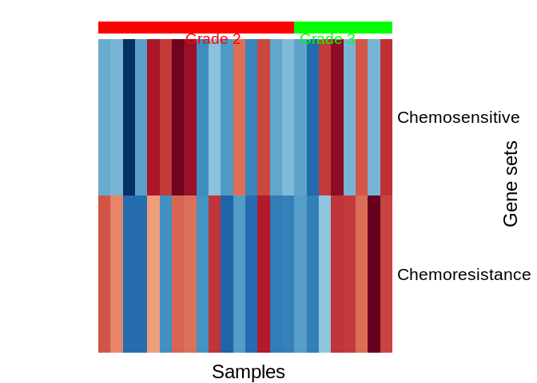<!-- -->

``` r
chemoresistance_ratio <- function(df){
  out <- data.frame(Patient = df$Patient,)
}
as_tibble(t(assay(chemo_es))) %>% mutate(Patient = colData(chemo_es)$Patient, Chemoresistance_ratio = abs(Chemoresistance)/abs(Chemosensitive))
```

    ## # A tibble: 24 × 4
    ##    Chemoresistance Chemosensitive Patient Chemoresistance_ratio
    ##              <dbl>          <dbl>   <int>                 <dbl>
    ##  1           0.251         -0.288       1                 0.871
    ##  2           0.184         -0.262       1                 0.701
    ##  3          -0.228         -0.314       2                 0.726
    ##  4          -0.292         -0.480       2                 0.608
    ##  5          -0.155          0.398       3                 0.389
    ##  6           0.292          0.529       3                 0.552
    ##  7          -0.331         -0.632       4                 0.523
    ##  8          -0.332         -0.318       4                 1.05 
    ##  9           0.149          0.472       5                 0.315
    ## 10          -0.256          0.395       5                 0.647
    ## # … with 14 more rows
    ## # ℹ Use `print(n = ...)` to see more rows

### Marker gene expression

Source: GeneCards

- ITGB1 (CD29) is an integrin, integrins are involved in cell-cell and
  cell-ECM adhesion. It is expressed in 3 of the 4 subpopulations (not
  S2).
- FAP is Fibroblast activation protein, a serine proteinase, selectively
  expressed in reactive stromal fibroblasts in epithelial cancers,
  expression should be highest in S1 population. Roles include: tissue
  remodelling, fibrosis, wound healing.
- α-SMA - ACTA2, alpha smooth muscle actin is involved in cell motility,
  structure, integrity and signalling. Its expression is highest in S1
  and S4 CAFs.
- PDPN (podoplanin) increases cell motility. It should only be expressed
  in S1 cells.
- PDGFRβ (Platelet Derived Growth Factor Receptor Beta) is a tyrosine
  kinase receptor for platelet-derived growth factors. They stimulate
  mitosis of cells of mesenchymal origin. Expression should be highest
  in S1, some expression in S3 and S4.

There are other possible genes which could be used to distinguish them
through manual curation: FSP1, CAV1, DPP4

``` r
# want to create 'background' gene set entrez id + LFC values for all genes
#info <- getBM(attributes = c("hgnc_symbol", "ensembl_gene_id_version"),
 #             mart=mart, filters = "ensembl_gene_id_version", values = rownames(dds))
info2 <- getBM(attributes = c("ensembl_gene_id", "hgnc_symbol"),
              mart=mart, filters = "hgnc_symbol", values = str_split_fixed(string = rownames(dds), pattern ="\\.", n = 2)[,1])
```

``` r
create_df_plotcounts <- function(dds, gene_interest, info, symbol_type_dds = "hgnc_symbol"){
  library(DESeq2)
  library(biomaRt)
  # put check for type of gene symbol in dds object, assuming ensembl gene version atm
  # assume info have column called hgnc_symbol
  info = info[!duplicated(info$hgnc_symbol),]
  rownames(info) = info$hgnc_symbol
  # assuming genes interest are in info, put in check for this to deal with missing gene symbol
  if (!(gene_interest %in% info$hgnc_symbol)){
    print(paste(gene_interest, "not found in table of hgnc symbols", sep = " "))
    geneCounts <- NA
  } else {
    gene_interest_info <- info[gene_interest,]
  #print(gene_interest_info)
    if (symbol_type_dds == "ensembl_gene_id_version"){
      gene_ensg <- info$ensembl_gene_id[which(info$hgnc_symbol == gene_interest)]
  # find ENSG1234.1 in dds object given ENGS1234
      idx <- str_detect(rownames(assay(dds)), paste0(gene_ensg, "\\.."))
      gene_correct_version <- rownames(assay(dds))[idx]
  } else if (symbol_type_dds == "hgnc_symbol"){
    #idx <- str_detect(rownames(assay(dds)), gene_interest)
    #gene_correct_version <- rownames(assay(dds))[idx]
      gene_correct_version <- gene_interest
  } else {
    stop("symbol_type_dds must be one of hgnc_symbol or ensembl_gene_id_version")
  }
    geneCounts <- plotCounts(dds, gene = gene_correct_version, intgroup = c("Study", "Subpopulation", "Tumor_JuxtaTumor"), returnData = TRUE)
  }
}


caf_plot_tumour_juxtatumour <- function(df_for_plotting, gene = NULL){
  library(ggplot2)
  gene = gene
  if (is.list(df_for_plotting)){
     cols <- colnames(df_for_plotting)
     df_for_plotting <- as.data.frame(df_for_plotting)
     colnames(df_for_plotting) <- cols
  }
  ggplot(df_for_plotting, aes(x = Subpopulation, y = count,  colour = Tumor_JuxtaTumor)) +
  geom_point(size = 1,  # reduce point size to minimize overplotting 
    position = position_jitter(
      width = 0.15,  # amount of jitter in horizontal direction
      height = 0     # amount of jitter in vertical direction (0 = none)
    )
  ) +
  scale_y_log10() +
  labs(title = gene) +
  theme(panel.grid.major = element_blank(), 
        panel.grid.minor = element_blank(),
        panel.background = element_blank(), 
        axis.line = element_line(colour = "black"), 
        axis.title.x = element_blank(),
        plot.title = element_text(hjust = 0.5)) +
  ylab("Normalised counts")  #, axis.title.x = element_blank())
}

caf_plot_study <- function(df_for_plotting, gene = NULL){
  library(ggplot2)
  gene = gene
  if (is.list(df_for_plotting)){
     cols <- colnames(df_for_plotting)
     df_for_plotting <- as.data.frame(df_for_plotting)
     colnames(df_for_plotting) <- cols
  }
  ggplot(df_for_plotting, aes(x = Subpopulation, y = count,  colour = Study)) +
  geom_point(size = 1,  # reduce point size to minimize overplotting 
    position = position_jitter(
      width = 0.15,  # amount of jitter in horizontal direction
      height = 0     # amount of jitter in vertical direction (0 = none)
    )
  ) +
  scale_y_log10() +
  labs(title = gene) +
  theme(panel.grid.major = element_blank(), 
        panel.grid.minor = element_blank(),
        panel.background = element_blank(), 
        axis.line = element_line(colour = "black"), 
        axis.title.x = element_blank(),
        plot.title = element_text(hjust = 0.5)) +
  ylab("Normalised counts")  #, axis.title.x = element_blank())
}
```

``` r
genes_interest <- c("FAP", "ITGB1", "ACTA2", "PDPN", "PDGFRB")
genes_interest_common_names <- c("FAP", "CD29", "αSMA", "PDPN", "PDGFRB")
annotated_dfs_for_plotting <- lapply(X = genes_interest, FUN = create_df_plotcounts, dds = dds, info = info2)
names(annotated_dfs_for_plotting) <- genes_interest
plots_out_tumor_juxtatumor <- list()
for (i in 1:length(annotated_dfs_for_plotting)){
  plt <- caf_plot_tumour_juxtatumour(df_for_plotting = annotated_dfs_for_plotting[[i]], 
                                                                   gene = genes_interest_common_names[i])
  plots_out_tumor_juxtatumor[[i]] = plt
}
plots_out_study <- list()
for (i in 1:length(annotated_dfs_for_plotting)){
  plt <- caf_plot_study(df_for_plotting = annotated_dfs_for_plotting[[i]], 
                        gene = genes_interest_common_names[i])
  plots_out_study[[i]] = plt
}
ggar_obj_tumor_juxtatumor <- ggarrange(plotlist = plots_out_tumor_juxtatumor, common.legend = TRUE) # rel_heights values control title margins
ggar_obj_tumor_juxtatumor_annotated <- annotate_figure(ggar_obj_tumor_juxtatumor, bottom = text_grob("CAF Subpopulation"))
ggar_obj_study <- ggarrange(plotlist = plots_out_study, common.legend = TRUE) # rel_heights values control title margins
ggar_obj_study_annotated <- annotate_figure(ggar_obj_study, bottom = text_grob("CAF Subpopulation"))
ggar_obj_tumor_juxtatumor_annotated
```

<!-- -->

``` r
ggar_obj_study_annotated
```

<!-- -->

``` r
genes_interest <- c("CXCL12","TNFSF4","PDCD1LG2", "CD276", "NT5E", "DPP4", "CAV1", "ATL1")
genes_interest_common_names <- c("CXCL12", "OX40L", "PDL2", "B7H3", "CD73", "DPP4", "CAV1", "FSP1")
annotated_dfs_for_plotting <- lapply(X = genes_interest, FUN = create_df_plotcounts, dds = dds, info = info2)
```

    ## [1] "PDCD1LG2 not found in table of hgnc symbols"

``` r
names(annotated_dfs_for_plotting) <- genes_interest
plots_out_tumor_juxtatumor <- list()
for (i in 1:length(annotated_dfs_for_plotting)){
  if (is.null(dim(annotated_dfs_for_plotting[[i]]))){
    next
  } else {
    plt <- caf_plot_tumour_juxtatumour(df_for_plotting = annotated_dfs_for_plotting[[i]], 
                                                    gene = genes_interest_common_names[i])
    plots_out_tumor_juxtatumor[[i]] = plt
  }
}
plots_out_tumor_juxtatumor <- plots_out_tumor_juxtatumor[lengths(plots_out_tumor_juxtatumor) != 0]
plots_out_study <- list()
for (i in 1:length(annotated_dfs_for_plotting)){
  if (is.null(dim(annotated_dfs_for_plotting[[i]]))){
    next
  } else {
    plt <- caf_plot_study(df_for_plotting = annotated_dfs_for_plotting[[i]], 
                        gene = genes_interest_common_names[i])
    plots_out_study[[i]] = plt
  }
}
plots_out_study <- plots_out_study[lengths(plots_out_study) != 0]
ggar_obj_tumor_juxtatumor <- ggarrange(plotlist = plots_out_tumor_juxtatumor, common.legend = TRUE) # rel_heights values control title margins
ggar_obj_tumor_juxtatumor_annotated <- annotate_figure(ggar_obj_tumor_juxtatumor, bottom = text_grob("CAF Subpopulation"))
ggar_obj_study <- ggarrange(plotlist = plots_out_study, common.legend = TRUE) # rel_heights values control title margins
ggar_obj_study_annotated <- annotate_figure(ggar_obj_study, bottom = text_grob("CAF Subpopulation"))
ggar_obj_tumor_juxtatumor_annotated
```

<!-- -->

``` r
ggar_obj_study_annotated
```

<!-- -->

``` r
# plotting original counts here, transformation 
genes_interest <- c("PTPRC", "EPCAM", "PECAM1")
genes_interest_common_names <- c("CD45", "EPCAM", "CD31")
annotated_dfs_for_plotting <- lapply(X = genes_interest, FUN = create_df_plotcounts, dds = dds, info = info2)
names(annotated_dfs_for_plotting) <- genes_interest
plots_out_tumor_juxtatumor <- list()
for (i in 1:length(annotated_dfs_for_plotting)){
  plt <- caf_plot_tumour_juxtatumour(df_for_plotting = annotated_dfs_for_plotting[[i]], 
                                                                   gene = genes_interest_common_names[i])
  plots_out_tumor_juxtatumor[[i]] = plt
}
plots_out_study <- list()
for (i in 1:length(annotated_dfs_for_plotting)){
  plt <- caf_plot_study(df_for_plotting = annotated_dfs_for_plotting[[i]], 
                        gene = genes_interest_common_names[i])
  plots_out_study[[i]] = plt
}
ggar_obj_tumor_juxtatumor <- ggarrange(plotlist = plots_out_tumor_juxtatumor, common.legend = TRUE) # rel_heights values control title margins
ggar_obj_tumor_juxtatumor_annotated <- annotate_figure(ggar_obj_tumor_juxtatumor, bottom = text_grob("CAF Subpopulation"))
ggar_obj_study <- ggarrange(plotlist = plots_out_study, common.legend = TRUE) # rel_heights values control title margins
ggar_obj_study_annotated <- annotate_figure(ggar_obj_study, bottom = text_grob("CAF Subpopulation"))
print(ggar_obj_tumor_juxtatumor_annotated)
```

<!-- -->

``` r
print(ggar_obj_study_annotated)
```

<!-- -->

The low to zero counts of these genes are what we would expect.

Per Gene, do the data line up with what we would expect? - FAP, S1 =
high, would expect it to be lower in S3 than S4, they are roughly the
same. Unknown Subpopulation, high, tight confidence - ITGB1 (CD29), very
similar across all subpopulations This is as expected - it is thought to
not be expressed only in S2 which we don’t have. - ACTA2 (alphaSMA),
very similar across all subpopulations. We would expect the expression
to be lowest in the S3 subpopulation but we don’t see that here. -
PDPN - expression highest in unknown samples, similar but lower in other
subpopulations. Slightly higher in S1 than S3 and S4 - supposed to be
expressed only in S1! Post-transcriptional regulation??? Seems to
undergo post-translational regulation -
<https://www.spandidos-publications.com/10.3892/ijo.2013.1887#b53-ijo-42-06-1849>
it is possible that differences won’t be seen here on the mRNA level. -
PDGFRB - highest in S1, as expected. Expression in our unknown similar
to S3 and S4.

- Carry out batch correction on reduced dataset, tumour_juxtatumour and
  subpopulation as model matrix
- DE analysis

### Batch correction with Combat-Seq

This batch correction allows us to remove differences between studies in
the Mechta-Grigoriou CAF subpopulation data (i.e. excluding our own
data), while still preserving differences between CAFs and TANs (tumour
and juxta-tumour). This will allow us to carry out DE analysis on these
samples.

``` r
#counts_matrix <- assay(dds_no_inhouse_copy)
#batch <- metadata_no_inhouse$Study
#covariates <- metadata_no_inhouse$Tumor_JuxtaTumor
#adjusted <- ComBat_seq(counts = counts_matrix, batch = batch, group = covariates)
#dds_batch_corrected_noinhouse <- DESeqDataSetFromMatrix(adjusted, colData = metadata_no_inhouse, design = ~1)
```

``` r
#ensembl_ids <- rownames(adjusted)
#ensembl_ids <- str_split_fixed(ensembl_ids, pattern = "\\.", n = 2)[,1]
#info <- getBM(attributes=c("hgnc_symbol",
#                           "ensembl_gene_id"),
#                  filters = c("ensembl_gene_id"),
#                  values = ensembl_ids,
#                  mart = mart,
 #                 useCache=FALSE)
```

``` r
#genes_interest <- c("FAP", "ITGB1", "ACTA2", "PDPN", "PDGFRB")
#genes_interest_common_names <- c("FAP", "CD29", "αSMA", "PDPN", "PDGFRB")

#annotated_dfs_for_plotting <- lapply(X = genes_interest, FUN = create_df_plotcounts, dds = dds_batch_corrected_noinhouse)
#names(annotated_dfs_for_plotting) <- genes_interest
#plots_out_tumor_juxtatumor <- list()
#for (i in 1:length(annotated_dfs_for_plotting)){
#  plt <- caf_plot_tumour_juxtatumour(df_for_plotting = annotated_dfs_for_plotting[[i]], 
#                                                                   gene = genes_interest_common_names[i])
#  plots_out_tumor_juxtatumor[[i]] = plt
#}
#plots_out_study <- list()
#for (i in 1:length(annotated_dfs_for_plotting)){
#  plt <- caf_plot_study(df_for_plotting = annotated_dfs_for_plotting[[i]], 
#                        gene = genes_interest_common_names[i])
#  plots_out_study[[i]] = plt
#}
#ggar_obj_tumor_juxtatumor <- ggarrange(plotlist = plots_out_tumor_juxtatumor, common.legend = TRUE) # rel_heights values control title margins
#title <- ggdraw() + draw_label("Batch-corrected normalised expression of marker genes\naccording to CAF subpopulation", fontface='bold')
#ggar_obj_tumor_juxtatumor_annotated <- annotate_figure(ggar_obj_tumor_juxtatumor, bottom = text_grob("CAF Subpopulation"), top = text_grob("Batch-corrected normalised expression of marker genes\naccording to CAF subpopulation", color = "black", face = "bold", size = 10))
#ggar_obj_tumor_juxtatumor_annotated <- annotate_figure(ggar_obj_tumor_juxtatumor, bottom = text_grob("CAF Subpopulation"))
#ggar_obj_study <- ggarrange(plotlist = plots_out_study, common.legend = TRUE) # rel_heights values control title margins
#ggar_obj_study_annotated <- annotate_figure(ggar_obj_study, bottom = text_grob("CAF Subpopulation"), top = text_grob("Batch-corrected normalised expression of marker genes\naccording to CAF subpopulation", color = "black", face = "bold", size = 10))
#print(ggar_obj_tumor_juxtatumor_annotated)
#print(ggar_obj_study_annotated)
```

- Carry out batch correction between studies, cannot account for
  differences in subpopulations here
- Differential expression analysis CAF vs TAN
- We cannot include patient in the formula here as we don’t have matched
  CAF TAN

``` r
# have to divide everything by 10 because the max digit is ~10x the max machine integer
dds_adjusted_all <- DESeqDataSetFromMatrix(countData = round(adjusted_all/10), colData = metadata, design = ~ Study + Tumor_JuxtaTumor)
```

    ## converting counts to integer mode

    ## Warning in DESeqDataSet(se, design = design, ignoreRank): some variables in
    ## design formula are characters, converting to factors

``` r
dds_adjusted_all$Tumor_JuxtaTumor <- relevel(dds_adjusted_all$Tumor_JuxtaTumor, ref = "juxtatumor")
dds_adjusted_all <- DESeq(dds_adjusted_all)
```

    ## estimating size factors

    ## estimating dispersions

    ## gene-wise dispersion estimates

    ## mean-dispersion relationship

    ## final dispersion estimates

    ## fitting model and testing

    ## -- replacing outliers and refitting for 690 genes
    ## -- DESeq argument 'minReplicatesForReplace' = 7 
    ## -- original counts are preserved in counts(dds)

    ## estimating dispersions

    ## fitting model and testing

### Differentially Expressed Genes CAF vs TAN (Tumor vs Juxta-Tumor)

``` r
dds <- dds_adjusted_all
res <- results(dds, filterFun = ihw, alpha = 0.05, c("Tumor_JuxtaTumor", "tumor", "juxtatumor"))
lfc <- lfcShrink(dds = dds, res = res, coef = 6, type = "apeglm")
lfc_df <- as.data.frame(lfc)

up <- get_upregulated(lfc_df)
down <- get_downregulated(lfc_df)

up <- annotate_de_genes(up, filter_by = "ensembl_gene_id_version")
down <- annotate_de_genes(down, filter_by = "ensembl_gene_id_version")
```

``` r
library(clusterProfiler)
library(org.Hs.eg.db)
master_lfc1 <- rbind(up,down)
# want to create 'background' gene set entrez id + LFC values for all genes
info <- getBM(attributes = c("hgnc_symbol", "entrezgene_id", "ensembl_gene_id_version"),
              mart=mart, filters = "hgnc_symbol", values = rownames(lfc_df))

lfc_df$Gene <- rownames(lfc_df)
tmp <- merge(info, lfc_df, by.x="hgnc_symbol", by.y="Gene")

background <- tmp$log2FoldChange
names(background) <- tmp$hgnc_symbol
background <- sort(background, decreasing = TRUE)

# make sure you have all DEGs here (LFC > 1 and pval cutoff i.e maser_lfc1 genes)
degtmp <- subset(tmp, tmp$hgnc_symbol %in% master_lfc1$Gene)
deg <- degtmp$entrezgene_id
deg <- na.omit(deg)

#deg.df <- bitr(deg, fromType = "ENTREZID",
 #               toType = c("ENSEMBL", "SYMBOL"),
  #              OrgDb = org.Hs.eg.db)
```

#### Hallmarks GSEA

``` r
hmarks <- read.gmt("~/Downloads/h.all.v7.4.symbols.gmt")

egmt <- GSEA(background,
             TERM2GENE=hmarks,
             pvalueCutoff = 0.1, 
             pAdjustMethod = 'BH',
             minGSSize = 1, 
             maxGSSize = 1000,
             by='fgsea',
             nPermSimple = 10000,
             seed=11384191)
```

    ## preparing geneSet collections...

    ## GSEA analysis...

    ## Warning in preparePathwaysAndStats(pathways, stats, minSize, maxSize, gseaParam, : There are ties in the preranked stats (10.48% of the list).
    ## The order of those tied genes will be arbitrary, which may produce unexpected results.

    ## Warning in preparePathwaysAndStats(pathways, stats, minSize, maxSize,
    ## gseaParam, : There are duplicate gene names, fgsea may produce unexpected
    ## results.

    ## leading edge analysis...

    ## done...

``` r
egmt_df <- egmt@result

egmt_subs <- subset(egmt_df, select=c(Description, enrichmentScore, NES, pvalue, p.adjust, core_enrichment ))

#DT::datatable(egmt_subs, rownames = FALSE, options=list(scrollX=T))
```

``` r
dotplot(egmt, title = "GSEA HALLMARKS", x="NES")
```

<!-- -->

### Enrichment plots

``` r
library(enrichplot)
for(i in 1:5){
  p <- gseaplot2(egmt, geneSetID = i, title = egmt_df$Description[[i]], pvalue_table = T)
  plot(p)
}
```

<!-- --><!-- --><!-- --><!-- --><!-- -->

#### GO Biological Processes GSEA

``` r
gobp <- read.gmt("~/Downloads/c5.go.bp.v7.4.symbols.gmt")

egmt <- GSEA(background,
             TERM2GENE=gobp,
             pvalueCutoff = 0.1, 
             pAdjustMethod = 'BH',
             minGSSize = 1, 
             maxGSSize = 1000,
             by='fgsea',
             nPermSimple = 10000,
             seed=11384191)

egmt_df <- egmt@result
#egmt_df$Description <- gsub("GOBP_", "", egmt_df$Description)
#egmt_df$ID <- gsub("GOBP_", "", egmt_df$ID)

egmt_subs <- subset(egmt_df, select=c(Description, enrichmentScore, NES, pvalue, p.adjust, core_enrichment ))
egmt_subs[1:5,]
```

    ##                                                                           Description
    ## GOBP_CELL_CELL_ADHESION                                       GOBP_CELL_CELL_ADHESION
    ## GOBP_LIPID_LOCALIZATION                                       GOBP_LIPID_LOCALIZATION
    ## GOBP_FATTY_ACID_METABOLIC_PROCESS                   GOBP_FATTY_ACID_METABOLIC_PROCESS
    ## GOBP_LEUKOCYTE_CHEMOTAXIS                                   GOBP_LEUKOCYTE_CHEMOTAXIS
    ## GOBP_MONOCARBOXYLIC_ACID_METABOLIC_PROCESS GOBP_MONOCARBOXYLIC_ACID_METABOLIC_PROCESS
    ##                                            enrichmentScore       NES
    ## GOBP_CELL_CELL_ADHESION                          0.5856096  1.472390
    ## GOBP_LIPID_LOCALIZATION                         -0.4293036 -1.527404
    ## GOBP_FATTY_ACID_METABOLIC_PROCESS               -0.4567706 -1.591681
    ## GOBP_LEUKOCYTE_CHEMOTAXIS                        0.6986392  1.676431
    ## GOBP_MONOCARBOXYLIC_ACID_METABOLIC_PROCESS      -0.3981489 -1.441785
    ##                                                  pvalue   p.adjust
    ## GOBP_CELL_CELL_ADHESION                    4.742894e-06 0.03511639
    ## GOBP_LIPID_LOCALIZATION                    1.722103e-05 0.04445667
    ## GOBP_FATTY_ACID_METABOLIC_PROCESS          3.091114e-05 0.04445667
    ## GOBP_LEUKOCYTE_CHEMOTAXIS                  3.523306e-05 0.04445667
    ## GOBP_MONOCARBOXYLIC_ACID_METABOLIC_PROCESS 3.769933e-05 0.04445667
    ##                                                                                                                                                                                                                                                                                                                                                                                                                                                                                                                                                                                                                                                                                                                            core_enrichment
    ## GOBP_CELL_CELL_ADHESION                    CEACAM6/S100A9/GATA3/DSG3/CCL19/S100A8/KRT18/CXCL13/CDH8/DSC2/IL7R/NRARP/CRTAM/PCDH1/ESAM/CDH6/CLDN1/NRXN3/EMB/CADM1/ADGRL3/DSC3/CCL21/CCL5/CCL5/CD4/IGFBP2/CYFIP2/AJUBA/CELSR2/KIF26B/KIF26B/SPINT2/LGALS9/FBLIM1/TGFB2/JAG1/AMIGO2/LEF1/JAK3/PAG1/CD93/ITGA4/CXADR/TNFSF4/F11R/NPNT/ADAM8/CDH13/CD274/ADAM19/VCAM1/SPARCL1/RUNX1/RUNX1/DUSP10/NECTIN2/FN1/NLGN4X/PCDH7/CDK5R1/ETS1/MYL12A/HSPB1/PCDHA10/HLA-A/HLA-A/HLA-A/HLA-A/HLA-A/HLA-A/HLA-A/HLA-A/BVES/LPP/HES1/IL15/PLXNB2/ZP3/PDLIM5/ALCAM/PTK2/MDK/VMP1/MYL9/NR4A3/KIFC3/TMEM131L/MYH9/CDH11/PALLD/METAP1/PRKG1/IL1RAP/CSRP1/DLG1/CASP3/ADGRL1/ADGRL1/TNFRSF21/ITGAV/SYNJ2BP/CDC42/ZNF703/OBSCN/TTYH1/TTYH1/TTYH1/TTYH1/TMEM47/PELI1
    ## GOBP_LIPID_LOCALIZATION                                                                                                                                                                                                                                                                                                                                                       SLC66A2/ARL6IP5/ACACA/ACACA/LIMA1/VPS51/RXRA/AGTR1/ABCG1/PLIN2/AUP1/TSKU/PER2/ABCA10/APOL4/HEXB/FZD4/PSAP/SLC27A1/LIPC/BDKRB2/ACSL1/NR1H3/SERPINA5/PTGES/OSBPL1A/SLC1A5/MAP2K6/ABCA1/NMB/FABP5/IL6/NFKBIA/PLTP/GULP1/APOD/APOC1/CLU/ANXA1/SLC10A3/SLC17A7/ABCA6/ADORA2A/ACACB/MEST/ACE/ABCA9/C3/ABCC2/LPL/ABCA8/ATP8B4/PPARG/CD36/AKR1C1/PLA2G2A/DGAT2/FABP4
    ## GOBP_FATTY_ACID_METABOLIC_PROCESS                                                                                                                                                                                                                       HADHA/PTGS1/GSTZ1/ECHDC2/TNFRSF1A/GSTM2/NAAA/PLP1/MAPK14/DEGS1/ILVBL/CRYL1/HSD17B8/HSD17B8/HSD17B8/HSD17B8/HSD17B8/HSD17B8/MID1IP1/EPHX2/MGLL/MCAT/PECR/ACOX2/SLC27A3/SLC27A3/ECI2/XBP1/PTGDS/ACACA/ACACA/ECI1/PCCB/PEDS1/PHYH/BDH2/DLD/ERLIN1/PER2/SLC27A1/LIPC/ALDH3A2/PAM/ACSL1/TWIST1/NR1H3/ACAT1/PTGES/SESN2/SESN2/FABP5/SCD/GSTP1/GPX4/MAPK3/APOC1/PDK4/HSD17B4/ANXA1/PCK2/PCK2/ACACB/PDK2/GPAM/PTGIS/AKR1C3/PON3/C3/LPL/PPARG/CD36/AKR1C1/ACADL/CYP4F12/AKR1C2/MLXIPL/DGAT2
    ## GOBP_LEUKOCYTE_CHEMOTAXIS                                                                                                                                                                                                                                                                                                                                                                                                                                                                                                            S100A9/CXCL10/CCL19/S100A8/CXCL13/PADI2/F2RL1/CCL21/CCL5/CCL5/S100A14/LGALS9/TGFB2/ADGRE2/SLAMF8/ITGA1/GPR183/GPSM3/GPSM3/GPSM3/GPSM3/GPSM3/GPSM3/GPSM3/CXADR/ADAM8/FCER1G/TRPM4/OXSR1/THBS1/PTK2/MDK
    ## GOBP_MONOCARBOXYLIC_ACID_METABOLIC_PROCESS                                         GSTZ1/ECHDC2/TNFRSF1A/PFKFB3/GSTM2/NAAA/PLP1/MAPK14/ALDH1A3/DEGS1/CKB/ILVBL/CRYL1/HSD17B8/HSD17B8/HSD17B8/HSD17B8/HSD17B8/HSD17B8/MID1IP1/MCCC1/EPHX2/MGLL/MCAT/PRKCE/PECR/ACOX2/SLC27A3/SLC27A3/P2RX7/ECI2/IDH1/XBP1/CRABP2/CYP27C1/PTGDS/TPR/ACACA/ACACA/ECI1/PCCB/HYI/PEDS1/PHYH/BDH2/DLD/SLC4A4/PGD/ERLIN1/PER2/INSR/ARNT/ADH1B/SLC27A1/LIPC/ALDH3A2/PAM/DDIT4/RDH10/ACSL1/TWIST1/NR1H3/ACAT1/PTGES/SESN2/SESN2/NUPR1/OSBPL1A/HSD3B7/FABP5/SCD/GSTP1/GPX4/ADH1C/IGF1/PHGDH/MAPK3/APOC1/PDK4/ME1/HSD17B4/ANXA1/PCK2/PCK2/RAE1/ACACB/CYP26B1/PDK2/CYP3A5/GPAM/PTGIS/AKR1C3/PON3/C3/ABCC2/LPL/PPARG/CD36/AKR1C1/ACADL/CYP4F12/AKR1C2/MLXIPL/DGAT2/GPD1

``` r
#DT::datatable(egmt_subs, rownames = FALSE, options=list(scrollX=T))
```

### Dot Plot

``` r
dotplot(egmt, title = "GO BIOLOGICAL PROCESSES", x="NES", showCategory=30, font.size = 8)
```

<!-- -->

### Enrichment Plots

``` r
for(i in 1:5){
  p <- gseaplot2(egmt, geneSetID = i, title = egmt_df$Description[[i]], pvalue_table = T)
  plot(p)
}
```

<!-- --><!-- --><!-- --><!-- --><!-- -->

### Batch correction

The following graphs demonstrate the batch effects

``` r
ann_colors = list(Study=c(EGAD00001004810 = "forestgreen",  EGAD00001003808 = "gold", EGAD00001006144 = "blue", EGAD00001005744 = "magenta3", InHouse = "black"),
                  Subpopulation = c(S1 = "dodgerblue4", S3 = "chartreuse1", S4 = "grey67", Unknown = "palevioletred"),
                  Tumor_JuxtaTumor = c(tumor = "royalblue", juxtatumor = "red")
                  )
```

``` r
# find euclidean distance between samples for heatmap generation (normalised data)
sampleDists <- dist(t(assay(vsd)))
# don't want files column to be on heatmap
subset_coldata <- subset(coldata, select = -c(files))
sampleDistMatrix <- as.matrix( sampleDists )
rownames(subset_coldata) <- subset_coldata$names
subset_coldata$names <- NULL

pheatmap(mat=sampleDistMatrix,
         show_rownames = FALSE,
         cluster_cols = TRUE,
         cluster_rows = TRUE,
         show_colnames = FALSE,
         annotation_col = subset_coldata,
         annotation_colors = ann_colors,
         clustering_distance_rows=sampleDists,
         clustering_distance_cols=sampleDists,
         col=colorRampPalette( rev(brewer.pal(9, "Blues")) )(255))
```

<!-- -->

``` r
pcaData <- plotPCA(vsd, intgroup = c("Study", "Subpopulation"), returnData = TRUE)
percentVar <- round(100 * attr(pcaData, "percentVar"))
```

``` r
ggplot(pcaData, aes(x = PC1, y = PC2, color = Study, shape = Subpopulation)) +
  geom_point(size =3) +
  xlab(paste0("PC1: ", percentVar[1], "% variance")) +
  ylab(paste0("PC2: ", percentVar[2], "% variance")) +
  coord_fixed() +
  ggtitle("PCA with VST data")
```

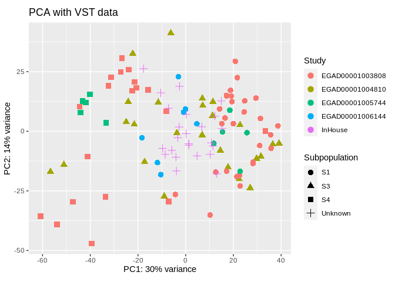<!-- -->

Next step is to look at batch correction.

#### Method 1: Limma’s remove batch effect function

``` r
library(limma)
```

``` r
vsd_remove_batch_intercept <- vsd
vsd_remove_batch_tumor_juxta_subpopulation <- vsd
vsd_remove_batch_tumor_juxta_only <- vsd
```

``` r
mat <- assay(vsd_remove_batch_intercept)
# only intercept term in model matrix, don't include Subpopulation or Tumor_JuxtaTumor
mm <- model.matrix(~1, colData(vsd_remove_batch_intercept))
# remove study batch effect
mat <- limma::removeBatchEffect(mat, batch = vsd_remove_batch_intercept$Study, design = mm)
assay(vsd_remove_batch_intercept) <- mat
pca_batch_correct_intercept <- plotPCA(vsd, intgroup = c("Subpopulation","Study")) + 
  aes(x = PC1, y = PC2, color = colData(vsd_remove_batch_intercept)$Subpopulation, shape =colData(vsd_remove_batch_intercept)$Study ) +
  labs(color='Subpopulation', shape = "Study") +
  ggtitle("PCA of VST data batch corrected using \nlimma::removeBatchEffect with intercept term only")
pca_batch_correct_intercept
```

<!-- -->

``` r
# find euclidean distance between samples for heatmap generation (normalised data)
# same template as previous heatmap
sampleDists <- dist(t(assay(vsd_remove_batch_intercept)))
sampleDistMatrix <- as.matrix( sampleDists )

pheatmap(mat=sampleDistMatrix,
         show_rownames = FALSE,
         cluster_cols = TRUE,
         cluster_rows = TRUE,
         show_colnames = FALSE,
         annotation_col = subset_coldata,
         annotation_colors = ann_colors,
         clustering_distance_rows=sampleDists,
         clustering_distance_cols=sampleDists,
         col=colorRampPalette( rev(brewer.pal(9, "Blues")) )(255))
```

<!-- -->

Limma’s removeBatchEffect function requires a design matrix as input,
this is the “treatment conditions” we wish to preserve. It is usually
the design matrix with all experimental factors other than batch
effects. The ideal scenario would be to include Subpopulation in this
matrix. However, this treats `Unknown` as its own Subpopulation, and so
will preserve differences between the InHouse samples and the other
samples, as seen in the below PCA plot. This is contrary to what we want
when assigning our samples to a cluster.

``` r
mat <- assay(vsd_remove_batch_tumor_juxta_subpopulation)
# create model matrix, full model matrix with Tumor_JuxtaTumor and Subpopulation
mm <- model.matrix(~Tumor_JuxtaTumor+Subpopulation, colData(vsd_remove_batch_tumor_juxta_subpopulation))
mat <- limma::removeBatchEffect(mat, batch = vsd_remove_batch_tumor_juxta_subpopulation$Study, design = mm)
```

    ## Coefficients not estimable: batch2 batch4

    ## Warning: Partial NA coefficients for 17763 probe(s)

``` r
assay(vsd_remove_batch_tumor_juxta_subpopulation) <- mat

pca_batch_correct_tumor_juxta_subpopulation <- plotPCA(vsd_remove_batch_tumor_juxta_subpopulation, intgroup = c("Subpopulation","Study")) + 
  aes(x = PC1, y = PC2, color = colData(vsd_remove_batch_tumor_juxta_subpopulation)$Subpopulation, 
      shape =colData(vsd_remove_batch_tumor_juxta_subpopulation)$Study ) +
  labs(color='Subpopulation', shape = "Study") +
  ggtitle("PCA of VST data batch corrected using \nlimma::removeBatchEffect with Tumor_JuxtaTumor\nand Subpopulation in model")
pca_batch_correct_tumor_juxta_subpopulation
```

<!-- -->

``` r
# find euclidean distance between samples for heatmap generation (normalised data)
# same template as previous heatmap

sampleDists <- dist(t(assay(vsd_remove_batch_tumor_juxta_subpopulation)))
sampleDistMatrix <- as.matrix( sampleDists )

pheatmap(mat=sampleDistMatrix,
         show_rownames = FALSE,
         cluster_cols = TRUE,
         cluster_rows = TRUE,
         show_colnames = FALSE,
         annotation_col = subset_coldata,
         annotation_colors = ann_colors,
         clustering_distance_rows=sampleDists,
         clustering_distance_cols=sampleDists,
         col=colorRampPalette( rev(brewer.pal(9, "Blues")) )(255))
```

<!-- -->

We can see from the PCA and heatmap above that including condition
(tumour-juxtatumour) and Subpopulation in our model matrix leads to good
separation of the Subpopulations, and a lack of clustering by batch. The
problem with this approach is that it treats our `Unknown` Subpopulation
as its own Subpopulation, which means it will cluster on its own no
matter what we do. Is there a way around this? Frozen surrogate variable
analysis could be an option, but this is usually used on microarray
data, I don’t know if it can be used on RNA-sequencing data.

``` r
mat <- assay(vsd)
mm <- model.matrix(~Tumor_JuxtaTumor, colData(vsd))
mat_batch_removed_limma <- limma::removeBatchEffect(mat, batch = vsd$Study, design = mm)
```

In the PCA plot above, we have not told the `removeBatchEffect` function
about our known Subpopulation, only whether the samples were taken from
Tumor or Juxta-Tumor. It does not know to preserve differences between
subpopulations when removing batch effects. Less variance being
explained by PC1 than in the first scenario (39% vs 68%). In the first
PCA plot, our in-house samples of unknown subpopulation cluster together
on their own.

``` r
#mat <- assay(vsd)
#modmatrix <- model.matrix(~as.factor(Tumor_JuxtaTumor), colData(vsd))
#batchQC(mat, batch=coldata$Study, condition= coldata$Subpopulation, 
      #  report_file = "batchqc_caf_data_not_corrected.html",
       # report_dir = ".", view_report = FALSE, interactive = FALSE
      #  )
```

``` r
coldata_pca <- coldata
rownames(coldata_pca) <- coldata_pca$names
coldata_pca$names <- NULL
coldata_pca$files <- NULL
p <- pca(mat, metadata = coldata_pca)
```

``` r
ggplot(p$rotated, aes(x = PC1, y = PC2, color = p$metadata$Study, shape = p$metadata$Subpopulation)) +
  geom_point(size =3) +
  xlab(paste0("PC1: ", percentVar[1], "% variance")) +
  ylab(paste0("PC2: ", percentVar[2], "% variance")) +
  coord_fixed() +
  labs(color='Study', shape = "Subpopulation") +
  ggtitle("PCA with transormed data after batch correction")
```

<!-- -->

``` r
batch <- coldata$Study
mm <- model.matrix(~Tumor_JuxtaTumor, colData(vsd))
```

# Predicting subpopulation(s) present in In-House samples

## Assigning in-house samples to a CAF Subpopulation using K-nearest neighbours

1.  Split mat into our known (training) and unknown (testing)
    subpopulations
2.  Run KNN

``` r
mat_t <- t(mat)
mat_known <- mat_t[coldata$names[which(coldata$Subpopulation != "Unknown")],]
coldata_known <- coldata[coldata$Subpopulation != "Unknown",]
mat_unknown <- mat_t[coldata$names[which(coldata$Subpopulation == "Unknown")],]
coldata_unknown <- coldata[coldata$Subpopulation == "Unknown",]
```

``` r
library(class)
```

``` r
##create a random number equal 90% of total number of rows
 ran <- sample(1:nrow(mat_known),0.9 * nrow(mat_known))
 ##training dataset extracted
 mat_train <- mat_known[ran,]
 
 ##test dataset extracted
 mat_test <- mat_known[-ran,]
```

``` r
# these are our labels
caf_target_category <- coldata_known[ran,4]
caf_test_category <- coldata_known[-ran,4]
```

``` r
pr <- knn(mat_train,mat_test,cl=caf_target_category,k=21)
```

``` r
 tab <- table(pr,caf_test_category)
tab
```

    ##     caf_test_category
    ## pr   S1 S3 S4
    ##   S1  6  1  0
    ##   S3  0  0  0
    ##   S4  0  0  2

``` r
accuracy <- function(x){sum(diag(x)/(sum(rowSums(x)))) * 100}
 accuracy(tab)
```

    ## [1] 88.88889

``` r
  outputs <- c()
for (i in 1:50){
  pr <- knn(mat_train,mat_test,cl=caf_target_category,k=i)
  number <- i
  tab <- table(pr,caf_test_category)
  accuracy_out <- accuracy(tab)
  outputs <- c(outputs, number = accuracy_out)
}
```

``` r
plot(outputs)
```

<!-- -->

``` r
  prediction <- knn(mat_train,mat_unknown,cl=caf_target_category,k=13)
names(prediction) <- rownames(mat_unknown)
prediction
```

    ## 4033 4034 4027 4028 4112 4113 4116 4117 4214 4215 4315 4316 4340 4341 4344 4345 
    ##   S1   S1   S1   S1   S1   S1   S1   S1   S1   S1   S1   S1   S1   S1   S1   S1 
    ## 3532 3533 3536 3537 4299 4300 4722 4723 
    ##   S1   S1   S1   S1   S1   S1   S4   S1 
    ## Levels: S1 S3 S4

They are all predicted to be S1 using this initial application of the
algorithm except one sample. Possibly use interquartile range to improve
performance?

## Deconvolution using CIBERSORTx

CIBERSORTx (Newman et al. 2019) is the most commonly used tool for
cell-type deconvolution. It is a machine learning method which carries
out batch correction, correcting for between-platform differences in
expression data. In this case, the signature matrix was made using all
of the available CAF subpopulation data (40 S1 samples, 25 S3 samples,
24 S4 samples). It is possible to infer the proportions of the different
subpopulations as well as a subpopulation-specific gene expression
matrix for each sample. Either scRNA-seq, bulk RNA-seq or microarray
data can be used as the reference.

- Create signature matrix for CIBERSORTx
- TPM normalise data,probably optional
- Run CIBERSORTx to figure out proportions of S1, S3 and S4 in In-house
  samples

The files for CIBERSORT (mixture file, reference data and phenotype
classes file), were prepared using the `cibersortx_prepare_files.R`
script.

`CIBERSORTx` was run using the following command:

    docker run -v /home/kevin/Documents/PhD/cibersort/caf_subpopulation/infiles:/src/data -v /home/kevin/Documents/PhD/cibersort/caf_subpopulation/outfiles:/src/outdir cibersortx/fractions --username k.ryan45@nuigalway.ie --token b7f03b943ade9b4146dc2126b4ac9d19 --single_cell FALSE --refsample caf_subtypes_tpm_for_sig_matrix.txt --mixture caf_tpm_mixture.txt --rmbatchBmode TRUE --outdir /home/kevin/Documents/PhD/cibersort/caf_subpopulation/outfiles --phenoclasses /home/kevin/Documents/PhD/cibersort/caf_subpopulation/infiles/phenoclasses_caf.txt

``` r
cibersort_results <- read.table("/home/kevin/Documents/PhD/cibersort/caf_subpopulation/outfiles/CIBERSORTx_Adjusted.txt", header = T)
cibersort_results
```

    ##    Mixture        S1 S3          S4 P.value Correlation      RMSE
    ## 1     4033 0.9570748  0 0.042925205       0   0.7870899 0.6807551
    ## 2     4034 1.0000000  0 0.000000000       0   0.8141137 0.6547153
    ## 3     4027 0.8987753  0 0.101224730       0   0.7687020 0.6886350
    ## 4     4028 1.0000000  0 0.000000000       0   0.7829962 0.7051913
    ## 5     4112 0.9903751  0 0.009624853       0   0.8377707 0.6094339
    ## 6     4113 1.0000000  0 0.000000000       0   0.8770761 0.5382961
    ## 7     4116 0.9926897  0 0.007310301       0   0.8019636 0.6716308
    ## 8     4117 1.0000000  0 0.000000000       0   0.8311613 0.6253372
    ## 9     4214 0.9889958  0 0.011004172       0   0.8361520 0.6117524
    ## 10    4215 1.0000000  0 0.000000000       0   0.8465000 0.5976711
    ## 11    4315 0.9728492  0 0.027150776       0   0.8048235 0.6586261
    ## 12    4316 1.0000000  0 0.000000000       0   0.8602991 0.5716391
    ## 13    4340 0.9787148  0 0.021285151       0   0.8009182 0.6673828
    ## 14    4341 0.9954915  0 0.004508522       0   0.8119521 0.6563516
    ## 15    4344 0.9902103  0 0.009789743       0   0.7950935 0.6816636
    ## 16    4345 0.9916468  0 0.008353235       0   0.7649171 0.7291115
    ## 17    3532 0.9833313  0 0.016668715       0   0.7842058 0.6959260
    ## 18    3533 1.0000000  0 0.000000000       0   0.8140856 0.6547627
    ## 19    3536 0.9775435  0 0.022456479       0   0.7423141 0.7559936
    ## 20    3537 1.0000000  0 0.000000000       0   0.7578456 0.7434883
    ## 21    4299 0.9721026  0 0.027897353       0   0.8134793 0.6440161
    ## 22    4300 1.0000000  0 0.000000000       0   0.8306485 0.6262410
    ## 23    4722 0.7708237  0 0.229176322       0   0.8034468 0.6101486
    ## 24    4723 0.9723284  0 0.027671590       0   0.7822037 0.6944232

Results look strange with P-value of 9999. CIBERSORTx was run using the
Docker image and using the GUI, and different results were obtained.
When the Docker image was used and the number of permutations was
changed from 0 to 100, the p-value changed to 0.000. The proportions
look different between the two methods, with the GUI predicting about
0.75 S1 with the rest being S4 for most samples.

## References

<div id="refs" class="references csl-bib-body hanging-indent">

<div id="ref-Li2022" class="csl-entry">

Li, Yumei, Xinzhou Ge, Fanglue Peng, Wei Li, and Jingyi Jessica Li.
2022. “<span class="nocase">Exaggerated false positives by popular
differential expression methods when analyzing human population
samples</span>.” *Genome Biology* 23 (1): 1–13.
<https://doi.org/10.1186/S13059-022-02648-4/FIGURES/2>.

</div>

<div id="ref-Newman2019" class="csl-entry">

Newman, Aaron M., Chloé B. Steen, Chih Long Liu, Andrew J. Gentles,
Aadel A. Chaudhuri, Florian Scherer, Michael S. Khodadoust, et al. 2019.
“<span class="nocase">Determining cell type abundance and expression
from bulk tissues with digital cytometry</span>.” *Nature Biotechnology
2019 37:7* 37 (7): 773–82. <https://doi.org/10.1038/s41587-019-0114-2>.

</div>

<div id="ref-Pelon2020" class="csl-entry">

Pelon, Floriane, Brigitte Bourachot, Yann Kieffer, Ilaria Magagna, Fanny
Mermet-Meillon, Isabelle Bonnet, Ana Costa, et al. 2020. “<span
class="nocase">Cancer-associated fibroblast heterogeneity in axillary
lymph nodes drives metastases in breast cancer through complementary
mechanisms</span>.” *Nature Communications 2020 11:1* 11 (1): 1–20.
<https://doi.org/10.1038/s41467-019-14134-w>.

</div>

<div id="ref-Zhao2020" class="csl-entry">

Zhao, Shanrong, Zhan Ye, and Robert Stanton. 2020. “<span
class="nocase">Misuse of RPKM or TPM normalization when comparing across
samples and sequencing protocols</span>.” *RNA* 26 (8): 903.
<https://doi.org/10.1261/RNA.074922.120>.

</div>

</div>
