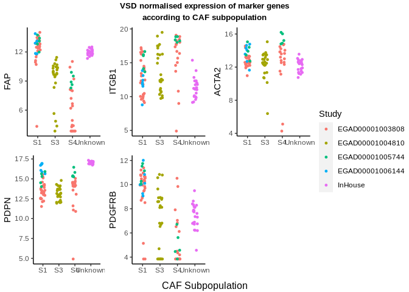
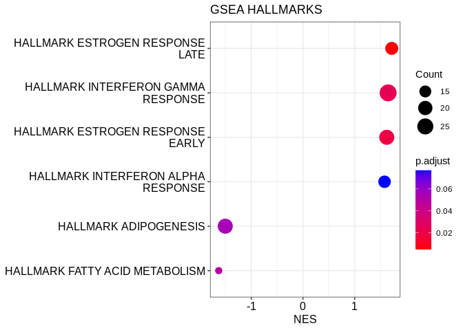
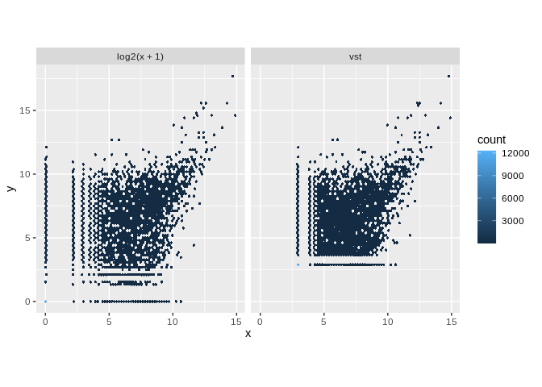

CAF subtype analysis
================
Kevin Ryan
2022-07-22 16:02:54

-   <a href="#introduction" id="toc-introduction">Introduction</a>
    -   <a href="#preparation" id="toc-preparation">Preparation</a>
        -   <a href="#create-sample-file" id="toc-create-sample-file">Create Sample
            File</a>
        -   <a href="#read-in-data-with-tximeta-and-create-deseq-object"
            id="toc-read-in-data-with-tximeta-and-create-deseq-object">Read in data
            with tximeta and create DESeq object</a>
        -   <a
            href="#differentially-expressed-genes-caf-vs-tan-tumor-vs-juxta-tumor"
            id="toc-differentially-expressed-genes-caf-vs-tan-tumor-vs-juxta-tumor">Differentially
            Expressed Genes CAF vs TAN (Tumor vs Juxta-Tumor)</a>
        -   <a href="#enrichment-plots" id="toc-enrichment-plots">Enrichment
            plots</a>
        -   <a href="#dot-plot" id="toc-dot-plot">Dot Plot</a>
        -   <a href="#enrichment-plots-1" id="toc-enrichment-plots-1">Enrichment
            Plots</a>
        -   <a href="#qc---pca-per-study-for-outlier-detection"
            id="toc-qc---pca-per-study-for-outlier-detection">QC - PCA per study for
            outlier detection</a>
        -   <a href="#batch-correction" id="toc-batch-correction">Batch
            correction</a>
    -   <a href="#clinical-correlations" id="toc-clinical-correlations">Clinical
        Correlations</a>
-   <a href="#predicting-subpopulations-present-in-in-house-samples"
    id="toc-predicting-subpopulations-present-in-in-house-samples">Predicting
    subpopulation(s) present in In-House samples</a>
    -   <a
        href="#assigning-in-house-samples-to-a-caf-subtype-using-k-nearest-neighbours"
        id="toc-assigning-in-house-samples-to-a-caf-subtype-using-k-nearest-neighbours">Assigning
        in-house samples to a CAF subtype using K-nearest neighbours</a>
    -   <a href="#deconvolution-using-cibersortx"
        id="toc-deconvolution-using-cibersortx">Deconvolution using
        CIBERSORTx</a>
    -   <a href="#references" id="toc-references">References</a>

# Introduction

Cancer-associated fibroblasts (CAFs) are a heterogeneous cell type found
in the tumour microenvironment. They have a wide array of functions, and
tend to be immunosuppressive and cancer-promoting. There have been many
attempts to characterise subpopulations of CAFs, with much
transcriptomic analysis being carried out in the Mechta-Grigoriou lab in
Institut Curie. They have identified 4 ‘subpopulations’ which can be
separated based on the expression of different markers:

-   S1: FAP<sup>High</sup>, CD29<sup>Med-High</sup>,
    α<sup>SMAHigh</sup>, PDPN<sup>High</sup>, PDGFRβ<sup>High</sup>
-   S2: FAP<sup>Neg</sup>, CD29<sup>Low</sup>, αSMANeg-<sup>Low</sup>,
    PDPN<sup>Low</sup>, PDGFRβ<sup>Low</sup>
-   S3: FAP<sup>Neg-Low</sup>, CD29<sup>Med</sup>,
    αSMA<sup>Neg-Low</sup>, PDPN<sup>Low</sup>, PDGFRβ<sup>Low-Med</sup>
-   S4: FAP<sup>Low-Med</sup>, CD29<sup>High</sup>, αSMA<sup>High</sup>,
    PDPN<sup>Low</sup>, PDGFRβ<sup>Med</sup>

(Pelon et al. 2020)

FACS gating strategies can be used to isolate these various
subpopulations. The Mechta-Grigoriou group have done this and have
generated bulk RNA-sequencing data for the S1, S3 and S4 subpopulations.
They generated scRNA-sequencing data for the S1 subpopulation. This data
was deposited on the European Genome Phenome Archive, and was accessed
via a Data Transfer Agreement.

The following summarises the data obtained:

<table>
<colgroup>
<col style="width: 18%" />
<col style="width: 18%" />
<col style="width: 27%" />
<col style="width: 36%" />
</colgroup>
<thead>
<tr class="header">
<th>Subpopulation</th>
<th>Total samples</th>
<th>Studies (Samples)</th>
<th>Notes</th>
</tr>
</thead>
<tbody>
<tr class="odd">
<td>S1</td>
<td>28</td>
<td><ul>
<li>EGAD00001003808 (16)</li>
<li>EGAD00001005744 (5)</li>
<li>EGAD00001006144 (7)</li>
</ul></td>
<td><ul>
<li>3808 has 12xJuxta-tumor</li>
<li>5744 5 samples from LN</li>
<li>Sorting vs spreading</li>
</ul></td>
</tr>
<tr class="even">
<td>S2</td>
<td>0</td>
<td>N/A</td>
<td>N/A</td>
</tr>
<tr class="odd">
<td>S3</td>
<td>14</td>
<td><ul>
<li>EGAD00001004810 (14)</li>
</ul></td>
<td><ul>
<li>4810 has 11xJuxta-tumor</li>
<li>Ovarian</li>
</ul></td>
</tr>
<tr class="even">
<td>S4</td>
<td>15</td>
<td><ul>
<li>EGAD00001003808 (10)</li>
<li>EGAD00001005744 (5)</li>
</ul></td>
<td><ul>
<li>3808 has 9xJuxta-tumor</li>
<li>5744 5 samples from LN</li>
</ul></td>
</tr>
</tbody>
</table>

With the juxta-tumour data, they got tumour and juxta-tumour data from
the same patient. However, I have not been able to figure out whether
they came from the same patient. Could probably use Optitype to
determine HLA allele - match tumour and juxta tumour.

We also have scRNA-seq data for S1.

It is likely that sorting the cells using FACS alters the
transcriptional properties of the cells compared to if they are
separated using spreading approches, as is seen in study
`EGAD00001006144`. This is something that we will have to keep in mind.

The data was processed using nf-core/rnaseq version `3.8.1` using the
default parameters. STAR/Salmon were used for alignment/quantification.

We would expect our tumour-associated normal to be most like the S3
subtype (usually accumulate in juxta-tumours).

Combining RNA-sequencing datasets from different studies can be very
challenging. We can expect batch effects to be present, so it might be
possible to determine whether differences be observe are due to actual
biological effects or technical artifacts. In addition, a recent study
suggests that DESeq2 and edgeR (the most popular differential expression
tools) experience large rates of false positives when used with large
sample sizes (Li et al. 2022). One of the datasets (`EGAD00001006144`)
was produced using stranded RNA-seq, whereas the other datasets were
unstranded. This can lead to a lack of comparability of the datasets
(Zhao, Ye, and Stanton 2020). It may be necessary to drop this dataset
from the analysis. All samples were prepared by poly(A) selection (use
of oligo-dT).

## Preparation

### Create Sample File

Columns will be: Sample, Study, CAF_subtype, Tumor_Juxtatumor

*Here we will be combining data from 5 studies. To begin with, we will
only include the metadata available for all studies (except for our
unknown CAF subtype label). Breast cancer subtype is only available for
certain studies and so is not included at this stage.*

There are also: ovarian cancer samples, EPCAM+ cells, samples prepared
by spreading or spreading and samples from lymph nodes. For the time
being, I will not consider them.

``` r
EGAD_4810 <- read.table("/home/kevin/Documents/PhD/CAF_data/EGAD00001004810/delimited_maps/Run_Sample_meta_info.map", 
                        sep = ";")
EGAD_4810_cancers <- str_split_fixed(EGAD_4810$V1, pattern = "=", n = 2)[,2]
EGAD_4810_keep <- which(EGAD_4810_cancers == "BC")
EGAD_4810_filtered <- EGAD_4810[EGAD_4810_keep,]
EGAD_4810_meta <- data.frame(
  Sample = str_split_fixed(EGAD_4810_filtered$V4, pattern = "=", n = 2)[,2],
  Study = "EGAD00001004810",
  Subtype = "S3",
  Tumor_JuxtaTumor = tolower(str_split_fixed(EGAD_4810_filtered$V3, pattern = " ", n = 2)[,2]),
  directory = "/home/kevin/Documents/PhD/CAF_data/nfcore_results/EGAD00001004810_nfcore_results/star_salmon",
  row.names = 1
)
EGAD_3808 <- read.table("/home/kevin/Documents/PhD/CAF_data/EGAD00001003808/meta_CAF-S1_S4_BC_47samples.txt", 
                        header = T, sep = "\t")
EGAD_3808_meta <- data.frame(
  Sample = EGAD_3808$Sample.Name,
  Study = "EGAD00001003808",
  Subtype = EGAD_3808$subset,
  Tumor_JuxtaTumor = EGAD_3808$Type, 
    directory = "/home/kevin/Documents/PhD/CAF_data/nfcore_results/EGAD00001003808_nfcore_results/star_salmon",
  row.names = 1
)
EGAD_6144 <- read.table("/home/kevin/Documents/PhD/CAF_data/EGAD00001006144/meta_7samples.txt", 
                        header = T,sep = "\t")
EGAD_6144_meta <- data.frame(
  Sample = paste("CAF_Culture_", EGAD_6144$Sample.Name, sep = ""),
  Study = "EGAD00001006144",
  Subtype = "S1",
  Tumor_JuxtaTumor = "tumor",
    directory = "/home/kevin/Documents/PhD/CAF_data/nfcore_results/EGAD00001006144_nfcore_results/star_salmon",
  row.names = 1
)
EGAD_5744 <- read.table("/home/kevin/Documents/PhD/CAF_data/EGAD00001005744/metaData_Pelon_et_al.txt", 
                        header =T, check.names = F)
EGAD_5744$Sample.Name <- gsub(pattern = "\\.", replacement = "-", x = EGAD_5744$Sample.Name )
EGAD_5744_filtered <- EGAD_5744[!(EGAD_5744$subset == "EPCAM+") & (EGAD_5744$Type == "T"),]
EGAD_5744_meta <- data.frame(
  Sample = EGAD_5744_filtered$Sample.Name,
  Study = "EGAD00001005744",
  Subtype = EGAD_5744_filtered$subset,
  Tumor_JuxtaTumor = "tumor",
    directory = "/home/kevin/Documents/PhD/CAF_data/nfcore_results/EGAD00001005744_nfcore_results/star_salmon",
  row.names = 1
)
barkley_samples <- read.csv("/home/kevin/Documents/PhD/rna_seq_bc/metadata/reformat_samples.csv", 
                            header = T, row.names = "samples", check.names = F)
barkley_samples_meta <- data.frame(
  Sample = row.names(barkley_samples),
   Study = "InHouse",
  Subtype = "Unknown",
  Tumor_JuxtaTumor = ifelse(barkley_samples$Condition == "Tumour", "tumor", "juxtatumor"),
  directory = "/home/kevin/Documents/PhD/CAF_data/nfcore_results/inhouse_data_nfcore_results_version_3_8_1/star_salmon",
  row.names = 1
)
metadata <- rbind.data.frame(EGAD_4810_meta, EGAD_3808_meta, 
                             EGAD_6144_meta, EGAD_5744_meta, barkley_samples_meta)
metadata$Tumor_JuxtaTumor <- gsub(x = metadata$Tumor_JuxtaTumor, pattern = "-", replacement = "")
metadata[1:5,]
```

    ##                  Study Subtype Tumor_JuxtaTumor
    ## B73T39 EGAD00001004810      S3            tumor
    ## B86T3  EGAD00001004810      S3            tumor
    ## B86T7  EGAD00001004810      S3       juxtatumor
    ## B86T10 EGAD00001004810      S3            tumor
    ## B86T13 EGAD00001004810      S3       juxtatumor
    ##                                                                                           directory
    ## B73T39 /home/kevin/Documents/PhD/CAF_data/nfcore_results/EGAD00001004810_nfcore_results/star_salmon
    ## B86T3  /home/kevin/Documents/PhD/CAF_data/nfcore_results/EGAD00001004810_nfcore_results/star_salmon
    ## B86T7  /home/kevin/Documents/PhD/CAF_data/nfcore_results/EGAD00001004810_nfcore_results/star_salmon
    ## B86T10 /home/kevin/Documents/PhD/CAF_data/nfcore_results/EGAD00001004810_nfcore_results/star_salmon
    ## B86T13 /home/kevin/Documents/PhD/CAF_data/nfcore_results/EGAD00001004810_nfcore_results/star_salmon

``` r
write.table(metadata, file = "/home/kevin/Documents/PhD/subtypes/caf-subtype-analysis/metadata_caf_subtypes.txt", quote = F, sep = "\t", row.names = T)
metadata_no_inhouse <- rbind.data.frame(EGAD_4810_meta, EGAD_3808_meta, 
                             EGAD_6144_meta, EGAD_5744_meta)
metadata_no_inhouse$Tumor_JuxtaTumor <- gsub(x = metadata_no_inhouse$Tumor_JuxtaTumor, pattern = "-", replacement = "")
```

### Read in data with tximeta and create DESeq object

Samples were processed with nf-core/rnaseq version `3.8.1` Read in
samples with tximport, deseqdataobject etc

``` r
files <- file.path(metadata$directory, rownames(metadata), "quant.sf")
coldata <- data.frame(files, names=rownames(metadata), Study = metadata$Study, 
                      Subtype = metadata$Subtype, 
                      Tumor_JuxtaTumor = metadata$Tumor_JuxtaTumor,
                      stringsAsFactors=FALSE)
# tx2gene file for the gencode v31 file used in the analysis
tx2gene <- read_tsv("/home/kevin/Documents/PhD/references/tx2gene_gencode_v31.txt")
```

    ## Rows: 226882 Columns: 2
    ## ── Column specification ────────────────────────────────────────────────────────
    ## Delimiter: "\t"
    ## chr (2): TXNAME, GENEID
    ## 
    ## ℹ Use `spec()` to retrieve the full column specification for this data.
    ## ℹ Specify the column types or set `show_col_types = FALSE` to quiet this message.

``` r
se <- tximeta(coldata, skipMeta=TRUE, txOut=FALSE, tx2gene=tx2gene)
```

    ## reading in files with read_tsv
    ## 1 2 3 4 5 6 7 8 9 10 11 12 13 14 15 16 17 18 19 20 21 22 23 24 25 26 27 28 29 30 31 32 33 34 35 36 37 38 39 40 41 42 43 44 45 46 47 48 49 50 51 52 53 54 55 56 57 58 59 60 61 62 63 64 65 66 67 68 69 70 71 72 73 74 75 76 77 78 79 80 81 82 83 84 85 86 87 88 89 90 91 92 93 94 95 96 97 98 99 100 101 102 103 104 105 106 107 108 109 110 111 112 113 
    ## summarizing abundance
    ## summarizing counts
    ## summarizing length

``` r
files_no_inhouse <- file.path(metadata_no_inhouse$directory, rownames(metadata_no_inhouse), "quant.sf")
coldata_no_inhouse <- data.frame(files = files_no_inhouse, names=rownames(metadata_no_inhouse), Study = metadata_no_inhouse$Study, 
                      Subtype = metadata_no_inhouse$Subtype, 
                      Tumor_JuxtaTumor = metadata_no_inhouse$Tumor_JuxtaTumor,
                      stringsAsFactors=FALSE)
# tx2gene file for the gencode v31 file used in the analysis
#tx2gene <- read_tsv("/home/kevin/Documents/PhD/references/tx2gene_gencode_v31.txt")
se_no_inhouse <- tximeta(coldata = coldata_no_inhouse, skipMeta=TRUE, txOut=FALSE, tx2gene=tx2gene)
```

    ## reading in files with read_tsv

    ## 1 2 3 4 5 6 7 8 9 10 11 12 13 14 15 16 17 18 19 20 21 22 23 24 25 26 27 28 29 30 31 32 33 34 35 36 37 38 39 40 41 42 43 44 45 46 47 48 49 50 51 52 53 54 55 56 57 58 59 60 61 62 63 64 65 66 67 68 69 70 71 72 73 74 75 76 77 78 79 80 81 82 83 84 85 86 87 88 89 
    ## summarizing abundance
    ## summarizing counts
    ## summarizing length

``` r
# do no design for the time being, Subtype + Batch gives error - model matrix not full rank
# this function stores input values, intermediate calculations and results of DE analysis - makes counts non-negative integers
dds_no_inhouse <- DESeqDataSet(se_no_inhouse, design = ~1)
```

    ## using counts and average transcript lengths from tximeta

``` r
# returns a vector of whether the total count of each gene is >= 10 (True or false)
keep <- rowSums(counts(dds_no_inhouse)) >= 10
# only keep rows (genes) for which keep is TRUE
dds_no_inhouse <- dds_no_inhouse[keep,]
# at least X samples with a count of 10 or more, where X can be chosen as the sample size of the smallest group of samples
X <- 7
keep <- rowSums(counts(dds_no_inhouse) >= 10) >= X
dds_no_inhouse <- dds_no_inhouse[keep,]
dds_no_inhouse_copy <- dds_no_inhouse
ntd <- normTransform(dds_no_inhouse)
```

    ## using 'avgTxLength' from assays(dds), correcting for library size

``` r
# do no design for the time being, Subtype + Batch gives error - model matrix not full rank
# this function stores input values, intermediate calculations and results of DE analysis - makes counts non-negative integers
dds <- DESeqDataSet(se, design = ~1)
```

    ## using counts and average transcript lengths from tximeta

``` r
# returns a vector of whether the total count of each gene is >= 10 (True or false)
keep <- rowSums(counts(dds)) >= 10
# only keep rows (genes) for which keep is TRUE
dds <- dds[keep,]
# at least X samples with a count of 10 or more, where X can be chosen as the sample size of the smallest group of samples
X <- 7
keep <- rowSums(counts(dds) >= 10) >= X
dds <- dds[keep,]
ntd <- normTransform(dds)
```

    ## using 'avgTxLength' from assays(dds), correcting for library size

``` r
suppressPackageStartupMessages(library(sva))
dds_no_inhouse <- DESeq(dds_no_inhouse)
```

    ## Warning in DESeq(dds_no_inhouse): the design is ~ 1 (just an intercept). is this
    ## intended?

    ## estimating size factors

    ## using 'avgTxLength' from assays(dds), correcting for library size

    ## estimating dispersions

    ## gene-wise dispersion estimates

    ## mean-dispersion relationship

    ## final dispersion estimates

    ## fitting model and testing

    ## -- replacing outliers and refitting for 6625 genes
    ## -- DESeq argument 'minReplicatesForReplace' = 7 
    ## -- original counts are preserved in counts(dds)

    ## estimating dispersions

    ## fitting model and testing

``` r
dat  <- counts(dds_no_inhouse, normalized = TRUE)
idx  <- rowMeans(dat) > 1
dat  <- dat[idx, ]
# we have subtype and tumour-juxtatomour in the model matrix
mod  <- model.matrix(~ Subtype + Tumor_JuxtaTumor, colData(dds_no_inhouse))
mod0 <- model.matrix(~   1, colData(dds_no_inhouse))
svseq <- svaseq(dat, mod, mod0, n.sv = 4)
```

    ## Number of significant surrogate variables is:  4 
    ## Iteration (out of 5 ):1  2  3  4  5

``` r
#svseq$sv
par(mfrow = c(4, 1), mar = c(3,5,3,1))
for (i in 1:4) {
  stripchart(svseq$sv[, i] ~ dds_no_inhouse$Study, vertical = TRUE, main = paste0("SV", i))
  abline(h = 0)
 }
```

<!-- -->

``` r
dds_no_inhouse$SV1 <- as.factor(svseq$sv[,1])
dds_no_inhouse$SV2 <- as.factor(svseq$sv[,2])
dds_no_inhouse$SV3 <- as.factor(svseq$sv[,3])
dds_no_inhouse$SV4 <- as.factor(svseq$sv[,4])
dds_no_inhouse$Subtype <- as.factor(dds_no_inhouse$Subtype)
dds_no_inhouse$Tumor_JuxtaTumor <- as.factor(dds_no_inhouse$Tumor_JuxtaTumor)
design(dds_no_inhouse) <- ~ 1
```

``` r
dds_no_inhouse_deseq <- DESeq(dds_no_inhouse)
```

    ## Warning in DESeq(dds_no_inhouse): the design is ~ 1 (just an intercept). is this
    ## intended?

    ## using pre-existing normalization factors

    ## estimating dispersions

    ## found already estimated dispersions, replacing these

    ## gene-wise dispersion estimates

    ## mean-dispersion relationship

    ## final dispersion estimates

    ## fitting model and testing

    ## -- replacing outliers and refitting for 6625 genes
    ## -- DESeq argument 'minReplicatesForReplace' = 7 
    ## -- original counts are preserved in counts(dds)

    ## estimating dispersions

    ## fitting model and testing

``` r
metadata_subtype_study <- data.frame(metadata$Study, metadata$Subtype)
```

``` r
dds <- DESeq(dds)
```

    ## Warning in DESeq(dds): the design is ~ 1 (just an intercept). is this intended?

    ## estimating size factors

    ## using 'avgTxLength' from assays(dds), correcting for library size

    ## estimating dispersions

    ## gene-wise dispersion estimates

    ## mean-dispersion relationship

    ## final dispersion estimates

    ## fitting model and testing

    ## -- replacing outliers and refitting for 6253 genes
    ## -- DESeq argument 'minReplicatesForReplace' = 7 
    ## -- original counts are preserved in counts(dds)

    ## estimating dispersions

    ## fitting model and testing

``` r
mart <- useMart(biomart = "ensembl", dataset = "hsapiens_gene_ensembl", host="useast.ensembl.org")
```

    ## Warning: Ensembl will soon enforce the use of https.
    ## Ensure the 'host' argument includes "https://"

``` r
ensembl_ids <- rownames(assay(dds))
ensembl_ids <- str_split_fixed(ensembl_ids, pattern = "\\.", n = 2)[,1]
info <- getBM(attributes=c("hgnc_symbol", "ensembl_gene_id"),
                  filters = "ensembl_gene_id",
                  values = ensembl_ids,
                  mart = mart,
                  useCache=FALSE)

#rownames(info) <- info$hgnc_symbol
```

Source: GeneCards - ITGB1 (CD29) is an integrin, integrins are involved
in cell-cell and cell-ECM adhesion. It is expressed in 3 of the 4
subpopulations (not S2). - FAP is Fibroblast activation protein, a
serine proteinase, selectively expressed in reactive stromal fibroblasts
in epithelial cancers, expression should be highest in S1 population.
Roles include: tissue remodelling, fibrosis, wound healing. - α^SMA -
ACTA2, alpha smooth muscle actin is involved in cell motility,
structure, integrity and signalling. Its expression is highest in S1 and
S4 CAFs. - PDPN (podoplanin) increases cell motility. It should only be
expressed in S1 cells. - PDGFRβ (Platelet Derived Growth Factor Receptor
Beta) is a tyrosine kinase receptor for platelet-derived growth factors.
They stimulate mitosis of cells of mesenchymal origin. Expression should
be highest in S1, some expression in S3 and S4.

There are other possible genes which could be used to distinguish them
through manual curation: FSP1, CAV1, DPP4

``` r
# Function to take in dds object, ensembl - hgnc info and genes interest and output df for plotting
create_annotated_df_for_plotting <- function(dds, info, genes_interest){
  library(stringr)
  # put check for type of gene symbol in dds object, assuming ensembl gene version atm
  # assume info have column called hgnc_symbol
  info <- info[!duplicated(info$hgnc_symbol),]
  rownames(info) <- info$hgnc_symbol
  # assuming genes interest are in info, put in check for this to deal with missing gene symbol
  genes_interest_info <- info[genes_interest,] 
  # again, here assuming ENSG1234.1 etc
  ensembl_genes_dds <- str_split_fixed(rownames(assay(dds)), pattern = "\\.", n = 2)[,1]
  ids <- which(ensembl_genes_dds %in% genes_interest_info$ensembl_gene_id)
  dds_genes_interest <- dds[ids,]
  dds_genes_interest_exprs <- data.frame(assay(dds_genes_interest))
  metadata <- as.data.frame(colData(dds))
  colnames(dds_genes_interest_exprs) <- rownames(metadata)
  rownames(dds_genes_interest_exprs) <- genes_interest
  dds_genes_interest_exprs_t <- as.data.frame(t(dds_genes_interest_exprs))
  dds_genes_interest_exprs_t$Subpopulation <- metadata$Subtype
  dds_genes_interest_exprs_t$Study <- metadata$Study
  dds_genes_interest_exprs_t$Tumor_JuxtaTumor <- metadata$Tumor_JuxtaTumor
  return(dds_genes_interest_exprs_t)
}

caf_plot_tumour_juxtatumour <- function(annotated_df_for_plotting, gene_of_interest, label_yaxis = gene_of_interest){
  if (is.null(label_yaxis)){
    label_yaxis <- gene_of_interest
  }
  annotated_df_for_plotting$gene_of_interest <- annotated_df_for_plotting[, gene_of_interest]
  ggplot(annotated_df_for_plotting, aes(Subpopulation, gene_of_interest, colour = Tumor_JuxtaTumor)) +
  geom_point(size = 1,  # reduce point size to minimize overplotting 
    position = position_jitter(
      width = 0.15,  # amount of jitter in horizontal direction
      height = 0     # amount of jitter in vertical direction (0 = none)
    )
  ) +
  scale_y_continuous(gene_of_interest) +
  theme(panel.grid.major = element_blank(), panel.grid.minor = element_blank(),
panel.background = element_blank(), axis.line = element_line(colour = "black"), axis.title.x = element_blank())  +
    ylab(label_yaxis)  #, axis.title.x = element_blank())
}

caf_plot_study <- function(annotated_df_for_plotting, gene_of_interest, label_yaxis = gene_of_interest){
  if (is.null(label_yaxis)){
    label_yaxis <- gene_of_interest
  }
  annotated_df_for_plotting$gene_of_interest <- annotated_df_for_plotting[, gene_of_interest]
  ggplot(annotated_df_for_plotting, aes(Subpopulation, gene_of_interest, colour = Study)) +
  geom_point(size = 1,  # reduce point size to minimize overplotting 
    position = position_jitter(
      width = 0.15,  # amount of jitter in horizontal direction
      height = 0     # amount of jitter in vertical direction (0 = none)
    )
  ) +
  scale_y_continuous(gene_of_interest) +
  theme(panel.grid.major = element_blank(), panel.grid.minor = element_blank(),
panel.background = element_blank(), axis.line = element_line(colour = "black"), axis.title.x = element_blank()) +
    ylab(label_yaxis)#
}
```

``` r
library(ggpubr)
```

    ## 
    ## Attaching package: 'ggpubr'

    ## The following object is masked from 'package:cowplot':
    ## 
    ##     get_legend

``` r
vsd <- vst(dds, blind = FALSE)
genes_interest <- c("FAP", "ITGB1", "ACTA2", "PDPN", "PDGFRB")
dds_genes_interest_exprs_t <- create_annotated_df_for_plotting(vsd, info = info, genes_interest = genes_interest)
df_for_plotting <- create_annotated_df_for_plotting(dds = dds, info = info, genes_interest = genes_interest)
caf_plot_study(df_for_plotting, gene_of_interest = "FAP")
```

<!-- -->

``` r
caf_plot_tumour_juxtatumour(df_for_plotting, gene_of_interest = "FAP")
```

<!-- -->

``` r
plots_out_study <- lapply(FUN = caf_plot_study, X = genes_interest, annotated_df_for_plotting = df_for_plotting)
plots_out_subpop <- lapply(FUN = caf_plot_tumour_juxtatumour, X = genes_interest, annotated_df_for_plotting = df_for_plotting)
ggar_obj_study <- ggarrange(plotlist = plots_out_study, common.legend = TRUE) # rel_heights values control title margins
ggar_obj_subpop <- ggarrange(plotlist = plots_out_subpop, common.legend = TRUE) # rel_heights values control title margins
ggar_obj_study_annotated <- annotate_figure(ggar_obj_study, bottom = text_grob("CAF Subpopulation"))
ggar_obj_subpop_annotated <- annotate_figure(ggar_obj_subpop, bottom = text_grob("CAF Subpopulation"))
ggar_obj_study_annotated
```

<!-- -->

``` r
ggar_obj_subpop_annotated
```

<!-- -->

``` r
genes_interest <- c("CXCL12","TNFSF4","PDCD1LG2", "CD276", "NT5E", "DPP4", "CAV1", "ATL1")
df_for_plotting <- create_annotated_df_for_plotting(dds = dds, info = info, genes_interest = genes_interest)
plots_out_study <- lapply(FUN = caf_plot_study, X = genes_interest, annotated_df_for_plotting = df_for_plotting)
plots_out_subpop <- lapply(FUN = caf_plot_tumour_juxtatumour, X = genes_interest, annotated_df_for_plotting = df_for_plotting)
ggar_obj_study <- ggarrange(plotlist = plots_out_study, common.legend = TRUE) # rel_heights values control title margins
ggar_obj_subpop <- ggarrange(plotlist = plots_out_subpop, common.legend = TRUE) # rel_heights values control title margins
ggar_obj_study_annotated <- annotate_figure(ggar_obj_study, bottom = text_grob("CAF Subpopulation"))
ggar_obj_subpop_annotated <- annotate_figure(ggar_obj_subpop, bottom = text_grob("CAF Subpopulation"))
ggar_obj_study_annotated
```

<!-- -->

``` r
ggar_obj_subpop_annotated
```

<!-- -->

``` r
# plotting original counts here, transformation 
genes_interest <- c("PTPRC", "EPCAM", "PECAM1")
genes_interest_common_name <- c("CD45", "EPCAM", "CD31")
df_for_plotting <- create_annotated_df_for_plotting(dds = dds, info = info, genes_interest = genes_interest)
plots_out_study <- lapply(FUN = caf_plot_study, X = genes_interest, annotated_df_for_plotting = df_for_plotting, label_yaxis = genes_interest_common_name)
plots_out_subpop <- lapply(FUN = caf_plot_tumour_juxtatumour, X = genes_interest, annotated_df_for_plotting = df_for_plotting, label_yaxis = genes_interest_common_name)
ggar_obj_study <- ggarrange(plotlist = plots_out_study, common.legend = TRUE) # rel_heights values control title margins
ggar_obj_subpop <- ggarrange(plotlist = plots_out_subpop, common.legend = TRUE) # rel_heights values control title margins
ggar_obj_study_annotated <- annotate_figure(ggar_obj_study, bottom = text_grob("CAF Subpopulation"))
ggar_obj_subpop_annotated <- annotate_figure(ggar_obj_subpop, bottom = text_grob("CAF Subpopulation"))
ggar_obj_study_annotated
```

<!-- -->

``` r
ggar_obj_subpop_annotated
```

<!-- -->

The low to zero counts of these genes are what we would expect.

``` r
#fap_plot <- ggplot(dds_genes_interest_exprs_t, aes(x = Subpopulation, y = FAP, color = Tumor_JuxtaTumor, shape = Study)) +
 # geom_point(size = 0.75,  # reduce point size to minimize overplotting 
  #  position = position_jitter(
   #   width = 0.15,  # amount of jitter in horizontal direction
    #  height = 0     # amount of jitter in vertical direction (0 = none)
  #  )
#  ) +
#  theme(panel.grid.major = element_blank(), panel.grid.minor = element_blank(),
#panel.background = element_blank(), axis.line = element_line(colour = "black"))

itgb1_plot <- ggplot(dds_genes_interest_exprs_t, aes(x = Subpopulation, y = ITGB1, color = Tumor_JuxtaTumor, shape = Study)) +
  geom_point(size = 0.75,  # reduce point size to minimize overplotting 
    position = position_jitter(
      width = 0.15,  # amount of jitter in horizontal direction
      height = 0     # amount of jitter in vertical direction (0 = none)
    )
  ) +
  theme(panel.grid.major = element_blank(), panel.grid.minor = element_blank(),
panel.background = element_blank(), axis.line = element_line(colour = "black"))

acta2_plot <- ggplot(dds_genes_interest_exprs_t, aes(x = Subpopulation, y = ACTA2, color = Tumor_JuxtaTumor, shape = Study)) +
  geom_point(size = 0.75,  # reduce point size to minimize overplotting 
    position = position_jitter(
      width = 0.15,  # amount of jitter in horizontal direction
      height = 0     # amount of jitter in vertical direction (0 = none)
    )
  ) +
  theme(panel.grid.major = element_blank(), panel.grid.minor = element_blank(),
panel.background = element_blank(), axis.line = element_line(colour = "black"))

pdpn_plot <- ggplot(dds_genes_interest_exprs_t, aes(x = Subpopulation, y = PDPN, color = Tumor_JuxtaTumor, shape = Study)) +
  geom_point(size = 0.75,  # reduce point size to minimize overplotting 
    position = position_jitter(
      width = 0.15,  # amount of jitter in horizontal direction
      height = 0     # amount of jitter in vertical direction (0 = none)
    )
  ) +
  theme(panel.grid.major = element_blank(), panel.grid.minor = element_blank(),
panel.background = element_blank(), axis.line = element_line(colour = "black"))

pdgfrb_plot <- ggplot(dds_genes_interest_exprs_t, aes(x = Subpopulation, y = PDGFRB, color = Tumor_JuxtaTumor, shape = Study)) +
  geom_point(size = 0.75,  # reduce point size to minimize overplotting 
    position = position_jitter(
      width = 0.15,  # amount of jitter in horizontal direction
      height = 0     # amount of jitter in vertical direction (0 = none)
    )
  ) +
  theme(panel.grid.major = element_blank(), panel.grid.minor = element_blank(),
panel.background = element_blank(), axis.line = element_line(colour = "black"),
legend.key.size = unit(0.25, 'cm'),
legend.title = element_text(size=10), #change legend title font size

)

#p <- plot_grid(fap_plot + theme(legend.position = "none"), 
 #              itgb1_plot + theme(legend.position = "none") , 
  #             acta2_plot + theme(legend.position = "none"), 
   #            pdpn_plot + theme(legend.position = "none"), 
    #           pdgfrb_plot, #+ theme(legend.position = "none"), 
     #          ncol=3, 
      #         labels=LETTERS[1:5])
#legend <- get_legend(
  # create some space to the left of the legend
 # fap_plot + theme(legend.box.margin = margin(0, 0, 0,12))
#)
# look again at what this is
#title <- ggdraw() + draw_label("Unnormalised expression of marker genes\naccording to CAF subpopulation", fontface='bold')
#plot_grid(title, p, legend, ncol=1, rel_heights=c(0.1, 0.5), rel_widths = 1, 1) # rel_heights values control title margins
#plot_grid(title, p, ncol=1, rel_heights=c(0.1, 0.5)) # rel_heights values control title margins
```

``` r
library(ggpubr)
# input table - row sample, col genes

#caf_plot_function(dds_genes_interest_exprs_t, gene_of_interest = "FAP")
#plots_out <- lapply(FUN = caf_plot_function_tumour_juxtatumour, X = genes_interest, input_table = dds_genes_interest_exprs_t)
#plots_out
#ggar_obj <- ggarrange(plotlist = plots_out, common.legend = TRUE) # rel_heights values control title margins
#ggar_obj_annotated <- annotate_figure(ggar_obj, bottom = text_grob("CAF Subpopulation"))
#ggar_obj_annotated
```

``` r
caf_plot_function_study <- function(input_table, gene_of_interest){
  library(ggplot2)
  input_table$gene_of_interest <- input_table[, gene_of_interest]
  ggplot(input_table, aes(Subpopulation, gene_of_interest, colour = Study)) +
  geom_point(size = 1,  # reduce point size to minimize overplotting 
    position = position_jitter(
      width = 0.15,  # amount of jitter in horizontal direction
      height = 0     # amount of jitter in vertical direction (0 = none)
    )
  ) +
  scale_y_continuous(gene_of_interest) +
  theme(panel.grid.major = element_blank(), panel.grid.minor = element_blank(),
panel.background = element_blank(), axis.line = element_line(colour = "black"), axis.title.x = element_blank())
}

caf_plot_function_tumour_juxtatumour <- function(input_table, gene_of_interest){
  library(ggplot2)
  input_table$gene_of_interest <- input_table[, gene_of_interest]
  ggplot(input_table, aes(Subpopulation, gene_of_interest, colour = Tumor_JuxtaTumor)) +
  geom_point(size = 1,  # reduce point size to minimize overplotting 
    position = position_jitter(
      width = 0.15,  # amount of jitter in horizontal direction
      height = 0     # amount of jitter in vertical direction (0 = none)
    )
  ) +
  scale_y_continuous(gene_of_interest) +
  theme(panel.grid.major = element_blank(), panel.grid.minor = element_blank(),
panel.background = element_blank(), axis.line = element_line(colour = "black"), axis.title.x = element_blank())
}
```

``` r
library(ggpubr)
genes_interest <- c("FAP", "ITGB1", "ACTA2", "PDPN", "PDGFRB")
plots_out <- lapply(FUN = caf_plot_function_study, X = genes_interest, input_table = dds_genes_interest_exprs_t)
ggar_obj <- ggarrange(plotlist = plots_out, common.legend = TRUE) # rel_heights values control title margins
ggar_obj_annotated <- annotate_figure(ggar_obj, bottom = text_grob("CAF Subpopulation"))
ggar_obj_annotated
```

<!-- -->

``` r
#vsd <- vst(dds, blind = FALSE)
info_unique <- info[!duplicated(info$hgnc_symbol),]
rownames(info_unique) <- info_unique$hgnc_symbol
genes_interest_info <- info_unique[genes_interest,] 
ensembl_genes_vsd <- str_split_fixed(rownames(assay(vsd)), pattern = "\\.", n = 2)[,1]
#dds_replicated <- dds
ids <- which(ensembl_genes_vsd %in% genes_interest_info$ensembl_gene_id)
vsd_genes_interest <- vsd[ids,]
vsd_genes_interest_exprs <- data.frame(assay(vsd_genes_interest))
colnames(vsd_genes_interest_exprs) <- rownames(metadata)
rownames(vsd_genes_interest_exprs) <- genes_interest
vsd_genes_interest_exprs_t <- as.data.frame(t(vsd_genes_interest_exprs))
vsd_genes_interest_exprs_t$Subpopulation <- metadata$Subtype
vsd_genes_interest_exprs_t$Study <- metadata$Study
vsd_genes_interest_exprs_t$Tumor_JuxtaTumor <- metadata$Tumor_JuxtaTumor
fap_plot <- ggplot(vsd_genes_interest_exprs_t, aes(x = Subpopulation, y = FAP)) +
  geom_point(size = 0.75,  # reduce point size to minimize overplotting 
    position = position_jitter(
      width = 0.15,  # amount of jitter in horizontal direction
      height = 0     # amount of jitter in vertical direction (0 = none)
    )
  ) +
  theme(panel.grid.major = element_blank(), panel.grid.minor = element_blank(),
panel.background = element_blank(), axis.line = element_line(colour = "black"))
itgb1_plot <- ggplot(vsd_genes_interest_exprs_t, aes(x = Subpopulation, y = ITGB1)) +
  geom_point(size = 0.75,  # reduce point size to minimize overplotting 
    position = position_jitter(
      width = 0.15,  # amount of jitter in horizontal direction
      height = 0     # amount of jitter in vertical direction (0 = none)
    )
  ) +
  theme(panel.grid.major = element_blank(), panel.grid.minor = element_blank(),
panel.background = element_blank(), axis.line = element_line(colour = "black"))

acta2_plot <- ggplot(vsd_genes_interest_exprs_t, aes(x = Subpopulation, y = ACTA2)) +
  geom_point(size = 0.75,  # reduce point size to minimize overplotting 
    position = position_jitter(
      width = 0.15,  # amount of jitter in horizontal direction
      height = 0     # amount of jitter in vertical direction (0 = none)
    )
  ) +
  theme(panel.grid.major = element_blank(), panel.grid.minor = element_blank(),
panel.background = element_blank(), axis.line = element_line(colour = "black"))

pdpn_plot <- ggplot(vsd_genes_interest_exprs_t, aes(x = Subpopulation, y = PDPN)) +
  geom_point(size = 0.75,  # reduce point size to minimize overplotting 
    position = position_jitter(
      width = 0.15,  # amount of jitter in horizontal direction
      height = 0     # amount of jitter in vertical direction (0 = none)
    )
  ) + 
  theme(panel.grid.major = element_blank(), panel.grid.minor = element_blank(),
panel.background = element_blank(), axis.line = element_line(colour = "black"))

pdgfrb_plot <- ggplot(vsd_genes_interest_exprs_t, aes(x = Subpopulation, y = PDGFRB)) +
  geom_point(size = 0.75,  # reduce point size to minimize overplotting 
    position = position_jitter(
      width = 0.15,  # amount of jitter in horizontal direction
      height = 0     # amount of jitter in vertical direction (0 = none)
    )
  ) + 
  theme(panel.grid.major = element_blank(), panel.grid.minor = element_blank(),
panel.background = element_blank(), axis.line = element_line(colour = "black"))

p <- plot_grid(fap_plot, itgb1_plot, acta2_plot, pdpn_plot, pdgfrb_plot, ncol=3, labels=LETTERS[1:5])
title <- ggdraw() + draw_label("VSD normalised expression of marker genes\naccording to CAF subpopulation", fontface='bold')
plot_grid(title, p, ncol=1, rel_heights=c(0.1, 0.5)) # rel_heights values control title margins
```

<!-- -->

``` r
plots_out <- lapply(FUN = caf_plot_function_study, X = genes_interest, input_table = vsd_genes_interest_exprs_t)
ggar_obj <- ggarrange(plotlist = plots_out, common.legend = TRUE, legend = "right") # rel_heights values control title margins
title <- ggdraw() + draw_label("VSD normalised expression of marker genes\naccording to CAF subpopulation", fontface='bold')
ggar_obj_annotated <- annotate_figure(ggar_obj, bottom = text_grob("CAF Subpopulation"), top = text_grob("VSD normalised expression of marker genes\naccording to CAF subpopulation", color = "black", face = "bold", size = 10))
ggar_obj_annotated
```

<!-- -->

``` r
plots_out <- lapply(FUN = caf_plot_function_tumour_juxtatumour, X = genes_interest, input_table = vsd_genes_interest_exprs_t)
ggar_obj <- ggarrange(plotlist = plots_out, common.legend = TRUE, legend = "right") # rel_heights values control title margins
title <- ggdraw() + draw_label("VSD normalised expression of marker genes\naccording to CAF subpopulation", fontface='bold')
ggar_obj_annotated <- annotate_figure(ggar_obj, bottom = text_grob("CAF Subpopulation"), top = text_grob("VSD normalised expression of marker genes\naccording to CAF subpopulation", color = "black", face = "bold", size = 10))
ggar_obj_annotated
```

<!-- -->

``` r
library(purrr)
#summarised_data <- vsd_genes_interest_exprs_t %>% split(.$Subtype) %>% map(summary)
#summarised_data$S1
```

Per Gene, do the data line up with what we would expect? - FAP, S1 =
high, would expect it to be lower in S3 than S4, they are roughly the
same. Unknown subtype, high, tight confidence - ITGB1 (CD29), very
similar across all subtypes. This is as expected - it is thought to not
be expressed only in S2 which we don’t have. - ACTA2 (alphaSMA), very
similar across all subpopulations. We would expect the expression to be
lowest in the S3 subpopulation but we don’t see that here. - PDPN -
expression highest in unknown samples, similar but lower in other
subpopulations. Slightly higher in S1 than S3 and S4 - supposed to be
expressed only in S1! Post-transcriptional regulation??? Seems to
undergo post-translational regulation -
<https://www.spandidos-publications.com/10.3892/ijo.2013.1887#b53-ijo-42-06-1849>
it is possible that differences won’t be seen here on the mRNA level. -
PDGFRB - highest in S1, as expected. Expression in our unknown similar
to S3 and S4.

-   Carry out batch correction on reduced dataset, tumour_juxtatumour
    and subtype as model matrix
-   Plot genes
-   DE analysis

``` r
library(sva)
counts_matrix <- assay(dds_no_inhouse_copy)
batch <- metadata_no_inhouse$Study
covariates <- metadata_no_inhouse$Tumor_JuxtaTumor
  #Subpopulation = metadata_no_inhouse$Subtype)
                        
adjusted <- ComBat_seq(counts = counts_matrix, batch = batch, group = covariates)
```

    ## Found 4 batches
    ## Using full model in ComBat-seq.
    ## Adjusting for 1 covariate(s) or covariate level(s)
    ## Estimating dispersions
    ## Fitting the GLM model
    ## Shrinkage off - using GLM estimates for parameters
    ## Adjusting the data

``` r
ensembl_ids <- rownames(adjusted)
ensembl_ids <- str_split_fixed(ensembl_ids, pattern = "\\.", n = 2)[,1]
info <- getBM(attributes=c("hgnc_symbol",
                           "ensembl_gene_id"),
                  filters = c("ensembl_gene_id"),
                  values = ensembl_ids,
                  mart = mart,
                  useCache=FALSE)
```

``` r
genes_interest <- c("FAP", "ITGB1", "ACTA2", "PDPN", "PDGFRB")
info_unique <- info[!duplicated(info$hgnc_symbol),]
rownames(info_unique) <- info_unique$hgnc_symbol
genes_interest_info <- info_unique[genes_interest,] 
ids <- which(ensembl_ids %in% genes_interest_info$ensembl_gene_id)
adjusted_genes_interest <- adjusted[ids,]
colnames(adjusted_genes_interest) <- rownames(metadata_no_inhouse)
rownames(adjusted_genes_interest) <- genes_interest
```

``` r
adjusted_genes_interest_exprs_t <- as.data.frame(t(adjusted_genes_interest))
adjusted_genes_interest_exprs_t$Subpopulation <- metadata_no_inhouse$Subtype
adjusted_genes_interest_exprs_t$Study <- metadata_no_inhouse$Study
adjusted_genes_interest_exprs_t$Tumor_JuxtaTumor <- metadata_no_inhouse$Tumor_JuxtaTumor
```

``` r
plots_out <- lapply(FUN = caf_plot_function_study, X = genes_interest, input_table = adjusted_genes_interest_exprs_t)
ggar_obj <- ggarrange(plotlist = plots_out, common.legend = TRUE, legend = "right") # rel_heights values control title margins
title <- ggdraw() + draw_label("Batch-corrected expression of marker genes\naccording to CAF subpopulation", fontface='bold')
ggar_obj_annotated <- annotate_figure(ggar_obj, bottom = text_grob("CAF Subpopulation"), top = text_grob("VSD normalised expression of marker genes\naccording to CAF subpopulation", color = "black", face = "bold", size = 10))
ggar_obj_annotated
```

<!-- -->

``` r
plots_out <- lapply(FUN = caf_plot_function_tumour_juxtatumour, X = genes_interest, input_table = adjusted_genes_interest_exprs_t)
ggar_obj <- ggarrange(plotlist = plots_out, common.legend = TRUE, legend = "right") # rel_heights values control title margins
title <- ggdraw() + draw_label("Batch-corrected expression of marker genes\naccording to CAF subpopulation", fontface='bold')
ggar_obj_annotated <- annotate_figure(ggar_obj, bottom = text_grob("CAF Subpopulation"), top = text_grob("VSD normalised expression of marker genes\naccording to CAF subpopulation", color = "black", face = "bold", size = 10))
ggar_obj_annotated
```

<!-- -->

-   Carry out batch correction between studies, cannot account for
    differences in subpopulations here
-   Differential expression analysis CAF vs TAN
-   We cannot include patient in the formula here as we don’t have
    matched CAF TAN

``` r
counts_matrix_all <- assay(dds)
batch_all <- metadata$Study
covariates_all <- metadata$Tumor_JuxtaTumor
  #Subpopulation = metadata_no_inhouse$Subtype)
                        
adjusted_all <- ComBat_seq(counts = counts_matrix_all, batch = batch_all, group = covariates_all)
```

    ## Found 5 batches
    ## Using full model in ComBat-seq.
    ## Adjusting for 1 covariate(s) or covariate level(s)
    ## Estimating dispersions
    ## Fitting the GLM model
    ## Shrinkage off - using GLM estimates for parameters
    ## Adjusting the data

``` r
# have to divide everything by 10 because the max digit is ~10x the max machine integer
dds_adjusted_all <- DESeqDataSetFromMatrix(countData = round(adjusted_all/10), colData = metadata, design = ~ Study + Tumor_JuxtaTumor)
```

    ## converting counts to integer mode

    ## Warning in DESeqDataSet(se, design = design, ignoreRank): some variables in
    ## design formula are characters, converting to factors

``` r
dds_adjusted_all$Tumor_JuxtaTumor <- relevel(dds_adjusted_all$Tumor_JuxtaTumor, ref = "juxtatumor")
dds_adjusted_all <- DESeq(dds_adjusted_all)
```

    ## estimating size factors

    ## estimating dispersions

    ## gene-wise dispersion estimates

    ## mean-dispersion relationship

    ## final dispersion estimates

    ## fitting model and testing

    ## -- replacing outliers and refitting for 890 genes
    ## -- DESeq argument 'minReplicatesForReplace' = 7 
    ## -- original counts are preserved in counts(dds)

    ## estimating dispersions

    ## fitting model and testing

### Differentially Expressed Genes CAF vs TAN (Tumor vs Juxta-Tumor)

``` r
get_upregulated <- function(df){

    key <- intersect(rownames(df)[which(df$log2FoldChange>=1)], rownames(df)[which(df$padj<=0.05)])

  results <- as.data.frame((df)[which(rownames(df) %in% key),])
    return(results)
}

get_downregulated <- function(df){

    key <- intersect(rownames(df)[which(df$log2FoldChange<=-1)], rownames(df)[which(df$padj<=0.05)])

    results <- as.data.frame((df)[which(rownames(df) %in% key),])
    return(results)
}

annotate_de_genes <- function(df, filter_by){
    # if your df has hgnc_symbol as rowmaes, filter by that, if it is the ENSG1234.12, use "ensembl_gene_id_version", if it is the regular engs, filter by "ensembl_gene_id"
    filter_by_string <- as.character(filter_by)
    df$gene_symbol <- rownames(df)
    colnames(df)[6] <- filter_by_string
    #print(df)
    mart <- useMart(biomart = "ensembl", dataset = "hsapiens_gene_ensembl", host="uswest.ensembl.org")
    info <- getBM(attributes=c("hgnc_symbol",
                               "ensembl_gene_id_version",
                               "chromosome_name",
                               "start_position",
                               "end_position",
                               "strand",
                               "entrezgene_description"),
                  filters = c(filter_by_string),
                  values = df[,6],
                  mart = mart,
                  useCache=FALSE)

    tmp <- merge(df, info, by=filter_by_string)
    tmp$strand <- gsub("-1", "-", tmp$strand)
    tmp$strand <- gsub("1", "+", tmp$strand)
    #tmp$hgnc_symbol <- make.names(tmp$hgnc_symbol, unique = T)
    tmp <- tmp[!grepl("CHR", tmp$chromosome_name),]

    output_col <- c("Gene", "Ensembl ID", "Chromosome", "Start", "Stop", "Strand", "Description", "Log2FC", "P-value", "Adj P-value")
    tmp <- subset(tmp, select=c(hgnc_symbol, ensembl_gene_id_version, chromosome_name, start_position, end_position, strand, entrezgene_description, log2FoldChange, pvalue, padj))
    colnames(tmp) <- output_col

    if(min(tmp$Log2FC) > 0){
        tmp <- tmp[order(-tmp$Log2FC),]
    }else{
        tmp <- tmp[order(tmp$Log2FC),]
    }

    return(tmp)

}
```

``` r
dds <- dds_adjusted_all
res <- results(dds, filterFun = ihw, alpha = 0.05, c("Tumor_JuxtaTumor", "tumor", "juxtatumor"))
lfc <- lfcShrink(dds = dds, res = res, coef = 6, type = "apeglm")
lfc_df <- as.data.frame(lfc)

up <- get_upregulated(lfc_df)
down <- get_downregulated(lfc_df)

up <- annotate_de_genes(up, filter_by = "ensembl_gene_id_version")
down <- annotate_de_genes(down, filter_by = "ensembl_gene_id_version")
```

``` r
library(clusterProfiler)
```

    ## 

    ## Registered S3 method overwritten by 'ggtree':
    ##   method      from 
    ##   identify.gg ggfun

    ## clusterProfiler v4.2.0  For help: https://yulab-smu.top/biomedical-knowledge-mining-book/
    ## 
    ## If you use clusterProfiler in published research, please cite:
    ## T Wu, E Hu, S Xu, M Chen, P Guo, Z Dai, T Feng, L Zhou, W Tang, L Zhan, X Fu, S Liu, X Bo, and G Yu. clusterProfiler 4.0: A universal enrichment tool for interpreting omics data. The Innovation. 2021, 2(3):100141

    ## 
    ## Attaching package: 'clusterProfiler'

    ## The following object is masked from 'package:IRanges':
    ## 
    ##     slice

    ## The following object is masked from 'package:S4Vectors':
    ## 
    ##     rename

    ## The following object is masked from 'package:purrr':
    ## 
    ##     simplify

    ## The following object is masked from 'package:biomaRt':
    ## 
    ##     select

    ## The following object is masked from 'package:stats':
    ## 
    ##     filter

``` r
library(org.Hs.eg.db)
```

    ## Loading required package: AnnotationDbi

    ## 
    ## Attaching package: 'AnnotationDbi'

    ## The following object is masked from 'package:clusterProfiler':
    ## 
    ##     select

    ## The following object is masked from 'package:dplyr':
    ## 
    ##     select

    ## 

``` r
master_lfc1 <- rbind(up,down)
# want to create 'background' gene set entrez id + LFC values for all genes
info <- getBM(attributes = c("hgnc_symbol", "entrezgene_id", "ensembl_gene_id_version"),
              mart=mart, filters = "ensembl_gene_id_version", values = rownames(lfc_df))

lfc_df$Gene <- rownames(lfc_df)
tmp <- merge(info, lfc_df, by.x="ensembl_gene_id_version", by.y="Gene")

background <- tmp$log2FoldChange
names(background) <- tmp$hgnc_symbol
background <- sort(background, decreasing = TRUE)

# make sure you have all DEGs here (LFC > 1 and pval cutoff i.e maser_lfc1 genes)
degtmp <- subset(tmp, tmp$hgnc_symbol %in% master_lfc1$Gene)
deg <- degtmp$entrezgene_id
deg <- na.omit(deg)

#deg.df <- bitr(deg, fromType = "ENTREZID",
 #               toType = c("ENSEMBL", "SYMBOL"),
  #              OrgDb = org.Hs.eg.db)
```

#### Hallmarks GSEA

``` r
hmarks <- read.gmt("~/Downloads/h.all.v7.4.symbols.gmt")

egmt <- GSEA(background,
             TERM2GENE=hmarks,
             pvalueCutoff = 0.1, 
             pAdjustMethod = 'BH',
             minGSSize = 1, 
             maxGSSize = 1000,
             by='fgsea',
             seed=11384191)
```

    ## preparing geneSet collections...

    ## GSEA analysis...

    ## Warning in preparePathwaysAndStats(pathways, stats, minSize, maxSize, gseaParam, : There are ties in the preranked stats (0.36% of the list).
    ## The order of those tied genes will be arbitrary, which may produce unexpected results.

    ## Warning in preparePathwaysAndStats(pathways, stats, minSize, maxSize,
    ## gseaParam, : There are duplicate gene names, fgsea may produce unexpected
    ## results.

    ## leading edge analysis...

    ## done...

``` r
egmt_df <- egmt@result

egmt_subs <- subset(egmt_df, select=c(Description, enrichmentScore, NES, pvalue, p.adjust, core_enrichment ))

#DT::datatable(egmt_subs, rownames = FALSE, options=list(scrollX=T))
```

``` r
dotplot(egmt, title = "GSEA HALLMARKS", x="NES")
```

<!-- -->

### Enrichment plots

``` r
library(enrichplot)
for(i in 1:5){
  p <- gseaplot2(egmt, geneSetID = i, title = egmt_df$Description[[i]], pvalue_table = T)
  plot(p)
}
```

<!-- --><!-- --><!-- --><!-- --><!-- -->

#### GO Biological Processes GSEA

``` r
gobp <- read.gmt("~/Downloads/c5.go.bp.v7.4.symbols.gmt")

egmt <- GSEA(background,
             TERM2GENE=gobp,
             pvalueCutoff = 0.1, 
             pAdjustMethod = 'BH',
             minGSSize = 1, 
             maxGSSize = 1000,
             by='fgsea',
             seed=11384191)

egmt_df <- egmt@result
#egmt_df$Description <- gsub("GOBP_", "", egmt_df$Description)
#egmt_df$ID <- gsub("GOBP_", "", egmt_df$ID)

egmt_subs <- subset(egmt_df, select=c(Description, enrichmentScore, NES, pvalue, p.adjust, core_enrichment ))
egmt_subs[1:5,]
```

    ##                                                           Description
    ## GOBP_CELL_ACTIVATION                             GOBP_CELL_ACTIVATION
    ## GOBP_LEUKOCYTE_MIGRATION                     GOBP_LEUKOCYTE_MIGRATION
    ## GOBP_CELL_MIGRATION                               GOBP_CELL_MIGRATION
    ## GOBP_CELL_CELL_ADHESION                       GOBP_CELL_CELL_ADHESION
    ## GOBP_REGULATION_OF_CELL_ACTIVATION GOBP_REGULATION_OF_CELL_ACTIVATION
    ##                                    enrichmentScore      NES       pvalue
    ## GOBP_CELL_ACTIVATION                     0.6232011 1.504855 5.667682e-07
    ## GOBP_LEUKOCYTE_MIGRATION                 0.7226043 1.716402 6.491471e-07
    ## GOBP_CELL_MIGRATION                      0.6141992 1.486385 7.201766e-07
    ## GOBP_CELL_CELL_ADHESION                  0.6724927 1.611537 7.806810e-07
    ## GOBP_REGULATION_OF_CELL_ACTIVATION       0.7033533 1.678158 1.098068e-06
    ##                                       p.adjust
    ## GOBP_CELL_ACTIVATION               0.001441918
    ## GOBP_LEUKOCYTE_MIGRATION           0.001441918
    ## GOBP_CELL_MIGRATION                0.001441918
    ## GOBP_CELL_CELL_ADHESION            0.001441918
    ## GOBP_REGULATION_OF_CELL_ACTIVATION 0.001622505
    ##                                                                                                                                                                                                                                                                                                                                                                                                                                                                                                                                                                                                                                                                                                                                                                                                                                                                                      core_enrichment
    ## GOBP_CELL_ACTIVATION                                                                                                                                                                                                                                                                                                                                                      CEACAM6/S100A9/IGHG1/CST7/GATA3/CXCL10/CCL19/S100A8/SOX11/CD53/PADI2/MGAM/IL7R/NRARP/CRTAM/GMFG/F2RL1/MNDA/CCL21/CCL5/ULBP2/CD4/TRBC2/IGFBP2/TRPC6/LGALS9/INHBA/HLA-F/SVIP/LEF1/MICB/ADGRE2/PDGFA/PAG1/P2RY1/CD93/SLAMF8/GPR183/VAMP8/ITGA4/TNFSF4/BATF2/CXADR/ADGRF5/F11R/CD274/FCER1G/ADAM8/CAMK4/PRDM1/VCAM1/TEC/GNA14/TRPC3/HSPA6/ITPR2/DUSP10/NECTIN2/F2RL2/F2R/GCA/HLA-A/HES1/IDO1/NR4A3/IL15/TIMP1/ZP3/ARSB/MYL9/TMEM131L/CPPED1/DNASE1L1/SYT11/HSPA1B/METAP1/FRK/DLG1/CSRP1/GLIPR1/RAB31/TNFRSF21/PTK2B/HLA-H/CNN2
    ## GOBP_LEUKOCYTE_MIGRATION                                                                                                                                                                                                                                                                                                                                                                                                                                                                                                                                                                                                                                                                              CEACAM6/S100A9/IGLV2-14/GATA3/CXCL10/CCL19/S100A8/PADI2/CRTAM/ESAM/F2RL1/CCL21/CCL5/LGALS9/S100A14/TGFB2/ADGRE2/SLAMF8/GPR183/ITGA3/GPSM3/ITGA4/CXADR/F11R/FCER1G/ADAM8/TRPM4/SDC1/VCAM1/OXSR1
    ## GOBP_CELL_MIGRATION                CEACAM6/S100A9/IGLV2-14/GATA3/CXCL10/CCL19/S100A8/SHROOM2/MMP7/PADI2/STC1/ERBB4/CRTAM/CLDN1/ESAM/F2RL1/CCL21/CCL5/PARD6B/EFNB2/AJUBA/CELSR2/MGAT3/LGALS9/S100A14/FOXC2/PIK3R3/TGFB2/JAG1/NTF3/LEF1/CCN4/PHLDA2/ADGRE2/PDGFA/P2RY1/SLAMF8/GPR183/CSPG4/SORL1/SULF1/FGF13/ITGA3/GPSM3/SEMA7A/ITGA4/CXADR/FOXC1/F11R/CD274/CDH13/FCER1G/FGF1/ADAM8/TRPM4/TMSB15A/SIX4/SDC1/VCAM1/MCAM/DUSP10/STARD13/FMNL3/CDK5R1/F2R/OXSR1/ETS1/SINHCAF/BVES/SLC9A3R1/POSTN/ARHGDIB/SEMA5A/HES1/HACE1/EPHA3/GPC1/NR4A3/TIMP1/ZP3/ARSB/DAPK3/PALLD/HIF1A/BCAR1/HBEGF/SSH1/PTK2B/RAP2A/NET1/MIIP/PTK7/EPHA1/CDKN2B-AS1/SYNJ2BP/ZNF703/PLXNB1/ZNF580/SHTN1/LRCH1/PTPRF/EPHA4/IGF1R/PSTPIP2/NEDD9/SNAI1/PDGFC/CDK5/NCKAP1/PEX13/FERMT2/ARPC5/BAG4/ENPEP/PPARD/PLAA/CCN2/CRKL/TNFAIP1/EPHB4/PDCD10/PLEKHO1/SPATA13/HGF/JCAD/PDLIM1/TNFRSF10B/LAMA5/C5AR1/NCK2/ADAMTS12/FZD3/SPDL1/PLXNA2
    ## GOBP_CELL_CELL_ADHESION                                                                                                                                                                                                                                                                                                                                                                                                                                   CEACAM6/S100A9/GATA3/DSG3/CCL19/S100A8/KRT18/CDH8/IL7R/NRARP/CRTAM/CLDN1/ESAM/CDH6/EMB/DSC3/CCL21/CCL5/CD4/IGFBP2/AJUBA/CELSR2/SPINT2/KIF26B/LGALS9/FBLIM1/TGFB2/JAG1/LEF1/PAG1/CD93/ITGA4/TNFSF4/CXADR/F11R/CD274/CDH13/ADAM8/VCAM1/DUSP10/NECTIN2/CDK5R1/ETS1/NLGN4X/HLA-A/BVES/HES1/IDO1/KIFC3/NR4A3/IL15/VMP1/ALCAM/CDH11/PDLIM5/ZP3/MYL9/TMEM131L/PALLD/METAP1/DLG1/IL1RAP/CSRP1/TNFRSF21/TMEM47/SYNJ2BP/ZNF703/PELI1/PTPRF/PAWR/DLG3
    ## GOBP_REGULATION_OF_CELL_ACTIVATION                                                                                                                                                                                                                                                                                                                                                                                                                                                                                                                                                                         IGHG1/CST7/GATA3/CCL19/SOX11/IL7R/NRARP/CRTAM/F2RL1/MNDA/CCL21/CCL5/CD4/TRBC2/IGFBP2/LGALS9/INHBA/HLA-F/LEF1/ADGRE2/PDGFA/PAG1/SLAMF8/GPR183/VAMP8/TNFSF4/ADGRF5/F11R/CD274/FCER1G/ADAM8/CAMK4/PRDM1/VCAM1/TEC/DUSP10/NECTIN2/HLA-A/HES1/IDO1/NR4A3/IL15/ZP3/TMEM131L/SYT11/DLG1/TNFRSF21

``` r
#DT::datatable(egmt_subs, rownames = FALSE, options=list(scrollX=T))
```

### Dot Plot

``` r
dotplot(egmt, title = "GO BIOLOGICAL PROCESSES", x="NES", showCategory=30, font.size = 8)
```

<!-- -->

### Enrichment Plots

``` r
for(i in 1:5){
  p <- gseaplot2(egmt, geneSetID = i, title = egmt_df$Description[[i]], pvalue_table = T)
  plot(p)
}
```

<!-- --><!-- --><!-- --><!-- --><!-- -->
\### Data transformation

There are a number of options to choose from when normalising RNA-seq
data, the main ones being: - Take the log of the data and add a
pseudocount. - Variance stabilizing transformation (Anders and Huber
2010) - Regularized logarithm transformation (Love, Huber, and Anders
2014)

The log+pseudocount approach tends to mean that lowly expressed genes
have more of an effect. *Vst* and *rlog* bring these counts towards a
central amount, making the data more homoskedastic. This allows them to
be used in downstream processes which require homoskedastic data
(e.g. PCA). The authors of DESeq2 recommend *vst* for large sample sizes
such as ours as it is much faster than *rlog*

``` r
# here, blind is FALSE as we don't want it to be blind to experimental design 
# recommended when transforming data for downstream analysis which will use the design information
vsd <- vst(dds, blind = FALSE)
```

``` r
dds <- estimateSizeFactors(dds)

df <- bind_rows(
  as_data_frame(log2(counts(dds, normalized=TRUE)[, 1:2]+1)) %>%
         mutate(transformation = "log2(x + 1)"),
  as_data_frame(assay(vsd)[, 1:2]) %>% mutate(transformation = "vst"))
```

    ## Warning: `as_data_frame()` was deprecated in tibble 2.0.0.
    ## Please use `as_tibble()` instead.
    ## The signature and semantics have changed, see `?as_tibble`.
    ## This warning is displayed once every 8 hours.
    ## Call `lifecycle::last_lifecycle_warnings()` to see where this warning was generated.

``` r
colnames(df)[1:2] <- c("x", "y")  

lvls <- c("log2(x + 1)", "vst")
df$transformation <- factor(df$transformation, levels=lvls)

ggplot(df, aes(x = x, y = y)) + geom_hex(bins = 80) +
  coord_fixed() + facet_grid( . ~ transformation)  
```

<!-- -->

There doesn’t seem to much of a difference between the two methods of
normalisation, only that the lowly expressed genes have been brought up
to a minimum of \~4.

### QC - PCA per study for outlier detection

``` r
#studies <- levels(colData(vsd)$Study)
# write a function which takes in DESeq object & creates PCA of all studies
deseq_pca_studies <- function(dds_object){
  library(PCAtools)
  library(ggplot2)
  studies <- levels(colData(dds_object)$Study)
  pca_plots <- list()
  for (i in 1:length(studies)){
    study <- studies[i]
    samples <- colnames(dds_object)[which(colData(dds_object)$Study == study)]
    dds_object_study <- dds_object[,samples]
    stopifnot(dim(dds_object_study)[2] == length(samples))
    pca_plot_data <- plotPCA(dds_object_study, intgroup = c("Subtype", "Tumor_JuxtaTumor"), returnData = TRUE)
    percentVar <- round(100 * attr(pca_plot_data, "percentVar"))
    title <- paste("PCA plot of study:", study, sep = " ")
    #plot_labels <- rownames(pca_plot_data)
    #print(samples)
    #print(length(samples))
    pca_plot_data$samples <- rownames(pca_plot_data)
    pca_plot <- ggplot(pca_plot_data, aes(x = PC1, y = PC2, color = Subtype, shape = Tumor_JuxtaTumor, label = samples)) +
                geom_point(size =3) +
                geom_text(hjust="middle", vjust=1, data = subset(pca_plot_data, PC2 > 22)) +
                xlab(paste0("PC1: ", percentVar[1], "% variance")) +
                ylab(paste0("PC2: ", percentVar[2], "% variance")) +
                coord_fixed() +
                ggtitle(title)
    pca_plots[[i]] <- pca_plot
    #print(pca_plots[i])
  }
  #stopifnot(length(pca_plots) == length(studies))
  return(pca_plots)
}
```

``` r
#output <- deseq_pca_studies(vsd)
#output
#output
```

``` r
plotPCA(vsd, intgroup = c("Study", "Subtype"))
```

<!-- -->

### Batch correction

The following graphs demonstrate the batch effects

``` r
ann_colors = list(Study=c(EGAD00001004810 = "forestgreen",  EGAD00001003808 = "gold", EGAD00001006144 = "blue", EGAD00001005744 = "magenta3", InHouse = "black"),
                  Subtype = c(S1 = "dodgerblue4", S3 = "chartreuse1", S4 = "grey67", Unknown = "palevioletred"),
                  Tumor_JuxtaTumor = c(tumor = "royalblue", juxtatumor = "red")
                  )
```

``` r
# find euclidean distance between samples for heatmap generation (normalised data)
sampleDists <- dist(t(assay(vsd)))
# don't want files column to be on heatmap
subset_coldata <- subset(coldata, select = -c(files))
sampleDistMatrix <- as.matrix( sampleDists )
rownames(subset_coldata) <- subset_coldata$names
subset_coldata$names <- NULL

pheatmap(mat=sampleDistMatrix,
         show_rownames = FALSE,
         cluster_cols = TRUE,
         cluster_rows = TRUE,
         show_colnames = FALSE,
         annotation_col = subset_coldata,
         annotation_colors = ann_colors,
         clustering_distance_rows=sampleDists,
         clustering_distance_cols=sampleDists,
         col=colorRampPalette( rev(brewer.pal(9, "Blues")) )(255))
```

<!-- -->

## Clinical Correlations

``` r
metadata_pca <- metadata[,1:3]
vsd_matrix <- as.matrix(assay(vsd))
p <- pca(vsd_matrix, metadata = metadata_pca)

  eigencorplot(p,
    components = getComponents(p, 1:10),
    metavars = colnames(metadata_pca),
    col = c('white', 'cornsilk1', 'gold', 'forestgreen', 'darkgreen'),
    cexCorval = 0.7,
    colCorval = 'black',
    fontCorval = 2,
    posLab = 'bottomleft',
    rotLabX = 45,
    posColKey = 'top',
    cexLabColKey = 1.5,
    scale = TRUE,
    corFUN = 'pearson',
    corUSE = 'pairwise.complete.obs',
    corMultipleTestCorrection = 'none',
    main = 'PC1-10 clinical correlations',
    colFrame = 'white',
    plotRsquared = TRUE)
```

<!-- -->

``` r
plotPCA(vsd, intgroup = c("Study", "Subtype"))
```

<!-- -->

``` r
pcaData <- plotPCA(vsd, intgroup = c("Study", "Subtype"), returnData = TRUE)
percentVar <- round(100 * attr(pcaData, "percentVar"))
```

``` r
ggplot(pcaData, aes(x = PC1, y = PC2, color = Study, shape = Subtype)) +
  geom_point(size =3) +
  xlab(paste0("PC1: ", percentVar[1], "% variance")) +
  ylab(paste0("PC2: ", percentVar[2], "% variance")) +
  coord_fixed() +
  ggtitle("PCA with VST data")
```

<!-- -->

Next step is to look at batch correction.

#### Method 1: Limma’s remove batch effect function

``` r
library(limma)
```

``` r
vsd_remove_batch_intercept <- vsd
vsd_remove_batch_tumor_juxta_subtype <- vsd
vsd_remove_batch_tumor_juxta_only <- vsd
```

``` r
mat <- assay(vsd_remove_batch_intercept)
# only intercept term in model matrix, don't include Subtype or Tumor_JuxtaTumor
mm <- model.matrix(~1, colData(vsd_remove_batch_intercept))
# remove study batch effect
mat <- limma::removeBatchEffect(mat, batch = vsd_remove_batch_intercept$Study, design = mm)
assay(vsd_remove_batch_intercept) <- mat
pca_batch_correct_intercept <- plotPCA(vsd, intgroup = c("Subtype","Study")) + 
  aes(x = PC1, y = PC2, color = colData(vsd_remove_batch_intercept)$Subtype, shape =colData(vsd_remove_batch_intercept)$Study ) +
  labs(color='Subpopulation', shape = "Study") +
  ggtitle("PCA of VST data batch corrected using \nlimma::removeBatchEffect with intercept term only")
pca_batch_correct_intercept
```

<!-- -->

``` r
# find euclidean distance between samples for heatmap generation (normalised data)
# same template as previous heatmap
sampleDists <- dist(t(assay(vsd_remove_batch_intercept)))
sampleDistMatrix <- as.matrix( sampleDists )

pheatmap(mat=sampleDistMatrix,
         show_rownames = FALSE,
         cluster_cols = TRUE,
         cluster_rows = TRUE,
         show_colnames = FALSE,
         annotation_col = subset_coldata,
         annotation_colors = ann_colors,
         clustering_distance_rows=sampleDists,
         clustering_distance_cols=sampleDists,
         col=colorRampPalette( rev(brewer.pal(9, "Blues")) )(255))
```

<!-- -->

Limma’s removeBatchEffect function requires a design matrix as input,
this is the “treatment conditions” we wish to preserve. It is usually
the design matrix with all experimental factors other than batch
effects. The ideal scenario would be to include Subtype in this matrix.
However, this treats `Unknown` as its own subtype, and so will preserve
differences between the InHouse samples and the other samples, as seen
in the below PCA plot. This is contrary to what we want when assigning
our samples to a cluster.

``` r
mat <- assay(vsd_remove_batch_tumor_juxta_subtype)
# create model matrix, full model matrix with Tumor_JuxtaTumor and Subtype
mm <- model.matrix(~Tumor_JuxtaTumor+Subtype, colData(vsd_remove_batch_tumor_juxta_subtype))
mat <- limma::removeBatchEffect(mat, batch = vsd_remove_batch_tumor_juxta_subtype$Study, design = mm)
```

    ## Coefficients not estimable: batch2 batch4

    ## Warning: Partial NA coefficients for 22678 probe(s)

``` r
assay(vsd_remove_batch_tumor_juxta_subtype) <- mat

pca_batch_correct_tumor_juxta_subtype <- plotPCA(vsd_remove_batch_tumor_juxta_subtype, intgroup = c("Subtype","Study")) + 
  aes(x = PC1, y = PC2, color = colData(vsd_remove_batch_tumor_juxta_subtype)$Subtype, shape =colData(vsd_remove_batch_tumor_juxta_subtype)$Study ) +
  labs(color='Subpopulation', shape = "Study") +
  ggtitle("PCA of VST data batch corrected using \nlimma::removeBatchEffect with Tumor_JuxtaTumor\nand Subtype in model")
pca_batch_correct_tumor_juxta_subtype
```

<!-- -->

``` r
# find euclidean distance between samples for heatmap generation (normalised data)
# same template as previous heatmap

sampleDists <- dist(t(assay(vsd_remove_batch_tumor_juxta_subtype)))
sampleDistMatrix <- as.matrix( sampleDists )

pheatmap(mat=sampleDistMatrix,
         show_rownames = FALSE,
         cluster_cols = TRUE,
         cluster_rows = TRUE,
         show_colnames = FALSE,
         annotation_col = subset_coldata,
         annotation_colors = ann_colors,
         clustering_distance_rows=sampleDists,
         clustering_distance_cols=sampleDists,
         col=colorRampPalette( rev(brewer.pal(9, "Blues")) )(255))
```

<!-- -->

We can see from the PCA and heatmap above that including condition
(tumour-juxtatumour) and subtype in our model matrix leads to good
separation of the subtypes, and a lack of clustering by batch. The
problem with this approach is that it treats our `Unknown` subtype as
its own subtype, which means it will cluster on its own no matter what
we do. Is there a way around this? Frozen surrogate variable analysis
could be an option, but this is usually used on microarray data, I don’t
know if it can be used on RNA-sequencing data.

``` r
mat <- assay(vsd)
mm <- model.matrix(~Tumor_JuxtaTumor, colData(vsd))
mat_batch_removed_limma <- limma::removeBatchEffect(mat, batch = vsd$Study, design = mm)
```

In the PCA plot above, we have not told the `removeBatchEffect` function
about our known subtypes, only whether the samples were taken from Tumor
or Juxta-Tumor. It does not know to preserve differences between
subpopulations when removing batch effects. Less variance being
explained by PC1 than in the first scenario (39% vs 68%). In the first
PCA plot, our in-house samples of unknown subtype cluster together on
their own.

``` r
#mat <- assay(vsd)
#modmatrix <- model.matrix(~as.factor(Tumor_JuxtaTumor), colData(vsd))
#batchQC(mat, batch=coldata$Study, condition= coldata$Subtype, 
      #  report_file = "batchqc_caf_data_not_corrected.html",
       # report_dir = ".", view_report = FALSE, interactive = FALSE
      #  )
```

``` r
coldata_pca <- coldata
rownames(coldata_pca) <- coldata_pca$names
coldata_pca$names <- NULL
coldata_pca$files <- NULL
p <- pca(mat, metadata = coldata_pca)
```

``` r
ggplot(p$rotated, aes(x = PC1, y = PC2, color = p$metadata$Study, shape = p$metadata$Subtype)) +
  geom_point(size =3) +
  xlab(paste0("PC1: ", percentVar[1], "% variance")) +
  ylab(paste0("PC2: ", percentVar[2], "% variance")) +
  coord_fixed() +
  labs(color='Study', shape = "Subpopulation") +
  ggtitle("PCA with transormed data after batch correction")
```

<!-- -->

``` r
batch <- coldata$Study
mm <- model.matrix(~Tumor_JuxtaTumor, colData(vsd))
```

# Predicting subpopulation(s) present in In-House samples

## Assigning in-house samples to a CAF subtype using K-nearest neighbours

1.  Split mat into our known (training) and unknown (testing)
    subpopulations
2.  Run KNN

``` r
mat_t <- t(mat)
mat_known <- mat_t[coldata$names[which(coldata$Subtype != "Unknown")],]
coldata_known <- coldata[coldata$Subtype != "Unknown",]
mat_unknown <- mat_t[coldata$names[which(coldata$Subtype == "Unknown")],]
coldata_unknown <- coldata[coldata$Subtype == "Unknown",]
```

``` r
library(class)
```

``` r
##create a random number equal 90% of total number of rows
 ran <- sample(1:nrow(mat_known),0.9 * nrow(mat_known))
 ##training dataset extracted
 mat_train <- mat_known[ran,]
 
 ##test dataset extracted
 mat_test <- mat_known[-ran,]
```

``` r
# these are our labels
caf_target_category <- coldata_known[ran,4]
caf_test_category <- coldata_known[-ran,4]
```

``` r
pr <- knn(mat_train,mat_test,cl=caf_target_category,k=21)
```

``` r
 tab <- table(pr,caf_test_category)
tab
```

    ##     caf_test_category
    ## pr   S1 S4
    ##   S1  6  1
    ##   S3  0  0
    ##   S4  0  2

``` r
accuracy <- function(x){sum(diag(x)/(sum(rowSums(x)))) * 100}
 accuracy(tab)
```

    ## [1] 66.66667

``` r
  outputs <- c()
for (i in 1:50){
  pr <- knn(mat_train,mat_test,cl=caf_target_category,k=i)
  number <- i
  tab <- table(pr,caf_test_category)
  accuracy_out <- accuracy(tab)
  outputs <- c(outputs, number = accuracy_out)
}
```

``` r
plot(outputs)
```

<!-- -->

``` r
  prediction <- knn(mat_train,mat_unknown,cl=caf_target_category,k=13)
names(prediction) <- rownames(mat_unknown)
prediction
```

    ## 4033 4034 4027 4028 4112 4113 4116 4117 4214 4215 4315 4316 4340 4341 4344 4345 
    ##   S1   S1   S4   S1   S1   S1   S1   S1   S1   S1   S1   S1   S1   S1   S1   S1 
    ## 3532 3533 3536 3537 4299 4300 4722 4723 
    ##   S1   S1   S1   S1   S1   S1   S4   S1 
    ## Levels: S1 S3 S4

They are all predicted to be S1 using this initial application of the
algorithm except one sample. Possibly use interquartile range to improve
performance?

## Deconvolution using CIBERSORTx

CIBERSORTx \[Newman2019\] is the most commonly used tool for cell-type
deconvolution. It is a machine learning method which carries out batch
correction, correcting for between-platform differences in expression
data. In this case, the signature matrix was made using all of the
available CAF subpopulation data (40 S1 samples, 25 S3 samples, 24 S4
samples). It is possible to infer the proportions of the different
subpopulations as well as a subpopulation-specific gene expression
matrix for each sample. Either scRNA-seq, bulk RNA-seq or microarray
data can be used as the reference.

-   Create signature matrix for CIBERSORTx
-   TPM normalise data,probably optional
-   Run CIBERSORTx to figure out proportions of S1, S3 and S4 in
    In-house samples

The files for CIBERSORT (mixture file, reference data and phenotype
classes file), were prepared using the `cibersortx_prepare_files.R`
script.

`CIBERSORTx` was run using the following command:

    docker run -v /home/kevin/Documents/PhD/cibersort/caf_subpopulation/infiles:/src/data -v /home/kevin/Documents/PhD/cibersort/caf_subpopulation/outfiles:/src/outdir cibersortx/fractions --username k.ryan45@nuigalway.ie --token b7f03b943ade9b4146dc2126b4ac9d19 --single_cell FALSE --refsample caf_subtypes_tpm_for_sig_matrix.txt --mixture caf_tpm_mixture.txt --rmbatchBmode TRUE --outdir /home/kevin/Documents/PhD/cibersort/caf_subpopulation/outfiles --phenoclasses /home/kevin/Documents/PhD/cibersort/caf_subpopulation/infiles/phenoclasses_caf.txt

``` r
cibersort_results <- read.table("/home/kevin/Documents/PhD/cibersort/caf_subpopulation/outfiles/CIBERSORTx_Adjusted.txt", header = T)
cibersort_results
```

    ##    Mixture        S1 S3          S4 P.value Correlation      RMSE
    ## 1     4033 0.9570748  0 0.042925205       0   0.7870899 0.6807551
    ## 2     4034 1.0000000  0 0.000000000       0   0.8141137 0.6547153
    ## 3     4027 0.8987753  0 0.101224730       0   0.7687020 0.6886350
    ## 4     4028 1.0000000  0 0.000000000       0   0.7829962 0.7051913
    ## 5     4112 0.9903751  0 0.009624853       0   0.8377707 0.6094339
    ## 6     4113 1.0000000  0 0.000000000       0   0.8770761 0.5382961
    ## 7     4116 0.9926897  0 0.007310301       0   0.8019636 0.6716308
    ## 8     4117 1.0000000  0 0.000000000       0   0.8311613 0.6253372
    ## 9     4214 0.9889958  0 0.011004172       0   0.8361520 0.6117524
    ## 10    4215 1.0000000  0 0.000000000       0   0.8465000 0.5976711
    ## 11    4315 0.9728492  0 0.027150776       0   0.8048235 0.6586261
    ## 12    4316 1.0000000  0 0.000000000       0   0.8602991 0.5716391
    ## 13    4340 0.9787148  0 0.021285151       0   0.8009182 0.6673828
    ## 14    4341 0.9954915  0 0.004508522       0   0.8119521 0.6563516
    ## 15    4344 0.9902103  0 0.009789743       0   0.7950935 0.6816636
    ## 16    4345 0.9916468  0 0.008353235       0   0.7649171 0.7291115
    ## 17    3532 0.9833313  0 0.016668715       0   0.7842058 0.6959260
    ## 18    3533 1.0000000  0 0.000000000       0   0.8140856 0.6547627
    ## 19    3536 0.9775435  0 0.022456479       0   0.7423141 0.7559936
    ## 20    3537 1.0000000  0 0.000000000       0   0.7578456 0.7434883
    ## 21    4299 0.9721026  0 0.027897353       0   0.8134793 0.6440161
    ## 22    4300 1.0000000  0 0.000000000       0   0.8306485 0.6262410
    ## 23    4722 0.7708237  0 0.229176322       0   0.8034468 0.6101486
    ## 24    4723 0.9723284  0 0.027671590       0   0.7822037 0.6944232

Results look strange with P-value of 9999. CIBERSORTx was run using the
Docker image and using the GUI, and different results were obtained.
When the Docker image was used and the number of permutations was
changed from 0 to 100, the p-value changed to 0.000. The proportions
look different between the two methods, with the GUI predicting about
0.75 S1 with the rest being S4 for most samples.

## References

<div id="refs" class="references csl-bib-body hanging-indent">

<div id="ref-Li2022" class="csl-entry">

Li, Yumei, Xinzhou Ge, Fanglue Peng, Wei Li, and Jingyi Jessica Li.
2022. “<span class="nocase">Exaggerated false positives by popular
differential expression methods when analyzing human population
samples</span>.” *Genome Biology* 23 (1): 1–13.
<https://doi.org/10.1186/S13059-022-02648-4/FIGURES/2>.

</div>

<div id="ref-Pelon2020" class="csl-entry">

Pelon, Floriane, Brigitte Bourachot, Yann Kieffer, Ilaria Magagna, Fanny
Mermet-Meillon, Isabelle Bonnet, Ana Costa, et al. 2020. “<span
class="nocase">Cancer-associated fibroblast heterogeneity in axillary
lymph nodes drives metastases in breast cancer through complementary
mechanisms</span>.” *Nature Communications 2020 11:1* 11 (1): 1–20.
<https://doi.org/10.1038/s41467-019-14134-w>.

</div>

<div id="ref-Zhao2020" class="csl-entry">

Zhao, Shanrong, Zhan Ye, and Robert Stanton. 2020. “<span
class="nocase">Misuse of RPKM or TPM normalization when comparing across
samples and sequencing protocols</span>.” *RNA* 26 (8): 903.
<https://doi.org/10.1261/RNA.074922.120>.

</div>

</div>
