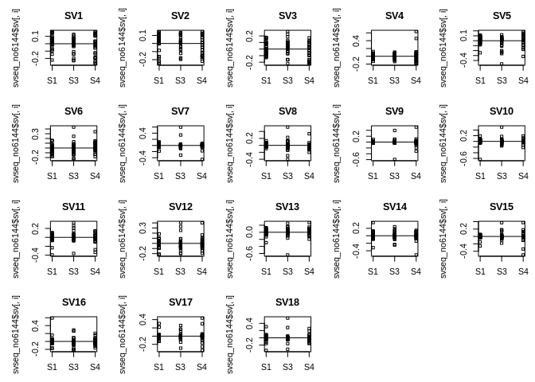

CAF subtype analysis
================
Kevin Ryan
2022-07-08 20:23:40

-   <a href="#introduction" id="toc-introduction">Introduction</a>
    -   <a href="#preparation" id="toc-preparation">Preparation</a>
        -   <a href="#create-sample-file" id="toc-create-sample-file">Create Sample
            File</a>
        -   <a href="#read-in-data-with-tximeta-and-create-deseq-object"
            id="toc-read-in-data-with-tximeta-and-create-deseq-object">Read in data
            with tximeta and create DESeq object</a>
        -   <a href="#data-transformation" id="toc-data-transformation">Data
            transformation</a>
    -   <a
        href="#assigning-in-house-samples-to-a-caf-subtype-using-k-nearest-neighbours"
        id="toc-assigning-in-house-samples-to-a-caf-subtype-using-k-nearest-neighbours">Assigning
        in-house samples to a CAF subtype using K-nearest neighbours</a>
    -   <a href="#references" id="toc-references">References</a>

# Introduction

Cancer-associated fibroblasts (CAFs) are a heterogeneous cell type found
in the tumour microenvironment. They have a wide array of functions, and
tend to be immunosuppressive and cancer-promoting. There have been many
attempts to characterise subtypes of CAFs, with much transcriptomic
analysis being carried out in the Mechta-Grigoriou lab in Institut
Curie. They have identified 4 ‘subtypes’ which can be separated based on
the expression of different markers:

-   S1: FAP<sup>High</sup>, CD29<sup>Med-High</sup>,
    α<sup>SMAHigh</sup>, PDPN<sup>High</sup>, PDGFRβ<sup>High</sup>
-   S2: FAP<sup>Neg</sup>, CD29<sup>Low</sup>, αSMANeg-<sup>Low</sup>,
    PDPN<sup>Low</sup>, PDGFRβ<sup>Low</sup>
-   S3: FAP<sup>Neg-Low</sup>, CD29<sup>Med</sup>,
    αSMA<sup>Neg-Low</sup>, PDPN<sup>Low</sup>, PDGFRβ<sup>Low-Med</sup>
-   S4: FAP<sup>Low-Med</sup>, CD29<sup>High</sup>, αSMA<sup>High</sup>,
    PDPN<sup>Low</sup>, PDGFRβ<sup>Med</sup>

(Pelon et al. 2020)

FACS gating strategies can be used to isolate these various subtypes.
The Mechta-Grigoriou group have done this and have generated bulk
RNA-sequencing data for the S1, S3 and S4 subtypes. They generated
scRNA-sequencing data for the S1 subtype. This data was deposited on the
European Genome Phenome Archive, and was accessed via a Data Transfer
Agreement.

The following summarises the data obtained:

<table>
<colgroup>
<col style="width: 18%" />
<col style="width: 18%" />
<col style="width: 27%" />
<col style="width: 36%" />
</colgroup>
<thead>
<tr class="header">
<th>Subpopulation</th>
<th>| Total sam</th>
<th>ples | Studies (Samples)</th>
<th>| Notes</th>
</tr>
</thead>
<tbody>
<tr class="odd">
<td>S1</td>
<td>28</td>
<td><ul>
<li>EGAD00001003808 (16)</li>
<li>EGAD00001005744 (5)</li>
<li>EGAD00001006144 (7)</li>
</ul></td>
<td><ul>
<li>3808 has 12xJuxta-tumor</li>
<li>5744 5 samples from LN</li>
<li>Sorting vs spreading</li>
</ul></td>
</tr>
<tr class="even">
<td>S2</td>
<td>0</td>
<td>N/A</td>
<td>N/A</td>
</tr>
<tr class="odd">
<td>S3</td>
<td>14</td>
<td><ul>
<li>EGAD00001004810 (14)</li>
</ul></td>
<td><ul>
<li>4810 has 11xJuxta-tumor</li>
<li>Ovarian</li>
</ul></td>
</tr>
<tr class="even">
<td>S4</td>
<td>15</td>
<td><ul>
<li>EGAD00001003808 (10)</li>
<li>EGAD00001005744 (5)</li>
</ul></td>
<td><ul>
<li>3808 has 9xJuxta-tumor</li>
<li>5744 5 samples from LN</li>
</ul></td>
</tr>
</tbody>
</table>

With the juxta-tumour data, they got tumour and juxta-tumour data from
the same patient. However, I have not been able to figure out whether
they came from the same patient. Could probably use Optitype to
determine HLA allele - match tumour and juxta tumour.

We also have scRNA-seq data for S1.

The data was processed using nf-core/rnaseq version `3.8.1` using the
default parameters. STAR/Salmon were used for alignment/quantification.

We would expect our tumour-associated normal to be most like the S3
subtype (usually accumulate in juxta-tumours).

Combining RNA-sequencing datasets from different studies can be very
challenging. We can expect batch effects to be present, so it might be
possible to determine whether differences be observe are due to actual
biological effects or technical artifacts. In addition, a recent study
suggests that DESeq2 and edgeR (the most popular differential expression
tools) experience large rates of false positives when used with large
sample sizes (Li et al. 2022). One of the datasets (`EGAD00001006144`)
was produced using stranded RNA-seq, whereas the other datasets were
unstranded. This can lead to a lack of comparability of the datasets
(Zhao, Ye, and Stanton 2020). It may be necessary to drop this dataset
from the analysis. All samples were prepared by poly(A) selection (use
of oligo-dT).

## Preparation

### Create Sample File

Columns will be: Sample, Study, CAF_subtype, Tumor_Juxtatumor

*Here we will be combining data from 5 studies. To begin with, we will
only include the metadata available for all studies (except for our
unknown CAF subtype label). Breast cancer subtype is only available for
certain studies and so is not included at this stage.*

There are also: ovarian cancer samples, EPCAM+ cells, samples prepared
by spreading or spreading and samples from lymph nodes. For the time
being, I will not consider them.

``` r
EGAD_4810 <- read.table("/home/kevin/Documents/PhD/CAF_data/EGAD00001004810/delimited_maps/Run_Sample_meta_info.map", 
                        sep = ";")
EGAD_4810_cancers <- str_split_fixed(EGAD_4810$V1, pattern = "=", n = 2)[,2]
EGAD_4810_keep <- which(EGAD_4810_cancers == "BC")
EGAD_4810_filtered <- EGAD_4810[EGAD_4810_keep,]
EGAD_4810_meta <- data.frame(
  Sample = str_split_fixed(EGAD_4810_filtered$V4, pattern = "=", n = 2)[,2],
  Study = "EGAD00001004810",
  Subtype = "S3",
  Tumor_JuxtaTumor = tolower(str_split_fixed(EGAD_4810_filtered$V3, pattern = " ", n = 2)[,2]),
  directory = "/home/kevin/Documents/PhD/CAF_data/nfcore_results/EGAD00001004810_nfcore_results/star_salmon",
  row.names = 1
)
EGAD_3808 <- read.table("/home/kevin/Documents/PhD/CAF_data/EGAD00001003808/meta_CAF-S1_S4_BC_47samples.txt", 
                        header = T, sep = "\t")
EGAD_3808_meta <- data.frame(
  Sample = EGAD_3808$Sample.Name,
  Study = "EGAD00001003808",
  Subtype = EGAD_3808$subset,
  Tumor_JuxtaTumor = EGAD_3808$Type, 
    directory = "/home/kevin/Documents/PhD/CAF_data/nfcore_results/EGAD00001003808_nfcore_results/star_salmon",
  row.names = 1
)
EGAD_6144 <- read.table("/home/kevin/Documents/PhD/CAF_data/EGAD00001006144/meta_7samples.txt", 
                        header = T,sep = "\t")
EGAD_6144_meta <- data.frame(
  Sample = paste("CAF_Culture_", EGAD_6144$Sample.Name, sep = ""),
  Study = "EGAD00001006144",
  Subtype = "S1",
  Tumor_JuxtaTumor = "tumor",
    directory = "/home/kevin/Documents/PhD/CAF_data/nfcore_results/EGAD00001006144_nfcore_results/star_salmon",
  row.names = 1
)
EGAD_5744 <- read.table("/home/kevin/Documents/PhD/CAF_data/EGAD00001005744/metaData_Pelon_et_al.txt", 
                        header =T, check.names = F)
EGAD_5744$Sample.Name <- gsub(pattern = "\\.", replacement = "-", x = EGAD_5744$Sample.Name )
EGAD_5744_filtered <- EGAD_5744[!(EGAD_5744$subset == "EPCAM+") & (EGAD_5744$Type == "T"),]
EGAD_5744_meta <- data.frame(
  Sample = EGAD_5744_filtered$Sample.Name,
  Study = "EGAD00001005744",
  Subtype = EGAD_5744_filtered$subset,
  Tumor_JuxtaTumor = "tumor",
    directory = "/home/kevin/Documents/PhD/CAF_data/nfcore_results/EGAD00001005744_nfcore_results/star_salmon",
  row.names = 1
)
barkley_samples <- read.csv("/home/kevin/Documents/PhD/rna_seq_bc/metadata/reformat_samples.csv", 
                            header = T, row.names = "samples", check.names = F)
barkley_samples_meta <- data.frame(
  Sample = row.names(barkley_samples),
   Study = "InHouse",
  Subtype = "Unknown",
  Tumor_JuxtaTumor = ifelse(barkley_samples$Condition == "Tumour", "tumor", "juxtatumor"),
  directory = "/home/kevin/Documents/PhD/CAF_data/nfcore_results/inhouse_data_nfcore_results_version_3_8_1/star_salmon",
  row.names = 1
)
metadata <- rbind.data.frame(EGAD_4810_meta, EGAD_3808_meta, 
                             EGAD_6144_meta, EGAD_5744_meta, barkley_samples_meta)
metadata$Tumor_JuxtaTumor <- gsub(x = metadata$Tumor_JuxtaTumor, pattern = "-", replacement = "")
metadata[1:5,]
```

    ##                  Study Subtype Tumor_JuxtaTumor
    ## B73T39 EGAD00001004810      S3            tumor
    ## B86T3  EGAD00001004810      S3            tumor
    ## B86T7  EGAD00001004810      S3       juxtatumor
    ## B86T10 EGAD00001004810      S3            tumor
    ## B86T13 EGAD00001004810      S3       juxtatumor
    ##                                                                                           directory
    ## B73T39 /home/kevin/Documents/PhD/CAF_data/nfcore_results/EGAD00001004810_nfcore_results/star_salmon
    ## B86T3  /home/kevin/Documents/PhD/CAF_data/nfcore_results/EGAD00001004810_nfcore_results/star_salmon
    ## B86T7  /home/kevin/Documents/PhD/CAF_data/nfcore_results/EGAD00001004810_nfcore_results/star_salmon
    ## B86T10 /home/kevin/Documents/PhD/CAF_data/nfcore_results/EGAD00001004810_nfcore_results/star_salmon
    ## B86T13 /home/kevin/Documents/PhD/CAF_data/nfcore_results/EGAD00001004810_nfcore_results/star_salmon

### Read in data with tximeta and create DESeq object

Samples were processed with nf-core/rnaseq version `3.8.1` Read in
samples with tximport, deseqdataobject etc

``` r
files <- file.path(metadata$directory, rownames(metadata), "quant.sf")
coldata <- data.frame(files, names=rownames(metadata), Study = metadata$Study, 
                      Subtype = metadata$Subtype, 
                      Tumor_JuxtaTumor = metadata$Tumor_JuxtaTumor,
                      stringsAsFactors=FALSE)
tx2gene <- read_tsv("/home/kevin/Documents/PhD/references/tx2gene_gencode_v31.txt")
```

    ## Rows: 226882 Columns: 2
    ## ── Column specification ────────────────────────────────────────────────────────
    ## Delimiter: "\t"
    ## chr (2): TXNAME, GENEID
    ## 
    ## ℹ Use `spec()` to retrieve the full column specification for this data.
    ## ℹ Specify the column types or set `show_col_types = FALSE` to quiet this message.

``` r
se <- tximeta(coldata, skipMeta=TRUE, txOut=FALSE, tx2gene=tx2gene)
```

    ## reading in files with read_tsv
    ## 1 2 3 4 5 6 7 8 9 10 11 12 13 14 15 16 17 18 19 20 21 22 23 24 25 26 27 28 29 30 31 32 33 34 35 36 37 38 39 40 41 42 43 44 45 46 47 48 49 50 51 52 53 54 55 56 57 58 59 60 61 62 63 64 65 66 67 68 69 70 71 72 73 74 75 76 77 78 79 80 81 82 83 84 85 86 87 88 89 90 91 92 93 94 95 96 97 98 99 100 101 102 103 104 105 106 107 108 109 110 111 112 113 
    ## summarizing abundance
    ## summarizing counts
    ## summarizing length

``` r
dds <- DESeqDataSet(se, design = ~ Study)
```

    ## using counts and average transcript lengths from tximeta

    ## Warning in DESeqDataSet(se, design = ~Study): some variables in design formula
    ## are characters, converting to factors

``` r
dim(dds)
```

    ## [1] 60603   113

``` r
# returns a vector of whether the total count of each gene is >= 10 (True or fals)
keep <- rowSums(counts(dds)) >= 10
# only keep rows (genes) for which keep is TRUE
dds <- dds[keep,]
# at least X samples with a count of 10 or more, where X can be chosen as the sample size of the smallest group of samples
X <- 7
keep <- rowSums(counts(dds) >= 10) >= X
dds <- dds[keep,]
ntd <- normTransform(dds)
```

    ## using 'avgTxLength' from assays(dds), correcting for library size

``` r
dds <- DESeq(dds)
```

    ## estimating size factors

    ## using 'avgTxLength' from assays(dds), correcting for library size

    ## estimating dispersions

    ## gene-wise dispersion estimates

    ## mean-dispersion relationship

    ## final dispersion estimates

    ## fitting model and testing

    ## -- replacing outliers and refitting for 2685 genes
    ## -- DESeq argument 'minReplicatesForReplace' = 7 
    ## -- original counts are preserved in counts(dds)

    ## estimating dispersions

    ## fitting model and testing

``` r
select <- order(rowMeans(counts(dds,normalized=TRUE)),
                decreasing=TRUE)[1:20]
df <- as.data.frame(colData(dds)[,c("Study","Subtype", "Tumor_JuxtaTumor")])
pheatmap(assay(ntd)[select,], cluster_rows=FALSE, show_rownames=FALSE,
         cluster_cols=FALSE, annotation_col=df, show_colnames = F)
```

<!-- -->

From the heatmap, we can see that there are profound batch effects
present which must be dealt with.

### Data transformation

There are a number of options to choose from when normalising RNA-seq
data, the main ones being: - Take the log of the data and add a
pseudocount. - Variance stabilizing transformation (Anders and Huber
2010) - Regularized logarithm transformation (Love, Huber, and Anders
2014)

The log+pseudocount approach tends to mean that lowly expressed genes
have more of an effect. *Vst* and *rlog* bring these counts towards a
middle amount, making the data more homoskedastic. This allows them to
be used in downstream processes which require homoskedastic data
(e.g. PCA). The authors of DESeq2 recommend *vst* for large sample sizes
such as ours as it is much faster than *rlog*

``` r
vsd <- vst(dds, blind = FALSE)
```

``` r
dds <- estimateSizeFactors(dds)
```

    ## using 'avgTxLength' from assays(dds), correcting for library size

``` r
df <- bind_rows(
  as_data_frame(log2(counts(dds, normalized=TRUE)[, 1:2]+1)) %>%
         mutate(transformation = "log2(x + 1)"),
  as_data_frame(assay(vsd)[, 1:2]) %>% mutate(transformation = "vst"))
```

    ## Warning: `as_data_frame()` was deprecated in tibble 2.0.0.
    ## Please use `as_tibble()` instead.
    ## The signature and semantics have changed, see `?as_tibble`.
    ## This warning is displayed once every 8 hours.
    ## Call `lifecycle::last_lifecycle_warnings()` to see where this warning was generated.

``` r
colnames(df)[1:2] <- c("x", "y")  

lvls <- c("log2(x + 1)", "vst")
df$transformation <- factor(df$transformation, levels=lvls)

ggplot(df, aes(x = x, y = y)) + geom_hex(bins = 80) +
  coord_fixed() + facet_grid( . ~ transformation)  
```

<!-- -->

There doesn’t seem to much of a difference between the two methods of
normalisation, only that the lowly expressed genes have been brought up
to a minimum of \~4.

``` r
# find euclidean distance between samples for heatmap generation (normalised data)
sampleDists <- dist(t(assay(vsd)))
# don't want files column to be on heatmap
subset_coldata <- subset(coldata, select = -c(files))
sampleDistMatrix <- as.matrix( sampleDists )
rownames(subset_coldata) <- subset_coldata$names
subset_coldata$names <- NULL
#rownames(sampleDistMatrix) <- vsd$Study
#colnames(sampleDistMatrix) <- NULL
#colors <- colorRampPalette( rev(brewer.pal(9, "Blues")) )(255)
#pheatmap(sampleDistMatrix,
 #        clustering_distance_rows = sampleDists,
  #       clustering_distance_cols = sampleDists,
   #      col = colors)
```

``` r
ann_colors = list(Study=c(EGAD00001004810 = "forestgreen",  EGAD00001003808 = "gold", EGAD00001006144 = "blue", EGAD00001005744 = "magenta3", InHouse = "black"),
                  Subtype = c(S1 = "dodgerblue4", S3 = "chartreuse1", S4 = "grey67", Unknown = "palevioletred"),
                  Tumor_JuxtaTumor = c(tumor = "royalblue", juxtatumor = "red")
                  )
```

``` r
pheatmap(mat=sampleDistMatrix,
         show_rownames = FALSE,
         cluster_cols = TRUE,
         cluster_rows = TRUE,
         show_colnames = FALSE,
         annotation_col = subset_coldata,
         annotation_colors = ann_colors,
         clustering_distance_rows=sampleDists,
         clustering_distance_cols=sampleDists,
         col=colorRampPalette( rev(brewer.pal(9, "Blues")) )(255))
```

<!-- -->

``` r
plotPCA(vsd, intgroup = c("Study", "Subtype"))
```

<!-- -->

``` r
pcaData <- plotPCA(vsd, intgroup = c("Study", "Subtype"), returnData = TRUE)
percentVar <- round(100 * attr(pcaData, "percentVar"))
```

``` r
ggplot(pcaData, aes(x = PC1, y = PC2, color = Study, shape = Subtype)) +
  geom_point(size =3) +
  xlab(paste0("PC1: ", percentVar[1], "% variance")) +
  ylab(paste0("PC2: ", percentVar[2], "% variance")) +
  coord_fixed() +
  ggtitle("PCA with VST data")
```

<!-- -->

``` r
gpca <- glmpca(counts(dds), L=2)
gpca.dat <- gpca$factors
gpca.dat$Study <- dds$Study
gpca.dat$Subtype <- dds$Subtype
```

Next step is to look at batch correction.

``` r
library(limma)
```

    ## 
    ## Attaching package: 'limma'

    ## The following object is masked from 'package:DESeq2':
    ## 
    ##     plotMA

    ## The following object is masked from 'package:BiocGenerics':
    ## 
    ##     plotMA

``` r
mat <- assay(vsd)
mm <- model.matrix(~Tumor_JuxtaTumor+Subtype, colData(vsd))
mat <- limma::removeBatchEffect(mat, batch = vsd$Study, design = mm)
```

    ## Coefficients not estimable: batch2 batch4

    ## Warning: Partial NA coefficients for 22678 probe(s)

``` r
assay(vsd) <- mat
plotPCA(vsd, intgroup = c("Subtype", "Study"))
```

<!-- -->
Limma’s removeBatchEffect function requires a design matrix as input,
this is the “treatment conditions” we wish to preserve. It is usually
the design matrix with all experimental factors other than batch
effects. I do not know whether to include Subtype in this matrix, as
this treats `Unknown` as its own subtype, and so will preserve
differences between the InHouse samples and the other samples, as seen
in the above PCA plot.

``` r
mat <- assay(vsd)
mm <- model.matrix(~Tumor_JuxtaTumor, colData(vsd))
mat <- limma::removeBatchEffect(mat, batch = vsd$Study, design = mm)
assay(vsd) <- mat
plotPCA(vsd, intgroup = c("Subtype", "Study"))
```

<!-- -->

In the PCA plot above, we have not told the `removeBatchEffect` function
about our known subtypes, only whether the samples were taken from Tumor
or Juxta-Tumor. It does not know to preserve differences between
subpopulations when removing batch effects. We have much less variance
being explained by PC1 than in the first scenario (39% vs 68%). In the
first PCA plot, our in-house samples of unknown subtype cluster together
on their own.

``` r
#mat <- assay(vsd)
#modmatrix <- model.matrix(~as.factor(Tumor_JuxtaTumor), colData(vsd))
#batchQC(mat, batch=coldata$Study, condition= coldata$Subtype, 
      #  report_file = "batchqc_caf_data_not_corrected.html",
       # report_dir = ".", view_report = FALSE, interactive = FALSE
      #  )
```

## Assigning in-house samples to a CAF subtype using K-nearest neighbours

1.  Split mat into our known (training) and unknown (testing)
    subpopulations
2.  Run KNN

``` r
mat_t <- t(mat)
mat_known <- mat_t[coldata$names[which(coldata$Subtype != "Unknown")],]
coldata_known <- coldata[coldata$Subtype != "Unknown",]
mat_unknown <- mat_t[coldata$names[which(coldata$Subtype == "Unknown")],]
coldata_unknown <- coldata[coldata$Subtype == "Unknown",]
```

``` r
library(class)
```

``` r
##create a random number equal 90% of total number of rows
 ran <- sample(1:nrow(mat_known),0.9 * nrow(mat_known))
 ##training dataset extracted
 mat_train <- mat_known[ran,]
 
 ##test dataset extracted
 mat_test <- mat_known[-ran,]
```

``` r
# these are our labels
caf_target_category <- coldata_known[ran,4]
caf_test_category <- coldata_known[-ran,4]
```

``` r
pr <- knn(mat_train,mat_test,cl=caf_target_category,k=21)
```

``` r
 tab <- table(pr,caf_test_category)
tab
```

    ##     caf_test_category
    ## pr   S1 S3 S4
    ##   S1  3  4  2
    ##   S3  0  0  0
    ##   S4  0  0  0

``` r
accuracy <- function(x){sum(diag(x)/(sum(rowSums(x)))) * 100}
 accuracy(tab)
```

    ## [1] 33.33333

``` r
  outputs <- c()
for (i in 1:50){
  pr <- knn(mat_train,mat_test,cl=caf_target_category,k=i)
  number <- i
  tab <- table(pr,caf_test_category)
  accuracy_out <- accuracy(tab)
  outputs <- c(outputs, number = accuracy_out)
}
```

``` r
plot(outputs)
```

<!-- -->

``` r
  prediction <- knn(mat_train,mat_unknown,cl=caf_target_category,k=13)
prediction
```

    ##  [1] S1 S1 S1 S1 S1 S1 S1 S1 S1 S1 S1 S1 S1 S1 S1 S1 S1 S1 S1 S1 S1 S1 S1 S1
    ## Levels: S1 S3 S4

They are all predicted to be S1 using this initial application of the
algorithm. Possibly use interquartile range to improve performance?

## References

<div id="refs" class="references csl-bib-body hanging-indent">

<div id="ref-Li2022" class="csl-entry">

Li, Yumei, Xinzhou Ge, Fanglue Peng, Wei Li, and Jingyi Jessica Li.
2022. “<span class="nocase">Exaggerated false positives by popular
differential expression methods when analyzing human population
samples</span>.” *Genome Biology* 23 (1): 1–13.
<https://doi.org/10.1186/S13059-022-02648-4/FIGURES/2>.

</div>

<div id="ref-Pelon2020" class="csl-entry">

Pelon, Floriane, Brigitte Bourachot, Yann Kieffer, Ilaria Magagna, Fanny
Mermet-Meillon, Isabelle Bonnet, Ana Costa, et al. 2020. “<span
class="nocase">Cancer-associated fibroblast heterogeneity in axillary
lymph nodes drives metastases in breast cancer through complementary
mechanisms</span>.” *Nature Communications 2020 11:1* 11 (1): 1–20.
<https://doi.org/10.1038/s41467-019-14134-w>.

</div>

<div id="ref-Zhao2020" class="csl-entry">

Zhao, Shanrong, Zhan Ye, and Robert Stanton. 2020. “<span
class="nocase">Misuse of RPKM or TPM normalization when comparing across
samples and sequencing protocols</span>.” *RNA* 26 (8): 903.
<https://doi.org/10.1261/RNA.074922.120>.

</div>

</div>
