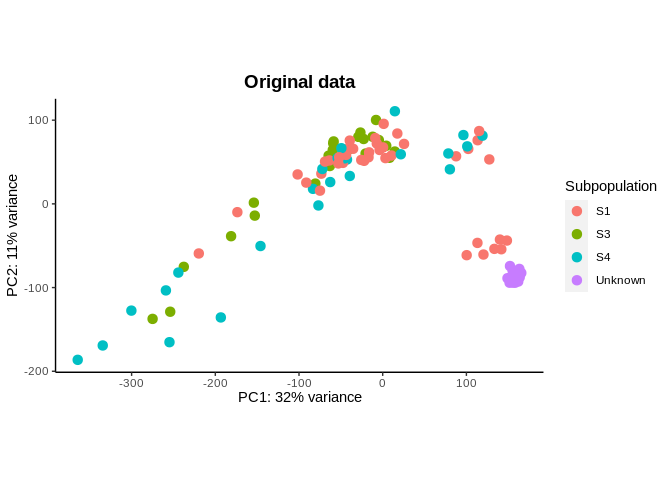
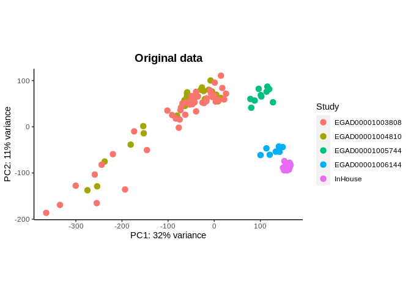

QC
================

- <a href="#bibliography-citationsbib"
  id="toc-bibliography-citationsbib">bibliography: citations.bib</a>
- <a href="#convert-command-line-arguments-to-variables"
  id="toc-convert-command-line-arguments-to-variables">Convert
  command-line arguments to variables</a>

## bibliography: citations.bib

Converting the QC script into a version that can go into a Nextflow
pipeline. Need to run from the command line, without hardcoding paths.
This script carries out initial QC, including outlier removal and batch
correction.

## Convert command-line arguments to variables

``` r
metadata <- params$metadata
print(paste("metadata file: ", metadata))
```

    ## [1] "metadata file:  /home/kevin/Documents/PhD/subtypes/caf-subtype-analysis/nf-subpop/work/b5/96261f5e2860c36a778fc3df7b3428/metadata_full.txt"

``` r
tx2gene_file <- params$tx2gene
print(paste("tx2gene file: ", tx2gene_file))
```

    ## [1] "tx2gene file:  /home/kevin/Documents/PhD/subtypes/caf-subtype-analysis/nf-subpop/work/b5/96261f5e2860c36a778fc3df7b3428/tx2gene.txt"

``` r
out <- params$out
print(paste("out file: ", out))
```

    ## [1] "out file:  out.txt"

#### Define functions

``` r
filter_out_low_expressed <- function(dds){
  library(DESeq2)
  print(paste("no of genes before filtering...", nrow(dds)))
  # returns a vector of whether the total count of each gene is >= 10 (True or false)
  keep <- rowSums(counts(dds)) >= 10
  # only keep rows (genes) for which keep is TRUE
  dds <- dds[keep,]
  # at least X samples with a count of 10 or more, where X is 5% of samples
  X <- round(0.05*ncol(dds))
  keep <- rowSums(counts(dds) >= 10) >= X
  dds <- dds[keep,]
  print(paste("no of genes after filtering...", nrow(dds)))
  return(dds)
}
svaBatchCor <- function(dat, mmi, mm0,n.sv=NULL, svs.include = NULL){
  library(sva)
  dat <- as.matrix(dat)
  Y <- t(dat)
  if(is.null(n.sv)) n.sv <- num.sv(dat,mmi,method="leek")
  o <- sva(dat,mmi,mm0,n.sv=n.sv)
  if (is.null(svs.include)){
    W <- o$sv
  } else{
    W <- o$sv[,svs.include]
  }
  alpha <- solve(t(W) %*% W) %*% t(W) %*% Y
  o$corrected <- t(Y - W %*% alpha)
  return(o)
}
```

#### Read in data

``` r
# metadata file created with create_metadata.R
metadata <- read.table(file.path(metadata), row.names = 1, sep = "\t")
# get files from metadata directory
files <- file.path(metadata$directory, rownames(metadata), "quant.sf")
# make coldata given information for tximeta
coldata <- data.frame(files, names=rownames(metadata), Study = metadata$Study, 
                      Subpopulation = metadata$Subpopulation, 
                      Tumor_JuxtaTumor = metadata$Tumor_JuxtaTumor,
                      stringsAsFactors=FALSE)
# tx2gene generated with generate_tx2gene_table.R or supplied
tx2gene <- read.table(tx2gene_file, header = T)
# read in quant.sf file for each sample
se <- tximeta(coldata, skipMeta=TRUE, txOut=FALSE, tx2gene=tx2gene)
```

    ## reading in files with read_tsv

    ## 1 2 3 4 5 6 7 8 9 10 11 12 13 14 15 16 17 18 19 20 21 22 23 24 25 26 27 28 29 30 31 32 33 34 35 36 37 38 39 40 41 42 43 44 45 46 47 48 49 50 51 52 53 54 55 56 57 58 59 60 61 62 63 64 65 66 67 68 69 70 71 72 73 74 75 76 77 78 79 80 81 82 83 84 85 86 87 88 89 90 91 92 93 94 95 96 97 98 99 100 101 102 103 104 105 106 107 108 109 110 111 112 113 
    ## summarizing abundance
    ## summarizing counts
    ## summarizing length

``` r
dds <- DESeqDataSet(se, design = ~1)
```

    ## using counts and average transcript lengths from tximeta

``` r
# carry out variance-stabilising transformation
vsd <- vst(dds, blind = TRUE)
```

    ## using 'avgTxLength' from assays(dds), correcting for library size

#### Exploratory data analysis - PCA

##### PCA + clinical correlations all studies

For consistency between the DESeq2 `plotPCA` function (which by default
takes the 500 most variable genes) and the PCATools `pca` function, all
genes were used when carrying out PCA.

``` r
pca_before_correction_subpop <- plotPCA(vsd, intgroup = c("Subpopulation"), ntop = nrow(vsd)) + 
  theme(panel.background = element_blank(),
        axis.line = element_line(colour = "black")) +
labs(colour = "Subpopulation")  +
  ggtitle("Original data") +
    theme(plot.title = element_text(hjust = 0.5, size = 14, face = "bold"))

pca_before_correction_subpop
```

<!-- -->

``` r
pca_before_correction_study <- plotPCA(vsd, intgroup = c("Study"), ntop = nrow(vsd)) +
    #ggtitle("PCA using Ensembl gene ID version") +
  theme(panel.background = element_blank(),
        axis.line = element_line(colour = "black")) +
labs(colour = "Study") +
  ggtitle("Original data") +
  theme(plot.title = element_text(hjust = 0.5, size = 14, face = "bold"))

pca_before_correction_study
```

<!-- -->

``` r
pca_before_correction_tumor_juxtatumor <- plotPCA(vsd, intgroup = c("Tumor_JuxtaTumor"), ntop = nrow(vsd)) + 
  ggtitle("Original data")
```

**Double-check this stuff - based on using hgnc symbols**

There seems to be 4 groups of samples here: the samples at PC1 \< -100
which look like outliers, the main group in the middle (-100 \< PC1 \<
50) and then 2 groups which separate on PC2. One of these groups comes
completely from one batch (EGAD00001005744) which is purely tumour CAFs
and the other is a mixture of our in-house samples and study
EGAD00001006144. There is clear separation between the in-house samples
and EGAD00001006144, so perhaps they could be called one cluster. The
in-house samples underwent culturing in a medium to promote the growth
of fibroblastic cells, whereas the EGAD00001006144 samples either
underwent separation by sorting or spreading. It is possible that there
are similarities in the conditions under which the samples were kept
which altered their transcriptomic properties.

We can see that there are 16 samples that explain much of the variation
in PC1, meaning that they are quite different from the other samples.
Let’s have a look at the PCA loadings using the `biplot` from
`PCATools`.

It is important to note here that our interpretation of the PCA is
subjective, and can change depending on the number of highly variable
genes we consider when carrying out PCA.

To run from console rmarkdown::render(“file.Rmd”, params = list(myName =
“Martin”)) To run from command line: Rscript -e
“rmarkdown::render("file.Rmd", params = list(myName = "abcd"))”

Rscript -e “rmarkdown::render("QC_pipeline.Rmd", params = list(metadata
="/home/kevin/Documents/PhD/subtypes/caf-subtype-analysis/intermediate_files/metadata/metadata_all_samples.txt",
tx2gene =
"/home/kevin/Documents/PhD/subtypes/caf-subtype-analysis/nf-subpop/outdir/tx2gene/tx2gene.txt",
out = "test.txt"))”

``` r
outfile <- data.frame(x = c(1,2,3), y = c(3,4,5))
write.table(outfile, file = out, quote = F)
```
